# Unsupervised Deep Learning

## Motivation

### Motivation  

Deep learning research has traditionally been driven by the availability of **large‑scale datasets** that contain millions of annotated examples.  In many domains the data possess the following characteristics:

|                     | So far                                   |
|---------------------|:----------------------------------------:|
| **Dataset size**    | Huge (up to **millions**!)               |
| **Variation**       | **Many** objects                         |
| **Modalities**      | **Few** modalities                       |

In contrast, **medical imaging** exhibits a markedly different profile:

| Medical imaging |
|:----------------:|
| Small (**30–100** patients) |
| **One** complex object per patient |
| **Many** imaging modalities (e.g., CT, MRI, PET) |

A concrete illustration of the data‑availability gap is the **German healthcare system**.  In 2014 there were roughly  

* 65 computed‑tomography (CT) scans per 1 000 inhabitants, amounting to about **5 million CT scans** nationwide.  

Although the raw volume of scans is comparable to the large datasets used in computer‑vision research, several obstacles prevent a straightforward reuse:

* **Privacy sensitivity** – medical images contain personal health information and are protected by strict regulations.  
* **Trend toward data sharing** – initiatives are emerging to make anonymised data available for research, yet the process is still nascent.  
* **Annotation cost** – creating reliable pixel‑wise or diagnostic labels requires expert radiologists, making manual annotation **expensive and time‑consuming**.

The privacy concern is more acute than it might first appear. Even seemingly anonymised volumetric scans can betray a patient's identity through unexpected channels: rendering the surface of the face from a head CT permits automatic face‑recognition systems to identify the subject, and there are also non‑obvious cues such as the cortical folding pattern of the brain, which is so individual that persons can be recognised from a brain‑surface scan with reported accuracy of up to 99 %. Sharing whole 3‑D volumes therefore carries a real re‑identification risk; even though identification from a single 2‑D slice is more difficult, this consideration shapes the regulatory landscape and slows the public release of medical datasets.

These constraints motivate learning paradigms that can **operate with limited or no labeled data**.

---

### Solutions  

When labeled data are scarce, three increasingly popular learning strategies can be employed:

1. **Weakly supervised learning** – the available supervision is indirect or coarse.  For example, a model may be trained to **localise objects** using only image‑level class labels, without bounding‑box annotations.  

   *Figure (diagram): rendered from TikZ in the original slides; not converted to Mermaid because it is a diagram.*  

2. **Semi‑supervised learning** – a small subset of the data is labeled (often only a few percent), while the majority remains unlabeled.  The model exploits the structure of the unlabeled data to improve its predictions on the labeled portion.  

3. **Unsupervised learning** – **no labeled data** are required.  The algorithm discovers patterns, regularities, or latent representations solely from the raw input distribution.  

A concrete instance of weak supervision is to localise the position of an object in an image even though only the *image‑level* class label (e.g. "brushing teeth", "cutting trees") is available. Visualisation techniques, such as those that exploit gradients flowing back to the input, allow the activated regions to be highlighted, which in turn provides cheap pseudo‑bounding‑boxes. In the semi‑supervised case, a typical workflow is **bootstrapping**: a weak classifier is trained on the small labelled subset, applied to the much larger unlabelled pool, and the most confidently classified samples are added to a new training set; the procedure is iterated, gradually growing the effective training set and improving the classifier in each round.

These approaches form a spectrum of supervision, with unsupervised learning representing the most label‑independent extreme.

---

### Label‑free Learning – Dimensionality Reduction  

A primary use case of unsupervised learning is **dimensionality reduction**, i.e., mapping high‑dimensional data onto a low‑dimensional manifold while preserving essential geometric relationships.

*The first figure* (described in the original slide) shows a **two‑dimensional scatter plot** of points forming a **spiral (Swiss‑roll) manifold**.  The axes range from –10 to 15, and the point colours smoothly transition from red to orange to yellow to blue as the spiral winds outward.  This visualisation illustrates how a *non‑linear* manifold embedded in a high‑dimensional space can be unfolded into a two‑dimensional representation that respects neighbourhood relationships.

*The second figure* depicts the result of **Laplacian Eigenmaps**, another non‑linear reduction technique.  Here the axes span roughly –0.04 to 0.04, and points are colour‑coded from blue through green and yellow to red.  The points arrange themselves into a **crescent‑shaped cluster**, reflecting the preservation of local geometry: points that were close on the original high‑dimensional manifold remain close after projection.

Both examples demonstrate that **unsupervised representation learning** can reveal the intrinsic structure of data without any external labels.

---

### Label‑free Learning – Network Initialization  

Unsupervised pre‑training is also valuable for **initialising deep networks** before fine‑tuning on a downstream task (a practice closely related to transfer learning).  A common architecture for this purpose is a **stacked auto‑encoder**.  The diagram below, expressed in Mermaid syntax, visualises a two‑layer auto‑encoder hierarchy:

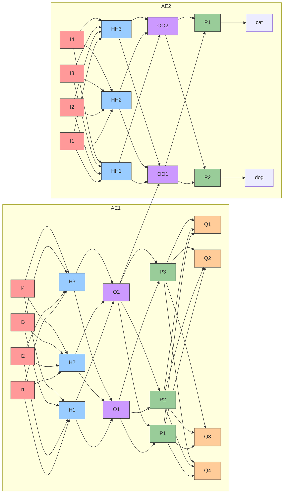

In this schematic, the **first auto‑encoder (AE1)** learns a compact representation of the raw inputs $I_1,\dots,I_4$ through hidden layers $H_1,H_2,H_3$, producing encoded outputs $O_1,O_2$.  These encodings are further transformed by a second hidden block ($P_1,P_2,P_3$) and finally mapped to a set of high‑level features $Q_1,\dots,Q_4$.  

A **second auto‑encoder (AE2)** processes the same inputs independently, yielding a separate latent space ($HH_*$, $OO_*$) that is ultimately connected to concrete semantic categories such as “cat’’ and “dog’’ via the nodes `Cat` and `Dog`.  The **cross‑stack connection** (`O2 --> OO1`) indicates that features learned in the first stack may be reused as inputs to the second, enabling **layer‑wise pre‑training** and **parameter sharing** across tasks.

By training this architecture **without labels**, the network discovers useful feature hierarchies that can later serve as an **initialisation** for supervised fine‑tuning, often accelerating convergence and improving final performance.

The general recipe behind this initialisation strategy is straightforward: first an autoencoder with a bottleneck is trained to reconstruct its input, then the decoder branch is discarded and the encoder is **repurposed** for a downstream task by appending new task‑specific layers. In the example illustrated by the diagram, the new head turns the encoder into a binary cat‑versus‑dog classifier. Because the encoder has already learned a low‑dimensional representation that preserves the salient structure of the inputs, the downstream classifier needs comparatively few parameters and can be trained with smaller labelled datasets. Conceptually this is very close to **transfer learning**: pre‑training on a generic (here label‑free) objective transfers structure into the weights that supervised fine‑tuning can specialise.

---

### Label‑free Learning – Representation Learning  

Beyond dimensionality reduction and initialization, unsupervised models are employed to learn **rich data representations** that capture semantic similarity.  A typical downstream use case is **clustering**: groups of samples that are close in the learned embedding space tend to share visual characteristics.

The slide’s illustration shows a **dense mosaic of small images** (faces, animals, vehicles, indoor scenes) arranged roughly in a circular cloud.  Each image corresponds to a point in a high‑dimensional embedding that the network has learned **without any class labels**.  When the embeddings are visualised (e.g., via t‑SNE or UMAP), images that are semantically similar end up **near each other**, creating clusters of visually related pictures.  This emergent structure demonstrates that the model has discovered **meaningful features** solely from raw pixel data, enabling tasks such as **unsupervised clustering**, **content‑based retrieval**, and **semantic similarity search**.

---

### Label‑free Learning – Generative Models  

Unsupervised learning also underpins **generative modeling**, where the goal is to learn a probability distribution $p(\mathbf{x})$ over data $\mathbf{x}$ and to draw **realistic new samples**.  Representative applications include:

* **Realistic image synthesis** – generating high‑fidelity pictures that resemble the training set.  
* **Missing‑data imputation** – using a generative model to fill in unobserved regions, which can then be leveraged in **semi‑supervised** pipelines.  
* **Image‑to‑image translation** – converting an image from one domain (e.g., sketches) to another (e.g., photorealistic renderings) without paired examples.  
* **Simulation of possible futures** – providing stochastic scenarios for downstream **reinforcement learning** agents.

The following flowchart, expressed in Mermaid, captures the high‑level loop between training data and model‑generated samples:

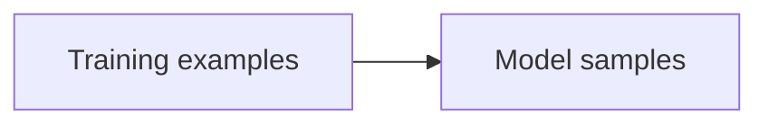

During training, the model adjusts its parameters so that the **distribution of generated samples** matches the distribution of the **training examples**.  Various architectures (e.g., variational auto‑encoders, generative adversarial networks) implement this principle with different loss functions and training dynamics. The same generative machinery underlies a surprisingly broad set of downstream uses: in **semi‑supervised learning** the synthesised samples augment a small labelled dataset; in **domain translation** they convert images from one domain to another (a notable example being the CycleGAN, which we will encounter later); and in **reinforcement learning** they can simulate plausible futures, providing the agent with imagined trajectories to plan against.

---

### Label‑free Learning – Today  

Current research and practice focus on three families of unsupervised or weakly‑supervised models:

* **Restricted Boltzmann Machines (RBMs)**  
  * Historically pivotal as building blocks for **Deep Belief Networks**.  
  * Although conceptually important, RBMs are now **rarely used** in state‑of‑the‑art pipelines due to training difficulties and the rise of more expressive alternatives.

* **Autoencoders**  
  * Serve as **non‑linear dimensionality‑reduction** tools that compress data into lower‑dimensional latent codes.  
  * Extensions such as **Variational Autoencoders (VAEs)** augment the basic auto‑encoder with a probabilistic framework, enabling **generative modelling** and **explicit likelihood estimation**.

* **Generative Adversarial Networks (GANs)**  
  * Currently the **most widely adopted generative model** across computer vision and medical imaging.  
  * The adversarial training paradigm (generator vs. discriminator) yields high‑quality samples and has inspired a multitude of derivative applications, including **segmentation**, **image reconstruction**, **semi‑supervised learning**, and **domain adaptation**.

These approaches collectively illustrate how **label‑free learning** can address the scarcity of annotated data, provide powerful initialisations, and enable a broad spectrum of generative and representation‑learning tasks.

## Restricted Boltzmann Machines

### Restricted Boltzmann Machine (RBM)

A **Restricted Boltzmann Machine** (RBM) is a bipartite, undirected graphical model that learns a probability distribution over a set of observed binary variables. The visible layer $\vec{v} = (v_1,\dots,v_{n_v})^\top$ consists of binary (Bernoulli) units that encode the observed data. The hidden layer $\vec{h} = (h_1,\dots,h_{n_h})^\top$ also contains binary units; these latent variables capture statistical dependencies in the data and provide a compact representation of the input.

The network connectivity is restricted: every visible unit is connected to every hidden unit, but there are **no** connections among units within the same layer. This structure can be visualised as a bipartite graph:

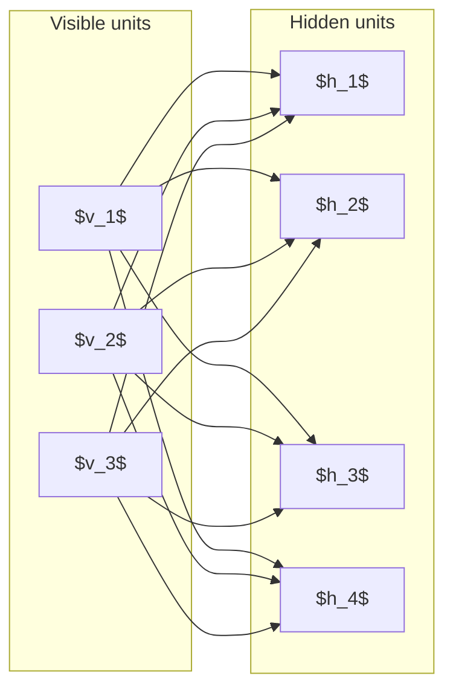

The RBM is an **energy‑based model**.  A joint probability distribution over visible and hidden variables is defined via an energy function $E(\vec{v},\vec{h})$:

\[
\begin{aligned}
p(\vec{v},\vec{h}) &= \frac{1}{Z}\,\exp\!\bigl(-E(\vec{v},\vec{h})\bigr)\\[4pt]
E(\vec{v},\vec{h}) &= -\vec{b}^{\top}\vec{v}\;-\;\vec{c}^{\top}\vec{h}\;-\;\vec{v}^{\top}\mathbf{W}\vec{h}
\end{aligned}
\]

* $\vec{b}\in\mathbb{R}^{n_v}$ and $\vec{c}\in\mathbb{R}^{n_h}$ are bias vectors for visible and hidden units, respectively.
* $\mathbf{W}\in\mathbb{R}^{n_v\times n_h}$ is the weight matrix that connects each visible unit to each hidden unit.
* $Z$ is the **partition function**, i.e. a normalisation constant that ensures $p(\vec{v},\vec{h})$ sums to one over all possible binary configurations:
  \[
  Z = \sum_{\vec{v},\vec{h}} \exp\!\bigl(-E(\vec{v},\vec{h})\bigr).
  \]

The distribution $p(\vec{v},\vec{h})$ is a Boltzmann distribution, closely related to the softmax function. It is important to note that an RBM is **not** a feed‑forward (fully‑connected) layer; instead, its hidden layer models the visible layer **stochastically** and the model is trained in an **unsupervised** fashion. From a probabilistic‑graphical‑model perspective, an RBM may be viewed as a **Markov random field with hidden variables**: the bipartite structure ensures that visible units are conditionally independent given the hidden units, and vice versa, which is precisely what makes the conditional sampling step efficient. Training adjusts the weight matrix $\mathbf{W}$ so that low‑energy configurations are assigned high probability and unlikely configurations are assigned low probability.

Historically, RBMs played a significant role in the resurgence of deep learning research. They were instrumental in the development of deep belief networks (DBNs), which marked a milestone in the field. Although RBMs are not as commonly used today, they laid the groundwork for more advanced techniques and architectures that are widely employed in modern deep learning. In particular, RBMs underpinned several headline applications of the early deep‑learning era, including Google's *Deep Dream* visualisation system; for this historical reason they are still worth knowing even though contemporary unsupervised pipelines tend to favour autoencoders or adversarial models.

---

### Training RBMs

#### Objective and Gradient

Training consists of adjusting the parameters $\boldsymbol{\theta}=\{\mathbf{W},\vec{b},\vec{c}\}$ so that the model assigns high probability to observed data vectors (low energy) and low probability to unlikely configurations (high energy).  Given a single data example $\vec{v}$, the log‑likelihood of the model is

\[
\begin{aligned}
\log L(\boldsymbol{\theta}\mid \vec{v})
&= \log p(\vec{v}\mid\boldsymbol{\theta}) \\[4pt]
&= \log \frac{1}{Z}\sum_{\vec{h}}\exp\!\bigl(-E(\vec{v},\vec{h})\bigr) \\[4pt]
&= \log \sum_{\vec{h}}\exp\!\bigl(-E(\vec{v},\vec{h})\bigr)
   \;-\; \log\!\Bigl(\sum_{\vec{v},\vec{h}}\exp\!\bigl(-E(\vec{v},\vec{h})\bigr)\Bigr).
\end{aligned}
\]

Differentiating with respect to a parameter $\theta\in\Theta$ (where $\Theta$ denotes the parameter space whose vector representation is $\boldsymbol{\theta}$) yields (see @Fischer14TRB)

\[
\frac{\partial \log L(\boldsymbol{\theta}\mid \vec{v})}{\partial \theta}
=
\underbrace{\sum_{\vec{h}} p(\vec{h},\vec{v})\,
           \bigl(-\frac{\partial E(\vec{v},\vec{h})}{\partial \theta}\bigr)}_{\displaystyle \mathbb{E}_{\text{data}}}
-
\underbrace{\sum_{\vec{v},\vec{h}} p(\vec{v},\vec{h})\,
           \bigl(-\frac{\partial E(\vec{v},\vec{h})}{\partial \theta}\bigr)}_{\displaystyle \mathbb{E}_{\text{model}}}.
\]

The first term $\mathbb{E}_{\text{data}}$ is an expectation under the **data‑dependent** distribution (visible units fixed to the training example). The second term $\mathbb{E}_{\text{model}}$ is an expectation under the full model distribution, which is generally intractable because it requires summing over all possible $\vec{v}$ and $\vec{h}$. Intuitively, the training rule pushes down the energy of configurations the model believes are likely (the *negative* phase) while pushing up the energy of configurations actually present in the data (the *positive* phase); only when the two expectations agree does the gradient vanish.

#### Approximation by Contrastive Divergence

To avoid the costly evaluation of $\mathbb{E}_{\text{model}}$, the **contrastive divergence** (CD) algorithm provides a practical approximation:

1. **Positive phase** – set the visible units to a training example $\vec{v}$ and compute the activation probabilities of each hidden unit:
   \[
   p(h_i = 1 \mid \vec{v}) = \sigma\!\Bigl(\sum_{j} w_{ij}v_j + c_i\Bigr),
   \]
   where $\sigma(x)=1/(1+e^{-x})$ is the logistic sigmoid.  Sample a binary hidden vector $\vec{h}$ from these probabilities.

2. **Negative phase** – run a short Gibbs chain of length $k$ (typically $k=1$):
   * Sample a reconstruction $\tilde{\vec{v}}$ from the hidden state:
     \[
     p(v_j = 1 \mid \vec{h}) = \sigma\!\Bigl(\sum_{i} w_{ij}h_i + b_j\Bigr).
     \]
   * Resample hidden units $\tilde{\vec{h}}$ from the reconstructed visible units using the same conditional probability as in step 1.

3. **Parameter updates** – compute the difference between the outer products of the positive and negative phases and apply a learning rate $\eta$:
   \[
   \Delta w_{ij} = \eta\bigl(v_i h_j - \tilde{v}_i \tilde{h}_j\bigr),\qquad
   \Delta b_j = \eta\bigl(v_j - \tilde{v}_j\bigr),\qquad
   \Delta c_i = \eta\bigl(h_i - \tilde{h}_i\bigr).
   \]

Increasing the number of Gibbs steps $k$ reduces the bias of the gradient estimate, but in practice a single step ($k=1$) already yields useful learning.

*Figure (unresolved): `tikzplots/rbm`.*

---

### Deep Belief Network (DBN)

A **Deep Belief Network** is formed by stacking several RBMs on top of one another and training each layer **greedily**, i.e. one RBM at a time.  The output (hidden) units of a lower RBM become the visible units for the next RBM in the stack.  The architecture can be visualised as:

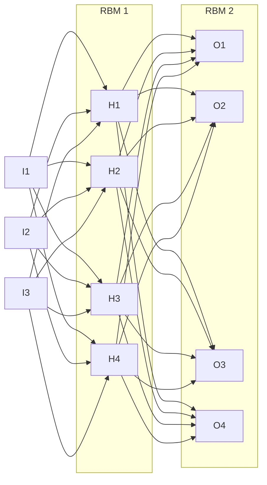

Key properties of DBNs:

* **Layer‑wise unsupervised pre‑training:** each RBM learns a generative model of its input distribution without supervision.
* **Fine‑tuning:** after the stack has been pre‑trained, the topmost layer (or the entire network) can be fine‑tuned with supervised learning for tasks such as classification.
* The DBN architecture was one of the first deep models to achieve strong results on benchmark datasets, marking a milestone in the resurgence of deep learning research [Hinton & Salakhutdinov (2006) [@Hinton06]].
* Although DBNs are historically important, they have largely been superseded by more recent deep architectures (e.g., deep convolutional and transformer models).

The DBN is therefore a paradigmatic illustration of the deep‑learning mantra "let us go deeper": instead of a single shallow latent layer, *layers are stacked on top of layers*, with each level learning a progressively more abstract latent representation of the level below. Once the unsupervised pre‑training is complete, attaching a small classification head to the topmost RBM and fine‑tuning the entire stack with backpropagation yields a competitive supervised model — a recipe that effectively sparked the deep‑learning renaissance even though the RBM/DBN combination has since become uncommon in practice.

## Autoencoder

### Autoencoder (AE)

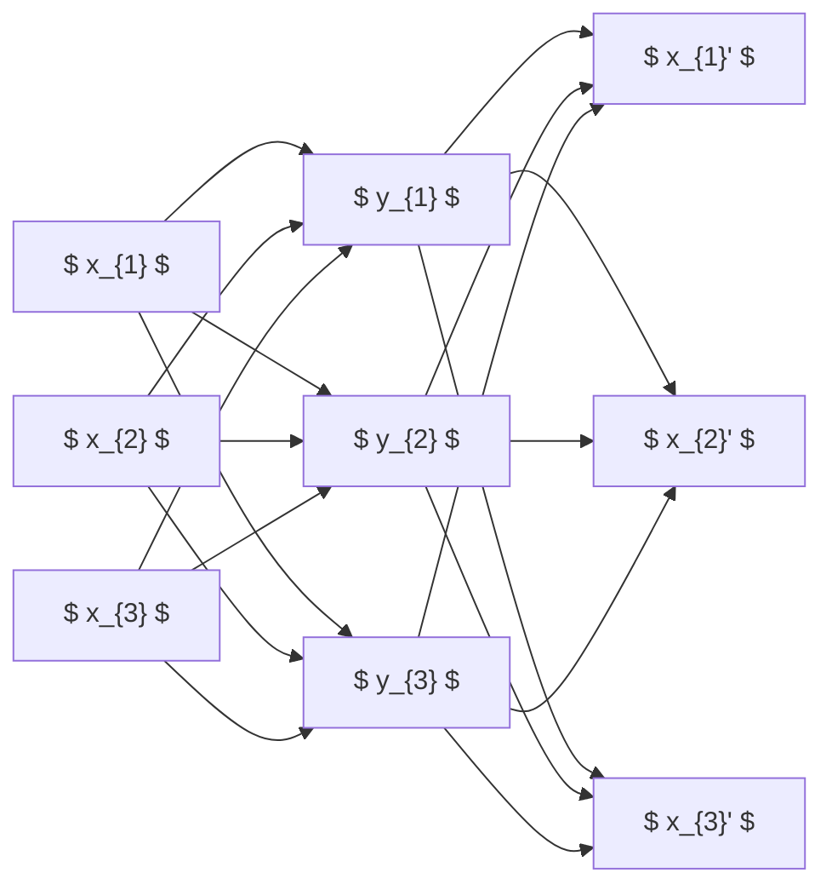

An autoencoder (AE) is a special type of feed-forward neural network designed to learn efficient data representations by encoding and then decoding the input data. The architecture consists of two main components: an encoder and a decoder.

The **encoder** maps the input data $\mathbf{x}$ to a lower-dimensional representation $\mathbf{y}$ through a function $f(\mathbf{x})$. This compressed representation captures the essential features of the input data. The challenge lies in defining a suitable loss function to train the network effectively.

To address this, the **decoder** reconstructs the original input data from the compressed representation. The decoder function $g(\mathbf{y})$ aims to produce an output $\hat{\mathbf{x}}$ that closely matches the original input $\mathbf{x}$. The goal of the autoencoder is to learn an approximation of the identity function, where the reconstructed output $\hat{\mathbf{x}}$ is as close as possible to the input $\mathbf{x}$.

At first glance this objective seems trivial: if the input layer and the hidden layer have the **same** number of nodes, the network can just learn the identity map and incur zero loss. The autoencoder only becomes a useful learning device once a *constraint* is imposed that prevents this degenerate solution — typically by making the hidden representation lower‑dimensional than the input, or by penalising its activations or noise patterns. The various autoencoder variants discussed below differ exactly in *how* they enforce such a constraint.

### Autoencoder – Loss Functions

The loss function in an autoencoder measures the difference between the original input $\mathbf{x}$ and the reconstructed output $\mathbf{x'}$. This loss is proportional to the negative log-likelihood of the input given the reconstructed output, expressed as:

$$
L(\mathbf{x},\mathbf{x'}) \propto - \log p(\mathbf{x} \lvert \mathbf{x'})
$$

Two common loss functions used in autoencoders are the squared $L_2$ norm and cross-entropy.

For the squared $L_2$ norm, the likelihood of the input given the reconstructed output is modeled as a Gaussian distribution:

$$
p(X \lvert \mathbf{x'}) \sim \mathcal{N}(\mathbf{x'}, \sigma^2\mathbf{I})
$$

The corresponding loss function is:

$$
L(\mathbf{x},\mathbf{x'})=\lVert \mathbf{x} - \mathbf{x'} \lVert_2^2
$$

For cross-entropy, the likelihood is modeled as a Bernoulli distribution:

$$
p(X \lvert \mathbf{x'}) \sim \mathcal{B}(\mathbf{x'})
$$

The loss function in this case is:

$$
L(\mathbf{x},\mathbf{x'})=-\sum_{i=1}^n x_i \log( x'_i ) + ( 1-x_i ) \log( 1 - x'_i)
$$

For the cross‑entropy loss to be well defined, the reconstructed components $x'_i$ must lie in the valid probability range $[0,1]$. In practice this is achieved by terminating the decoder with a softmax (or, in the per‑pixel binary case, a sigmoid) activation function, so that the network's output can be interpreted as a probability.

### Enforce Information Compression

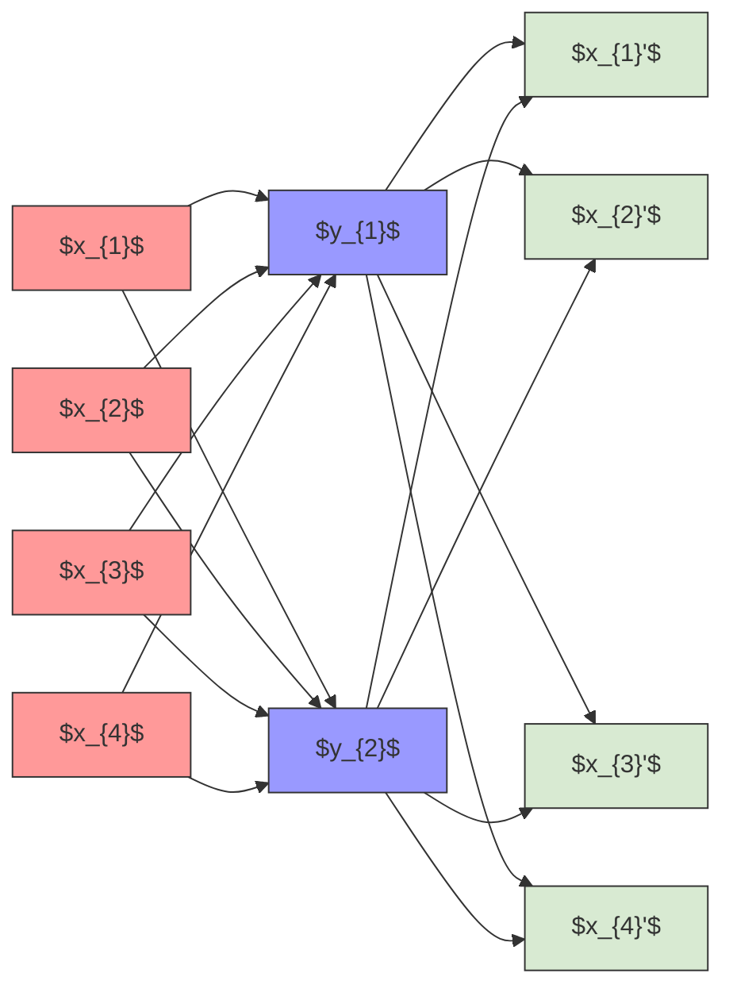

To ensure that the autoencoder learns a compressed representation of the input data, it is essential to prevent the network from simply copying the input to the output. This can be achieved by using an **undercomplete autoencoder**, where the number of hidden units is fewer than the number of input units. In such a configuration, the autoencoder is forced to learn a more efficient representation of the data.

When the autoencoder uses linear layers and the squared $L_2$ norm as the loss function, it effectively learns a Principal Component Analysis (PCA) of the input data. This is because the linear layers and the squared loss encourage the network to capture the principal components of the data. However, if nonlinear layers are used, the autoencoder learns a nonlinear generalization of PCA, allowing it to capture more complex patterns in the data.

### Sparse Autoencoder

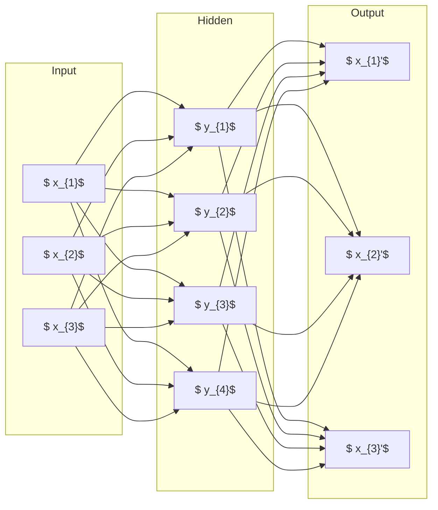

A **sparse autoencoder** is another technique used to enforce information compression. Unlike undercomplete autoencoders, sparse autoencoders may include more hidden units compared to input units. The key idea is to enforce sparsity in the activations of the bottleneck layer, rather than in the weights. This is achieved by adding a sparsity penalty term $\Omega(\vec{y})$ to the loss function:

$$
L_\text{SAE}(\vec{x}, \vec{x}',\vec{w})=L(\vec{x}, \vec{x}', \mathbf{w}) + \Omega({\vec{y}})
$$

Here, $\vec{y}$ represents the activations of the bottleneck layer, and $\Omega$ is a sparsity penalty function. Common choices for $\Omega$ include the $L_1$ or $L_2$ norm, or a penalty defined via the Kullback-Leibler (KL) divergence [Ng (2011) [@sparseAE]].

It is essential to recognise that sparsity must be enforced on the **activations** $\vec{y}$, *not* on the weights of the network. If sparsity were imposed on the weights, the network could still represent an essentially diagonal mapping — a matrix with ones along the diagonal is itself extremely sparse, yet it merely implements the identity transformation that the autoencoder is supposed to avoid. By constraining the *activations* instead, one forces the encoded vector to resemble a one‑hot or near‑one‑hot code, in which only a small subset of hidden units fires for any given input, yielding a meaningful, distributed representation despite the over‑complete latent dimension.

### Autoencoder Variations / Important Terms

#### Convolutional Autoencoder

A **convolutional autoencoder** replaces the fully connected layers in a traditional autoencoder with convolutional layers. This architecture is particularly useful for processing grid-like data, such as images. Optionally, pooling layers can be added to further reduce the dimensionality of the feature maps and enforce spatial invariance.

#### Denoising Autoencoder (DAE)

A **denoising autoencoder (DAE)** is designed to reconstruct the original input data from a corrupted version of it. The corruption process is modeled by a noise distribution $C(\hat{\bx} \vert \bx)$. Common noise models include adding Gaussian noise:

$$
C(\hat{\bx} \vert \bx) \sim \mathcal{N}(\bx,\sigma^2 \vec{I})
$$

or setting random elements of the input to zero. The DAE learns to denoise the corrupted input, which serves as a form of regularization similar to dropout but applied to the input layers.

Beyond mere regularisation, the DAE simultaneously performs *dimensionality reduction* (or *sparse coding*, depending on its architecture) and *image restoration* in a single trained system. A particularly striking generalisation is the **noise2noise** approach, which shows that a denoising autoencoder can be trained successfully even when the *target* itself is noisy, provided that the noise patterns in the input and in the target are statistically independent realisations. This observation greatly broadens the practical applicability of DAEs, especially in domains such as medical imaging where clean ground truth is rarely available.

### Autoencoder Variations / Important Terms

#### DAE as Generative Model

DAEs can also be used as generative models. By implicitly estimating the underlying data-generating process, the DAE learns the conditional distribution $p(\bx \vert \hat{\bx})$. The intuition is that if $\bx$ is a typical sample, iteratively applying the noise and the denoising process will reproduce the sample frequently.

The generative process can be modeled as a Markov chain that alternates between the denoising model $p(\bx \vert \hat{\bx})$ and the corruption process $C(\hat{\bx},\bx)$. By sampling from this Markov chain, an estimator of the data distribution $p(\bx)$ can be obtained. However, this process is often expensive and challenging to assess for convergence. As a result, variational autoencoders (VAEs) are more commonly used for generative modeling.

### Autoencoder Variations / Important Terms

#### Stacked Autoencoder

A **stacked autoencoder** consists of multiple autoencoders stacked on top of each other. There are two main approaches to training a stacked autoencoder:

1. **Layer-by-layer training**: The first autoencoder is trained to reconstruct the input data. The output of the bottleneck layer of the first autoencoder is then used as the input to the second autoencoder, which is trained to reconstruct this new input. This process is repeated for each subsequent autoencoder in the stack.

2. **End-to-end training**: All layers of the stacked autoencoder are trained simultaneously using backpropagation. This approach allows the network to learn a more complex and hierarchical representation of the data.

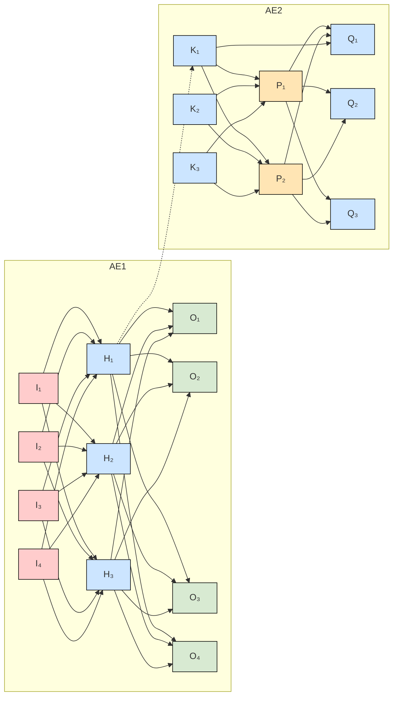

### Autoencoder Variations / Important Terms

#### Stacked Autoencoder (cont.)

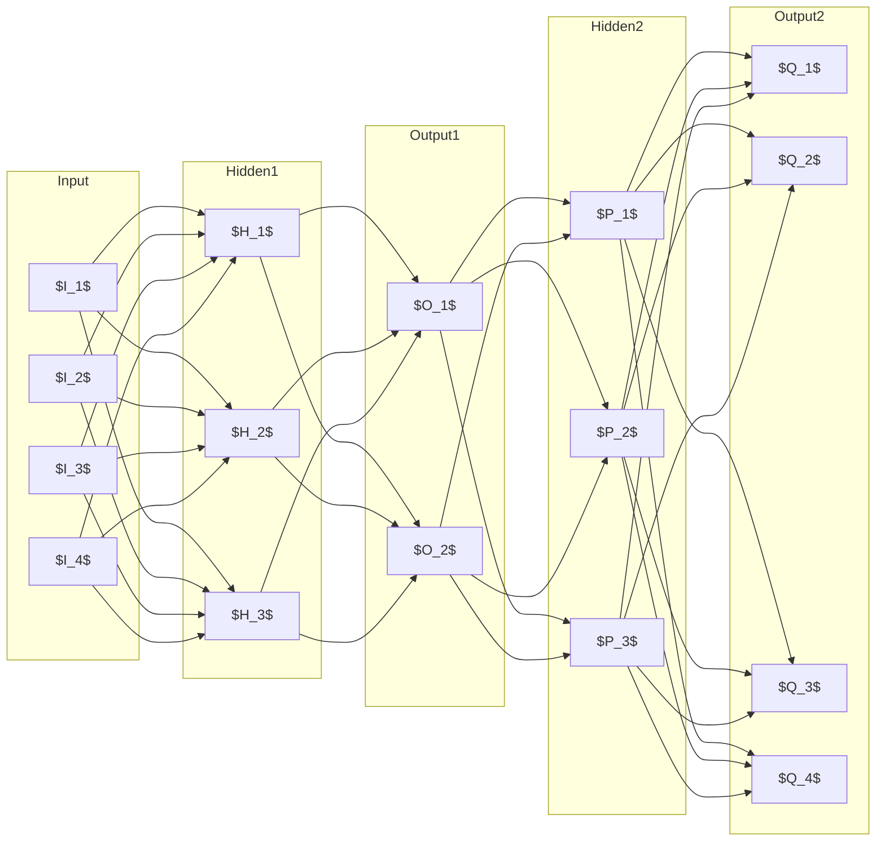

### Variational Autoencoders

Traditional autoencoders compute a **deterministic** feature vector describing the attributes of the input in latent space. In contrast, **variational autoencoders (VAEs)** use a variational approach to learn the latent representation, allowing for a probabilistic description of the observations in the latent space.

The key difference lies in the way the latent representation is modeled. In a traditional autoencoder, the latent attributes are represented as fixed values, whereas in a VAE, each latent attribute is described as a probability distribution. This probabilistic approach enables the model to capture the uncertainty in the input data and generate new samples by sampling from the learned distributions.

### Variational Autoencoders: Motivation

The motivation behind VAEs is to describe each latent attribute as a probability distribution, rather than a single value. This allows the model to capture the uncertainty in the input data and generate new samples by sampling from the learned distributions.

A helpful intuition is to think of a latent space whose dimensions correspond to interpretable attributes of the input — for face images, dimensions such as "smile", "head pose", "skin tone", and so on. A standard autoencoder encodes each face as a single point in this space, assigning, for example, one specific scalar value to "smile". A variational autoencoder, by contrast, encodes each face as a *probability distribution* over the latent attribute. For an unambiguously smiling face the distribution along the "smile" axis is sharply peaked; for an uncertain instance such as the *Mona Lisa*, whose expression has been debated for centuries, the distribution exhibits a much larger variance. The VAE thus naturally represents *uncertainty* about the value of each latent attribute, which is something a deterministic encoder cannot do.

### Variational Autoencoders

In a VAE, the decoding process involves sampling from the latent space to generate new data points. This sampling process is crucial for generating diverse and realistic samples. The representation of latent attributes as probability distributions enforces a continuous and smooth latent space representation. Similar latent space vectors should correspond to similar reconstructions, enabling the model to generate coherent and meaningful samples.

### Variational Autoencoders: Statistical Motivation

The statistical motivation behind VAEs is to determine the distribution of the latent variable $\latent$ that generates an observation $x$. However, computing the true posterior distribution $p(\latent|x)$ is often intractable. To address this, VAEs approximate the true posterior with a tractable distribution $q(\latent|x)$ and minimize the Kullback-Leibler (KL) divergence between the two distributions:

$$
\min~\mathrm{KL}\big(p(\latent|x),q(\latent|x)\big)
$$

This is equivalent to maximizing the variational lower bound, which consists of the reconstruction likelihood and the KL divergence between the approximate posterior and the prior distribution:

$$
\max~\underbrace{\mathbb{E}_{q(\latent|x)} \log
p(x|\latent)}_{\text{reconstruction likelihood}}
- \mathrm{KL}\big(q(\latent|x),p(\latent)\big)
$$

This optimization forces the approximate posterior $q(\latent|x)$ to be similar to the true prior distribution $p(\latent)$.

### Variational Autoencoders: Statistical Motivation

The prior distribution $p(\latent)$ is often assumed to be an isotropic Gaussian distribution. Determining the approximate posterior $q(\latent|x)$ boils down to estimating the mean $\vec{\mu}$ and variance $\vec{\sigma}$ of the Gaussian distribution. A neural network is used to estimate both $q(\latent|x)$ and $p(x|\latent)$.

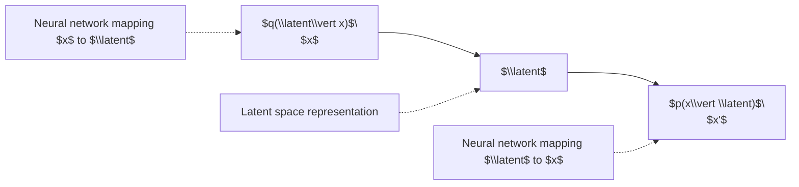

### Variational Autoencoders: Training

The training process of a VAE involves optimizing the variational lower bound. The loss function is given by:

$$
L(\theta, \phi; x, \latent) = \mathbb{E}_{q_\phi(\latent|x)} \log
      p_\theta(x|\latent) - \mathrm{KL}\big(q_\phi(\latent|x), p(\latent)\big)
$$

However, the presence of a sampling operator in the network makes it challenging to backpropagate through the random sampling process.

### Variational Autoencoders: Reparametrization Trick

To enable backpropagation, the **reparametrization trick** is used. This trick involves pushing the random sampling out of the backpropagation path by reparametrizing the sampling process. Instead of sampling directly from the distribution $q_\phi(\latent|x)$, a deterministic transformation is applied to a sample from a fixed distribution, such as a standard normal distribution. This allows for deterministic backpropagation through the network.

Concretely, the encoder predicts the parameters $\vec{\mu}$ and $\vec{\sigma}$ of the approximate posterior, and the latent code is then constructed by the deterministic equation

$$
\latent = \vec{\mu} + \vec{\sigma}\odot \boldsymbol{\epsilon}, \qquad \boldsymbol{\epsilon}\sim\mathcal{N}(\vec{0},\vec{I}).
$$

Here $\boldsymbol{\epsilon}$ is the only **random node** in the computation graph, and it sits *outside* the path along which gradients need to propagate. The downstream decoder still sees a stochastic $\latent$, but the gradient with respect to $\vec{\mu}$ and $\vec{\sigma}$ flows through the deterministic transformation in the usual way. The same mechanism turns sampling into a *layer* that can be inserted anywhere in a neural network, and it makes the right‑hand side of the VAE usable as a fully fledged generator: feeding any $\boldsymbol{\epsilon}$ sample through the decoder produces a new synthetic data point that is consistent with the learned distribution.

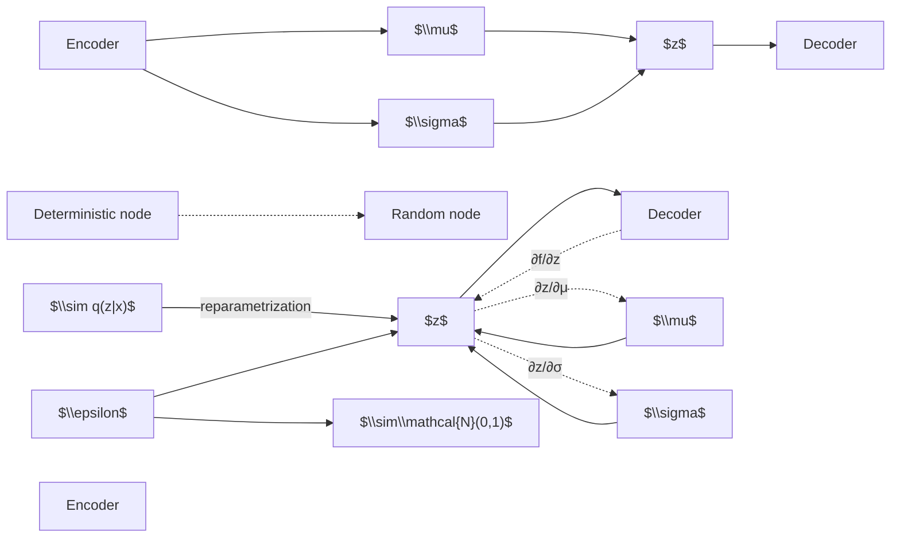

### Variational Autoencoders: Latent Space Visualization

The latent space learned by a VAE can be visualized to understand the structure of the data. For example, when trained on the MNIST dataset, the latent space can be visualized in two dimensions, with points colored according to their assigned digit class. The visualization shows clear clustering of points, where each cluster corresponds to a specific digit. The overlap between neighboring digit classes indicates the ambiguity in the latent representation.

The shape of this latent space is a direct consequence of the two competing terms in the VAE objective. Using only the **reconstruction loss** produces well‑separated clusters but offers no continuity between them, so traversing the latent space between two clusters yields meaningless intermediate reconstructions. Using only the **KL divergence** forces the posterior towards the prior and discards all class information. It is the *combination* of the two losses — simultaneously minimising reconstruction error and the KL divergence to the prior — that yields a latent space that is both *organised by content* and *smooth*, allowing new samples to be drawn from the prior and decoded into meaningful images.

### Variational Autoencoders as Generative Models

VAEs can be used as generative models to create new data samples. By sampling from the distributions in the latent space and decoding them, new and realistic data points can be generated. The diagonal prior enforces independence between the latent variables, allowing the model to encode different factors of variation. For example, smoothly varying the degree of smile and head pose in generated face images demonstrates the model's ability to capture and manipulate these factors.

### Variational Autoencoders: Summary

VAEs are probabilistic models that allow for data generation by sampling from the learned distributions in the latent space. The intractable density is optimized by maximizing the variational lower bound, which is trained via backpropagation using the reparametrization trick.

**Pros of VAEs:**
- Provide a principled approach to generative modeling.
- The latent space representation can be useful for other tasks.

**Cons of VAEs:**
- Only maximize a lower bound of the likelihood.
- Samples in standard models often have lower quality compared to Generative Adversarial Networks (GANs).

VAEs remain an active area of research, with ongoing efforts to improve their performance and applicability.

## Generative Adversarial Networks

### Let’s Play a Game (or the Principle of GANs)

A Generative Adversarial Network (GAN) can be understood as a two‑player game between a **generator** $G$ and a **discriminator** $D$. The generator receives a random noise vector $\mathbf{z}\sim p_{\mathbf{z}}$ and produces a synthetic sample $G(\theta^{G};\mathbf{z})$, often called a *fake* sample. The discriminator receives either a real data point $\mathbf{x}\sim p_{\text{data}}$ or the fake sample and outputs a scalar in $[0,1]$ that estimates the probability that the input is real (output = 1) or fake (output = 0).

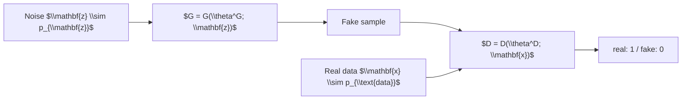

The objective of the game is to make $G$ produce samples that are indistinguishable from real data, while $D$ tries to correctly label real versus fake inputs. A useful intuition is to think of the generator as an *artist* who fabricates artworks and the discriminator as an *art critic* who, given many examples of authentic pieces, must judge whether each work presented is genuine or a forgery; performing this game with humans would be impractical, so both players are realised as deep neural networks that are pitted against one another.

---

### Training GANs – Minimax Game

Training proceeds by alternating optimization of the two networks.

1. **Training the discriminator.**
   The discriminator parameters $\theta^{D}$ are updated to minimise the loss

   $$
   L^{D}(\theta^{D},\theta^{G})=
   -\,\mathbb{E}_{\mathbf{x}\sim p_{\text{data}}}\!\big[\log D(\mathbf{x})\big]
   -\,\mathbb{E}_{\mathbf{z}\sim p_{\mathbf{z}}}\!\big[\log \big(1-D(G(\mathbf{z}))\big)\big].
   $$

   This loss encourages $D$ to assign high probabilities to real data and low probabilities to generated data.

2. **Training the generator.**
   The generator parameters $\theta^{G}$ are updated to minimise the *negative* of the discriminator loss, i.e. to maximise $D$’s mistake probability:

   $$
   L^{G} = -\,L^{D}.
   $$

   In other words, $G$ tries to maximise the discriminator’s error, thereby learning to generate samples that look realistic.

Optionally, one may perform $k$ optimisation steps for one player before updating the other; this can stabilise training when one network learns much faster than the other.

At equilibrium the pair $(\theta^{G},\theta^{D})$ constitutes a **saddle point** of the discriminator loss: $D$ cannot improve its classification accuracy, and $G$ cannot produce samples that $D$ would label as fake.

#### Value function formulation

The adversarial objective can be expressed with a single **value function** $V$ that represents the discriminator’s payoff:

$$
V(\theta^{D},\theta^{G}) = -\,L^{D}(\theta^{D},\theta^{G}).
$$

Training then corresponds to the minimax problem

$$
\hat{\theta}^{G} = \arg\min_{\theta^{G}} \max_{\theta^{D}} V(\theta^{D},\theta^{G}).
$$

---

### Training GANs – Optimal Discriminator

To understand the dynamics of the game we can analytically solve for the optimal discriminator given a fixed generator distribution $p_{\text{model}}(\mathbf{x})$ (the distribution of $G(\mathbf{z})$). Assuming that both $p_{\text{data}}(\mathbf{x})$ and $p_{\text{model}}(\mathbf{x})$ are strictly positive for all $\mathbf{x}$ (otherwise $D(\mathbf{x})$ would be undefined on regions never seen during training), we set the derivative of the discriminator loss with respect to $D(\mathbf{x})$ to zero:

\[
\frac{\partial L^{D}}{\partial D(\mathbf{x})}=0.
\]

Solving yields the **optimal discriminator**:

\[
D^{*}(\mathbf{x}) =
\frac{p_{\text{data}}(\mathbf{x})}{p_{\text{data}}(\mathbf{x}) + p_{\text{model}}(\mathbf{x})}.
\]

This expression is a theoretical construct: in practice we can never know the true densities, so $D$ must be learned from data. The GAN framework therefore amounts to a supervised learning approximation of this density‑ratio, subject to the usual under‑ and over‑fitting trade‑offs.

---

### Non‑Saturating Games – Modify Generator’s Loss

The original minimax loss can lead to vanishing gradients for the generator when the discriminator becomes very good early in training. A common practical modification replaces the generator’s objective with a **non‑saturating** loss:

\[
\begin{aligned}
L^{D} &= -\tfrac{1}{2}\,\mathbb{E}_{\mathbf{x}\sim p_{\text{data}}}\!\big[\log D(\mathbf{x})\big]
        -\tfrac{1}{2}\,\mathbb{E}_{\mathbf{z}\sim p_{\mathbf{z}}}\!\big[\log\big(1-D(G(\mathbf{z}))\big)\big],\\[4pt]
L^{G} &= -\tfrac{1}{2}\,\mathbb{E}_{\mathbf{z}\sim p_{\mathbf{z}}}\!\big[\log D(G(\mathbf{z}))\big].
\end{aligned}
\]

Now the generator **maximises** the log‑probability that the discriminator classifies its output as real, rather than minimising the log‑probability that the discriminator is correct. This heuristic mitigates the vanishing‑gradient problem that occurs when $D$ is already near optimal, especially at the beginning of training. Because the generator no longer minimises the exact negative of the discriminator loss, the equilibrium can no longer be described by a single scalar loss; instead the two networks are trained with their own (but coupled) objectives.

---

### Other Popular Loss Functions

#### Feature‑matching (perceptual) loss

Instead of directly trying to fool the discriminator, the generator can be trained to match **expected feature statistics** of an intermediate layer $f(\cdot)$ inside the discriminator:

\[
L^{G}_{\text{FM}} = \bigl\| \mathbb{E}_{\mathbf{x}\sim p_{\text{data}}}[f(\mathbf{x})]
                     - \mathbb{E}_{\mathbf{z}\sim p_{\mathbf{z}}}[f(G(\mathbf{z}))] \bigr\|^{2}_{2}.
\]

Matching these high‑level representations discourages the generator from over‑fitting to the current discriminator and is widely used in image synthesis tasks.

#### Wasserstein loss (WGAN)

The **Wasserstein GAN** replaces the original Jensen–Shannon divergence with the Earth‑Mover (Wasserstein‑1) distance. The discriminator—now called a **critic** $D$—is trained to maximise the difference of its expectations on real and generated data while being constrained to be 1‑Lipschitz:

\[
\max_{\|D\|_{L}\le 1}
\Bigl\{
\mathbb{E}_{\mathbf{x}\sim p_{\text{data}}}[D(\mathbf{x})]
-
\mathbb{E}_{\mathbf{x}\sim p_{\text{model}}}[D(\mathbf{x})]
\Bigr\}.
\]

If the weights of $D$ were allowed to grow without bound, the gradient could become unbounded. In practice the Lipschitz constraint is enforced by **weight clipping** (or by gradient penalty variants), which keeps the critic within the space of 1‑Lipschitz functions and prevents the vanishing‑gradient pathology that plagues conventional GANs.

> **Figure (description).**
> The figure shows three curves on a common axis ranging from $x\approx -8$ to $x\approx 8$ and $y\approx -0.4$ to $y\approx 1.0$.
> *Blue*: the true data density. *Red*: the density of fake samples evaluated by a conventional GAN discriminator, exhibiting a flat region (vanishing gradient). *Green*: the critic of a WGAN, which remains approximately linear over a large interval (non‑vanishing gradients). The figure visualises why WGANs alleviate gradient saturation.

Other loss formulations (e.g., KL divergence‑based GANs) exist, but the **approximation strategy**—how the discriminator estimates the density ratio—often matters more than the precise form of the loss.

---

### How to Evaluate GANs

#### Inception Score (IS) [Salimans et al. (2016) [@Salimans16]]

The Inception Score measures two desirable properties: (i) generated images should be classifiable by a pretrained classifier (Inception‑v3), and (ii) the classifier’s predictive distribution should have low entropy for each image but high entropy across the whole set, indicating diversity. Formally,

\[
\mathrm{IS}(\mathbf{x}) =
\exp\!\Bigl\{ \mathbb{E}_{\mathbf{x}}\big[ \mathrm{KL}\big(p(y\mid\mathbf{x}) \,\|\, p(y)\big) \big] \Bigr\},
\]

where $p(y\mid\mathbf{x})$ is the conditional class distribution given a generated image, and $p(y)=\mathbb{E}_{\mathbf{x}}[p(y\mid\mathbf{x})]$ is the marginal class distribution. Higher IS indicates better quality and diversity.

#### Fréchet Inception Distance (FID) [Heusel et al. (2017) [@Heusel17]]

FID compares the statistics of real and generated image embeddings extracted from the last pooling layer of Inception‑v3. Assuming both sets follow multivariate Gaussian distributions with means $\mu_{\mathbf{x}},\mu_{\mathbf{g}}$ and covariances $\Sigma_{\mathbf{x}},\Sigma_{\mathbf{g}}$, the distance is

\[
\mathrm{FID}(\mathbf{x},\mathbf{g}) =
\bigl\|\mu_{\mathbf{x}}-\mu_{\mathbf{g}}\bigr\|^{2}
+ \operatorname{Tr}\!\Bigl(\Sigma_{\mathbf{x}}+\Sigma_{\mathbf{g}}
-2\bigl(\Sigma_{\mathbf{x}}\Sigma_{\mathbf{g}}\bigr)^{1/2}\Bigr).
\]

Lower FID values indicate that the generated distribution is closer to the real one. Unlike IS, FID does not rely on a categorical label space and is more robust to noise.

---

### GANs in Comparison to Other Generative Models

* **Parallel sample generation:** Once trained, a GAN can generate many samples simultaneously without sequential dependencies.
* **Few modeling constraints:** Unlike Boltzmann machines or other energy‑based models, GANs impose virtually no restrictions on the form of the data distribution.
* **No Markov chain required:** Sampling does not involve a costly iterative chain.
* **No variational lower bound:** GANs avoid the need for an explicit likelihood bound, unlike variational auto‑encoders.
* **Asymptotic consistency:** Because both generator and discriminator are universal function approximators, the model can, in principle, represent any data distribution given sufficient capacity and training.

---

### Conditional GANs [Mirza & Osindero (2014) [@MirzaO14]]

Standard GANs produce *unconditioned* samples, i.e., the generator draws from a single implicit distribution. In many applications we desire control over certain attributes (e.g., generating an image that matches a textual description). For instance, when generating handwritten digits one would normally want to choose *which* digit (0, 1, 2, …) the generator outputs, rather than receiving an arbitrary class. Conditional GANs (cGANs) achieve this by feeding an additional conditioning vector $\mathbf{y}$ to both $G$ and $D$.

In implementation terms, the latent input is split into two parts: the usual noise vector $\mathbf{z}$ and the conditioning vector $\mathbf{y}$ (which encodes the desired attribute, class, or text embedding). The two are concatenated before being passed through the generator, and the discriminator likewise receives both the (real or generated) image *and* the same conditioning vector — it must therefore decide not only whether the image is realistic but also whether it is consistent with the requested condition. The two‑player minimax game described earlier remains structurally the same; the only difference is that every term in the loss is now conditioned on $\mathbf{y}$.

* **Generator:** $G(\mathbf{z}\mid\mathbf{y})$ receives the noise $\mathbf{z}$ and the condition $\mathbf{y}$, producing a sample that should reflect the condition.
* **Discriminator:** $D(\mathbf{x}\mid\mathbf{y})$ evaluates whether a given pair $(\mathbf{x},\mathbf{y})$ is real or fabricated.

The minimax objective becomes

\[
\begin{aligned}
\min_{G}\max_{D} V(D,G) &=
\mathbb{E}_{\mathbf{x}\sim p_{\text{data}}(\mathbf{x})}\!\big[ \log D(\mathbf{x}\mid\mathbf{y})\big] \\
&\qquad + \mathbb{E}_{\mathbf{z}\sim p_{\mathbf{z}}}\!\big[ \log\big(1-D(G(\mathbf{z}\mid\mathbf{y}))\big)\big].
\end{aligned}
\]

> **Figure (description).**
> The diagram shows a generator receiving a latent vector $\mathbf{z}$ (blue circles) and a conditioning vector $\mathbf{y}$ (gradient‑colored circles), outputting $G(\mathbf{z}|\mathbf{y})$ (dark gray). The discriminator takes either a real sample $\mathbf{x}$ (blue) or the generated sample, together with the same conditioning $\mathbf{y}$, and emits a probability $D(\mathbf{x}|\mathbf{y})$ or $D(G(\mathbf{z}|\mathbf{y}))$ (black / green). Arrows illustrate the flow of information, emphasizing that both networks are conditioned on $\mathbf{y}$.

---

### Example: Conditional GANs for Face Generation

When the conditioning vector encodes facial attributes such as “smiling”, “gender”, or “age”, the generator learns to produce faces exhibiting those attributes, while the discriminator learns to verify whether a face possesses the claimed attribute. This **mode‑specific** learning enables controlled synthesis of realistic human faces. Examples of generated faces typically display three rows: a row of unconditioned random samples (the baseline), a second row conditioned on a single property such as *old age*, and a third row conditioned on a combination of properties (e.g. *old age* and *smiling*). Despite the additional constraints the generator still produces a varied set of identities, demonstrating that the conditioning vector influences the desired attribute without collapsing the identity dimension.

> **Figure (description).**
> A grid of 21 grayscale face images (3 rows × 7 columns) showcases variations in expression and age. The arrangement illustrates how different latent vectors $z$ combined with attribute conditions yield diverse yet attribute‑consistent faces.

---

### Image‑to‑Image Translation

Image‑to‑image translation tasks map an input image from one domain to a corresponding output in another domain (e.g., aerial photographs → maps, black‑and‑white → color, daytime → night). The idea here is that we use the label image again as a conditioning vector. This leads us to the observations that this is domain translation. It is simply a conditional GAN. The positive examples are given to the discriminator. The example below shows a handbag and its edges. The negative examples are then constructed by giving the edges of the handbag to the generator to create a handbag that fools the discriminator.

> **Figure (description).**
> Six paired examples are displayed:
> 1. *Aerial → Map* – an overhead satellite view transformed into a schematic map.
> 2. *Labels → Facade* – semantic labels converted into a realistic building façade.
> 3. *BW → Color* – grayscale photos colourised.
> 4. *Day → Night* – a daylight street scene re‑rendered as nighttime.
> 5. *Aerial → Map* (second instance) – similar to (1) but with a different region.
> 6. *Edges → Photo* – edge sketches turned into a photorealistic handbag image.

These examples demonstrate that a learned conditional mapping can perform diverse visual transformations.

---

### Image‑to‑Image – Just a Conditional GAN!

The image‑to‑image problem can be formulated as a conditional GAN: the **generator** receives an input image (the condition) and outputs a translated image, while the **discriminator** judges whether a given pair (input, output) is real or synthesized.

> **Figure (description).**
> Two columns of paired images are shown: a *positive example* (real input with matching real output) and a *negative example* (real input with a generated output). The discriminator $D$ sits above, trying to separate the two cases, and the generator $G$ sits below, trying to produce outputs that fool $D$. Solid arrows indicate successful translations; dashed arrows denote failures. The system is trained with the usual minimax objective, now conditioned on the source image.

A characteristic example is the edges‑to‑photo handbag task: each *positive* training pair given to the discriminator consists of a real handbag together with its edge map, while *negative* pairs are constructed by feeding the same edge map to the generator and concatenating the synthesised handbag with the input edges. The generator therefore learns the mapping `edges → photorealistic handbag` and the discriminator learns to recognise plausible (input, output) pairings.

A central limitation of this formulation is that the two domains must be **exactly aligned** during training: the conditioning image (e.g. an edge map) and the target image (the corresponding handbag) have to depict the very same instance. In many realistic settings this is impossible — for example, one can easily collect images of zebras in their natural habitat and images of horses in their natural habitat, but it is essentially infeasible to find a paired dataset showing the *same* scene rendered both with horses and with zebras. The conditional GAN as just described therefore cannot be applied to such *unpaired* domain‑translation problems.

---

### Cycle‑Consistent GANs [@Zhu17‑UII]

When paired training data (input–output pairs) are unavailable, a naïve conditional GAN lacks a constraint that ties the output to the original input. **Cycle‑consistent GANs (CycleGAN)** address this by introducing an *inverse* mapping $F$ that maps generated images back to the original domain. The key idea is that the conditioning variables can themselves be chained into a *loop*: a forward generator $G$ produces an image in the target domain from a sample in the source domain, and a second generator $F$ takes that image as its conditioning input and tries to reproduce the original. By insisting that this round trip returns the starting sample, $G$ and $F$ are constrained to be approximate inverses of one another, which provides the missing supervision signal even though no genuine pairs are available. The two mappings satisfy the *cycle‑consistency* constraints:

\[
F(G(\mathbf{x})) \approx \mathbf{x}
\qquad\text{and}\qquad
G(F(\mathbf{y})) \approx \mathbf{y},
\]

where $\mathbf{x}\in X$ and $\mathbf{y}\in Y$ are samples from the two domains.

> **Figure (description).**
> Left: a zebra standing in a field (domain $X$). Right: a horse in a similar scene (domain $Y$). An arrow labelled $G$ points from the zebra to the horse, illustrating the forward translation. The reverse arrow labelled $F$ (not shown) would map the horse back to a zebra. The illustration emphasises that the model must learn to recover the original animal after a round‑trip translation, despite the absence of exact paired examples.

---

### Cycle Consistency Loss [@Zhu17‑UII]

CycleGAN employs two discriminators ($D_{Y}$ for domain $Y$ and $D_{X}$ for domain $X$) and two generators ($G\colon X\rightarrow Y$, $F\colon Y\rightarrow X$). The **cycle‑consistency loss** enforces that a forward‑then‑backward translation returns the original image:

\[
\begin{aligned}
L_{\text{cyc}}(G,F) &=
\mathbb{E}_{\mathbf{x}\sim p_{\text{data}}(\mathbf{x})}\!\big[ \|F(G(\mathbf{x})) - \mathbf{x}\|_{1} \big] \\
&\quad + \mathbb{E}_{\mathbf{y}\sim p_{\text{data}}(\mathbf{y})}\!\big[ \|G(F(\mathbf{y})) - \mathbf{y}\|_{1} \big].
\end{aligned}
\]

The full objective combines the adversarial losses for both mappings with the cycle loss:

\[
L(G,F,D_X,D_Y) =
L_{\text{GAN}}(G,D_Y,X,Y) +
L_{\text{GAN}}(F,D_X,Y,X) +
\lambda\,L_{\text{cyc}}(G,F),
\]

where $\lambda$ balances realism (adversarial terms) against reconstruction fidelity (cycle term). Both directions of the cycle consistency operate simultaneously: the forward direction translates $\mathbf{x}\!\to\!\mathbf{y}$ and back to $\mathbf{x}$ while ensuring that the synthesised $\mathbf{y}$ is not flagged as fake by $D_Y$, and the inverse direction translates $\mathbf{y}\!\to\!\mathbf{x}$ and back to $\mathbf{y}$ while satisfying $D_X$. Two discriminators are therefore mandatory, one for each domain. The $L_1$ distances inside the cycle loss could in principle be replaced by other reconstruction losses, but $L_1$ is preferred in practice because it tends to preserve crisp edges in the reconstruction.

> **Figure (description).**
> The diagram shows two domains $X$ and $Y$ as columns of points. Arrows labelled $G$ and $F$ connect the domains bidirectionally. For a sample $x\in X$, the path $x \xrightarrow{G} y' \xrightarrow{F} \hat{x}$ is visualised, with the original $x$ (blue) and the reconstruction $\hat{x}$ (red) linked by a curved line. An analogous path exists for $y\in Y$. Dashed arrows labelled “cycle‑consistency loss” indicate that the $L_{1}$ distance between original and reconstructed points is penalised.

---

### CycleGAN: Examples

CycleGAN can learn impressive mappings despite the lack of paired data. Representative results include:

* **Artistic style transfer:** Translating photographs into the style of Monet paintings and vice‑versa.
* **Animal domain transfer:** Converting images of zebras into horses and back.
* **Season translation:** Mapping summer scenery to winter scenery (and the reverse).
* **Cross‑artist translation:** Transforming Van Gogh paintings into the style of Cezanne or Ukiyo‑e.

The framework is also readily *chained*: by coupling several CycleGANs with their respective cycle losses one can re‑render a single photograph in the styles of multiple artists (Monet, Van Gogh, …), each obtained by training an additional inverse pair. CycleGAN further finds use beyond purely aesthetic applications; in **autonomous driving**, for example, it can translate raw road‑scene images into corresponding semantic segmentation masks, providing a route to image segmentation when paired training data are scarce. The figure description below mentions an ablation study that compares the *cycle alone*, the *GAN alone*, *GAN + forward loss*, *GAN + backward loss*, and the full CycleGAN: only the complete loss yields back‑and‑forth translations that match the ground truth, confirming that both adversarial and consistency terms are necessary.

> **Figure (description).**
> A 3 × 3 grid shows source images (top row) and their translations (bottom rows). Each column corresponds to a different domain pair (e.g., photograph ↔ Monet, zebra ↔ horse, summer ↔ winter). The visual quality demonstrates that the generators produce plausible target‑domain images while the cycle loss preserves structural content.

> **Figure (description).**
> A second set of visuals compares four GAN variants on a semantic‑segmentation‑to‑real translation task. Columns display: (1) input synthetic images, (2) output of a vanilla GAN, (3) GAN with a forward pass only, (4) GAN with a backward pass only, (5) CycleGAN, and (6) the ground‑truth real image. The comparison highlights that CycleGAN better maintains object identities and scene layout across the translation.

## More Tricks of the Trade

### One‑sided Label Smoothing

In the discriminator of a Generative Adversarial Network (GAN) it is common to replace the target labels of the real samples by a smoothed value.  Concretely, instead of assigning a target of $1$ to every real example we use a slightly lower value, for instance $0.9$.  The target for fake samples is **not** modified; they keep the label $0$.  If both real and fake targets were smoothed, the discriminator could learn to reinforce an incorrect decision boundary, causing the generator $G$ to produce samples that merely resemble the data distribution that it already knows how to generate.

The benefits of one‑sided label smoothing are twofold:

* It prevents the discriminator $D$ from producing excessively large gradients for $G$, which would otherwise destabilize training.
* It discourages $D$ from extrapolating toward extreme samples, thereby keeping the adversarial game within a sensible range of the data manifold.

---

### Balancing $G$ and $D$ necessary?

Contrary to an intuitive belief that the generator and discriminator must be kept perfectly balanced, this is **not** a strict requirement.  GAN training can be interpreted as the estimation of the ratio between the data density $p_{\text{data}}(x)$ and the model density $p_{G}(x)$.  The ratio is estimated correctly only when the discriminator is optimal.  Consequently, it is permissible for $D$ to be substantially stronger than $G$; the system still converges provided the loss functions are chosen appropriately.

When the discriminator becomes too good, two pathological situations may arise:

1. **Vanishing gradients for $G$** – If $D$ classifies almost all generated samples as fake with high confidence, the gradient signal that $G$ receives may disappear.  A common remedy is to employ the *non‑saturating* generator loss, i.e. maximizing $\log D(G(z))$ instead of minimizing $\log(1 - D(G(z)))$.
2. **Exploding gradients for $G$** – In some regimes the gradient magnitude can become excessively large, leading to unstable updates.  Applying label smoothing (as described above) mitigates this problem by tempering the discriminator’s confidence.

Thus, while a completely balanced $G$–$D$ pair is not mandatory, careful loss design and regularization are essential to avoid gradient pathologies.

---

### Deep Convolutional GANs (DCGAN)

DCGANs replace the fully‑connected layers traditionally used in GANs with convolutional architectures that are better suited to image data.  The discriminator consists of a sequence of strided convolutional layers that progressively down‑sample the spatial resolution while increasing the number of feature maps.  A typical configuration starts from an input volume of size $1024 \times 1024 \times 4$ and applies four convolutional stages:

| Layer | Input size | Output size | Stride |
|------|------------|-------------|--------|
| **CONV1** | $1024 \times 1024 \times 4$ | $512 \times 512 \times 16$ | 2 |
| **CONV2** | $512 \times 512 \times 16$ | $256 \times 256 \times 32$ | 2 |
| **CONV3** | $256 \times 256 \times 32$ | $128 \times 128 \times 64$ | 2 |
| **CONV4** | $128 \times 128 \times 64$ | $64 \times 64 \times 5$   | 2 |

The final $64 \times 64 \times 5$ feature map is fed to the classifier that produces the scalar decision $D(x)$.  The same down‑sampling principle applies to the generator, but with *transposed* convolutions (also called deconvolutions) to up‑sample from a latent vector $z$ to an image.

Key architectural guidelines for DCGANs are:

* **Replace pooling layers** with strided convolutions in the discriminator and with transposed convolutions in the generator.
* **Remove fully connected hidden layers**, which allows the network to be deeper and more spatially invariant.
* **Activation functions**: the generator uses ReLU activations in all hidden layers and $\tanh$ at the output to map pixel values into $[-1,1]$; the discriminator uses LeakyReLU (typically with negative slope $0.2$) for all layers.
* **Batch normalization** is applied after each convolution (except the output layers) to stabilize training and to speed up convergence.

---

### Problem of Batch Normalization in the Generator

When a conventional batch‑normalization (BN) layer is employed in the generator, the statistics (mean and variance) are computed over the entire mini‑batch.  If a mini-batch contains only *real* examples or only *fake* examples, the BN statistics become highly correlated across samples.  This strong intra‑batch correlation can lead to undesirable artefacts such as mode collapse or overly smooth generated images, because the generator receives a biased estimate of the data distribution. Empirically, this manifests as samples within a batch that look almost identical to one another, even when the latent inputs were sampled independently — the BN layer effectively *broadcasts* batch‑level statistics into every individual reconstruction.

---

### Virtual Batch Normalization (VBN)

To mitigate the intra‑batch correlation problem, **Virtual Batch Normalization** computes normalization statistics using a *reference batch* that remains fixed throughout training.  The procedure is as follows:

1. **Reference batch creation** – At the start of training, sample a set $R$ of random latent vectors (or real images) and keep this batch constant.
2. **Virtual batch construction** – For each sample $\mathbf{x}_i$ in the current mini‑batch, form a *virtual batch* $V_i = R \cup \{\mathbf{x}_i\}$, i.e., the reference batch augmented with the single current sample.
3. **Statistic computation** – Compute the mean $\mu_i$ and standard deviation $\sigma_i$ of $V_i$.
4. **Normalization** – Normalize $\mathbf{x}_i$ using $\mu_i$ and $\sigma_i$:
   $$
   \hat{\mathbf{x}}_i = \frac{\mathbf{x}_i - \mu_i}{\sigma_i}.
   $$
5. **Propagation of the reference batch** – During each forward pass the reference batch $R$ must also be propagated through the network so that its activation statistics are available for the normalization of the current samples.

If VBN is computationally prohibitive, one may resort to **instance normalization**, which normalizes each sample independently (subtracting its own mean and dividing by its own standard deviation) and therefore avoids any dependence on other batch members. Although VBN doubles the cost of every forward pass — because $R$ must always be processed alongside the current mini‑batch — it has been observed to greatly stabilise GAN training and to suppress the intra‑batch correlation artefacts described above.

---

### Historical Averaging

Another regularization technique borrowed from reinforcement learning is **historical averaging**.  The idea is to penalize the current parameter vector $\boldsymbol{\theta}$ for deviating too far from the running average of its past values.  The penalty term added to the loss is
$$
\left\| \boldsymbol{\theta} - \frac{1}{T}\sum_{i=1}^{T} \boldsymbol{\theta}[i] \right\|^{2},
$$
where $\boldsymbol{\theta}[i]$ denotes the parameter values at training step $i$ and $T$ is the total number of steps considered so far.  The running average can be updated online using an exponential moving average:
$$
\bar{\boldsymbol{\theta}}_{t} = \alpha \, \bar{\boldsymbol{\theta}}_{t-1} + (1-\alpha) \, \boldsymbol{\theta}_{t},
$$
with $\alpha \in (0,1)$ controlling the memory length.

Historical averaging stabilizes GAN training by preventing rapid, large-scale shifts in the generator or discriminator parameters.  Similar ideas from reinforcement learning also apply to GANs:

* **Experience replay** – Maintain a buffer of previously generated samples and periodically re‑introduce them to the discriminator. This diversifies the discriminator's training signal and prevents it from over‑fitting to the most recent generator outputs.
* **Checkpoint swapping** – Keep older checkpoints of $G$ and $D$ and occasionally swap them in for a few iterations, allowing the adversarial pair to "re‑learn" from past configurations and breaking out of cyclic behaviour where the two networks chase each other indefinitely.

---

### DCGAN Examples: Bedrooms after One Epoch

The figure (a $6 \times 6$ grid) shows 36 generated bedroom images after a single epoch of DCGAN training.  The samples exhibit substantial variation in layout, lighting, and color, yet most display the typical artefacts of early-stage GAN outputs: blur, distorted edges, and occasional unrealistic textures.  Despite these imperfections, the generator already captures high-level structure such as the presence of a bed, walls, and windows, illustrating how the adversarial loss quickly forces the model to approximate the data manifold and the diversity of generated bedrooms it can attain even after a single training epoch.

---

### Vector Arithmetic in the Latent Space

A notable property of well‑trained GANs is that the latent space often encodes *semantic directions* that can be manipulated via simple vector arithmetic.  The accompanying figure presents three groups of human face images:

* **Group A** – Male faces **without** glasses.
* **Group B** – Male faces **with** glasses.
* **Group C** – Female faces **without** glasses.

The bottom row visualizes the equation

\[
\text{(woman with glasses)} \; \approx \; \text{(man with glasses)} \; - \; \text{(man without glasses)} \; + \; \text{(woman without glasses)} .
\]

To perform this operation, one averages the latent vectors belonging to each group, computes the difference vector (e.g., “glasses” direction = mean$(\mathbf{z}_{\text{man+glasses}})$ − mean$(\mathbf{z}_{\text{man‑no‑glasses}})$), and adds it to the latent vector of a target sample (e.g., a woman without glasses).  The resulting generated image exhibits the *glasses* attribute while preserving gender, demonstrating that the GAN has learned a **distributed representation** in which concepts such as gender and eyewear are relatively disentangled.

This phenomenon is closely related to the **InfoGAN** framework, which explicitly encourages disentangled latent codes by maximizing mutual information between a subset of latent variables and the generated output \[@Chen16\]. In effect, vector arithmetic in $\mathbf{z}$‑space allows one to *manufacture* a conditioning attribute even when no conditioning variable was provided at training time — a powerful tool for **constrained generation** in scenarios where labels for the desired attribute are not directly available.

## Advanced GAN Methods

### Mode Collapse  

Mode collapse is a pathological behavior observed during the training of Generative Adversarial Networks (GANs). In this situation the generator \(G\) repeatedly produces samples from only a few modes of the true data distribution, effectively “rotating” through these modes without ever converging to a fixed distribution that matches the full data variability. Consequently the generator never learns to cover the entire support of the data and the model fails to generate diverse outputs.  

A possible theoretical reason for mode collapse is the failure of the min–max problem to commute:  

\[
\min_G \max_D V(G,D) \neq \max_D \min_G V(G,D)
\]

When the discriminator \(D\) is placed in the inner loop of the optimization, it can converge quickly to the correct distribution, while the generator, also placed in the inner loop, may concentrate all of its probability mass on the most likely point according to the current discriminator. In practice one typically performs *simultaneous* stochastic gradient descent (SGD) on both networks, which allows both of the above effects to appear simultaneously.  

A concrete visual illustration is provided by trying to fit a target distribution composed of several cluster centres arranged in a ring in 2‑D space. Snapshots of the generator at 5 000, 10 000, 15 000, 20 000, and 25 000 training steps reveal that the generator's probability mass *jumps* from one ring mode to another instead of spreading itself across all of them. Because the generator never settles, the model fails to converge to a stable distribution that covers all clusters — this is mode collapse in its most recognisable form.  

Several practical solutions have been proposed to alleviate mode collapse. Two notable approaches are **minibatch discrimination**, which enriches the discriminator with information about sample diversity within a minibatch, and **unrolled GANs**, which approximate a more thorough optimization of the discriminator before updating the generator.  

---

### Minibatch Discrimination  

The central intuition behind minibatch discrimination is to give the discriminator access to statistics that reflect how a sample relates to other samples in the same mini‑batch. By doing so, the discriminator can penalize the generator when it produces many identical (or highly similar) samples, thereby encouraging diversity.  

The procedure consists of the following steps:  

1. **Feature extraction** – Pass each input (real or generated) through the discriminator up to an intermediate layer and collect the resulting feature vectors.  

2. **Minibatch layer** – For each feature vector, compute a similarity measure with respect to all other feature vectors in the same mini‑batch. This yields a similarity vector that captures how the current sample relates to its peers.  

3. **Feature augmentation** – Concatenate the similarity vector to the original feature vector, thus providing the discriminator with additional “side information” about the sample’s context within the batch.  

The minibatch features are computed *separately* for real data and for generated data, but the final discriminator head still outputs a binary decision (real vs. fake). Because the discriminator now sees information about the diversity of the batch, the generator receives gradients that discourage collapse to a single mode.  

---

### Unrolled GAN  

In the ideal formulation of a GAN, the generator seeks the global optimum  

\[
G^{*} = \arg\min_{G}\; \max_{D} V(G,D),
\]

where \(V(G,D)\) denotes the GAN value function. In practice, however, the maximization over \(D\) is *ignored* when computing the gradient with respect to \(G\); the generator’s update is based on a *single* forward pass of the discriminator rather than on the fully optimized discriminator. This approximation can contribute to instability and mode collapse.  

The **unrolled GAN** addresses this issue by explicitly *back‑propagating through* several steps of discriminator optimization. The key idea is to treat the maximized value \(\max_{D} V(G,D)\) as a cost for the generator and differentiate through the optimization process that leads to (an approximation of) this maximum.  

#### Computational graph for an unrolled GAN  

Consider a cycle‑consistent GAN (CycleGAN) where the discriminator is updated \(k\) times before the generator receives a gradient. The unrolled computational graph consists of the following elements:  

1. **Function evaluation blocks** – Each block computes the GAN loss \(f_i(G_i(\theta_G), \theta_D)\) for the current generator parameters \(\theta_G\) and discriminator parameters \(\theta_D\).  

2. **SGD steps for the discriminator** – After each loss evaluation, an SGD update is applied to \(\theta_D\), producing a new set of discriminator parameters that will be used in the next block.  

3. **Gradient flow** – In the forward pass, green arrows indicate the sequential flow of data through the \(k\) discriminator updates. In the backward pass, red arrows show how gradients with respect to \(\theta_D\) flow back through each SGD step, while gradients with respect to \(\theta_G\) are accumulated to update the generator.  

By unrolling the discriminator for a finite number of steps \(k\) (e.g., \(k=10\)), the generator receives a more informative gradient that reflects how the discriminator would react after several updates. Fully maximizing the discriminator's value function is intractable, but even a modest number of unrolled steps can substantially reduce mode collapse.  

The construction is conceptually identical to the *back‑propagation through time* used in recurrent neural networks: each unrolled SGD step on $\theta_D$ acts like a recurrent application of the same update operator, and the gradient with respect to $\theta_G$ flows back through the entire chain. Empirically, even $k=10$ unrolled steps already make a dramatic difference; on the same ring‑of‑modes toy problem that exhibited mode‑rotation behaviour for the standard GAN, the unrolled GAN starts from the same initial distribution at step 0 but has spread over a much larger area by step 5 000, fills the entire domain by step 10 000, forms a ring shape by step 15 000, develops sharp local maxima around 20 000 steps, and finally reproduces the target distribution by step 25 000.  

---

### GANs for Semi‑supervised Learning  

A common way to exploit GANs for semi‑supervised learning is to enlarge the discriminator’s output space from \(K\) to \(K+1\) classes. The original \(K\) classes correspond to the *true* categories present in the labeled data, while the additional \((K+1)^{\text{st}}\) class represents *fake* inputs generated by the generator.  

During training, the discriminator is trained both as a classifier (predicting one of the \(K\) real classes) and as a binary classifier distinguishing real from generated data. The probability that an image is *real* can be obtained by summing the discriminator’s predicted probabilities over the \(K\) real classes. In this way, the discriminator simultaneously learns to classify labeled examples and to detect generated samples, allowing the generator to benefit from the labeled data while the discriminator leverages unlabeled data through the adversarial signal.  

---

### Multi‑scale Approaches: Laplacian Pyramid of GANs  

Generating high‑resolution images directly with a GAN is notoriously difficult; most GANs perform well up to modest resolutions (e.g., \(64\times64\) pixels). A multi‑scale strategy called the **Laplacian Pyramid of GANs (LapGAN)** addresses this limitation by progressively increasing the resolution and adding detail at each level of a pyramid.  

#### Generation process  

1. **Base level** – The generator at the coarsest scale (\(G_0\)) receives a noise vector \(\tilde{z}_0\) and produces a low‑resolution image \(\tilde{I}_0\).  

2. **Higher levels** – For each subsequent level \(i\), the generator \(G_i\) takes two inputs: (a) a fresh noise vector \(\tilde{z}_i\) and (b) the upsampled image from the previous level \(I_{i-1}\). These are combined as a conditioning variable.  

3. **Output as a difference image** – Instead of directly outputting a full image, \(G_i\) generates a *difference* (or residual) image \(\tilde{h}_i\). This residual is added to the upsampled previous image to obtain the refined image at the current resolution:  
   \[
   I_i = \text{upsample}(I_{i-1}) + \tilde{h}_i .
   \]  

The cascade \(\{G_0, G_1, G_2, G_3\}\) thus constructs the final high‑resolution image \(I_3\) by iteratively adding finer details, mirroring the classic Laplacian pyramid decomposition where an image is decomposed into a low‑frequency base and a series of band‑pass residuals.  

#### Training procedure  

Each generator \(G_i\) is paired with its own discriminator \(D_i\). The discriminator operates on *difference images* (the residuals) rather than on full images. Training proceeds level‑by‑level:  

- Real residuals are obtained by subtracting the upsampled lower‑resolution image from the corresponding ground‑truth image at that scale.  

- Generated residuals come from \(G_i\).  

- \(D_i\) learns to distinguish real residuals from generated ones, while \(G_i\) learns to produce residuals that fool \(D_i\).  

Although LapGANs can generate images at higher resolutions than a single GAN, the reported experiments still typically cap at \(64\times64\) pixels. Nonetheless, the multi‑scale paradigm has inspired many later high‑resolution synthesis methods.  

---

### StackGANs: Text‑to‑Photo‑Realistic Image Synthesis  

StackGANs address the challenging task of generating photorealistic images conditioned on textual descriptions. The key insight is to **decompose** the generation process into two stages, analogous to how a human artist first sketches a rough composition and then refines it.  

#### Stage‑I GAN (Sketch Generation)  

- **Conditioning** – The generator receives the text embedding describing the desired object (e.g., a bird) as input.  

- **Output** – It produces a low‑resolution (\(64\times64\) or \(128\times128\)) image that captures the *coarse* structure: overall shape, basic colors, and background layout. The result is often blurry and may contain artifacts, but it provides a reasonable scaffold for further refinement.  

#### Stage‑II GAN (Refinement)  

- **Conditioning** – This generator takes both the low‑resolution image from Stage‑I and the original text embedding as inputs.  

- **Output** – It generates a higher‑resolution image (typically four times the pixel count of Stage‑I) with sharper edges, finer textures, and corrected defects. The Stage‑II network learns to *add realistic details* while preserving the semantic content dictated by the text.  

Empirical results show that Stage‑I images are indeed blurry and lack detailed foreground structure, whereas Stage‑II outputs exhibit substantially higher visual fidelity and a \(4\times\) increase in resolution. A canonical demonstration is the generation of bird images from textual descriptions: Stage‑I produces a recognisable but coarse bird matching the text caption, while Stage‑II corrects defects and adds plumage detail, yielding a much more photorealistic image. The staged architecture is essentially a higher‑level relative of the LapGAN strategy from the previous subsection — both decompose the daunting task of high‑resolution synthesis into a sequence of conditional generators, each of which only has to add detail beyond what the previous stage already supplied.  

---

### Summary  

Generative Adversarial Networks (GANs) are a class of generative models that rely on a *supervised* adversarial game between a generator \(G\) and a discriminator \(D\) to approximate an otherwise intractable cost function. They are capable of simulating a wide variety of loss functions and have found applications beyond pure generation, including:  

- **Semi‑supervised classification**, where the discriminator is extended to an extra “fake” class.  
- **Transfer learning**, leveraging pre‑trained discriminators as feature extractors.  
- **Multi‑modal output generation**, allowing a single model to produce diverse samples conditioned on the same input.  

Training GANs remains challenging because finding an equilibrium between \(D\) and \(G\) is non‑trivial; common failure modes include **mode collapse** and the inability to generate discrete data, since gradients cannot flow through a non‑differentiable categorical sampling step. Nevertheless, many extensions — such as minibatch discrimination, unrolled optimization, multi‑scale pyramids, and staged conditional generators — have been proposed to mitigate these issues and expand the applicability of GANs. The pace of innovation in this area is high: large‑scale variants such as **BigGAN** have pushed conditional GAN synthesis into the regime of very high resolution images, and **domain transfer** — the use of GANs to convert images between domains — has become a widely deployed practical technique.  

---  

### Comprehensive Questions  

- What is the basic idea of contrastive divergence?  
- What is the defining characteristic of an autoencoder?  
- How do denoising autoencoders work?  
- What is a variational autoencoder, and why is the reparametrisation trick necessary in order to back‑propagate through a sampling operation?  
- What does an optimal discriminator for GANs learn?  
- What are the advantages of GANs compared to other generative models?  
- What is "mode collapse"?  
- Explain feature matching / perceptual loss.  
- What is a CycleGAN and how does its cycle‑consistency loss enable unpaired image‑to‑image translation?  

---  

### Further Reading  

- Variational Autoencoders: <http://dpkingma.com/wordpress/wp-content/uploads/2015/12/talk_nips_workshop_2015.pdf>  
- NIPS 2016 GAN Tutorial by Goodfellow: <https://www.youtube.com/watch?v=AJVyzd0rqdc>  
- “How to train a GAN? Tips and tricks to make GANs work” (note: some tips may be outdated): <https://github.com/soumith/ganhacks>  
- “Ever wondered about how to name your GAN?”: <https://github.com/hindupuravinash/the-gan-zoo>

## References

### References

## Lecture Notes Sources

These integrated lecture notes were transcribed from voice recordings of the lecture (FAU LME). Follow the links for the original blog posts:

- [Unsupervised Learning Part 1](https://lme.tf.fau.de/lecture-notes/lecture-notes-dl/lecture-notes-in-deep-learning-unsupervised-learning-part-1/)
- [Unsupervised Learning Part 2](https://lme.tf.fau.de/lecture-notes/lecture-notes-dl/lecture-notes-in-deep-learning-unsupervised-learning-part-2/)
- [Unsupervised Learning Part 3](https://lme.tf.fau.de/lecture-notes/lecture-notes-dl/lecture-notes-in-deep-learning-unsupervised-learning-part-3/)
- [Unsupervised Learning Part 4](https://lme.tf.fau.de/lecture-notes/lecture-notes-dl/lecture-notes-in-deep-learning-unsupervised-learning-part-4/)
- [Unsupervised Learning Part 4 2](https://lme.tf.fau.de/lecture-notes/lecture-notes-dl/lecture-notes-in-deep-learning-unsupervised-learning-part-4-2/)

## Bibliography

The bibliography collects the core papers that were referenced throughout the unsupervised learning lecture series.  Below, brief historical notes and contextual remarks are added to highlight how each work fits into the development of modern generative models.

- **Chen16** — Chen et al. (2016) "InfoGAN: Interpretable Representation Learning by Information Maximizing Generative Adversarial Nets." *Advances in Neural Information Processing Systems 29*. [http://papers.nips.cc/paper/6399-infogan-interpretable-representation-learning-by-information-maximizing-generative-adversarial-nets.pdf](http://papers.nips.cc/paper/6399-infogan-interpretable-representation-learning-by-information-maximizing-generative-adversarial-nets.pdf).  
  *InfoGAN* was presented in the lecture as an early example of how an adversarial framework can be extended to learn disentangled, semantically meaningful latent codes, complementing the more basic GAN formulation.

- **Denton15** — Denton et al. (2015) "Deep Generative Image Models using a Laplacian Pyramid of Adversarial Networks." *CoRR*. [http://arxiv.org/abs/1506.05751](http://arxiv.org/abs/1506.05751).  
  The Laplacian Pyramid GAN (LAPGAN) was discussed in Part 5 as a hierarchical approach that first generates a low‑resolution image and then progressively adds high‑frequency details, illustrating a powerful way to obtain higher‑resolution samples.

- **Fischer14TRB** — Fischer & Igel (2014) "Training restricted Boltzmann machines: An introduction." *Pattern Recognition*. DOI: [https://doi.org/10.1016/j.patcog.2013.05.025](https://doi.org/https://doi.org/10.1016/j.patcog.2013.05.025).  
  This tutorial was cited when the lecturer described the historical role of restricted Boltzmann machines (RBMs) as one of the first unsupervised deep models and explained the contrastive‑divergence learning rule.

- **Gauthier15** — Gauthier (2015) "Conditional generative adversarial networks for face generation." [http://www.foldl.me/2015/conditional-gans-face-generation/](http://www.foldl.me/2015/conditional-gans-face-generation/).  
  The conditional GAN idea introduced here underpins the later discussion of *pix2pix* and CycleGAN, where side information (e.g., class labels, edge maps) is concatenated to the latent vector.

- **Goodfellow16tut** — Goodfellow (2016) "NIPS 2016 Tutorial: Generative Adversarial Networks."  . [arxiv:http://arxiv.org/abs/1701.00160v4](http://arxiv.org/abs/1701.00160v4).
  The tutorial slides were used as a reference for the basic GAN game, the minimax formulation, and the non‑saturating loss that mitigates vanishing gradients in the generator.

- **Heusel17** — Heusel et al. (2017) "GANs Trained by a Two Time-Scale Update Rule Converge to a Local Nash Equilibrium." *Advances in Neural Information Processing Systems 30*. [http://papers.nips.cc/paper/7240-gans-trained-by-a-two-time-scale-update-rule-converge-to-a-local-nash-equilibrium.pdf](http://papers.nips.cc/paper/7240-gans-trained-by-a-two-time-scale-update-rule-converge-to-a-local-nash-equilibrium.pdf).  
  Their two‑time‑scale (TTUR) analysis was mentioned when explaining why the discriminator and generator may be trained with different learning rates to improve stability.

- **Hinton06** — Hinton & Salakhutdinov (2006) "Reducing the dimensionality of data with neural networks.." *Science*. DOI: [10.1126/science.1127647](https://doi.org/10.1126/science.1127647).  
  This landmark paper introduced deep autoencoders for dimensionality reduction and was highlighted as the precursor of modern variational autoencoders (VAEs).

- **Isola16** — Isola et al. (2016) "Image-to-Image Translation with Conditional Adversarial Networks."  . [arxiv:http://arxiv.org/abs/1611.07004v3](http://arxiv.org/abs/1611.07004v3).
  The *pix2pix* framework was used as a concrete example of a conditional GAN that learns a mapping from an input image (e.g., edges, segmentation masks) to a target image.

- **Kingma13-AEV** — Kingma & Welling (2013) "Auto-Encoding Variational Bayes." *arXiv e-prints*.  . [arxiv:http://arxiv.org/abs/1312.6114v11](http://arxiv.org/abs/1312.6114v11).
  The variational autoencoder formalism, together with the re‑parameterization trick, was presented in Part 2 as a probabilistic alternative to deterministic autoencoders.

- **Metz17** — Metz et al. (2017) "Unrolled Generative Adversarial Networks." *International Conference on Learning Representations*.  . [arxiv:http://arxiv.org/abs/1611.02163v4](http://arxiv.org/abs/1611.02163v4).
  Unrolled GANs were discussed in the “Advanced GAN Methods” segment as a technique to mitigate mode collapse by back‑propagating through several discriminator updates.

- **MirzaO14** — Mirza & Osindero (2014) "Conditional Generative Adversarial Nets." *CoRR*. [http://arxiv.org/abs/1411.1784](http://arxiv.org/abs/1411.1784).  
  This paper introduced the conditioning vector *y* that later became the backbone of *pix2pix*, CycleGAN, and many multi‑modal generation tasks.

- **Radford15** — Radford et al. (2015) "Unsupervised Representation Learning with Deep Convolutional Generative Adversarial Networks."  . [arxiv:http://arxiv.org/abs/1511.06434v2](http://arxiv.org/abs/1511.06434v2).
  The DCGAN architecture (strided convolutions, batch‑norm, ReLU/LeakyReLU) was referenced when describing practical design choices for stable GAN training.

- **Salimans16** — Salimans et al. (2016) "Improved Techniques for Training GANs." *Advances in Neural Information Processing Systems 29*. [http://papers.nips.cc/paper/6125-improved-techniques-for-training-gans.pdf](http://papers.nips.cc/paper/6125-improved-techniques-for-training-gans.pdf).  
  Techniques such as one‑sided label smoothing, feature matching, and minibatch discrimination were all drawn from this work.

- **Zhang16** — Zhang et al. (2016) "StackGAN: Text to Photo-realistic Image Synthesis with Stacked Generative Adversarial Networks." *CoRR*. [http://arxiv.org/abs/1612.03242](http://arxiv.org/abs/1612.03242).  
  StackGAN was presented in Part 5 as a two‑stage conditional GAN that first sketches a low‑resolution image from a text description and then refines it to high resolution.

- **Zhou16LDF** — Zhou et al. (2016) "Learning Deep Features for Discriminative Localization." *2016 IEEE Conference on Computer Vision and Pattern Recognition (CVPR)*. DOI: [10.1109/CVPR.2016.319](https://doi.org/10.1109/CVPR.2016.319).  
  The class‑activation‑map (CAM) technique from this paper was mentioned when illustrating how GAN discriminators can provide useful feature embeddings for downstream tasks.

- **Zhu17-UII** — Zhu et al. (2017) "Unpaired Image-to-Image Translation using Cycle-Consistent Adversarial Networks." *CoRR*. [http://arxiv.org/abs/1703.10593](http://arxiv.org/abs/1703.10593).  
  CycleGAN was a centerpiece of Part 4, demonstrating how two GANs coupled with a cycle‑consistency loss enable translation between domains without paired examples.

- **sparseAE** — Ng (2011) "CS294A Lecture notes." [https://web.stanford.edu/class/cs294a/handouts.html](https://web.stanford.edu/class/cs294a/handouts.html).  
  These notes were used to introduce the concept of sparse autoencoders, where an L1 penalty on hidden activations forces a compact, over‑complete representation.

- **zhang2016stackgan** — Zhang et al. (2016) "Stackgan: Text to photo-realistic image synthesis with stacked generative adversarial networks." *arXiv preprint arXiv:1612.03242*.  . [arxiv:http://arxiv.org/abs/1612.03242v2](http://arxiv.org/abs/1612.03242v2).

These references together form the backbone of the unsupervised learning syllabus, spanning early energy‑based models (RBMs), deterministic and variational autoencoders, and the full spectrum of GAN variants that are now standard tools for representation learning, image synthesis, and domain translation.