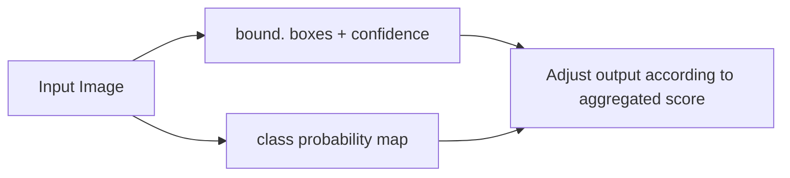

# Segmentation and Object Detection

## Introduction

### Today’s Topics  

In computer vision, three closely related tasks are often discussed together: **image classification**, **object detection**, and **segmentation**.  
All three aim to interpret visual data, but they differ in the granularity of the information they produce:

1. **Classification** – The goal is to assign a single label (e.g., “Cat”) to an entire image, answering the question *what* is present.  
2. **Object Detection** – The task is to locate each instance of a target class and draw a bounding box around it, thereby providing both *what* and *where*.  
3. **Segmentation** – This further refines the localization by labeling each pixel. Segmentation can be split into two families:  

   * **Semantic segmentation** – Every pixel receives a class label, but different instances of the same class are not distinguished.  
   * **Instance segmentation** – Each pixel is labeled not only with a class but also with a unique identifier for the object it belongs to, thus separating individual instances.

The following visual examples illustrate these distinctions using photographs of cats in natural outdoor settings.

> **Historical note.** The progressive refinement from classification to detection to segmentation mirrors the evolution of deep‑learning architectures: early convolutional classifiers (e.g., AlexNet) were extended to region‑based detectors such as R‑CNN [5] and later to fully convolutional semantic segmentors (Long et al.'s FCN [13]), culminating in instance‑aware systems like Mask R‑CNN [10]. This lineage explains why the three tasks are frequently taught together.

---

### Classification  

Consider an image that contains three cats. A classification system would output a single label such as **“Cat”**, indicating that at least one cat is present in the scene. No information about the number of cats, their positions, or shapes is provided.

> **Why classification alone is insufficient.** As Prof. Maier emphasized, classification discards spatial relationships, which are crucial for downstream tasks such as robotics navigation or medical diagnosis. For example, knowing *where* a tumor lies (segmentation) is far more actionable than merely knowing that a tumor exists (classification).

---

### Semantic Segmentation  

Semantic segmentation assigns a class label to every pixel in an image. In the example with the three cats, a semantic‑segmentation model might produce a mask that colors all pixels belonging to the “cat” class in solid red, regardless of which physical cat they belong to. The result is a binary map (cat vs. background) that delineates the overall region occupied by cats but does not separate the three individuals.

*Figure:* Two cat silhouettes filled with solid red against a wooden fence background illustrate this pixel‑wise labeling. The red region corresponds to the output of a pixel‑wise classifier that has decided each covered pixel belongs to the “cat” class.

> **From classification to dense prediction.** The first breakthrough for dense labeling was the Fully Convolutional Network (FCN) [13], which repurposes a classification CNN into an encoder‑decoder that produces a coarse heat map and then upsamples it to the original resolution. Subsequent refinements—SegNet [1] and the now‑canonical U‑Net [21]—introduced learned up‑sampling (unpooling, transposed convolutions) and skip connections to recover fine details, enabling high‑quality semantic masks for applications ranging from autonomous driving (road, pedestrian, vehicle labeling) to medical imaging (organ and vessel delineation).

> **Evaluation metrics.** To quantify segmentation quality, practitioners use pixel accuracy, mean pixel accuracy, and especially the mean Intersection‑over‑Union (mIoU), which measures the overlap between predicted and ground‑truth regions while accounting for class imbalance [Part 1].

---

### Object Detection  

Object detection combines classification with **localization**. Rather than labeling every pixel, the model returns a set of axis‑aligned bounding boxes, each tightly enclosing an individual object. For the same three‑cat photo, an object‑detection algorithm would output three rectangular boxes, each labeled “Cat”. The boxes indicate where each cat appears in the image, but they do not provide precise shape information.

*Figure:* Orange bounding boxes drawn around each cat demonstrate this output. The boxes are aligned with the image axes and fully contain the corresponding animal, capturing the spatial extent of each detection.

> **Early detection pipelines.** The classic Viola‑Jones cascade [25] was among the first real‑time detectors, using Haar‑like features and boosting. Modern deep‑learning detectors began with R‑CNN [5], which generated region proposals via selective search and classified each region with a CNN. Fast R‑CNN [6] and Faster R‑CNN [5] streamlined the pipeline by sharing convolutional features and introducing a Region Proposal Network, respectively, paving the way for end‑to‑end trainable detectors that run at near‑real‑time speeds.

> **Bounding‑box regression.** In addition to class scores, modern detectors learn a regression offset that refines the coarse proposal into a tighter box, a technique first popularized in the R‑CNN family and retained in subsequent single‑shot detectors such as YOLO [26] and SSD [24].

---

### Instance Segmentation  

Instance segmentation merges the fine‑grained pixel labeling of semantic segmentation with the instance awareness of object detection. The model produces a separate mask for each object, assigning a unique identifier (or distinct color) to the pixels of each instance. In the cat example, three non‑overlapping masks—e.g., orange for the leftmost cat, blue for the middle cat, and maroon for the rightmost cat—are generated. This representation tells us *what* each object is, *where* it is, and *its exact silhouette*.

*Figure:* Colored masks overlay three animal shapes (an orange cat on the left and blue/maroon blobs on the right), showing how each instance receives its own segmentation mask.

> **Two‑stage instance methods.** Mask R‑CNN [10] extends Faster R-CNN by adding a small Fully Convolutional Network branch that predicts a binary mask for each RoI. The overall loss combines classification, bounding‑box regression, and mask segmentation, enabling high‑quality instance masks on benchmarks such as COCO.

> **Why instance matters.** Instance‑level information is essential for tasks like counting objects (e.g., cells in a microscopy slide), reasoning about occlusion (e.g., grasp planning in robotics), or measuring per‑object metrics (e.g., tumor volume). 

---

### Summary of Relations  

| Task | Output | Handles Instances? | Typical Output Format |
|------|--------|--------------------|-----------------------|
| **Classification** | Single class label per image | No | Text label (e.g., “Cat”) |
| **Semantic Segmentation** | Per‑pixel class label | No (all cats share the same label) | Pixel‑wise mask (binary or multi‑class) |
| **Object Detection** | Bounding boxes + class label | Yes (each box is an instance) | Set of rectangles with class scores |
| **Instance Segmentation** | Per‑pixel instance‑aware label | Yes (each instance gets its own mask) | Set of masks, each with a unique ID or color |

These four formulations form a hierarchy of increasingly detailed visual understanding. Modern computer‑vision pipelines often combine them, using detection to propose regions of interest and segmentation to refine object boundaries. Understanding the differences is essential before selecting loss functions, network architectures, and evaluation metrics for a given application.

> **Practical tip.** When designing a system, start from the coarsest required granularity (classification) and only add detection or segmentation modules if the downstream task demands spatial precision. This incremental approach mirrors the lecture’s narrative and avoids unnecessary computational overhead.

## Segmentation

### Motivation

#### What is Semantic Segmentation?

Semantic segmentation assigns a categorical label to every pixel of an image, thereby partitioning the image into regions that correspond to meaningful objects. Each pixel receives a **semantic class**, yielding a dense, pixel‑wise classification. This formulation generalizes to other signals such as audio, where time‑frequency bins can be labeled analogously.

A canonical example is an aerial silhouette of an airplane: the dark airplane region is separated from the lighter background, and the task is to label all pixels belonging to the airplane with the class “airplane”.

#### Applications of Segmentation

Semantic segmentation is a core component in many real‑world systems:

- **Medical imaging** – delineation of organs, vessels, and cells.
- **Autonomous driving** – identification of traffic signs, pedestrians, drivable surfaces, and other street elements.
- **Other domains** – aerial imaging, robotics, image editing, and any task that requires precise object boundaries.

#### Evaluation Metrics

The usefulness of a segmentation method depends on execution time, memory footprint, and the quality of the produced masks. Because class frequencies are rarely uniform, metrics must account for class imbalance.

Assume a total of $k\!+\!1$ classes, including a void/background class. Let $p_{ij}$ denote the number of pixels whose true class is $i$ and that are predicted as class $j$. In particular, $p_{ii}$ counts true positives for class $i$.

1. **Pixel Accuracy (PA)** – the proportion of correctly classified pixels over the whole image:

   $$
   PA = \frac{\displaystyle\sum_{i=0}^{k} p_{ii}}{\displaystyle\sum_{i=0}^{k}\sum_{j=0}^{k} p_{ij}} .
   $$

2. **Mean Pixel Accuracy (MPA)** – the average per‑class pixel accuracy:

   $$
   MPA = \frac{1}{k+1}\sum_{i=0}^{k}\frac{p_{ii}}{\displaystyle\sum_{j=0}^{k} p_{ij}} .
   $$

3. **Mean Intersection over Union (MIoU)** – the average IoU across classes:

   $$
   MIoU = \frac{1}{k+1}\sum_{i=0}^{k}\frac{p_{ii}}{\displaystyle\sum_{j=0}^{k} p_{ij} \;+\;\sum_{j=0}^{k} p_{ji} \;-\; p_{ii}} .
   $$

4. **Frequency‑Weighted Intersection over Union (FWIoU)** – an IoU that weights each class by its pixel frequency, thus mitigating the effect of rare classes:

   $$
   FWIoU = \frac{1}{\displaystyle\sum_{i=0}^{k}\sum_{j=0}^{k} p_{ij}}
           \sum_{i=0}^{k}
           \frac{\displaystyle\sum_{j=0}^{k} p_{ij}\, p_{ii}}
                {\displaystyle\sum_{j=0}^{k} p_{ij} \;+\;\sum_{j=0}^{k} p_{ji} \;-\; p_{ii}} .
   $$

---

### Fully Convolutional Networks for Segmentation

#### Reminder: Fully Convolutional Networks

Traditional convolutional neural networks (CNNs) for image classification consist of a cascade of convolutional layers that extract spatial features, followed by **fully connected** layers that collapse spatial dimensions and output a vector of class probabilities. The fully connected layers fix the input size and discard spatial information, which is unsuitable for dense prediction tasks such as segmentation.

#### Fully Convolutional Networks (FCNs) \[@long2015fully\]

FCNs reinterpret fully connected layers as **convolutional** layers with $1\times1$ kernels. Consequently, the network can accept inputs of arbitrary size and produce a spatial **heat map** as output. Down‑sampling (pooling) layers still coarsen the resolution, so the raw output is typically low‑resolution relative to the input image. The main challenge, therefore, is to increase output resolution while preserving the global context captured by deep layers.

#### Encoder–Decoder Architectures

Most modern segmentation networks adopt an **encoder–decoder** scheme:

- The **encoder** (often a classification CNN) progressively reduces spatial resolution while enriching feature representations.
- The **decoder** learns to map the compressed representation back to the original resolution, producing pixel‑wise class predictions.

The decoder must therefore **upsample** the low‑resolution encoder output. Skip connections (links between corresponding encoder and decoder stages) are frequently employed to reuse high‑resolution features from early encoder layers, aiding precise localization.

It is worth emphasizing that, although the resulting "hourglass" silhouette resembles an autoencoder, a segmentation network is *not* an autoencoder: the input is the raw image, while the target output is a categorical label map of the same spatial size. The encoder is in essence the same convolutional backbone used for classification, and the decoder is a learned inverse that produces the dense prediction map.

Examples of encoder–decoder networks include:

- Long et al.’s Fully Convolutional Networks \[@long2015fully\]
- SegNet \[@badr\]
- U‑Net \[@ronneberger2015u\]

---

### Upsampling

#### Upsampling Techniques

The decoder requires a method to restore spatial resolution. Common approaches are:

- **Unpooling** (nearest‑neighbor replication or “bed of nails”)
- **Transpose convolution** (learnable upsampling, sometimes called “deconvolution”)
- **Upsampling using max‑pooling indices** (as in SegNet)

#### Nearest‑Neighbor Unpooling

The simplest form copies each element of a low‑resolution feature map into a $2\times2$ block, thereby quadrupling the spatial size. This operation is deterministic and parameter‑free.

#### “Bed of Nails” Unpooling

A variant places the original value at a single location within the upsampled $2\times2$ region and fills the remaining three cells with zeros. This preserves the original activation while expanding the map.

#### Upsampling with Max‑Pooling Indices

During encoding, the positions of the maximal values inside each pooling window are stored. During decoding, these indices are used to place the pooled values back into their original locations, yielding a sparse upsampled map that can be followed by a convolution to densify the representation.

#### Transpose Convolution (Fractionally‑Strided Convolution)

A **transpose convolution** learns a set of kernels that are applied in a way that expands the input spatially. With stride $s$, each input pixel influences an $s\times s$ region in the output. Mathematically, a transpose convolution corresponds to the gradient (backward pass) of a regular convolution with respect to its input. By adjusting the stride, the upsampling factor can be controlled.

#### Checkerboard Artifacts

When the kernel size is not an integer multiple of the stride, the overlap of the kernel on the output is uneven, producing a characteristic checkerboard pattern in the generated feature maps. Although the network could in principle learn weights that compensate for this, in practice the artifacts persist and degrade visual quality.

#### Strategies to Avoid Checkerboard Artifacts

- Choose kernel sizes divisible by the stride, eliminating uneven overlap.
- Separate the upsampling operation from the convolution: first resize the feature map using a deterministic method (nearest neighbor or bilinear interpolation), then apply a standard convolution to refine the upsampled features.

---

### Integrating Context Knowledge

#### Combining “Where” and “What”

Semantic segmentation must reconcile **local** detail (precise pixel‑level boundaries) with **global** context (scene‑level understanding). Local cues are essential for accurate borders, whereas global information helps resolve ambiguous local patterns. Standard CNNs struggle to balance these requirements because deep layers have large receptive fields but low spatial resolution, while shallow layers retain detail but lack semantic richness.

#### Long et al.’s FCNs

FCNs address this imbalance by adding **skip connections** from earlier (higher‑resolution) layers to the upsampling pathway. After each pooling stage, a $1\times1$ convolution produces a class‑score map; these maps are upsampled and summed, progressively refining the coarse prediction with finer details. The resulting network is a directed acyclic graph (DAG) that integrates multi‑scale information.

Concretely, if the decoder is started from the deepest feature map alone, the resulting segmentation is extremely coarse compared with the high‑resolution ground truth. Long et al. instead route a copy of every preceding pooling stage into the decoder: the lower‑resolution prediction is upsampled by a factor of two and *summed* with the matching encoder map at the same scale, producing an intermediate prediction that is then upsampled again. Repeating this fusion at successive scales yields a substantially better delineation of object boundaries than purely decoder‑driven upsampling. The combination of *local* predictions (carried by the high‑resolution encoder maps) with the *global* structure provided by the deeper layers is what enables the network to balance "where" with "what".

The effect of increasing the number of skip connections is illustrated by the FCN‑32s, FCN‑16s, and FCN‑8s variants: each successive model reduces the upsampling factor (from 32× to 8×), thereby incorporating finer encoder features and yielding sharper segmentations.

#### SegNet \[@badr\]

SegNet follows the encoder–decoder paradigm with a crucial twist: each decoder upsampling layer reuses the **max‑pooling indices** saved during encoding. This provides spatial context without the need for learned upsampling kernels, and the subsequent convolution refines the feature map before the final softmax classifier.

This index‑based mechanism is conceptually a different solution to the same context‑integration problem that motivated Long et al.'s skip connections. Rather than fusing entire feature maps across scales, SegNet retains only the *positional* information about where the strongest activations occurred during downsampling and re‑injects them at the corresponding decoder stage—an inexpensive but effective way to recover fine spatial structure without learning an explicit deconvolution filter.

#### U‑Net \[@ronneberger2015u\]

U‑Net also employs an encoder–decoder structure but emphasizes symmetric expansion and intensive **concatenation** of encoder feature maps with decoder representations. The encoder consists of repeated $3\times3$ convolutions followed by $2\times2$ max‑pooling, halving spatial dimensions while doubling channel depth. The decoder upsamples via $2\times2$ transposed convolutions, halves the channel count, and concatenates the cropped encoder feature maps (skip connections). This architecture, coupled with aggressive data augmentation (non‑rigid deformations, rotations, translations), achieves high accuracy even with limited training data.

The name *U‑Net* derives directly from the diagrammatic shape of the network: the contracting (encoder) path occupies the left arm of a "U", the bottleneck sits at the bottom, and the symmetric expanding (decoder) path forms the right arm. The horizontal links across the U are the skip connections that match each encoder stage to its corresponding decoder stage, and these links are what allow the network to recover precise spatial detail at the original image resolution. U‑Net is straightforward to train and has, in practice, become the de‑facto standard for general image segmentation: as of August 11, 2020 the original paper had already accumulated more than 16,000 citations, and the count continues to climb. Many subsequent refinements—dilated convolutions, hourglass stacks, multi‑scale modules, recurrent post‑processing, and CRF‑based refinement—can be plugged into the U‑Net skeleton, but for a wide range of general‑purpose segmentation tasks the vanilla U‑Net still matches or outperforms these variants.

---

### Additional Approaches

#### Dilated (Atrous) Convolutions

Dilated convolutions insert $L-1$ zeros between kernel elements, effectively expanding the receptive field without reducing spatial resolution. The **dilation rate** $L$ controls the spacing and therefore the upsampling factor. Stacking layers with increasing dilation rates yields exponentially growing receptive fields while keeping the number of learnable parameters linear.

This trade‑off is particularly attractive for tasks that span a wide range of magnifications—e.g., medical or aerial imagery in which both fine textures and large structures must be classified—because the model can aggregate context across many scales without committing additional capacity to the filters themselves. In specific applications where multiple object scales coexist, dilated stacks can therefore be a useful augmentation of a U‑Net‑style decoder.

Prominent models that exploit dilated convolutions include DeepLab \[@chen2016deeplab\], ENet \[@paszke2016enet\], and the Multi‑Scale Context Aggregation module \[@yu2015multi\]. However, efficient implementations are still an active research area, and the empirical gain varies across tasks.

#### Stacked Hourglass Networks \[@newell16\]

Hourglass networks extend the encoder–decoder idea by chaining multiple **hourglass modules** in a cascade. Each module contains a downsampling path, a bottleneck, and an upsampling path, all with a constant number of feature channels. Learned skip connections (element‑wise addition) fuse features across scales within each hourglass. By stacking several hourglasses and applying a loss after each module, the network iteratively refines its predictions, akin to a coarse‑to‑fine cascade.

A distinguishing trait relative to U‑Net is that each skip connection itself contains a **trainable** sub‑module rather than a plain copy or concatenation, so the lateral path can act as an *artifact‑correction* network on top of the basic encoder–decoder. Because every hourglass returns to the original spatial resolution, multiple modules can be stacked and supervised in series, yielding several refinement stages that incrementally improve accuracy.

#### Convolutional Pose Machines and Landmark Refinement

A natural extension of the stacked‑hourglass idea is the **convolutional pose machine**, in which the bottleneck where two hourglasses meet is exploited as an information‑exchange layer between *per‑class* output maps. When the network simultaneously predicts several segmentation or heat‑map channels—one per class or anatomical landmark—the partially refined channel maps from the first hourglass are concatenated and fed back into the second hourglass. The downstream refinement therefore receives, at the bottleneck, an estimate of *all* other classes already detected in the image, allowing each landmark to "see" the others. For human‑pose estimation this means that the prediction of, e.g., the left knee is informed by the current estimates of the right knee, hip, and ankle, exploiting the strong spatial priors of the body model. The same mechanism has been used at FAU by Bastian Bier for the detection of anatomical landmarks in X‑ray projections, where the relative geometry of bony landmarks provides an analogous prior that stabilizes detection across viewing angles.

#### Conditional Random Fields (CRFs)

CRFs can be used as a post‑processing step to sharpen coarse CNN outputs. Each pixel becomes a node in a random field, and pairwise potentials encourage spatially consistent labeling while allowing long‑range dependencies.

- **DeepLab** \[@Chen14\] integrates a fully connected CRF after the CNN to iteratively refine segmentations.
- Extensions combine CRFs with atrous convolutions \[@chen2016deeplab\] and even formulate the CRF inference as a Recurrent Neural Network \[@Zheng15\], enabling end‑to‑end training.

The refinement process typically proceeds as: 1. CNN produces a low‑resolution score map. 2. The CRF (often implemented as a mean‑field approximation) propagates information across the image, respecting both appearance and spatial smoothness. 3. The refined map exhibits sharper object boundaries and reduced spurious predictions.

---

### Advanced Topics

#### Adversarial Networks for Segmentation \[@luc2016semantic\]

Semantic segmentation can be enhanced by adversarial training, where a **segmentor** $s(\mathbf{x})$ produces a dense class prediction for an input image $\mathbf{x}$, and a **discriminator** $a(\mathbf{x},\mathbf{y})$ tries to distinguish between ground‑truth label maps $\mathbf{y}$ and the segmentor’s output. The overall loss combines a conventional multi‑class cross‑entropy term with an adversarial binary‑cross‑entropy term:

$$
\begin{aligned}
l(\boldsymbol{\theta}_s,\boldsymbol{\theta}_a) =&\;
\sum_{n=1}^{N}
\underbrace{l_{\text{mce}}\big(s(\mathbf{x}_n),\mathbf{y}_n\big)}_{\text{pixel‑wise cross‑entropy}} \\
&\; -\lambda\Big[
l_{\text{bce}}\big(a(\mathbf{x}_n,\mathbf{y}_n),1\big) +
l_{\text{bce}}\big(a(\mathbf{x}_n,s(\mathbf{x}_n)),0\big)
\Big],
\end{aligned}
$$

where

- $\{(\mathbf{x}_n,\mathbf{y}_n)\}_{n=1}^N$ is the training set,
- $\boldsymbol{\theta}_s$ are the segmentor parameters,
- $\boldsymbol{\theta}_a$ are the discriminator parameters, and
- $\lambda$ balances the segmentation and adversarial losses.

During training, the segmentor is optimized **both** to minimize the pixel‑wise loss and to **fool** the discriminator (i.e., make its output indistinguishable from real label maps). This yields a form of multi‑task learning in which the adversarial objective encourages globally coherent, realistic segmentations beyond what is captured by per‑pixel cross‑entropy alone. From the perspective of optimization, this is structurally identical to the GAN setup encountered earlier in the course: the segmentor plays the role of generator, and the discriminator must decide whether a label map was produced by a human annotator or by the automatic system. The adversarial objective complements—rather than replaces—the standard pixel‑wise loss, and the relative weighting $\lambda$ is typically chosen empirically.

## Object Detection

### Motivation and Background

#### Object Detection – Goal  
Object detection simultaneously solves two sub‑tasks: (1) locating each object of interest in an image and (2) assigning a class label to the located object.  
A classic pipeline implements these tasks in three stages:

1. **Hypothesize bounding boxes.** Candidate windows are generated that might contain objects.  
2. **Resample selected boxes.** The candidate windows are transformed (e.g., scaled) so that they have a uniform size suitable for a classifier.  
3. **Apply a classifier.** A neural network (or other classifier) predicts the class probabilities for each resampled window.

A figure (not reproduced here) shows three cats with orange axis‑aligned bounding boxes. The top row visualises the network’s raw scores before softmax, while the bottom row shows the normalized class probabilities after softmax, illustrating steps 1 and 3 of the pipeline. The figure highlights that the classification step maps the features extracted from each box to a probability distribution over classes.

Concretely, in a typical demonstration the goal is to *localize* each cat and *classify* it as such: the algorithm has to figure out **where** each cat is in the image and confirm **what** it is. The contrast with semantic segmentation is important: a pixel‑wise visualization technique would simply mark all cat pixels in red without separating individual animals, whereas object detection commits to a discrete number of boxed instances—exactly what is needed downstream when one must reason about each cat as a distinct entity.

The main research challenge is to combine or replace these stages in a way that improves **speed**, **accuracy**, or both.

#### What Are We Looking For? – Bounding Boxes  
A *bounding box* is the smallest rectangle (according to a chosen measure) that fully encloses an object. It is typically parameterised by the coordinates of its top‑left corner \((x, y)\) together with its width \(w\) and height \(h\). In many detection systems a classifier confidence score is attached to each box, yielding a tuple \((x, y, w, h, \text{confidence})\).

A second illustration (airplane overhead views) contrasts a single coarse box that covers the whole aircraft with multiple finer boxes that delineate structural parts (fuselage, wings, tail, engines). This demonstrates that detection can be performed at different granularities, depending on the underlying algorithm.

#### Early Approaches  

*Viola & Jones (2001)* introduced a real‑time face detector that combined **Haar‑like features**, **AdaBoost** for feature selection, and a **cascade of classifiers** for rapid rejection of negative windows. This was the first competitive system that could run at video rates.

*Dalal & Triggs (2005)* proposed the **Histogram of Oriented Gradients (HOG)** descriptor together with a **Support Vector Machine (SVM)** classifier. HOG captures the distribution of edge orientations in local cells, providing a robust representation for pedestrian detection.

Both methods rely on handcrafted features and a sliding‑window evaluation strategy, which limits scalability to many object categories. Their common philosophy was a clean separation between a fast, hand‑crafted **feature extractor** and an effective **classifier** (boosting in the Viola–Jones case, an SVM in HOG); the success of these systems established the template that modern CNN detectors would later replace by learning *both* steps end‑to‑end. Within Viola–Jones, the boosting cascade is what makes real‑time evaluation possible: cheap features at the start of the cascade reject the overwhelming majority of background windows, so only a small fraction of locations is forwarded to the more expensive later stages.

#### Modern Approaches – Neural‑Network‑Based Detectors  

Modern detectors can be grouped into three families:

- **Sliding‑window detectors:** A convolutional neural network (CNN) classifies every possible window.  
- **Region‑proposal CNNs (R‑CNN family):** A separate module first proposes a modest set of interesting image regions; each region is then classified by a CNN.  
- **Single‑shot detectors:** Detection and classification are performed jointly in a single forward pass (e.g., **YOLO**, **SSD**).

A useful way to think about this taxonomy is that each family represents a different attempt to escape the brute‑force cost of the sliding‑window paradigm. Sliding‑window detectors gain the ability to reuse a strong pretrained classifier without retraining but pay an extreme computational price. Region‑proposal pipelines borrow an idea from human vision—our eyes selectively foveate only on interesting regions—by first producing a small set of plausible candidates and only then classifying them. Single‑shot detectors go one step further: they treat detection itself as a single forward pass through a single network. Below we discuss each family in detail.

---

### Sliding‑Window Approach  

The sliding‑window paradigm places a fixed‑size window of width \(W\) and height \(H\) at every location of the input image, evaluating a CNN on each window. To handle objects of different scales, the image is processed at multiple resolutions, effectively using windows of size \(W/s\) and \(H/s\) for a scaling factor \(s\).

Although conceptually simple, this approach generates a **large number of predictions**, most of which have low confidence. After classification, only windows whose confidence exceeds a threshold are retained. The computational cost is prohibitive because a forward pass through the CNN is required for *every* window.

#### From Sliding Windows to Fully Convolutional Networks  

A fully convolutional network (FCN) replaces the dense, fully‑connected classification head with a convolution that can be applied to feature maps of arbitrary spatial size. The key insight is that a fully‑connected layer can be *reshaped* into a convolution with a kernel that spans the entire spatial extent of the input activation map. This yields exactly the same output as the original dense layer but allows the network to process the whole image in a single forward pass, sharing computation across overlapping windows. The resulting feature maps can be pooled (e.g., by max‑pooling) to produce fixed‑size representations for downstream classification or regression.

This is exactly the $1\times1$‑convolution trick discussed earlier in the course: a fully‑connected layer with $D$ inputs and $K$ outputs is equivalent to a convolution whose kernel matches the spatial extent of the input feature map, so the same weights can be re‑used at every spatial location of a larger feature map. The benefit is that for a larger image the FCN simply produces a *larger* output map of class scores rather than a single vector, removing the explicit window‑sliding loop. The remaining problem is multi‑scale detection: even after eliminating the per‑window loop, an image pyramid is still needed to capture objects of widely varying sizes.

---

### Region‑Based Detectors  

#### Regional CNN (R‑CNN) [Girshick et al. (2013) [@RFH]]  

The R‑CNN pipeline first generates **region proposals** using *Selective Search* (see below). Each proposal is warped to a fixed size and fed through a pre‑trained CNN to extract a feature vector. A **linear SVM** classifies the feature vector, while a **linear regression** model refines the bounding‑box coordinates. Compared with pure sliding‑window methods, R‑CNN achieved a > 30 % gain in retrieval rate (2013) but remained computationally heavy because a full CNN forward pass was required for every proposal.

#### Region Proposal: Selective Search [Uijlings et al. (2013) [@SS]]  

Selective Search groups neighboring pixels that share similar colour or texture, producing an over‑segmentation of the image. By iteratively merging similar regions, a hierarchy of candidate segments emerges. Bounding boxes are drawn around the merged regions, yielding typically **≈ 2 000** proposals per image—far fewer than the exhaustive set of sliding windows. This process can be viewed as a form of coarse segmentation that dramatically reduces the search space.

The original R‑CNN paper implements this idea concretely with **superpixels**: small patches of perceptually homogeneous pixels that can be merged into progressively larger regions. By sweeping the merging threshold from fine to coarse, the algorithm produces both small, tightly localized candidates and large, scene‑level boxes, so that the downstream classifier receives a hierarchy of region sizes to evaluate. This is dramatically cheaper than evaluating every possible sliding window, because only the few thousand regions with coherent appearance need to be tested.

A second illustration visualises the refinement process: early iterations generate large, coarse boxes (blue), while later iterations produce tighter boxes around objects (green), demonstrating the hierarchical nature of the algorithm.

#### R‑CNN Pipeline Details  

For each region proposal:
1. **Warp** the proposal to a canonical size (e.g., 224 × 224 px).  
2. **Feature extraction** with a CNN pretrained on ImageNet.  
3. **Classification** using a linear SVM.  
4. **Bounding‑box refinement** using a linear regressor.

Although this pipeline boosted detection performance, it suffered from slow training and inference because each proposal required an independent CNN pass. Moreover, the system was not end‑to‑end trainable.

#### Towards Fast R‑CNN  

Fast R‑CNN improves efficiency by sharing convolutional computation across all proposals:

- The **entire image** is passed once through a CNN to obtain dense feature maps.  
- **Region proposals** are projected onto the last convolutional layer.  
- A **Spatial Pyramid Pooling (SPP)** layer pools the features inside each proposal to a fixed spatial size (e.g., 7 × 7), regardless of the proposal’s original dimensions. This eliminates the need for image warping and allows the network to handle arbitrary input sizes.

The SPP layer performs max‑pooling over a hierarchy of spatial bins, preserving spatial information while producing a uniform vector per proposal. With shared feature extraction, inference speed increased by **≈ 24–104 ×** relative to R‑CNN.

#### Region‑of‑Interest (RoI) Pooling  

An alternative to SPP is **RoI pooling**, which divides each projected proposal into a fixed grid (e.g., 2 × 2) and applies max‑pooling within each cell. The result is a fixed‑size feature map that can be fed into fully‑connected layers. RoI pooling makes the pipeline fully differentiable, enabling end‑to‑end training.

#### Fast R‑CNN [Girshick (2015) [@FASTRCNN]]  

Fast R‑CNN replaces the SVM classifier and separate bounding‑box regressor with a **softmax layer** for multi‑class classification and a **regression head** for bounding‑box refinement, both trained jointly using a **multi‑task loss**:

\[
L = L_{\text{cls}} + L_{\text{box}}.
\]

When sampling mini‑batches naively from many images, the resulting ROIs almost never overlap, which wastes computation since the shared convolutional features cannot be reused for closely overlapping crops. Fast R‑CNN therefore replaces the SVM and the separate bounding‑box regressor by a softmax head and a regression head, and trains them jointly through backpropagation — a step that is enabled precisely because RoI pooling is differentiable. Crucially, although Fast R‑CNN is now *almost* end‑to‑end, the region proposals themselves are still produced by an external selective‑search module, which becomes the next bottleneck to remove.

Training uses **hierarchical sampling**: rather than sampling 128 random ROIs from many images (which yields little overlap), Fast R‑CNN samples many ROIs (e.g., 64) from a few images, ensuring that mini‑batches contain highly overlapping regions and thus more informative gradients. This design yields a **9 ×** speedup over R‑CNN, yet real‑time performance remains unattained because region proposals are still generated offline.

#### Faster R‑CNN [Ren et al. (2017) [@FASTERRCNN]]  

Faster R‑CNN introduces a **Region Proposal Network (RPN)** that shares the convolutional backbone with the detection network:

1. An image is processed by a CNN to produce a dense feature map.  
2. The RPN slides a small network over this map. At each spatial location it predicts **\(k\) anchor boxes** (pre‑defined scales and aspect ratios, typically \(k = 9\)).  
3. For each anchor the RPN outputs (a) an objectness score (object vs. background) via a softmax, and (b) refined box coordinates (4 × \(k\) regression outputs).

A common configuration uses three scales and three aspect ratios, giving $k = 9$ anchors per location; for a typical feature‑map resolution this yields on the order of 4,000 box‑offset parameters and 2,000 objectness scores per image, which the softmax head turns into a ranked list of object/non‑object proposals. Because the anchors implicitly cover a range of scales and aspect ratios, neither the input image nor the convolutional filters need to be resized to handle multi‑scale objects—an important efficiency advantage over the earlier image‑pyramid approach.

Because proposals are generated directly from the convolutional features, the entire system becomes **end‑to‑end trainable**. However, with typical settings Faster R‑CNN runs at **5–17 fps**, which is still below real‑time thresholds.

#### Overview of R‑CNN‑Based Architectures  

All members of the R‑CNN family share a common backbone:  
- **Selective Search** (or RPN) produces region proposals.  
- A CNN extracts features from the proposals (either independently per proposal in R‑CNN or jointly via shared feature maps in Fast/Faster R‑CNN).  
- Classification and bounding‑box regression are performed on the pooled features (SVM + regression in R‑CNN, softmax + regression in Fast/Faster R‑CNN).

Comparing the three side by side highlights the progressive removal of computational bottlenecks. **R‑CNN** runs an independent CNN forward pass per region of interest and keeps an SVM as the downstream classifier, so most computation is wasted on overlapping regions. **Fast R‑CNN** moves to a single image‑wide CNN evaluation, applies the selective‑search proposals to its dense feature maps, and folds bounding‑box regression and classification into a multi‑task head; selective search, however, is still external. **Faster R‑CNN** replaces selective search with a Region Proposal Network operating on the same feature maps, yielding a fully end‑to‑end system in which feature extraction, proposal generation, RoI pooling, classification, and box refinement are all part of one differentiable graph. Each step roughly halves the inference time relative to its predecessor while sharing more of the backbone's computation.  

---

### Single‑Shot Detectors  

Single‑shot detectors eliminate the separate proposal stage by predicting bounding boxes and class probabilities directly from dense feature maps in a single forward pass.

#### YOLO [Redmon et al. (2016) [@YOLO1]]  

*You Only Look Once* (YOLO) divides the input image into an \(S \times S\) grid. Each cell is responsible for the objects whose centre falls inside it: the cell predicts a fixed number $B$ of candidate bounding boxes—each described by four geometric parameters and a confidence score, hence five numbers per box—together with $C$ class probabilities. The CNN therefore emits a tensor of shape

\[
S \times S \times (5\,B + C) ,
\]

so that a single forward pass produces *all* predictions for the image at once. To obtain the final per‑object class label, the system computes the spatial overlap between each predicted box and the per‑cell class probability map and averages the class scores within that box; the highest‑scoring class is then assigned to the detection. The pipeline consists of three steps:

1. **Resize** the image to a fixed dimension.  
2. **Run** a convolutional network that outputs a tensor encoding bounding‑box offsets, confidence scores, and class probabilities for each grid cell.  
3. **Apply non‑maximum suppression (NMS)** to discard overlapping boxes.

A mermaid diagram summarises the data flow:

YOLO achieves high throughput because it performs **one** CNN evaluation per image, but early versions suffered from lower localization accuracy compared with proposal‑based methods.

#### YOLO9000 [Redmon & Farhadi (2016) [@YOLO9000]]  

YOLO9000 extends YOLO with several improvements:

- **Batch normalization** and a higher‑resolution classifier raise mean Average Precision (mAP) by up to **6 %**.  
- **Anchor boxes** derived from k‑means clustering increase recall by **7 %**.  
- **Multi‑scale training** enables detection of objects at varied resolutions.  
- A **hierarchical classification** scheme merges multiple datasets, allowing the model to recognize **≈ 9 000** classes in (near) real time.

Together these changes are what justify the paper's tagline of "better, faster, stronger": the network is *better* because batch normalization plus higher‑resolution classification and clustered anchors raise mAP and recall; it is *faster* because the underlying CNN is restructured for a quicker forward pass; and it is *stronger* because the hierarchical detection tree allows several heterogeneous detection datasets to be merged so that a single model can cover thousands of object categories in real time.

#### Single‑Shot MultiBox Detector (SSD) [Liu et al. (2016) [@SSD1]]  

SSD follows the same single‑pass principle as YOLO but uses the **MultiBox** bounding‑box regression strategy [Szegedy et al. (2014) [@MB]]. It attaches a set of default anchor boxes of different scales and aspect ratios to multiple feature‑map layers, enabling detection of objects at various resolutions while preserving efficiency. Although SSD differs from YOLO in several details—most notably in how default boxes are tied to multiple feature‑map levels rather than to a single grid—it shares the core single‑shot principle of producing all detections in one forward pass through the CNN.

#### RetinaNet [Lin et al. (2017) [@focalLoss]]  

RetinaNet combines a **ResNet** backbone with a **Feature Pyramid Network (FPN)** to produce multi‑scale feature maps. For each pyramid level, two subnetworks predict (a) class probabilities and (b) box offsets. The architecture resembles a U‑Net: the encoder (ResNet) extracts features, the decoder (FPN) upsamples and merges them via skip connections. The crucial difference from a U‑Net is that RetinaNet does *not* perform a single per‑pixel prediction at the highest resolution; instead, it attaches **class and box prediction heads to every level of the pyramid**, so that objects at very different sizes can each be detected by the feature map best matched to their scale. This makes RetinaNet particularly attractive for tasks with strong scale dependency, such as the analysis of histological slides, in which both small cells and large tissue structures must be detected simultaneously. RetinaNet tackles the severe foreground‑background class imbalance inherent in dense detectors by employing **Focal Loss** [Lin et al. (2017) [@focalLoss]] (see below).

#### Speed–Accuracy Trade‑off  

A scatter plot (not reproduced) illustrates the relationship between GPU inference time (ms) and overall mAP for several detectors (Faster R‑CNN, R‑FCN, SSD, etc.) across different backbones (Inception V2/V3, MobileNet, ResNet‑101, VGG). Generally, longer inference times yield higher mAP, but the exact trade‑off depends heavily on the chosen architecture and backbone.

#### Class Imbalance in Dense Detectors  

Single‑shot detectors evaluate thousands of candidate locations per image, yet the vast majority correspond to **easy negatives** (background). Traditional pipelines address this with **hard‑negative mining**, but this adds complexity. An alternative is to redesign the loss function so that easy examples receive less gradient weight.

#### Focal Loss [Lin et al. (2017) [@focalLoss]]  

For binary objectness, let the model predict a probability \(p\) for the positive class. Define

\[
p_t = 
\begin{cases}
p & \text{if } y = 1,\\
1-p & \text{otherwise},
\end{cases}
\]

where \(y\) is the ground‑truth label. The standard cross‑entropy loss is \(\text{CE}(p_t) = -\log(p_t)\).  
Focal loss modifies this as

\[
\text{FL}(p_t) = -\alpha_t (1-p_t)^\gamma \log(p_t),
\]

where \(\alpha_t\) balances the contribution of each class (often set to the inverse class frequency) and the exponent \(\gamma \ge 0\) down‑weights well‑classified examples (large \(p_t\)). Conceptually, the objectness decision is treated as a Bernoulli variable, and standard cross‑entropy assigns equal weight to every example regardless of its current confidence. The factor $(1-p_t)^\gamma$ softens this: as $p_t \to 1$ the weight collapses to zero, so already‑easy negatives barely contribute to the gradient, while hard, low‑$p_t$ examples retain almost their full cross‑entropy weight. The graph of $(1-p_t)^\gamma \log(p_t)$ becomes increasingly *peaked* at small $p_t$ as $\gamma$ grows, focusing the optimizer on the few hundred genuinely difficult locations among the many thousands of trivial background candidates. When \(\gamma = 0\) the loss reduces to cross‑entropy; larger \(\gamma\) values focus learning on hard, mis‑classified examples, mitigating the imbalance problem and obviating the need for explicit hard‑negative mining.

---

### Summary of Object Detection  

- The core tasks are **bounding‑box regression** and **category classification**.  
- Pure sliding‑window approaches are computationally prohibitive.  
- **Region‑proposal networks** (R‑CNN, Fast/Faster R‑CNN) dramatically reduce the number of candidate windows by operating on a modest set of high‑quality proposals.  
- **Single‑shot detectors** (YOLO, SSD, RetinaNet) fuse proposal generation and classification into a single forward pass, achieving real‑time performance at the cost of a more complex loss design.  
- Modern detectors can be built atop any feature extractor (e.g., ResNet, MobileNet) and benefit from fully convolutional architectures that accept arbitrary input sizes.  
- The **speed–accuracy trade‑off** remains a central design consideration, often addressed by architectural choices (FPN, multi‑scale anchors) and loss functions (focal loss). In particular, reducing the number of predicted bounding boxes accelerates inference but risks missing true positives, so the trade‑off must be tuned to the application's tolerance for false negatives.

---

### Instance Segmentation  

Instance segmentation extends semantic segmentation by not only labeling each pixel with a class but also distinguishing **different instances** of the same class. Whereas semantic segmentation would assign all pixels belonging to “person” a single label, instance segmentation produces separate masks for each individual person, even when they overlap. Equivalently, it is no longer sufficient to know that a pixel belongs to "cube" or "cup"; the system must additionally decide *which* particular cube or cup that pixel belongs to. This makes instance segmentation effectively a fusion of object detection and semantic segmentation, inheriting the strengths of both.

Key challenges:

- The number of instances is **unknown a priori**, so a per‑pixel classification alone cannot solve the problem.  
- A common strategy combines **object detection** (to localise each instance) with **pixel‑level segmentation** (to refine the mask within each detection).

#### Applications  

- Occlusion reasoning (e.g., robotics gripping).  
- Counting objects of the same class.  
- Precise object‑boundary extraction for downstream tasks.

#### Representative Methods  

- **Simultaneous Detection and Segmentation (SDS)** [Hariharan et al. (2014) [@hariharan2014simultaneous]]  
- **DeepMask** [Pinheiro et al. (2015) [@pinheiro2015learning]] and **SharpMask** [Pinheiro et al. (2016) [@pinheiro2016learning]] – generate object proposals with associated masks.  
- **Mask R‑CNN** [He et al. (2017) [@He17]] – a two‑stage detector that adds a mask‑prediction branch to Faster R‑CNN.

#### Mask R‑CNN  

Mask R‑CNN augments the Faster R‑CNN pipeline:

1. **Region Proposal Network (RPN)** generates candidate boxes.  
2. **RoIAlign** extracts precise, bilinearly interpolated features for each proposal (improving over RoIPooling).  
3. A **shared head** processes these features with several convolutional layers.  
4. Three parallel branches predict:  
   - **Classification scores** (softmax).  
   - **Bounding‑box refinements** (smooth L1 regression).  
   - **Binary masks** (per‑pixel sigmoid) for the *ground‑truth class* only.

The overall loss is a sum of the three task losses:

\[
L = L_{\text{cls}} + L_{\text{box}} + L_{\text{mask}}.
\]

Mask R‑CNN can be combined with different backbones (ResNet, ResNet + FPN). In the ResNet version, three convolutional layers of sizes \(7\times7\), \(7\times7\), and \(14\times14\) with channel dimensions \(1024\), \(2048\), and \(256\) are used. The FPN variant replaces the final convolution with a larger \(28\times28\) kernel while keeping the same channel configuration, demonstrating the flexibility of the second-stage network. Two design variants for this second‑stage architecture are common. In the **joint‑branch** version, a single shared trunk processes the RoI features for several layers before branching into the mask, class, and box heads at a later stage; in the **early‑split** version, the network branches almost immediately so that mask prediction and class/box prediction are carried out by essentially separate sub‑networks. Both variants are trained with the same multi‑task loss combining the per‑pixel mask loss, the box regression loss, and the classification loss, but they trade off parameter sharing against task‑specific representational capacity. Qualitatively, Mask R‑CNN produces accurate per‑instance masks even in difficult scenes with multiple overlapping people, illustrating the benefit of jointly learning detection and segmentation in a single network.

Qualitative results (not reproduced) show accurate bounding boxes and pixel‑perfect masks for diverse objects (people, animals, vehicles), underscoring the benefit of joint detection‑segmentation learning.

---

### Overall Summary  

- **Object detection** and **instance segmentation** share the same fundamental building blocks: convolutional feature extractors, region proposal mechanisms, and task‑specific heads.  
- Fully convolutional designs preserve spatial information and enable processing of arbitrary input sizes.  
- The R‑CNN family illustrates how sharing computation across proposals speeds up detection, while single‑shot detectors show that proposal generation can be merged into the detection network itself.  
- Instance segmentation builds on these ideas by adding a mask‑prediction branch, yielding pixel‑accurate delineations of each detected object.

Taken together, the lecture has surveyed the three closely related tasks of semantic segmentation, object detection, and instance segmentation, and shown how each is solved by recombining a small set of architectural primitives—encoder–decoder backbones, learnable upsampling, skip connections, region proposals, multi‑scale feature pyramids, and task‑specific heads. Architectures such as U‑Net dominate general segmentation; YOLO and SSD provide real‑time detection where speed is critical; RetinaNet's feature pyramid with focal loss bridges multi‑scale detection in domains such as histology; and Mask R‑CNN combines all of these ideas into a unified instance‑segmentation framework. The fact that the same building blocks recur across all three tasks is itself one of the most important take‑aways from this part of the course.

---

### Looking Ahead  

Future lectures will address strategies for reducing the labeling burden (weakly‑ and self‑supervised learning) and the integration of **known operators** (physics‑based layers) into deep‑learning pipelines. Specifically, we will revisit the question of how to generate annotations from weak labels, how self‑supervision allows networks to exploit sparsely or even fully unlabeled data, and how injecting known operators—in essence, fixed, physics‑inspired sub‑modules—can both improve sample efficiency and make parts of a network reusable across tasks.

---

### Comprehensive Questions  

1. What is the difference between semantic and instance segmentation, and how does instance segmentation relate to object detection?  
2. How can a network be constructed to accept inputs of arbitrary spatial size?  
3. What is ROI pooling (and its successor RoIAlign), and how does it enable back‑propagation?  
4. Which metrics are commonly used to evaluate segmentation performance (e.g., IoU, mAP)?  
5. In what ways do auto‑encoders resemble segmentation networks?  
6. Describe a complete method for instance segmentation (e.g., Mask R‑CNN).

---

### Further Reading  

- Joseph Redmon’s website on Darknet and YOLO: an excellent resource for implementation details and pretrained models.  
- Additional tutorials and code repositories linked from the site provide practical starting points for experiments with YOLO and related detectors.

## References

#### References

## Lecture Notes Sources

These integrated lecture notes were transcribed from voice recordings of the lecture (FAU LME). Follow the links for the original blog posts:

- [Segmentation And Object Detection Part 1](https://lme.tf.fau.de/lecture-notes/lecture-notes-dl/lecture-notes-in-deep-learning-segmentation-and-object-detection-part-1/)
- [Segmentation And Object Detection Part 2](https://lme.tf.fau.de/lecture-notes/lecture-notes-dl/lecture-notes-in-deep-learning-segmentation-and-object-detection-part-2/)
- [Segmentation And Object Detection Part 3](https://lme.tf.fau.de/lecture-notes/lecture-notes-dl/lecture-notes-in-deep-learning-segmentation-and-object-detection-part-3/)
- [Segmentation And Object Detection Part 4](https://lme.tf.fau.de/lecture-notes/lecture-notes-dl/lecture-notes-in-deep-learning-segmentation-and-object-detection-part-4/)
- [Segmentation And Object Detection Part 5](https://lme.tf.fau.de/lecture-notes/lecture-notes-dl/lecture-notes-in-deep-learning-segmentation-and-object-detection-part-5/)

## Bibliography

The works listed below form the core literature that underpins modern semantic segmentation and object detection pipelines, as discussed throughout the lecture series.

* The transition from image‑level classification to dense, pixel‑wise prediction was pioneered by **Long et al. (2015)**, who introduced **Fully Convolutional Networks (FCN)** [@long2015fully].  Their insight that a classification CNN could be turned into an encoder‑decoder that produces coarse heat‑maps laid the groundwork for all subsequent segmentation architectures.  
* Building on FCN, **SegNet** [@badr] proposed the use of **max‑pooling indices** from the encoder to guide the decoder’s up‑sampling, thereby preserving spatial details without learning an explicit deconvolution filter.  This idea is highlighted in the lecture when the speaker contrasts “unpooling” with “transpose convolutions”.  
* **U‑Net** [@ronneberger2015u] refined the skip‑connection concept, concatenating encoder feature maps with decoder activations at each resolution.  The lecture notes stress that the U‑shaped architecture became “the state‑of‑the‑art method for image segmentation” and that it enjoys thousands of citations across biomedical and general‑purpose vision tasks.  
* **DeepLab** family papers (e.g. [@chen2016deeplab]) introduced **atrous (dilated) convolutions** to enlarge the receptive field without down‑sampling, and later combined the segmentation output with a **fully‑connected CRF** for edge‑preserving refinement.  The transcript mentions that “the iterative refinement of the conditional random field then can help to improve the segmentation” and that CRFs can be cast as RNNs [@Zheng15].  
* For real‑time semantic segmentation, **ENet** [@paszke2016enet] demonstrated a lightweight encoder‑decoder that runs at video rates, a point the lecturer makes when discussing “efficient implementation” for high‑resolution medical or aerial imagery.  

On the detection side, the bibliography captures the evolution from classical region‑based pipelines to fully end‑to‑end, single‑shot detectors:

* The **R‑CNN** lineage—**R‑CNN** [@RFH], **Fast R‑CNN** [@FASTRCNN], and **Faster R‑CNN** [@FASTERRCNN]—progressively reduced the computational burden by sharing convolutional feature maps and by introducing a **Region Proposal Network (RPN)**.  The lecture walks through this progression, emphasizing how Faster R‑CNN achieves “fully convolutional end‑to‑end training”.  
* **YOLO** [@YOLO1] and its successor **YOLO‑9000** [@YOLO9000] pioneered the **single‑shot** paradigm, predicting bounding boxes and class probabilities in a single forward pass.  The instructor highlights that YOLO‑9000 adds batch normalisation, multi‑scale training, and hierarchical detection to become “better, faster, stronger”.  
* **SSD** [@SSD1] offers an alternative single‑shot design using multiple default boxes at different scales; the lecture notes note that SSD, like YOLO, “evaluates many hypothesis locations” and therefore benefits from the **focal loss** introduced in [@focalLoss] to mitigate class imbalance.  
* **RetinaNet** (not listed explicitly but discussed) combines a **Feature Pyramid Network** with focal loss, effectively marrying the multi‑scale feature aggregation seen in U‑Net with the detection‑oriented loss.  

Finally, the bibliography includes works that bridge detection and segmentation:

* **Mask R‑CNN** [@He17] extends Faster R‑CNN by adding a parallel mask‑prediction branch, enabling **instance segmentation**.  The lecture refers to this as “the two‑stage procedure … multi‑task loss”.  
* The **Conditional Random Field as Recurrent Neural Network** paper [@Zheng15] provides an end‑to‑end differentiable CRF layer, allowing the refinement step discussed for DeepLab to be trained jointly with the CNN.  

These references collectively illustrate the historical trajectory from early fully convolutional ideas to sophisticated, multi‑task frameworks that balance **accuracy**, **speed**, and **memory footprint**, as repeatedly emphasized in the lecture (e.g., pixel‑accuracy, mean IoU, frequency‑weighted IoU).