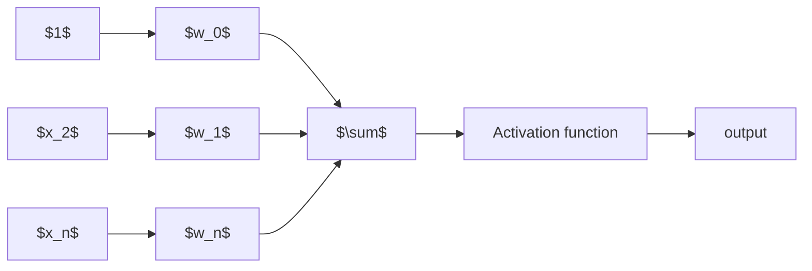
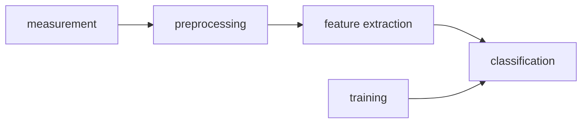
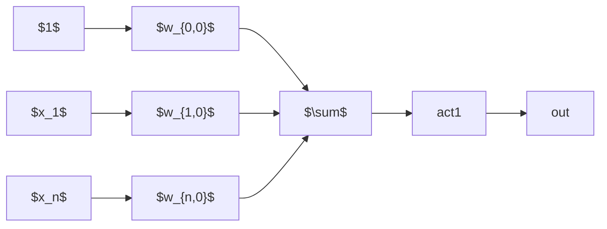
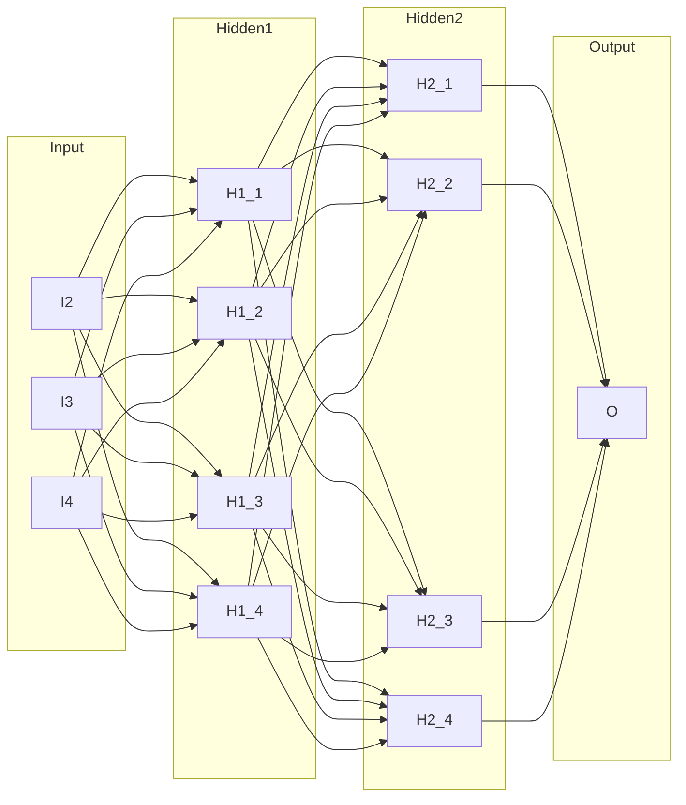

# Feed Forward Neural Networks

## Model

### Recap: Perceptrons

A perceptron implements a very simple decision rule. Given an input vector

\[
\mathbf{x} = (x_1, x_2, \dots , x_n)^\top
\]

and a weight vector

\[
\mathbf{w} = (w_1, w_2, \dots , w_n)^\top,
\]

the perceptron computes the scalar product \(\mathbf{w}^{\!\top}\mathbf{x}\) and then applies the sign function:

\[
\hat{y}= \operatorname{sign}\!\bigl(\mathbf{w}^{\!\top}\mathbf{x}\bigr).
\tag{1}
\]

Equation (1) shows that classification depends only on the **sign** of the weighted sum, i.e. on whether the input lies on one side or the other of the hyperplane defined by \(\mathbf{w}^{\!\top}\mathbf{x}=0\). Geometrically, the hyperplane is the decision boundary; the signed distance of a point \(\mathbf{x}\) to this boundary determines the class label.

The following diagram visualises the computational flow of a perceptron. Each input component (including a bias term \(x_0=1\)) is multiplied by its associated weight, summed, passed through an activation function, and finally yields the output.

**Geometric illustration.**  
Consider a two‑dimensional input space. The red line represents the decision boundary \(\mathbf{w}^{\!\top}\mathbf{x}=0\). A new sample (blue point) lies above this line. The dashed black line denotes the orthogonal projection of the sample onto the boundary, intersecting it at a green point. The right angle \(\alpha = 90^{\circ}\) emphasises orthogonality. Because the sign of the distance (positive for the blue point, negative for points below the line) determines \(\hat{y}\) via (1), the perceptron classifies the sample according to which side of the boundary it falls on.

---

### Recap: Pattern Recognition Pipeline

The classical pipeline for pattern recognition can be represented as a sequence of processing stages:

1. **Measurement** – raw data acquisition (e.g., sensor readings, images).
2. **Preprocessing** – noise reduction, normalisation, or other transformations that make the data more amenable to analysis.
3. **Feature extraction** – hand‑crafted or engineered descriptors that capture salient aspects of the data.
4. **Classification** – a decision function that maps the extracted features to class labels.

During training (the *training* block) the parameters of the classifier are tuned using labelled examples so that the mapping in the classification stage becomes accurate.

In today’s lecture we study the **(multi‑layer) perceptron**, which still relies on predefined features supplied by the feature‑extraction stage. Modern deep learning architectures replace hand‑crafted feature design with **data‑driven feature learning**; the network learns useful representations directly from raw measurements. Nevertheless, the conceptual stages above remain relevant and appear, often implicitly, in all contemporary architectures.

---

### XOR Problem

The exclusive‑or (XOR) problem is a classic illustration of the limitations of a single perceptron. In a two‑dimensional input space the four possible binary input vectors are

\[
(0,0),\;(0,1),\;(1,0),\;(1,1).
\]

If we assign class 0 to the points where both bits are equal and class 1 otherwise, the resulting data points are arranged as in the figure below: the two red points occupy the lower‑right and upper‑right quadrants, while the two blue points lie in the upper‑left and lower‑left quadrants. No straight line can separate the red from the blue points, i.e. the data are **not linearly separable**.

Consequences:

* A single perceptron, whose decision boundary must be a hyperplane, cannot solve the XOR problem.
* The limitation was formalised in the 1969 book *Perceptrons* (Minsky & Papert), which argued that many simple neural architectures could not represent important logical functions.
* The pessimistic conclusions contributed to a drastic reduction of AI research funding in the early 1970s, a period commonly referred to as the **AI winter**.

---

### Multi‑Layer Perceptron

A perceptron corresponds to a single artificial neuron. By **stacking multiple neurons in layers**, we obtain a *multi‑layer perceptron* (MLP). The additional layers permit the network to compute compositions of linear mappings and non-linearities, thereby enabling **non‑linear decision boundaries** that can separate data such as XOR.

The schematic below shows a minimal MLP with two hidden neurons and one output neuron. The bias term (constant 1) is included as an additional input. Each input component is connected to every hidden neuron (fully‑connected layer), the hidden neurons apply an activation function, and the hidden activations are again fully connected to the output neuron.

In this construction:

* **Input layer** supplies raw features (or, after preprocessing, the hand‑crafted features).
* **Hidden layer(s)** perform linear combinations followed by a non‑linear *activation function* (e.g., ReLU, sigmoid). These introduce the capacity to model complex, piece‑wise functions.
* **Output layer** aggregates the hidden activations, optionally applying a different activation (e.g., softmax for multiclass classification) to produce the final prediction.

Training an MLP consists of adjusting all the weights \(\{w_{i,j}\}\) to minimise a loss function that measures the discrepancy between predictions and ground‑truth labels.

---

### Terminology

The following graph illustrates the canonical connectivity pattern of a feed‑forward neural network with two hidden layers:

Key concepts:

* **Input layer** – the set of neurons that merely forward the external data (or pre‑processed features) into the network.
* **Hidden layers** – one or more intermediate layers whose neurons perform non‑linear transformations. Each hidden neuron receives a weighted sum of all outputs from the preceding layer and applies an activation function.
* **Output layer** – the final set of neurons that produce the network’s prediction. The activation used here depends on the task (e.g., linear for regression, sigmoid or softmax for classification).

A fundamental result in approximation theory, often called the **Universal Approximation Theorem**, states that a feed‑forward network with **a single hidden layer of sufficient width** can approximate any continuous function on a compact domain to arbitrary accuracy, provided that the activation functions are non‑linear and bounded (e.g., sigmoid, tanh) or satisfy mild technical conditions (e.g., ReLU). This theorem underpins the expressive power of deep networks.  Deeper networks can, however, provide more efficient representations. For instance, a decision tree can be converted into a neural network with a single hidden layer, but adding a second non-linearity can lead to a more efficient and exact solution. This is because deeper networks can decompose the problem into simpler, more manageable steps, making the representation more powerful and efficient. The theorem does not specify how to choose the number of neurons in the hidden layer or how to train the network, which are crucial practical considerations. The backpropagation algorithm, which we will discuss later, is a key method for training these networks by efficiently computing the gradients of the loss function with respect to the weights. This allows the network to learn from data and adjust its parameters to minimize the loss, thereby improving its performance on the task at hand.

* **Activation functions in hidden layers** introduce the required non‑linearity; without them the whole network would collapse to a single linear map regardless of depth.
* **Activation functions in the output layer** together with the chosen loss function define the learning objective. For example, a softmax activation combined with the cross‑entropy loss yields a probabilistic interpretation for multiclass classification.

These terms and properties form the basic vocabulary for discussing all subsequent deep‑learning architectures.

## Perceptrons as Universal Function Approximators

### Universal Approximation Theorem

Let \(\varphi(\cdot)\) be any non‑constant, bounded, and monotonically increasing activation function (for example, the logistic sigmoid or hyperbolic tangent).  
For every tolerance \(\varepsilon > 0\) and for every continuous target function  
\(f : K \subset \mathbb{R}^{m} \to \mathbb{R}\) defined on a compact set \(K\), there exist  

* an integer \(N \in \mathbb{N}\),  
* real output coefficients \(v_{i} \in \mathbb{R}\) and biases \(b_{i} \in \mathbb{R}\),  
* weight vectors \(w_{i} \in \mathbb{R}^{m}\) for \(i = 1,\dots ,N\),

such that the function realized by a feed‑forward network with a single hidden layer

\[
F(\mathbf{x}) \;=\; \sum_{i=1}^{N} v_{i}\,\varphi\!\bigl(w_{i}^{\mathsf{T}}\mathbf{x}+b_{i}\bigr)
\]

satisfies the uniform approximation bound  

\[
\bigl|F(\mathbf{x}) - f(\mathbf{x})\bigr| \;<\; \varepsilon \qquad\text{for all }\mathbf{x}\in K .
\]

Consequently, **any continuous function on a compact domain can be approximated arbitrarily well by a neural network that has only one hidden layer, provided the hidden units use a “sensible’’ activation function**.

While the theorem guarantees existence, it does **not** provide constructive guidance: it does not tell us how many hidden units are required for a given accuracy, how to choose the parameters \(\{v_i,w_i,b_i\}\), or how to train such a network efficiently. These practical questions are addressed by learning algorithms and network design heuristics.  

*In the original proof by Cybenko (1989) for sigmoid activations and the later generalisation by Hornik (1991), the authors showed that the approximation error \(\varepsilon\) can be made arbitrarily small by increasing the number of hidden units \(N\). In other words, as \(N \rightarrow \infty\) the bound \(\varepsilon \rightarrow 0\). The transcript of the lecture emphasises this quantitative behaviour: “if we increase \(N\), then \(\varepsilon\) goes down… if you approach infinity with \(N\), \(\varepsilon\) will approach zero.”*  This observation highlights why, in practice, one must balance model capacity against computational cost and over‑fitting risk.  

*Historically, the theorem was first proved for sigmoidal, bounded, monotone activations, but later work extended it to unbounded piece‑wise linear functions such as the rectified linear unit (ReLU). This broadened the class of practical networks that enjoy the universal approximation property.*  

---

### Motivation: Classification Trees and the Need for a Universal Approximator

Decision trees illustrate why a linear model such as a perceptron can be insufficient. A binary decision tree recursively partitions the input space by testing simple inequalities on the features. Consider the example with apples and pears. From these, we extract features which then result in some high dimensional vector space.  

### Optimization

The credit assignment problem refers to the difficulty of determining which components of a complex system are responsible for a particular outcome. In the context of neural networks, the problem manifests as the challenge of identifying which weights and neurons contributed most to a given loss value. 

---

### Layer Abstraction

### Fully Connected Layer

### Fully Connected Layer Summed Up

### Fully Connected Layer: Simple Example

### Comprehensive Questions

## References
## Why do we need Deep Learning?

These are the lecture notes for FAU’s YouTube Lecture “ Deep Learning “. This is a full transcript of the lecture video & matching slides. We hope, you enjoy this as much as the videos. Of course, this transcript was created with deep learning techniques largely automatically and only minor manual modifications were performed. If you spot mistakes, please let us know!

Welcome everybody to our lecture on deep learning! Today, we want to go into the topic. We want to introduce some of the important concepts and theories that have been fundamental to the field. Today’s topic will be feed-forward networks and feed-forward networks are essentially the main configuration of neural networks as we use them today. So in the next couple of videos, we want to talk about the first models and some ideas behind them. We also introduce a bit of theory. One important block will be about Universal function approximation where we will essentially show that neural networks are able to approximate any kind of function. This will then be followed by the introduction of the softmax function and some activations. In the end, we want to talk a bit about how to optimize such parameters and in particular, we will talk about the backpropagation algorithm.

So let’s start with the model and what you heard already is the perceptron. We already talked about this which was essentially a function that would map any high dimensional input to an inner product of the weight vector and the input. Then, we are only interested in the signed distance that is computed. You can interpret this essentially as you see above on the right-hand side. The decision boundary is shown in red and what you’re computing with the inner product is essentially a signed distance of a new sample to this decision boundary. If we consider only the sign, we can decide whether we are on one side or the other.

Now, if you look at classical pattern recognition and machine learning, we would still follow a so-called pattern recognition pipeline. We have some measurement that is converted and pre-processed in order to increase the quality, e.g. decrease noise. In the pre-processing, we essentially stay in the same domain as the input. So if you have an image as input, the output of the pre-processing will also be an image, but with probably better properties towards the classification task. Then, we want to do feature extraction. You remember the example with the apples and pears. From these, we extract features which then result in some high dimensional vector space. We can then go ahead and do the classification.

Now, what we’ve seen in the perceptron is that we are able to model linear decision boundaries. This immediately then led to the observation that perceptrons cannot solve the logical exclusive or – the so-called XOR.  You can see the visualization of the XOR problem above on the left-hand side. So, imagine you have some kind of distribution of classes where the top left and the bottom right is blue and the other class is bottom left and top right. This is inspired by the logical XOR function. You will not be able to separate those two point clouds with a single linear decision boundary. So, you either need curves or you use multiple lines. With a single perceptron, you will not be able to solve this problem. Because people have been arguing:  “Look we can model logical functions with perceptrons. If we build perceptrons on perceptrons, we can essentially build all of the logic!”

Now, if you can’t build XOR, then you’re probably not able to describe the entire logic and therefore, we will never achieve strong AI. This was a period of time when all funding to artificial intelligence research was tremendously cut down and people would not get any new grants. They would not get money to support the research. Hence, this period became known as the “AI Winter”.

Things changed with the introduction of the multi-layer perceptron. This is now the expansion of the perceptron. You do not just do a single neuron, but you use multiple of those neurons and you arrange them in layers. So here you can see a very simple draft. So, it is very similar to the perceptron. You have essentially some inputs and some weights. Now, you can see that it’s not just a single sum, but we have several of those sums that go through a non-linearity. Then, they assign weights again and summarize again to go into another non-linearity.

This is very interesting because we can use multiple neurons. We can now also model nonlinear decision boundaries. You can go on and then arrange this in layers. So what you typically do is, you have some input layer. This is our vector x. Then, you have several perceptrons that you arrange in hidden layers. They’re called hidden because they do not immediately observe the input. They assign weights, then compute something, and only at the very end, at the output, you have a layer again where you can observe what’s actually happening. All of these weights that are in between in those hidden layers, they are not directly observable. Here, you only observe them when you put some input in, compute the activations, and then at the very end, you can obtain the output. So, this is where you can actually observe what’s happening in your system.

Now, we will look into the so-called universal function approximator. This is actually just a network with a single hidden layer. Universal function approximation is a fundamental piece of theory because it tells us that with a single hidden layer, we can approximate any continuous function. So, let’s look a bit into this theorem. It starts as a formal definition. We have some 𝜑(x) and 𝜑(x) is a non-constant, bounded, monotonically increasing function. There exists some 𝜀 greater than zero and for any continuous function f( x ) defined on a compact subset of some high dimensional space ℝᵐ there exists an integer and real constant 𝜈 and b, and the real vectors w , where you can find an approximation. Here, you now see how the approximation is computed. You have an inner product of the weights with the input plus some bias. This goes into some activation function 𝜑(x). This is a non-constant, bounded, and monotonically increasing function. Then you have another linear combination using those 𝜈 which then produce the output capital F( x ). So F( x ) is our approximation and the approximation is a linear combination of nonlinearities that are computed from linear combinations. If you define it this way, you can demonstrate that if you F( x ) from the true function f( x ), the absolute difference between the two is bounded by a constant 𝜀. 𝜀 is greater than zero.

That’s already a very useful approximation. There is an upper bound 𝜀, but right now it doesn’t tell us how large 𝜀 actually is. So, 𝜀 may be really large. The universal approximation theorem also tells us that if we increase N, then 𝜀 goes down. Now if you approach infinity with N, 𝜀 will approach zero. So, the more neurons we take in this hidden layer, the better our approximation will get. So this means, we can approximate any function with just one hidden layer. So you could argue if you can approximate everything with a single layer, why the hell are people doing deep learning?

Deep learning doesn’t make any sense if a single layer is enough. I’ve just proved this to you. So there’s maybe no need for deep learning? Let’s look into some examples: I took a classification tree here and a classification tree is a method of subdividing space. I’m taking a 2-D example here where we have some input space x₁ and x₂. This is useful because we can visualize it very efficiently here on the slides. Our decision tree does the following thing: It decides whether x₁ is greater than 0.5. Note that I’m showing you the decision boundary on the right. In the next node, if you go to the left-hand side you look at x₂ and decide whether it’s greater or smaller than 0.25. On the other side, you simply look at x₁ again and decide whether it’s greater or smaller than 0.75. Now, if you do that you can assign classes in the leaf nodes. In these leaves, you can now, for example, assign the value 0 or 1 and this gives a subdivision of this place that has the shape of a mirrored L.

So, this is a function and this function can now be approximated by a universal function approximator. So let’s try to do that. We can transform this actually into a network. Let’s use the following idea: Our network has 2 input neurons because it’s a two-dimensional space. With our decision boundaries, we can also form these decisions x₁ being greater or smaller than 0.5. So, we can immediately adopt this. We can actually also adopt all the other inner nodes. Because we are using a sigmoid in this example, we also use the inverse of the inner nodes and put them in as additional neurons. So of course, I don’t have to learn anything here, because the connections towards the first hidden layer, I can take them from the tree definition. They’re already predefined, so there’s no learning required here. On the output side, I have to learn some weights and this can be done using for example a least square approximation and then I can directly compute those weights.

If I go ahead and really do that, we can also find a nice visualization. You can see that with our decision boundaries, we are essentially constructing a basis in the hidden layer. You can see if I use 0 and 1 as black and white, for every hidden node, I’m constructing a base vector. They are then essentially weighted linearly to for the output. So you could do this here by multiplying every pixel with every pixel and then simply summing this up. This is what the hidden layer here would do. Then, I’m essentially interested in combining those space vectors such that it will produce the desired y. Now, if I do that in a least-square sense, I get the approximation on the right. So it’s not half bad. I magnified this a bit. So this is what we wanted to get. This is the mirrored L and this is what came out of my approximation that I just proposed. Now, you can see that it kind of has the L shape in there, but the values here are in a domain between [0,1] and the 𝜀 with my six neuron approximation here is probably in the range of 0.7. So it kind of does the trick, but the approximation is not very good. In this particular configuration, you have to increase the number of neurons really a lot in order to get the error down because it’s a really hard problem. It can almost not be approximated.

So, what else could we do? Well if we want this, we could for example add a second non-linearity. Then, we would get exactly the solution that we desire. So you see maybe one layer is not very efficient in terms of representation. There is an algorithm that can map any decision tree on to a neural network. The algorithm goes as follows: You take all of your inner nodes, here the decisions between 0.5, 0.25, and 0.75. So, these are the inner nodes and then you connect them appropriately. You connect them in a way such that you are able to form exactly the sub-regions. Here you see that this is our L shape and in order to construct the top left region, we need to have access to the first decision. It separates the space into the left half-space and the right-half space. Next, we have access to the second decision. This way, we can use these two decisions in order to form this small patch on the top left. For all of the four patches that emerge from the decision boundaries, we get essentially one node. This simply means that for every leaf node, we get one node in the second layer. So one node for every inner node in the first layer and one node for every leaf node in the second layer. Then, you combine them in the output. You don’t even have to compute anything here, because we already know how these have to be merged in order to get to the right decision boundaries. This way, we manage to convert your decision tree into a neural network and it does exactly the correct approximation as we want it to happen.

What do we learn from this example? Well, we can approximate any function with a universal function approximator with just one hidden layer. But if we go deeper, we may find a decomposition of the problem that is just way more efficient. So here the decomposition was first inner nodes, then leaf nodes. This enabled us to derive an algorithm that only has seven nodes and could exactly approximate the problem. So you could argue that by building deeper networks you add additional steps. In each step, you try to simplify the function and the power of the representation, such that you get better processing towards the decision in the end.

Now, let’s go back to our Universal function approximation theorem. So, we’ve seen that it exists. It tells us that we can approximate everything with just a single hidden layer. So, that’s already a pretty cool observation but it doesn’t tell us how to choose N. It doesn’t tell us how to train. So there are a lot of problems with the universal approximation theorem. This is essentially the reason, why we go to what’s deep learning. Then, we can build systems that start disentangling representation over various steps. If we do so, we can build more efficient and more powerful systems and train them end-to-end. So this is the main reason, why we go towards deep learning. I expect anybody who’s working in deep learning to know about universal approximation and why deep learning actually makes sense. Ok so, that’s it for today. Next time, we will talk about activation functions and we will start introducing the backpropagation algorithm in the next set of videos. So stay tuned! I hope you enjoyed this video. Looking forward to seeing you in the next one!

If you liked this post, you can find more essays here , more educational material on Machine Learning here , or have a look at our Deep Learning Lecture . I would also appreciate a clap or a follow on YouTube , Twitter , Facebook , or LinkedIn in case you want to be informed about more essays, videos, and research in the future. This article is released under the Creative Commons 4.0 Attribution License and can be reprinted and modified if referenced.

## References

[1] R. O. Duda, P. E. Hart, and D. G. Stork. Pattern Classification. John Wiley and Sons, inc., 2000. [2] Christopher M. Bishop. Pattern Recognition and Machine Learning (Information Science and Statistics). Secaucus, NJ, USA: Springer-Verlag New York, Inc., 2006. [3] F. Rosenblatt. “The perceptron: A probabilistic model for information storage and organization in the brain.” In: Psychological Review 65.6 (1958), pp. 386–408. [4] WS. McCulloch and W. Pitts. “A logical calculus of the ideas immanent in nervous activity.” In: Bulletin of mathematical biophysics 5 (1943), pp. 99–115. [5] D. E. Rumelhart, G. E. Hinton, and R. J. Williams. “Learning representations by back-propagating errors.” In: Nature 323 (1986), pp. 533–536. [6] Xavier Glorot, Antoine Bordes, and Yoshua Bengio. “Deep Sparse Rectifier Neural Networks”. In: Proceedings of the Fourteenth International Conference on Artificial Intelligence Vol. 15. 2011, pp. 315–323. [7] William H. Press, Saul A. Teukolsky, William T. Vetterling, et al. Numerical Recipes 3rd Edition: The Art of Scientific Computing. 3rd ed. New York, NY, USA: Cambridge University Press, 2007.

---

- Lecture Notes in Deep Learning

# Lecture Notes in Deep Learning: Feedforward Networks – Part 2

## How can Networks actually be trained?

These are the lecture notes for FAU’s YouTube Lecture “ Deep Learning “. This is a full transcript of the lecture video & matching slides. We hope, you enjoy this as much as the videos. Of course, this transcript was created with deep learning techniques largely automatically and only minor manual modifications were performed. If you spot mistakes, please let us know!

Welcome to deep learning! So in this little video, we want to go ahead and look into some basic functions of neural networks. In particular, we want to look into the softmax function and look into some ideas on how we could potentially train the deep networks. Okay so let’s start with activation functions for classification.

Now so far, we have described the ground truth by labels -1 and +1, but of course, we could also have classes 0 and 1. This is really only a matter of definition if we only do a decision between two classes. But if you want to go into more complex cases, you want to be able to classify multiple classes. So in this case, you probably want to have an output vector. Here, you have essentially one dimension per class k where K is the number of classes. You can then define a ground truth representation as a vector that has all zeros except for one position and that is the true class. So, this is also called one-hot encoding, because all of the other parts of the vector are 0. Only a single one has a 1. Now, you try to compute a classifier that will produce our respective vector, and with this vector y hat, you can then go ahead and do the classification.

So it’s essentially like I’m guessing an output probability for each of the classes. In particular, for multi-class problems, this has been shown to be a more efficient way of attacking these problems. The problem is that you want to have a kind of probabilistic output towards 0 and 1, but we typically have some input vector x that could be arbitrarily scaled. So, in order to produce now our predictions, we employ a trick. The trick is that we use the exponential function as it will map everything into a positive space. Now, you want to make sure that the maximum that can be achieved is exactly 1. So, you do that for all of your classes and compute the sum over all of the exponentials of all input elements. This gives you the maximum that can be attained by this conversion. Then, you divide by this number for all of your given inputs and this will always scale to a [0, 1] domain. The resulting vector will also have the property that if you sum up all elements, it will equal to 1. These are two axioms of the probability distribution introduced by Kolmogorov. So, this allows us to treat the output of the network always as a kind of probability. If you look in literature also in software examples, sometimes the softmax function is also known as the normalized exponential function. It’s the same thing.

Now, let’s look at an example. So let’s say this is our input to our neural network. So, you see this small image on the left. Now, you introduce labels for this three-class problem. Wait, there’s something missing! It’s a four-class problem! So, you introduce labels for this four-class problem. Then, you have some arbitrary input that is shown here in the column x subscript k. So, they are scaled from -3.44 to 3.01. This is not so great, so let’s use the exponential function. Now, everything is mapped into positive numbers and there’s quite a difference now between the numbers. So, we need to rescale them and you can see that the highest probability is of course returned for heavy metal in this image!

So, let’s go ahead and also talk a bit about loss functions. So the loss function is a kind of function that tells you how good the prediction of a network is. A very typical one is the so-called cross-entropy loss. The cross-entropy is computed between two probability distributions. So, you have your ground truth distribution and the one that you’re estimating. Then, you can compute the cross-entropy in order to determine how well they are connected, i.e. how well they align with each other. Then, you can also use this as a loss function. Here, we can use the property that all of our elements will be zero except for the true class. So we only have to determine the negative logarithm of y hat subscript k, where k is the true class. This simplifies the computation a lot and we get rid of the above sum. By the way, this has a couple of more interesting interpretations and we will talk about them in one of the next videos.

Now, if you do this we can plug in the softmax function and construct the so-called softmax loss. You can see, we have the softmax function in there and then we take minus logarithm only for the element that has the true class. This is something that very typically used in the training of networks. This softmax loss is very commonly used very useful for one hot encoded ground truth. Also, it kind of represents a histogram. It’s related to statistics and distributions. Furthermore, all of the multi-class problems can be handled in this approach in a single go.

The other thing that I want to talk about in this video is optimization. So, one big thing that we haven’t considered at all is how we actually train those networks. We have already seen that these hidden layers that cannot be directly observed. This kind of brings us in a very difficult situation and you may argue that the image here on the right is very similar to the one on the left: If you change anything in this chain of events, it may essentially destroy the entire system. So, you have to be very careful in adjusting anything on the path, because you have to take into account all the other processing steps. This is really hard and you have to be careful what to adjust.

Now, we’ll go the easy way and we will formulate this as an optimization problem. So, we already discussed that we need some kind of loss function. The loss function tells us how good the fit of the predictions is to our actual training data. The inputs are the weights w , x the input vector, and y which are our ground truth labels. We have to consider all M training samples and this allows us to then describe some kind of loss. So, if we do this, we compute the expected value of the loss which is essentially the sum over all of the observations. This scaled sum then is used to determine the fit for the entire training data set. Now, if we want to create an optimal set of weights, what we do is we choose to minimize this loss function with respect to w over the entire training data set.

Well, now we have some mathematical principle that tells us what to do and we know minimization. Let’s try one of the obvious choices: gradient descent. So, we choose to find the minimum w that minimizes the loss of all training samples. In order to do so, we compute the gradient and we need some initial guess for w . There are many different ways of initializing w . Some people are just using randomly initialized weights and then you go ahead and do gradient descent. So, you follow the negative gradient direction step-by-step, until you arrive at some minimum. So here, you can see this initial w and this step may be random. Then in Step 2, iterate until convergence. So, you compute the gradient with respect to w of the loss function. Then you need some learning rate η. η essentially tells you how long the steps of these individual arrows here are. Then, you follow this direction until you arrive at a minimum. Now, η is commonly referred to as the learning rate. The interesting thing about this approach is it’s very simple and you will always find a minimum. It may be only a local one, but you will be able to minimize the function. What quite a few people do is they run several random initializations. Those random initializations are then used to find different local minima. Then, they simply take the best local minima for their final system.

What is this L that we are trying to optimize? Well, L is computed here at the very output layer. So, we put in the input into our network process with the entire network, and then, in the end, we compute essentially the difference or the fit or the loss to our desired output. So you could say, if the first layer is f the second is g , then we are interested in computing L of some input x and w . We compute f using w subscript f. Then use the weights w subscript g , compute g and then, in the end, we compute the fit between g and y . So, this is essentially what we need to compute in the loss function.

You see that this is slightly more difficult and gets more difficult for deeper networks. So, we will see that we need to be able to do this efficiently. There’s a very efficient algorithm to solve such kind of problems and it’s called the backpropagation algorithm which will be the topic of our next lecture. So, thank you very much for listening and see you in the next video!

If you liked this post, you can find more essays here , more educational material on Machine Learning here , or have a look at our Deep Learning Lecture . I would also appreciate a clap or a follow on YouTube , Twitter , Facebook , or LinkedIn in case you want to be informed about more essays, videos, and research in the future. This article is released under the Creative Commons 4.0 Attribution License and can be reprinted and modified if referenced.

## References

[1] R. O. Duda, P. E. Hart, and D. G. Stork. Pattern Classification. John Wiley and Sons, inc., 2000. [2] Christopher M. Bishop. Pattern Recognition and Machine Learning (Information Science and Statistics). Secaucus, NJ, USA: Springer-Verlag New York, Inc., 2006. [3] F. Rosenblatt. “The perceptron: A probabilistic model for information storage and organization in the brain.” In: Psychological Review 65.6 (1958), pp. 386–408. [4] WS. McCulloch and W. Pitts. “A logical calculus of the ideas immanent in nervous activity.” In: Bulletin of mathematical biophysics 5 (1943), pp. 99–115. [5] D. E. Rumelhart, G. E. Hinton, and R. J. Williams. “Learning representations by back-propagating errors.” In: Nature 323 (1986), pp. 533–536. [6] Xavier Glorot, Antoine Bordes, and Yoshua Bengio. “Deep Sparse Rectifier Neural Networks”. In: Proceedings of the Fourteenth International Conference on Artificial Intelligence Vol. 15. 2011, pp. 315–323. [7] William H. Press, Saul A. Teukolsky, William T. Vetterling, et al. Numerical Recipes 3rd Edition: The Art of Scientific Computing. 3rd ed. New York, NY, USA: Cambridge University Press, 2007.

---

- Lecture Notes in Deep Learning

# Lecture Notes in Deep Learning: Feedforward Networks – Part 3

## The Backpropagation Algorithm

These are the lecture notes for FAU’s YouTube Lecture “ Deep Learning “. This is a full transcript of the lecture video & matching slides. We hope, you enjoy this as much as the videos. Of course, this transcript was created with deep learning techniques largely automatically and only minor manual modifications were performed. If you spot mistakes, please let us know!

Welcome everybody to deep learning! Thanks for tuning in. Today’s topic will be the backpropagation algorithm. So, you may be interested in how we actually compute these derivatives in complex neural networks. Let’s look at a simple example. Our true function is 2 x ₁ plus 3 x ₂ to the power of 2 plus 3. Now, we want to evaluate the partial derivative of f( x ) at the position (1 3)ᵀ with respect to x ₁. There are two algorithms that can do that quite efficiently. The first one will be finite differences. The second one is an analytic derivative. So, we will go through both examples here.

For finite differences, the idea is that you compute the function value at some position x . Then, you add a very small increment h to x and evaluation the function there. You also compute the at function f(x) and take the difference between the two. Then, you divide by the value of h . So this is actually the definition of a derivative: It is the limit of the difference between f(x+h) and f(x) divided by h in which we let h approach 0. Now, the problem is this is not symmetric. So, sometimes you want to prefer a symmetric definition. Instead of computing this exactly at x , we go h/2 back and h/2 to the front. This allows us to compute the derivative exactly at the position x . Then, we still have to divide over h . This is a symmetric definition.

We can do this for our example. Let’s try to evaluate this. We take our original definition (2 x ₁+ 3 x ₂)² + 3. We wanted to look at the position (1 3)ᵀ. Let’s use the + h/2 definition above. Here, we set h to a small value, say 2 ⋅ 10⁻². We plug it in and you can see that here in this row. So this is going to be ((2(1+10⁻²+9)² + 3) and of course, we also have to subtract our small value in the second term. Then, we divide by the small value as well. So, we will end up with approximately 124.4404 minus 123.5604. This will be approximately 43.9999. So, we can compute this for any function, even if we don’t know the definition of the function, e.g., if one only has as a software module that we cannot access. In this case, we can use finite differences to approximate the partial derivative.

Practically, use we use h in the range of 1⋅ 10⁻⁵ which is appropriate for floating-point precision. Depending on the precision of your computing system, you can also determine what the appropriate value for h is going to be. You can check that in reference number seven. We see that this is really easy to use. We can evaluate this on any function we don’t need to know the formal definition, but of course, it’s computationally inefficient. Imagine you want to determine the gradient that is the set of all partial derivatives of a function that has a dimension of 100. This means that you have to evaluate the function 101 times to compute this entire gradient. So, this may not be such a great choice for general optimization, because it may become inefficient. But of course, it’s a very cool method to check your implementation. Imagine you implemented the analytic version and sometimes you make mistakes. Then, you can use this as a trick to check whether your analytic derivative is correctly implemented. This is also something you will learn in detail in the exercises here. It’s really useful if you want to debug your implementation.

Okay, so let’s talk about analytic gradients. Now the analytic gradient, we can derive by using a set of analytic differentiation rules. So, the first rule is going to be the derivative of a constant is going to be 0. Then, our operator is a linear operator which means we can rearrange it if we have for example sums of different components. Next, we also know the derivatives of monomials. If you have some x ⁿ, the derivative is going to be n ⋅ x ⁿ⁻¹. The chain rule applies if you have nested functions. It’s essentially the key idea that we also need for the backpropagation algorithm. You see that the derivative with respect to x of some nested function is going to be the derivative of the function with respect to g multiplied with the derivative of the function g with respect to x .

Ok so let’s place those to the very top right. We will need them in the next couple of slides. Let’s try to calculate this so here you see that partial derivative with respect to x ₁ of f( x ) at (1 3)ᵀ. Then, we can just plug in the definition. So, this is going to be the partial derivative of (2 x ₁+9)². So, we can already write the 9, because so we can already plug in the 3 and multiply it with 3 to obtain 9. In the next step, we can essentially compute the partial derivative with respect to the outer function. Now. there’s the application of the chain rule and we introduce this new variable z . In the next step, we can then compute the partial derivative of z to the power of 2, where we have to reduce the exponent by 1 and then multiply with this exponent. So, this is going to be 2(2 x ₁+9) times the partial derivative of 2 x ₁+9. So, we can simplify this a little bit further. You can see that if we apply the partial derivative on the 2 x ₁+9, x ₁ cancels away. Only 2 remains as minus the constant 9 also vanishes. So in the end, we end up with 2(2 x ₁+9) times 2. Now if you plug in x ₁ = 1, you will see that our derivative equals to 44. In our numerical implementation that we have evaluated previously, you can see that we had 43.9999. So, we were pretty close. But of course, the analytic gradient is more accurate.

Now the question is: “Can we do this automatically?” and of course the answer is “yes”. We use those rules, the chain rule, linearity, and the other two to decompose the complex functions of neural networks. We don’t do that manually but we do it completely automatically in the backpropagation algorithm. This is going to be more computationally efficient than finite differences.

So, you can essentially describe the backpropagation algorithm in a nutshell here: For every neuron, you need to have the inputs x ₁, x ₂, and of course the output that is y hat. Then, you can compute – in green – the forward pass. You evaluate somewhere the loss function and you get the derivative with respect to y hat that comes in in the backward pass. Then, for every element in your network graph, you need to know the derivatives with respect to the inputs, here x₁ and x₂. What we’re missing in this figure are, of course, trainable weights. For trainable weights, we would then also need to compute the derivatives with respect to them, in order to compute the parameter updates. So, for every module or node, you need to know the derivative with respect to the inputs and the derivative with respect to the weights. If you have that for every module then you can compose a graph and with this graph, you can then compute arbitrary derivatives of very complex functions.

Let’s go back to our example and apply backpropagation to it. So, what do we do? Well, we compute the forward pass first. In order to be able to compute the forward pass, we plug in intermediate definitions. So we decompose this now into some a that is 2 times x ₁ and b that is 3 times x ₂. Then, we can compute those: We get the values 2 and 9 for a and b . This allows us to compute c that is the sum of the two. This equates to 11. Then, we can compute e from that that is nothing else than the power of 2 of c . This gives us 121 and now we finally compute g , that is e plus 3. So, we end up with 124.

Ok, now we need to backpropagate. So, we need to compute the partial derivatives. Here, the partial derivatives of g with respect to e is going to be 1. Then, we compute the partial derivative of e respect to c and you’re going to see that this is 2 c . With c being 11 this evaluates to 22. Then, we need a partial derivative of c with respect to a which is again 1. Now, we need the partial derivative of a with respect to x₁. If you look at this block, you can see that this partial derivative is going to be 2. So we have to multiply all the partial derivatives from right to left in order to get the result: 1 times 22 times 1 times 2 and this is going to be 44. So, this was the backpropagation algorithm applied to our example.

Now, we do have a kind of stability problem. We multiply with potentially high and low numbers quite frequently in the scope of the backpropagation algorithm. This then gives us the problem of positive feedback and this can cause disaster. An example of positive feedback and how it can lead to disaster is shown in the small video here .

Now, what can we do about it? This is essentially a feedback loop. We have this controller and the output, where we compute the gradient. You see that there is this value of η. So, if we have η too high, it will create positive feedback. This will then result in very high values of our updates and then our loss may grow or really explode. So if it is too large, we even may have an increase in the loss function although we seek to minimize it. What can also happen is if you pick η too small, then you end up with the blue curve. That is called the vanishing gradient where we just have too small steps and we don’t get into a good convergence. So there’s no reduction of loss. It’s also a problem called “vanishing gradients”. So, only if you choose η appropriately, you will get a good learning rate. With a good learning rate, the loss should start decreasing very quickly over many iterations following this green curve. We should go then into some kind of convergence and when we have no changes anymore, we’re essentially at the point of convergence on the training data set. We can then stop updating our weights. So, we see that the choice of EDA is critical for our learning, and only if you said it appropriately you will get a good training process.

So let’s sum up backpropagation: It’s built around the chain rule. It uses a forward pass. Once we’re at the end and evaluate the loss function – essentially the difference to our learning target – then we can backpropagate. These computations are very efficient using a dynamic programming approach. Backpropagation is not a training algorithm. It is just a way of computing a gradient. You will see the actual training programs when we discuss loss and optimization in one of the next lectures. Some very important consequences are: We have a product of partials which means the numerical error is multiplied. This can be very problematic. Also because of the product of partials, we then result either in vanishing or exploding gratings. So, when you have very low values close to zero values and you start multiplying them with each other, then you have an exponential decay, causing vanishing gradients. If you have very high numbers, of course, you can also very quickly end up in an exponential growth – the exploding gradients.

We see gradients are critical for our training. So let’s talk a bit about activation functions and their derivatives. One of the classical ones is the sign function. We already had that in the perceptron. Now, you can see that it’s symmetric and normalized between 1 and -1. But remember, we are talking about partial derivatives in order to compute the weight updates. So, the derivative of this function is a bit problematic because it’s 0 everywhere except at the point 0 and there you essentially have infinity as value. So it’s not really great to use this in combination with gradient descent.

So what people have been doing? They switched to different functions and a popular one is the sigmoid function. So, it’s an s-shaped function that scales everything between 0 and 1 using a negative exponential function in the denominator. The nice thing is that if you compute the derivative of this, this is essentially f(x) times 1 – f(x). So, at least the derivative can be computed quite efficiently. In the forward pass, you always have to deal with the exponential functions which are also kind of problematic. Also, if you look at this function between let’s say between -3 and 3, you get gradients that may be suited for backpropagation. As soon as you go farther away from -3 or 3, you see that the derivative of this function will be very close to zero. So, we have saturation and again if you expect that you have a couple of those sigmoid functions behind each other, then it’s quite likely that it will produce very low values. This can also then lead to vanishing gradients.

So what did people do to beat that? Well, they introduced a piecewise linear activation function called “rectified linear unit” (ReLU) which is the maximum of zero and x . So, everything that is below zero is clipped to zero and everything else is just kept. Now, this is nice because we can compute this very efficiently. There’s no exponential function involved and the derivative is simply 1 if x was greater than zero and zero everywhere else. So, there’s much less vanishing gradient as essentially the entire positive half-space can be used for gradient descent. There are also some problems with the ReLU which we will look in more detail when we talk about activation functions.

Okay, now you understood many basic concepts of the backpropagation algorithm. But we still have to talk about more complex situations and in particular layers. So right now, we did everything on the neural node level. If you want to do all of the backpropagation on neuron-level, it’s very hard and you will very quickly lose oversight. So, we will introduce layer abstraction and see how we can compute those gradients for entire layers in the next lecture. So stay tuned and keep watching! I hope you enjoyed this video and see you in the next one. Thank you!

If you liked this post, you can find more essays here , more educational material on Machine Learning here , or have a look at our Deep Learning Lecture . I would also appreciate a clap or a follow on YouTube , Twitter , Facebook , or LinkedIn in case you want to be informed about more essays, videos, and research in the future. This article is released under the Creative Commons 4.0 Attribution License and can be reprinted and modified if referenced.

## References

[1] R. O. Duda, P. E. Hart, and D. G. Stork. Pattern Classification. John Wiley and Sons, inc., 2000. [2] Christopher M. Bishop. Pattern Recognition and Machine Learning (Information Science and Statistics). Secaucus, NJ, USA: Springer-Verlag New York, Inc., 2006. [3] F. Rosenblatt. “The perceptron: A probabilistic model for information storage and organization in the brain.” In: Psychological Review 65.6 (1958), pp. 386–408. [4] WS. McCulloch and W. Pitts. “A logical calculus of the ideas immanent in nervous activity.” In: Bulletin of mathematical biophysics 5 (1943), pp. 99–115. [5] D. E. Rumelhart, G. E. Hinton, and R. J. Williams. “Learning representations by back-propagating errors.” In: Nature 323 (1986), pp. 533–536. [6] Xavier Glorot, Antoine Bordes, and Yoshua Bengio. “Deep Sparse Rectifier Neural Networks”. In: Proceedings of the Fourteenth International Conference on Artificial Intelligence Vol. 15. 2011, pp. 315–323. [7] William H. Press, Saul A. Teukolsky, William T. Vetterling, et al. Numerical Recipes 3rd Edition: The Art of Scientific Computing. 3rd ed. New York, NY, USA: Cambridge University Press, 2007.

---

- Lecture Notes in Deep Learning

# Lecture Notes in Deep Learning: Feedforward Networks – Part 4

## Layer Abstraction

These are the lecture notes for FAU’s YouTube Lecture “ Deep Learning “. This is a full transcript of the lecture video & matching slides. We hope, you enjoy this as much as the videos. Of course, this transcript was created with deep learning techniques largely automatically and only minor manual modifications were performed. If you spot mistakes, please let us know!

Welcome, everybody to our next video on deep learning! So, today we want to talk about again feed-forward networks. In the fourth part, the main focus will be on the layer abstraction. Of course, we talked about those neurons and individual nodes but this grows really complex for larger networks. So we want to introduce this layering concept also in our computation of the gradients. This is really useful because we can then talk directly about gradients on entire layers and don’t need to go towards all of the different nodes.

So, how do we express this? Let’s recall what our single neuron is doing. The single neuron is computing essentially an inner product of its weights. By the way, we are skipping over this bias notation. So, we are expanding this vector by one additional element. This allows us to describe the bias also and the inner product as shown on the slide here. This is really nice because then you can see that the output y hat is just an inner product.

Now think about the case that we have M neurons which means that we get some y hat index m . All of them are inner products. So, if you bring this into a vector notation, you can see that the vector y hat is nothing else than a matrix multiplication of x with this matrix W . You see that a fully connected layer is nothing else than matrix multiplication. So, we can essentially represent arbitrary connections and topologies using this fully connected layer. Then, we also apply a pointwise non-linearity such that we get the nonlinear effect. The nice thing about matrix notation is of course that we can describe now the entire layer derivatives using matrix calculus.

So, our fully connected layer would then get the following configuration: Three elements for the input and then weights for every neuron. Let’s say you have two neurons, then we get these weight vectors. We multiply the two with x . In the forward pass, we have determined this y hat for the entire module using a matrix. If you want to compute the gradients, then we need exactly two partial derivatives. These are the same as we already mentioned: We need the derivative with respect to the weights. This is going to be the partial derivative with respect to W and the partial derivatives with respect to x for the backpropagation to pass it on to the next module.

So how do we compute this? Well, we have the layer that is y hat equals to W x . So there’s a matrix multiplication in the forward pass. Then, we need the derivative with respect to the weights. Now you can see that what we essentially need to do is we need a matrix derivative here. The derivative of y hat with respect to W is going to be simply x ᵀ. So, if we have the loss that comes into our module, the update to our weights is gonna be this loss vector multiplied with x ᵀ. So, we have some loss vector and x ᵀ which essentially means that you have an outer product. One is a column vector and the other one is a row vector because of the transpose. So, if you multiply the two, you will end up with a matrix. The above partial derivative with respect to W will always result in a matrix. Then if you look at the bottom row, you need the partial derivative of y hat with respect to x . Also something you can find in the matrix cookbook , by the way. It is very very useful. You find all kinds of matrix derivatives in this one. So if you do that, you can see for the above equation, the partial with respect to x is going to be W ᵀ. Now, you have W ᵀ multiplied again by some loss vector. This loss vector times a matrix is going to be a vector again. This is the vector that you will pass on in the backpropagation process towards the next higher layer.

Okay so let’s look into some example. We have a simple example first and then a multi-layer example next. So, the simple example is going to be the same network as we had it already. So this was network without any non-linearity W x . Now, we need some loss function. Here, we don’t take cross-entropy, but we take the L2 loss which is a common vector norm. What it does is simply take the output of the network subtract and the desired output and compute the L2 norm. This means that we element-wise square the different vector values and sum all of them up. In the end, we would have to take a square root, but we want to omit this. So, we take it to the power of two. When we now compute the derivatives of this L2-norm to the power of 2, of course, we have a factor of two showing up. This will be canceled out by this factor 1 over 2 in the beginning. By the way, this is a regression loss and also has statistical relations. We will talk about this when we talk about loss functions in more detail. The nice thing with L2 loss is that that you also find its matrix derivatives the matrix cookbook. We now compute the partial derivative of L with respect to y hat. This will give us then Wx – y and we can continue and compute the update for our weights. So the update for the weights is what we compute using the loss function’s derivative. The derivative of the loss function with respect to the input was Wx – y times x ᵀ . This will give us an update for the matrix weight. The other derivative that we want to compute is the partial derivative of the loss with respect to x . So, this is going to be – as we’ve seen on the previous slide – W ᵀ times the vector that comes from the loss function: Wx – y, as we determined in the third row of the slide.

Ok so let’s add some layers and change our estimator into three nested functions. Here, we have some linear matrices. So, this is an academic example: you could see that by multiplying W ₁, W ₂, and W ₃ with each other, they would simply collapse into a single matrix. Still, I find this example useful because it shows you what actually happens in the computation of the backpropagation process and why those specific steps are really useful. So, again we take the L2 loss function. Here, we have our three matrices inside.

Next, we have to go ahead and compute derivatives. Now for the derivatives, we start with Layer 3, the most outer layer. So, you see that we now compute the partial derivative of the loss function with respect to W ₃. First, the chain rule. Then, we have to compute the partial derivative of the loss function with respect to f₃( x ) hat with respect to W ₃. The partial derivative of the loss function again is simply the inner part of the L2 norm. So is this W ₃ W ₂ W ₁ x – y . The partial derivative of the net is gonna be ( W ₂ W ₁ x ) ᵀ , as we’ve seen on the previous slide. Note that I’m indicating the affinity of the matrix operator using a dot. For matrices, it makes a difference whether you multiply them from the left or from the right. Both multiplication directions are different. Hence, I’m indicating that you have to compute this product from the right-hand side. Now let’s do that and we end up with the final update for W ₃ that is simply computed from those two expressions.

Now, the partial derivative with respect to W ₂ is a bit more complicated because we have to apply the chain rule twice. So, again we have to compute the partial derivative of the loss function with respect to f₃( x ) hat. Then, we need the partial derivative of f₃( x ) hat with respect to W ₂ which means we have to apply the chain rule again. So we have to expand the partial derivative of f₃( x ) hat with respect to f₂( x ) hat and then the partial derivative of f₂( x ) hat with respect to W ₂. This doesn’t change much. The Loss term is the same as we used before. Now, if we compute the partial derivative of f₃( x ) hat with respect to f₂( x ) hat – remember f₂( x ) = W ₂ W ₁ x –  it’s gonna be W ₃ ᵀ and we have to multiply it from the left-hand side. Then, we go ahead and compute the partial derivative of f₂( x ) hat with respect to W ₂. You remain with ( W ₂ W ₁ x ) ᵀ . So, the final matrix derivative is going to be the product of the three terms. We can repeat this for the last layer, but now we have to apply the chain rule again. We see already two parts that we pre-computed, but we have to apply it again. So here we then get the partial derivative of f₂( x ) hat with respect to f₁( x ) hat and a partial derivative of f₁( x ) hat with respect to W ₁ which then yields two terms that we used before. The partial derivative of f₂( x ) hat with respect to f₁( x ) hat is W ₁ x , is going to be W ₂ ᵀ . Then, we still have to compute the partial derivative of f₁( x ) with respect to W ₁. This is going to be xᵀ . So, we end up with the product of four terms for this partial derivative.

Now, you can see if we do the backpropagation algorithm, we end up in a very similar way of processing. So first, we compute the forward path through our entire network and evaluate the loss function. Then, we can look at the different partial derivatives, and depending on where I want to go, I have to compute the respective partials. For the update of the last layer, I have to compute the partial derivative of the loss function and multiply it with the partial derivative of the last layer with respect to the weights. Now, if I go the second last layer, I have to compute the partial derivative with respect to the loss function, the partial derivative of the last layer from respect to the inputs, and the partial derivative of the second last layer with respect to the weights to get the update. If I want to go to the first layer, I have to compute all the respective backpropagation steps for the entire layers until I end up with the respective update on the very first layer. You can see that we can pre-compute a lot of those values and reuse them which allows us to implement backpropagation very efficiently.

Let’s summarize what we’ve seen so far. We’ve seen that we can combine the softmax activation function with the cross-entropy loss. Then, we can very naturally work with multi-class problems. We used gradient descent as the default choice for training network and we can achieve local minima using the strategy. We can, of course, compute gradients only numerically by finite differences and this is very useful for checking your implementations. This is something you will definitely need in the exercises! Then, we used the backpropagation algorithm to compute the gradients very efficiently. In order to be able to update the weights of the fully connected layers, we’ve seen that they can be abstracted as a complete layer. Hence, we can also compute layer-wise derivatives. So, it’s not required to compute everything on a node level, but you can really go into layer abstraction. You also saw that matrix calculus turns out to be very useful.

What happens next time in deep learning? Well, we will see that right now, we have only a limited number of loss functions. So, we will see problem adapted loss functions for regression and classification. The very simple optimization that we talked about right now with a single η is probably not the right way to go. So, there are much better optimization programs. They can be adapted to the needs of every single parameter. Then we’ll also see an argument why neural networks shouldn’t perform that well and some recent insights why they actually do perform quite well.

I also have a couple of comprehensive questions. So you should definitely be able to name different loss functions for multi-class classification. One-hot encoding is something everybody needs to know if you want to take the oral exam with me. You will have to be able to describe this. Then, of course, something I probably won’t ask in the exam but something that will be very useful for your daily routine is that you work with finite differences and use them for implementation checks. You have to be able to describe the backpropagation algorithm and to be honest, I think this – although it’s academic – but this multi-layer way abstraction way of describing backpropagation algorithm is really useful. It’s also very nice if you want to explain the backpropagation in an exam situation. What else do you have to be able to describe? The problem with exploding and vanishing gradients: What happens if you choose your η too high or too low? What’s a lost curve and how does it change over the iterations? Take a look at those graphs. They are really relevant and they also help you understand what’s going wrong in your training process. So you need to be aware of those and also it should be clear to you by now why the sign function is a bad choice for an activation function. We have plenty of references below this post. So, I hope you still had fun with those videos. Please continue watching and see you in the next video!

If you liked this post, you can find more essays here , more educational material on Machine Learning here , or have a look at our Deep Learning Lecture . I would also appreciate a clap or a follow on YouTube , Twitter , Facebook , or LinkedIn in case you want to be informed about more essays, videos, and research in the future. This article is released under the Creative Commons 4.0 Attribution License and can be reprinted and modified if referenced.

## References

[1] R. O. Duda, P. E. Hart, and D. G. Stork. Pattern Classification. John Wiley and Sons, inc., 2000. [2] Christopher M. Bishop. Pattern Recognition and Machine Learning (Information Science and Statistics). Secaucus, NJ, USA: Springer-Verlag New York, Inc., 2006. [3] F. Rosenblatt. “The perceptron: A probabilistic model for information storage and organization in the brain.” In: Psychological Review 65.6 (1958), pp. 386–408. [4] WS. McCulloch and W. Pitts. “A logical calculus of the ideas immanent in nervous activity.” In: Bulletin of mathematical biophysics 5 (1943), pp. 99–115. [5] D. E. Rumelhart, G. E. Hinton, and R. J. Williams. “Learning representations by back-propagating errors.” In: Nature 323 (1986), pp. 533–536. [6] Xavier Glorot, Antoine Bordes, and Yoshua Bengio. “Deep Sparse Rectifier Neural Networks”. In: Proceedings of the Fourteenth International Conference on Artificial Intelligence Vol. 15. 2011, pp. 315–323. [7] William H. Press, Saul A. Teukolsky, William T. Vetterling, et al. Numerical Recipes 3rd Edition: The Art of Scientific Computing. 3rd ed. New York, NY, USA: Cambridge University Press, 2007.

## Lecture Notes Sources

These integrated lecture notes were transcribed from voice recordings of the lecture (FAU LME). Follow the links for the original blog posts:

- [Feedforward Networks Part 1](https://lme.tf.fau.de/lecture-notes/lecture-notes-dl/lecture-notes-in-deep-learning-feedforward-networks-part-1/)
- [Feedforward Networks Part 2](https://lme.tf.fau.de/lecture-notes/lecture-notes-dl/lecture-notes-in-deep-learning-feedforward-networks-part-2/)
- [Feedforward Networks Part 3](https://lme.tf.fau.de/lecture-notes/lecture-notes-dl/lecture-notes-in-deep-learning-feedforward-networks-part-3/)
- [Feedforward Networks Part 4](https://lme.tf.fau.de/lecture-notes/lecture-notes-dl/lecture-notes-in-deep-learning-feedforward-networks-part-4/)
