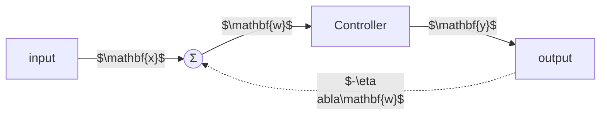
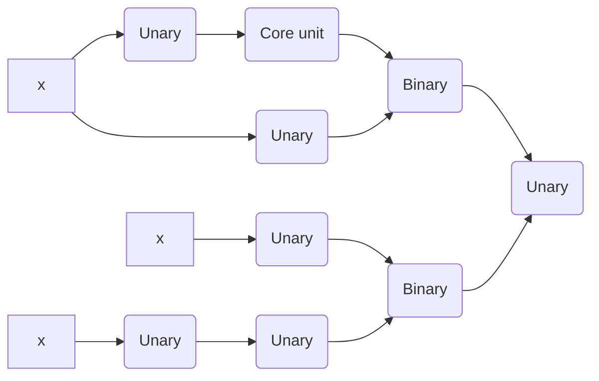
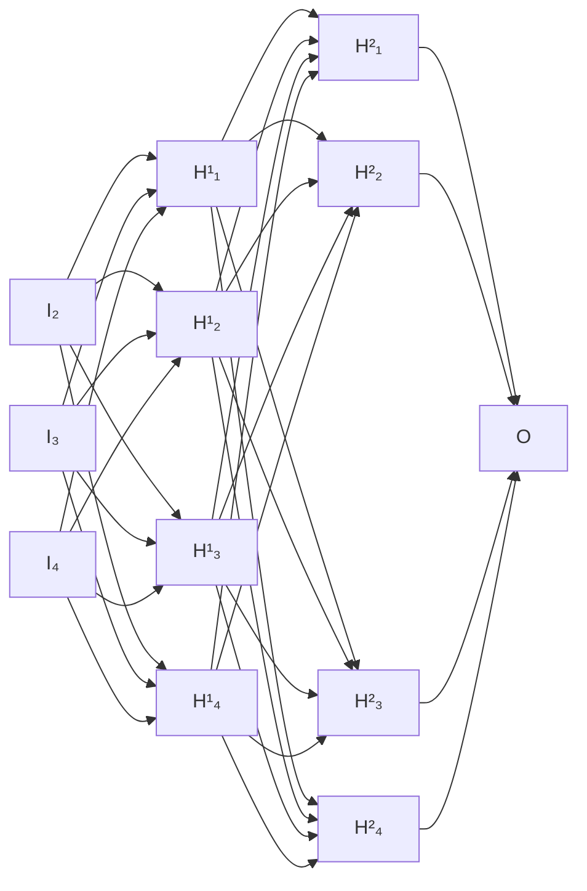

# Activation Functions and Convolutional Neural Networks

## Activation Functions

### Biological Activation

Biological neurons consist of a complex internal architecture that enables electrical signaling and chemical communication. The soma (cell body) contains the nucleus, nucleolus, rough endoplasmic reticulum (RER) studded with ribosomes, Golgi apparatus, mitochondria, and smooth ER. Extending from the soma are dendrites that receive inputs and an axon that transmits output. The axon hillock is the site where the summed dendritic inputs are integrated and, if a threshold is surpassed, an action potential is generated. Myelinating Schwann cells wrap the axon in a myelin sheath, leaving periodic gaps called **Nodes of Ranvier**; these nodes host a high density of voltage‑gated ion channels. The action potential propagates by **saltatory conduction**, “jumping’’ from node to node, which dramatically increases conduction speed while reducing metabolic cost. Synaptic terminals (axodendritic or axosomatic) contain vesicles filled with neurotransmitters that are released into the synaptic cleft and bind to receptors on the post‑synaptic membrane. Cytoskeletal elements—microtubules and microfilaments—provide structural support and enable axonal transport of organelles and proteins. This biological machinery implements an **all‑or‑none** response: when the membrane potential reaches a threshold (approximately –55 mV), voltage‑gated Na⁺ channels open, causing a rapid depolarization; the membrane then repolarizes and enters a refractory period. The figure in the original slides visualizes these components and the temporal voltage trace of an action potential, illustrating the essential elements that inspired artificial activation functions.

The knowledge essentially lies in the connections between the neurons. We have both inhibitory and excitatory connections. The synapses anatomically enforce feed-forward processing. However, those connections can be in any direction. So, they can also form cycles and you have entire networks of neurons that are connected with different axons in order to form different cognitive functions. Crucial is the sum of activations. Only if the sum of activations is above the threshold, then you will actually end up with an activation. These activations are electric spikes with a specified intensity and to be honest, the whole system is also time-dependent. Hence, they also encode the entire information over time. So, it’s not just that we have a single event that passes through but the whole process runs at a certain frequency. This enables the entire processing over time.

---

### Summary – Activations in Biological Neurons

- Knowledge is stored in the **connections** between neurons, i.e., in the pattern and strength of synaptic contacts.
- Both **excitatory** and **inhibitory** synapses exist, allowing a neuron to increase or decrease the likelihood of firing in downstream cells.
- Anatomically, synapses enforce a **feed‑forward** flow of information, although the actual functional direction can be bidirectional because the same physical connection can serve multiple computational roles.
- The **sum** of incoming post‑synaptic potentials determines whether the membrane potential reaches the firing **threshold**.
- Electrical spikes (action potentials) encode information not only by their **presence** (binary all‑or‑nothing) but also by their **timing** and **intensity**, which influences downstream processing over time.

---

### Activations in Artificial Neural Networks So Far

Non‑linear activation functions are the key to the **universal function approximation** property of neural networks; without them, a network collapses to a linear map irrespective of depth, severely limiting expressive power.

- The **Heaviside step (sign) function** captures the all‑or‑nothing behavior of a biological neuron, but it lacks a useful time component and is mathematically problematic because its derivative is zero everywhere except at the discontinuity, where it is undefined (or formally infinite):

  $$\begin{equation*}
  f'(x) =
  \begin{cases}
      \infty &  \text{for } x = 0 \\
      0 & \text{else}
  \end{cases}
  \end{equation*}$$

  This destroys gradient‑based learning (back‑propagation).

- Historically, the **sigmoid** function

  $$f(x) = \frac{1}{1+e^{-x}}$$

  was used because it is smooth and bounded, providing a differentiable approximation to the step function. However, as we shall see, sigmoid has several shortcomings that motivated the development of newer activations.

---

### Linear Activation Function

A linear activation simply scales its input:

$$\begin{align*}
f(x)  &= \alpha x\\
f'(x) &= \alpha
\end{align*}$$

Because it does not introduce any non‑linearity, a network composed solely of linear units reduces to a single linear transformation, regardless of depth. This makes the optimization landscape convex, which is trivial to solve, but it eliminates the network’s ability to model complex, non‑linear relationships. The linear activation is therefore listed for completeness and as a baseline.

---

### Sigmoid Activation Function

The logistic (sigmoid) function is defined as

$$\begin{align*}
f(x) &= \frac{1}{1+e^{-x}}\\
f'(x) &= f(x)\bigl(1-f(x)\bigr)
\end{align*}$$

Key properties:

- It resembles the biological firing curve: smooth, bounded between 0 and 1, and differentiable everywhere.
- The output can be interpreted as a **probability**.
- For very negative or very positive inputs (\(x \ll 0\) or \(x \gg 0\)), the function **saturates**, causing the gradient to approach zero.
- The range is **not zero‑centered**; all outputs are positive, which has implications for gradient flow (see next section).

---

### Zero‑Centering

The sigmoid maps \(\mathbb{R}\) to the interval \((0,1)\), so every activation is strictly positive. Consequently, the gradient with respect to a weight vector \(\mathbf{w}\) is either all positive or all negative, depending on the sign of the error signal. If the inputs to a layer have zero mean (\(\mu = 0\)), the sigmoid’s output shifts the distribution to a positive mean, producing a **covariate shift** for subsequent layers. Each layer must continually adapt to this shifting input distribution, slowing convergence. Techniques such as **batch normalization** mitigate this effect by explicitly re‑centering and re‑scaling activations, thereby reducing the variance \(\sigma\) of gradient updates across mini‑batches.

---

### Tanh Activation Function

The hyperbolic tangent activation is

$$\begin{align*}
f(x) &= \tanh(x)\\
f'(x) &= 1-f(x)^2
\end{align*}$$

Unlike sigmoid, \(\tanh\) is **zero‑centered**, mapping \(\mathbb{R}\) to \((-1,1)\). It can be expressed as a scaled and shifted sigmoid: \(\tanh(x) = 2\sigma(2x)-1\). While zero‑centering alleviates the covariate shift problem, \(\tanh\) still **saturates** for large \(|x|\), leading to **vanishing gradients** during deep training.

---

### Vanishing and Exploding Gradients

Learning hinges on understanding how changes in an input \(\mathbf{x}\) affect the output \(\mathbf{y}\). Sigmoid and tanh compress large regions of the input space \(\mathbf{X}\) into a narrow output interval \(\mathbf{Y}\). Thus, a substantial change in \(\mathbf{x}\) may produce only a tiny change in \(\mathbf{y}\), causing the **gradient** \(\partial \mathbf{y} / \partial \mathbf{x}\) to become very small—this is the **vanishing gradient** problem.

When back‑propagation multiplies many such small derivatives across layers, the product can shrink exponentially, effectively halting learning in early layers. Conversely, if derivatives are large (e.g., due to inappropriate weight initialization or activation functions with unbounded derivatives), the product can grow explosively, leading to **exploding gradients**. Both phenomena destabilize training.

---

### Recap: Feedback Loop – Vanishing and Exploding Gradients

The diagram illustrates a closed‑loop system in which the output \(\mathbf{y}\) feeds back through the gradient term \(-\eta \nabla\mathbf{w}\) to update the weights \(\mathbf{w}\), thereby influencing the next forward pass. The learning rate \(\eta\) controls the strength of this feedback.

---

### Influence of the Learning Rate

A figure (not reproduced here) displayed loss curves for three learning‑rate regimes:

- **Exploding gradient** (large \(\eta\)) caused loss to increase without bound—positive feedback.
- **Vanishing gradient** (tiny \(\eta\)) yielded a rapid drop in loss followed by a flat plateau—negative feedback.
- An **appropriate learning rate** produced a steady, monotonic decrease in loss.

Thus, the learning rate must be chosen carefully: too large leads to instability, too small stalls progress.

---

### Rectified Linear Units (ReLU)

The ReLU activation is defined as

$$\begin{align*}
f(x) &= \max(0,\,x)\\
f'(x) &=
\begin{cases}
1 & \text{if } x > 0\\
0 & \text{else}
\end{cases}
\end{align*}$$

Important characteristics:

- **Piece‑wise linearity** yields fast computation and good generalization.
- Empirically accelerates training (approximately sixfold speed‑up reported by Krizhevsky ’12).
- Avoids the vanishing‑gradient problem for the active region (\(x>0\)).
- However, the output is not zero‑centered, and the derivative is zero for negative inputs.

---

### Dying ReLUs

A “dying ReLU’’ occurs when a neuron’s weights and bias become such that its pre‑activation is negative for **all** inputs, causing the unit to output zero permanently:

\[
\mathbf{x} \mapsto 0.
\]

Since \(f'(x)=0\) in this regime, the gradient flowing back to the weights is also zero, so the neuron can no longer recover. Dying ReLUs are often triggered by an excessively high learning rate that pushes weights into the negative regime early in training.

---

### Leaky ReLU / Parametric ReLU

The leaky variant introduces a small slope \(\alpha\) for negative inputs:

$$\begin{align*}
f(x) &=
\begin{cases}
x & \text{if } x > 0\\
\alpha x & \text{else}
\end{cases}\\[4pt]
f'(x) &=
\begin{cases}
1 & \text{if } x > 0\\
\alpha & \text{else}
\end{cases}
\end{align*}$$

- Setting \(\alpha = 0.01\) yields the **Leaky ReLU** as proposed in [Maas et al. (2013) [@Maas13-RNI]].
- Learning \(\alpha\) from data leads to the **Parametric ReLU (PReLU)**, introduced in [He et al. (2015) [@He15-DDR]].

Both variants mitigate the dying‑ReLU problem by ensuring a non‑zero gradient for negative inputs.

---

### Exponential Linear Units (ELU)

ELUs combine the benefits of ReLUs with a smooth negative saturation:

$$\begin{align*}
f(x) &=
\begin{cases}
x & \text{if } x > 0\\
\alpha\bigl(e^{x}-1\bigr) & \text{else}
\end{cases}\\[4pt]
f'(x) &=
\begin{cases}
1 & \text{if } x > 0\\
\alpha e^{x} & \text{else}
\end{cases}
\end{align*}$$

Because the negative branch asymptotically approaches \(-\alpha\), ELUs **reduce the shift** of the activation mean toward positive values, helping to keep layer activations centered closer to zero while still avoiding vanishing gradients.

---

### Scaled Exponential Linear Units (SELU)

SELU scales the ELU output by a constant \(\lambda\) to enforce **self‑normalizing** behavior:

$$\begin{align*}
f(x) &= \lambda
\begin{cases}
x & \text{if } x > 0\\
\alpha\bigl(e^{x}-1\bigr) & \text{else}
\end{cases}\\[4pt]
f'(x) &= \lambda
\begin{cases}
1 & \text{if } x > 0\\
\alpha e^{x} & \text{else}
\end{cases}\\[4pt]
\lambda_{01} &= 1.0507\\
\alpha_{01} &= 1.6733
\end{align*}$$

Proposed in [Klambauer et al. (2017) [@Klambauer17-SNN]], the choice \((\lambda_{01},\alpha_{01})\) ensures that, under certain conditions, the mean and variance of activations converge to \(\mu=0\) and \(\sigma=1\) throughout the network, potentially eliminating the need for explicit Batch Normalization (see next lecture for details).

---

### Other Activation Functions

- **Maxout** learns a piece‑wise linear convex function by taking the maximum over a set of linear projections; introduced in [Goodfellow et al. (2013) [@Goodfellow13-MN]].
- **Radial basis functions** provide localized activations based on distance from a center.
- **Softplus** \(f(x)=\ln\bigl(1+e^{x}\bigr)\) offers a smooth approximation to ReLU but is computationally more expensive.

These alternatives illustrate the rich design space for activation functions, though many are not as widely adopted as ReLU‑family variants.

---

### Finding the Optimal Activation Function

Selecting an activation function can be framed as a **reinforcement‑learning/search** problem:

1. **Define a search space** of candidate functional forms (e.g., compositions of unary, binary, and core mathematical operations).
2. **Search** using a controller RNN that proposes architectures and receives a reward based on validation performance.
3. **Select** the best‑performing activation discovered.

A practical issue is that each “step’’ in the search corresponds to training a full network from scratch, which is computationally intensive. Researchers with access to large compute clusters (cloud or supercomputers) can afford such exhaustive searches.

---

### Searching for Activation Functions [Ramachandran et al. (2017) [@SFAF]]

The following mermaid diagram describes the grammar used in the Google “Searching for Activation Functions” study (Oct 16 2017) to generate candidate functions:

Nodes represent intermediate operations (unary transforms, binary combines, core units), and edges encode the compositional structure of a candidate activation.

---

### Example Activation Shapes from the Search

A set of four activation curves was visualized (x‑axis from –6 to 6, y‑axis from –2 to 4). The colors corresponded to different functional forms explored by the search. One of the discovered functions is the **Swish** activation, defined as

\[
f_{\text{Swish}}(x) = x \cdot \sigma(\beta x),
\]

where \(\sigma\) is the sigmoid and \(\beta\) is a learnable parameter. Swish had previously been called the **Sigmoid‑Weighted Linear Unit** [Elfwing et al. (2017) [@SigmodWeightedLinearUnit]]. Although many exotic functions were generated, most did not outperform simpler, well‑understood activations.

---

### Empirical Comparison of Activations

The study reported Top‑1 classification accuracies (in %) for a variety of activations across three dataset variations. The functions examined included LReLU, PReLU, Softplus, ELU, SELU, GELU, ReLU, Swish‑1, and Swish. While the table (omitted here) showed modest numeric differences, the authors cautioned that:

- Small absolute differences may not be statistically significant.
- Simpler activations (e.g., ReLU) often provide a better trade‑off between performance, stability, and computational cost.

---

### Summary of Activation Functions

- **ReLU** remains the default choice for most deep‑learning tasks due to its simplicity, efficiency, and strong empirical performance.
- **SELU** offers attractive theoretical guarantees of self‑normalization, which can reduce the need for explicit normalization layers.
- In practice, start with ReLU; only consider alternatives if a specific problem demands it.

**What makes a good activation function?**

1. **Almost linear regions** to avoid vanishing gradients.
2. **Saturating regions** to introduce non‑linearity.
3. **Monotonicity**, which helps optimization stability.

Finding the “best’’ activation for a given task is an expensive optimization problem, often requiring substantial computational resources. Nevertheless, understanding the trade‑offs outlined above equips practitioners to make informed choices without exhaustive searches.

## Convolutional Neural Networks

### Motivation

Fully‑connected (dense) layers connect every input unit to every neuron in the next layer.  This architecture is expressive enough to represent any linear relationship between inputs and outputs.  However, many machine‑learning problems involve high‑dimensional structured data such as images, video, or audio.

Consider a grayscale image of size $512 \times 512$ pixels fed into a hidden layer with only eight neurons.  The number of trainable parameters required for a dense connection is

\[
(512^2+1)\times 8 > 2\;\text{million}.
\]

The figure below illustrates the combinatorial explosion of connections in a fully‑connected network with three layers.

The sheer number of parameters makes dense connections impractical for large images.  Moreover, raw pixel values are a poor choice of features for visual classification tasks.  Pixels are highly correlated, sensitive to scale and illumination changes, and do not directly capture the semantic content of an image (e.g., “cat” vs. “dog”).

To obtain a more useful representation we must exploit two facts about images:

1. **Locality** – nearby pixels are strongly related, and useful visual patterns (edges, textures) are confined to small spatial neighborhoods.
2. **Translation invariance** – the same visual pattern (e.g., an eye) can appear at many different locations.

These observations motivate a hierarchical feature extraction strategy:

- Low‑level features such as edges and corners combine to form mid‑level parts (eyes, noses).
- Mid‑level parts assemble into high‑level concepts (faces, whole animals).

By learning filters that capture these local patterns and reusing them across the whole image, we can build compact, expressive representations that scale independently of the image size.

---

### Convolutional Neural Networks

Convolutional Neural Networks (CNNs) embody the ideas above.  Their key properties are:

- **Local connectivity**: each neuron is connected only to a small spatial region of the input, defined by a *filter* (or kernel).
- **Weight sharing**: the same filter is applied at every spatial location, yielding *translational equivariance*—a feature detected at one position is detected equally well elsewhere.
- **Hierarchical filtering**: successive convolutional layers operate on the output of previous layers, allowing the network to learn increasingly abstract patterns.

Together with learning via back‑propagation, these ingredients form modern CNNs.

---

### Convolutional Neural Networks – Architecture

A typical CNN for image classification proceeds as follows:

1. **Input** – an image (e.g., a scene containing a truck, car, and van).
2. **Feature extraction** – a stack of convolutional layers, each followed by a non‑linear activation (commonly ReLU) and a pooling layer.  Convolutional layers apply learned filters, while pooling reduces spatial resolution.
3. **Flattening** – the final set of feature maps is reshaped into a one‑dimensional vector.
4. **Classification** – a fully-connected layer maps the flattened representation to class scores, and a softmax layer converts scores into probabilities (e.g., “CAR”, “VAN”, “BICYCLE”).

The four essential building blocks of a CNN are therefore:

- **Convolutional layer** – extracts spatial features.
- **Activation function** – introduces non‑linearity.
- **Pooling layer** – aggregates information, reducing the number of parameters and providing invariance.
- **Final fully‑connected layer** – performs classification.

---

### Convolutional Layers

#### Local Connectivity

Instead of connecting every pixel to every neuron, a convolutional layer restricts each neuron to a *local* receptive field (e.g., a $3\times3$, $5\times5$, or $7\times7$ patch).  Mathematically this is equivalent to a fully‑connected layer whose weight matrix $\mathbf

- Lecture Notes in Deep Learning

# Lecture Notes in Deep Learning: Activations, Convolutions, and Pooling – Part 1

## Classical Activations

These are the lecture notes for FAU’s YouTube Lecture “ Deep Learning “. This is a full transcript of the lecture video & matching slides. We hope, you enjoy this as much as the videos. Of course, this transcript was created with deep learning techniques largely automatically and only minor manual modifications were performed. If you spot mistakes, please let us know!

Welcome back to deep learning! So in today’s lecture, we want to talk about activations and convolutional neural networks. We’ve split this up into several parts and the first one will be about classical activation functions. Later, we will talk about convolutional neural networks, pooling, and the like.

So, let’s start with activation functions and you can see that the activation functions go back to a biological motivation. We remember that everything we’ve been doing so far, we somehow also motivated with the biological realization. We see that the biological neurons are being connected with synapses to other neurons. This way, they can actually communicate with each other. The synapses have this myelin sheath and with this, they can actually electrically be insulated. They are able to communicate with other cells.

When they are communicating, they are not just sending everything that they get in. They have a selective mechanism. So if you have a stimulus, it actually does not suffice to generate an output signal. The total signal must be above a threshold and what then happens is that an action potential is triggered. After that, it repolarizes and then returns to the resting state. Interestingly, it doesn’t matter how strongly the cell is activated. It is always returning the same action potential and returns to its resting state.

The actual biological activation is even more complicated. You have different axons and they are connected to the synapses in other neurons. On the paths, they are covered within Schwann cells that then can deliver this action potential towards the next synapse. There are ion channels and they are actually used to stabilize the entire electrical process and bring the whole thing again into equilibrium after the activation pulse.

So, what we can see is the knowledge essentially lies in the connections between the neurons. We have both inhibitory and excitatory connections. The synapses anatomically enforce feed-forward processing. So, it’s very similar to what we’ve seen so far. However, those connections can be in any direction. So, they can also form cycles and you have entire networks of neurons that are connected with different axons in order to form different cognitive functions. Crucial is the sum of activations. Only if the sum of activations is above the threshold, then you will actually end up with an activation. These activations are electric spikes with a specified intensity and to be honest, the whole system is also time-dependent. Hence, they also encode the entire information over time. So, it’s not just that we have a single event that passes through but the whole process runs at a certain frequency. This enables the entire processing over time.

Now, activations in artificial neural networks so far they were nonlinear activation functions and mainly motivated by the universal function approximation. So if we don’t have the nonlinearities, we can’t get a powerful network. Without the nonlinearities, we would just end up with matrix multiplication. So compared to biology, we have some sign function that can model all-or-nothing responses. Generally, our activations have no time component. Maybe, this could be modeled by the activation strength of the sign function. Of course, it is also mathematically undesirable because the derivative of the sine function is zero everywhere except at zero where we have infinity. So this is absolutely not suited for backpropagation. Hence, we’ve been using the sigmoid function because we can compute an analytic derivative. Now the question is “Can we do better?”.

So, let’s look at some activation functions. The most simple one that we can think of is a linear activation where we just reproduce the input. We may want to scale it with some parameter α and then get the output. If we do, so we get a derivative of α. It’s very simple and it would render the entire optimization process into a convex problem. If we don’t introduce any non-linearity, we are essentially stuck with matrix multiplications. As such, we only list it here for completeness. It would not allow you to build deep neural networks as we know them.

Now, the sigmoid function is the first one that we started with. It essentially has a saturation towards 1 and 0. So, it has a probabilistic output which is very nice. However, it saturates for x going towards very large or very low values. You can see here that the derivative already around 3 or -3 is approaching zero very quickly. Another problem is that it’s not zero centered.

Well, the problem of the zero centering is that you always produce positive numbers independent of what input you get. Your output will always be positive because we map towards values between 0 and 1. This means that if we had a signal of zero mean as input into this activation function, it will always be shifted towards a mean that will be greater than zero. This is called the internal covariate shift of successive layers. So, the layers constantly have to adapt to the shifting distribution. As a result, batch learning reduces the variance of the updates.

So what can we do in order to compensate for this? Well, we can work with other activation functions and a very popular one is the tangens hyperbolicus. It is shown here in blue. You can see that it has very nice properties. For example, it’s zero centered and has already been used by LeCun since 1991. So, you could say it’s a shifted version of the sigmoid function. But one main problem of course remains. This is saturation. So you can see that maybe at 2 or -2, you already see that the derivatives are very close to zero. So it still causes the vanishing gradient problem.

Well, now the essence here is how does x affect y . Our sigmoid and hyperbolic tangent, they map large regions of x to very small regions in y . So, this means that large changes in x will result in minimal changes in y . So, the gradient vanishes. The problem is amplified by backpropagation where you have many steps of very small numbers. If they are close to zero and you multiply those updates steps with each other, you get an exponential decay. The deeper you build the network, the faster the gradient vanishes, and the more difficult it is to update the lower layers. So, a very related problem is of course the exploding gradient. So, here we had the problem that we have high values and those high values amplify each other. As a result, we get an exploding gradient.

So, we can think about our feedback loop and the controller that we’ve seen before. We have seen what will happen with your lost curve if you measure the loss over the training iterations. If you don’t adjust the learning rates appropriately, you get exploding gradients or the vanishing gradients. But it’s not just the learning rate η. The problem can also be amplified by the activation functions. In particular, the vanishing gradient is a problem that occurs with those saturating activation functions. So we might want to think about that and see whether we can get better activation functions.

So next time on deep learning, we’ll exactly look at those activation functions. What you’ve seen today are essentially the classical ones and in the next session, we’ll talk about the improvements that have been done in order to build much more stable activation functions. This will enable us to go into really deep networks. Thank you very much for listening and see you in the next session!

If you liked this post, you can find more essays here , more educational material on Machine Learning here , or have a look at our Deep Learning Lecture . I would also appreciate a clap or a follow on YouTube , Twitter , Facebook , or LinkedIn in case you want to be informed about more essays, videos, and research in the future. This article is released under the Creative Commons 4.0 Attribution License and can be reprinted and modified if referenced.

## References

[1] I. J. Goodfellow, D. Warde-Farley, M. Mirza, et al. “Maxout Networks”. In: ArXiv e-prints (Feb. 2013). arXiv: 1302.4389 [stat.ML]. [2] Kaiming He, Xiangyu Zhang, Shaoqing Ren, et al. “Delving Deep into Rectifiers: Surpassing Human-Level Performance on ImageNet Classification”. In: CoRR abs/1502.01852 (2015). arXiv: 1502.01852. [3] Günter Klambauer, Thomas Unterthiner, Andreas Mayr, et al. “Self-Normalizing Neural Networks”. In: Advances in Neural Information Processing Systems (NIPS). Vol. abs/1706.02515. 2017. arXiv: 1706.02515. [4] Min Lin, Qiang Chen, and Shuicheng Yan. “Network In Network”. In: CoRR abs/1312.4400 (2013). arXiv: 1312.4400. [5] Andrew L. Maas, Awni Y. Hannun, and Andrew Y. Ng. “Rectifier Nonlinearities Improve Neural Network Acoustic Models”. In: Proc. ICML. Vol. 30. 1. 2013. [6] Prajit Ramachandran, Barret Zoph, and Quoc V. Le. “Searching for Activation Functions”. In: CoRR abs/1710.05941 (2017). arXiv: 1710.05941. [7] Stefan Elfwing, Eiji Uchibe, and Kenji Doya. “Sigmoid-weighted linear units for neural network function approximation in reinforcement learning”. In: arXiv preprint arXiv:1702.03118 (2017). [8] Christian Szegedy, Wei Liu, Yangqing Jia, et al. “Going Deeper with Convolutions”. In: CoRR abs/1409.4842 (2014). arXiv: 1409.4842.

---

- Lecture Notes in Deep Learning

# Lecture Notes in Deep Learning: Activations, Convolutions, and Pooling – Part 2

## Modern Activations

These are the lecture notes for FAU’s YouTube Lecture “ Deep Learning “. This is a full transcript of the lecture video & matching slides. We hope, you enjoy this as much as the videos. Of course, this transcript was created with deep learning techniques largely automatically and only minor manual modifications were performed. If you spot mistakes, please let us know!

Welcome back to Part 2 of activation functions and convolutional neural networks! Now, we want to continue talking about the activation functions and the new ones used in deep learning. One of the most famous examples is the rectified linear unit (ReLU). Now the ReLU, we are already encountered earlier and the idea is simply to set the negative half-space to zero and the positive half-space to x. This then results in derivatives of one for the entire positive half-space and zero everywhere else. So, this is very nice because this way we get a good generalization. Due to the piecewise linearity, there’s a significant speedup. The function can be evaluated very quickly because we don’t need the exponential functions that are typically a bit slow on the implementation side. We don’t have this vanishing gradient problem because we have really large areas of high values for the derivative of this function. A drawback is it’s not zero centered. Now, this has not been solved with the rectified linear unit. However these ReLUs, they were a big step forward. With ReLUs, you could for the first time build deeper networks and with deeper networks, I mean networks that have more hidden layers than three.

Typically in classical machine learning, neural networks were limited to approximately three layers because already at this point you get the vanishing gradient problem. The lower layers never seen any of the gradients and therefore never updated their weights. So, ReLUs enabled the training of deep nets without unsupervised pre-training. You could already build deep nets, but you had to do unsupervised pre-training, With ReLUs, you could train from scratch directly just putting your data in which was a big step forward. Also, the implementation is very easy because the first derivative is 1 if the unit is activated and 0 otherwise. So there’s no second-order effect.

One problem still remains: Dying ReLUs. If you have weights and biases trained to yield negative results for x, then you simply always end up with a zero derivative. The ReLU always generates a zero output and this means that they no longer contribute to your training process. So, it simply stops at this point and no updates are possible because of the 0 derivative. This precious ReLU is suddenly always 0 and can no longer be trained. This is also quite frequently happening if you have a too high learning rate. Here, you may want to be careful with setting learning rates. There are a couple of ways out of this which we will discuss in the next couple of videos.

One way to alleviate the problem is already using not just a ReLU but something that is called leaky or parametric ReLU. The approach here is that you not set the negative half-space to zero but you set it to a scaled small number. So, you take α times x and you set α to be a small number. Then, you have a very similar effect as the ReLU, but you don’t end up with the dying ReLU problem as the derivative is never zero but it’s α. I first typically set the values to 0.01. The parametric ReLU is a further extension. Here, you make α a trainable parameter. So you can actually learn for every activation function how large it should be.

There are also exponential linear units and here the idea is that you find a smooth function on the negative half-space that slowly decays. You can see here, we set it to α times exponent of x minus one. This then results in derivatives 1 and α exponent x. So also, an interesting way to get a saturating effect. Here, we have no vanishing gradient and it also reduces the shift in activations because we can get also negative output values.

If you choose this variant of the exponential linear unit you add an additional scaling λ. If you have inputs with zero mean and unit variance, you can choose α and λ with these two values as reported here and they will preserve a zero mean and unit variance. So, this scaled exponential function (SELU) also gets rid of the problem of the internal covariate shift. So it’s an alternative variant of the ReLU and the nice property is that if you have these zero mean unit variance inputs, then your activations will remain on the same scale. You don’t have to care about the internal covariate shift. Another thing that we can do about the internal covariate shift is bach normalization. This is something that we’ll talk about in a couple of videos.

Okay, what other activation functions are there? There is maxout that learns the activation function. There are radial basis functions that can be employed. There is softplus which is a logarithm of 1 plus e to the power of x that was found to be less efficient than the ReLU.

This is actually getting ridiculous, isn’t it? So, what should we use now? People even went this far that they were trying to find the optimal activation function. They used reinforcement learning search in order to find them.

We will talk about reinforcement learning in a later lecture. We’ll just discuss the results here. One problem in this reinforcement learning type of setup is that it’s computationally very expensive. In every step of the reinforcement training procedure, you have to train an entire network from scratch. So, you need a supercomputer to do something like this, and searching for activation functions is reference [6]. It was published by Google already in 2017 and they actually did this. So, the strategy was to define the search space then perform the search using a recurrent neural network with reinforcement learning and in the end, they want to use the best result.

The search space that they used is that they put in x into some unary functions. Then these unary functions were combined using a binary core unit. This could then be merged again unary with another instance of x that was then used to produce to the final output using a binary function. So, this is essentially the search space that they went through. Of course, they took this kind of modeling because you can explain a lot of the typical activation functions like the sigmoid and so on using these kinds of expressions.

We see that these are activation functions that they found useful. So, we can’t do the procedure ourselves, but we can of course look at the results that they found. Here are some examples and interestingly you can see that some of the results that they produced resulted even no longer in convex functions. One general result that he came up with is that complicated activation functions generally didn’t perform very well. They found something that is x times σ(β x) which they call the swish function. So, this seemed to be performing quite well and actually this function that they identified using the search has already been proposed before as the sigmoid weighted linear unit [7].

So let’s look into the results in detail. Now a disclaimer: Never show tables in your results. Try hard to find a better representation! However, we did not find a better representation. What I can show you here is these are the top one accuracies that they have obtained. This was done in an inception Resnet v2 architecture trained on ImageNet. In the third row from the bottom, you could see the results with the ReLU and then the bottom two rows show the results with swish-1 and swish. Now, the question that we want to ask is: “Are these changes actually significant?” So, significance means that you compute the probability of the observation to be a result of randomness and you want to make sure that the result that you’re reporting is not random. In this entire chain of processing, we have frequently random initializations, ee have a lot of steps that may have introduced sampling errors, and so on. So you really want to make sure that the result is not random. Therefore, we have significance tests. If you look very closely, you really ask yourself: “Are the changes that are reported here actually significant?”.

Therefore our recommendation is to go to the ReLU. They work really well and if you have some problems, you can choose to use batch normalization which we’ll talk about in one of the next videos. Another interesting thing is the scaled exponential linear unit because it has this self-adaptation property. So, this is really attractive but try ReLU first. This is really typically the way you want to go. The search for the best activation function is a difficult and extensive optimization problem which has not led us to much better activation functions. So what we already have here is sufficient for most of your problems. What we do know about good activation functions is what we know from these observations: They have almost linear areas to prevent vanishing gradients, they have saturating areas to provide non-linearity, and they should be monotonic as this is really useful for our optimization.

This already brings us to the preview on the next lecture. In the next lecture, we really want to go towards convolutional neural networks and see into the tricks how we can reduce the number of connections and also the number of parameters for building really deep networks. So, I hope you liked this lecture and I am looking forward to seeing you in the next one!

If you liked this post, you can find more essays here , more educational material on Machine Learning here , or have a look at our Deep Learning Lecture . I would also appreciate a clap or a follow on YouTube , Twitter , Facebook , or LinkedIn in case you want to be informed about more essays, videos, and research in the future. This article is released under the Creative Commons 4.0 Attribution License and can be reprinted and modified if referenced.

## References

[1] I. J. Goodfellow, D. Warde-Farley, M. Mirza, et al. “Maxout Networks”. In: ArXiv e-prints (Feb. 2013). arXiv: 1302.4389 [stat.ML]. [2] Kaiming He, Xiangyu Zhang, Shaoqing Ren, et al. “Delving Deep into Rectifiers: Surpassing Human-Level Performance on ImageNet Classification”. In: CoRR abs/1502.01852 (2015). arXiv: 1502.01852. [3] Günter Klambauer, Thomas Unterthiner, Andreas Mayr, et al. “Self-Normalizing Neural Networks”. In: Advances in Neural Information Processing Systems (NIPS). Vol. abs/1706.02515. 2017. arXiv: 1706.02515. [4] Min Lin, Qiang Chen, and Shuicheng Yan. “Network In Network”. In: CoRR abs/1312.4400 (2013). arXiv: 1312.4400. [5] Andrew L. Maas, Awni Y. Hannun, and Andrew Y. Ng. “Rectifier Nonlinearities Improve Neural Network Acoustic Models”. In: Proc. ICML. Vol. 30. 1. 2013. [6] Prajit Ramachandran, Barret Zoph, and Quoc V. Le. “Searching for Activation Functions”. In: CoRR abs/1710.05941 (2017). arXiv: 1710.05941. [7] Stefan Elfwing, Eiji Uchibe, and Kenji Doya. “Sigmoid-weighted linear units for neural network function approximation in reinforcement learning”. In: arXiv preprint arXiv:1702.03118 (2017). [8] Christian Szegedy, Wei Liu, Yangqing Jia, et al. “Going Deeper with Convolutions”. In: CoRR abs/1409.4842 (2014). arXiv: 1409.4842.

---

- Lecture Notes in Deep Learning

# Lecture Notes in Deep Learning: Activations, Convolutions, and Pooling – Part 3

## Convolutional Layers

These are the lecture notes for FAU’s YouTube Lecture “ Deep Learning “. This is a full transcript of the lecture video & matching slides. We hope, you enjoy this as much as the videos. Of course, this transcript was created with deep learning techniques largely automatically and only minor manual modifications were performed. If you spot mistakes, please let us know!

Welcome back to deep learning! Today, we want to continue talking about convolutional neural networks. What we really want to see in this lecture, are the building blocks towards building deep networks. So what we will learn about today are convolutional neural networks, This is one of the most important building blocks of deep networks.

So far, we had those fully connected layers where each input is connected to each node. This is very powerful because it can represent any kind of linear relationship between the inputs. Essentially between every layer, we have one matrix multiplication. This essentially means that from one layer to another layer, we can have an entire change of representation. It also means that we have a lot of connections.

So let’s think about images, videos, sounds, and machine learning. Then, this is a bit of a disadvantage because they typically have huge input sizes. You want to think about how to deal with these large input sizes. Let’s say, we assume we have an image with 512 times 512 pixels that means that one hidden layer with eight neurons has already 512 ^ 2 + 1 for the bias times 8 trainable weights. That’s more than 2 million trainable weights just for a single hidden layer. Of course, this is not the way to go and size is really a problem. There’s more to that.

So let’s say we want to classify between a cat and a dog. If you look at those two images, then you can see that a large part of these images, they just contain empty areas. So, they are not very relevant as pixels, in general, are very bad features. They are highly correlated, scale-dependent, and have intensity variations. So they’re a huge problem and pixels are a bad representation from a machine learning point of view. You want to create something that is more abstract and summarizing the information better.

So, the question is: “Can we find a better representation?” We have a certain degree of locality of course in an image. So, we can try to find the same macro features at different locations, and then we reuse them. Ideally, we want to construct something like a hierarchy of features where we have edges and corners that then form eyes. Then, we have, eyes, nose, and ears that form a face, and then face, body, and legs will finally form an animal. So, composition matters and if you can learn a better representation then you can also classify better.

So this is really key and what we often see in the convolutional neural networks is that you find very simple descriptors on the early layers. Then, in the intermediate layers, you’ll find more abstract representations. Here, we find eyes, noses, and so on. In the higher layers, you then find really receptors for example here faces. So, we want to have a local sensitivity but then we want to scale them over the entire network in order to also model these layers of abstraction. We can do that by using convolution in neural networks.

So, here is generally the idea of these architectures. Instead of fully connecting everything with everything, they use a so-called receptive field for every neuron that is like a filter kernel. Then, they compute the same weights over the entire image – essentially a convolution – and produce different so-called feature maps. Next, the feature maps go to a pooling layer. The pooling then tries to bring in the abstraction and de-magnify the image. In the following, we then can again do a convolution and pooling and can go into the next stage. You go on until you have some abstract representation and the abstract representation is then fed to a fully connected layer. This fully connected layer, in the end, maps to the final classes which are “car”, “truck”, “van” and the like. This is then the classification result. So, we need convolutional layers, activation functions, and pooling to get the abstraction and to reduce the dimensionality. In the last layers, we find fully connected ones for classification.

So let’s start with the convolutional layers. So, the idea here is that we want to exploit the spatial structure by only connecting pixels in a neighborhood. This can be then expressed in a fully connected layer except if we want to express this in a fully connected layer, we could set every entry in our matrix to zero except they are connected by local connections. So this would mean that we have can neglect many connections over spacial distances. Another trick is that you use filters of size 3 x 3, 5 x 5, and 7 x 7 and you want them to be identical over the entire layer. So, the weights within the small neighborhood are the same even when you shift them around. They are then called tied or shared weights. If you do this, you are essentially modeling a convolution. If you have the same weights, then this is exactly the same concept that you learn in any image processing class as filter masks, So, we essentially here construct networks that have trainable filter masks.

Here, we see a blow-up view of this process. So, essentially convolution – if you have attended a signal processing class – can be expressed as the integral over two functions where you shift one of the functions over the other and then integrate the final result.

Cross-correlation is an associated concept and you see that the only difference between cross-correlation and convolution is the sign for τ. In convolution, you move in a negative direction, and in cross-correlation, you move in a positive direction. What we see quite often is that people talk about convolutions, but they actually implemented cross-correlation. So they essentially flipped the direction of the mask. So, if you are creating something that is trainable, it actually doesn’t matter because you would learn the sign of the function anyway. So, both implementations will be fine. Cross-correlation is actually frequently being implemented in actual deep learning software. Typically, you initialize the weights randomly anyway. Hence, the difference has no effect.

Another thing that we need to talk about is different input sizes and how the convolution is actually then being used to process. So this receptive field implies that the output is actually smaller because we have only access to the very up to the very boundary. So, if you want to compute the convolution kernel at the very boundaries of your receptive field, you would actually reach outside of the field of view. One way of dealing with this is then to reduce the size of the feature map and the next respective layer. You can also use padding. What many people do is just zero padding. So, all values that have not been observed are actually set to zero and then you can remain in the same size and just convolve the entire image. There are also other strategies like mirroring and so on but zero padding is probably the most common one.

This way, you get the forward path. You actually don’t have to implement it with the small convolution kernels. You can also use a Fourier transform to actually perform the convolution. So, you have a 2-D input image. Let’s say it’s a multi-channel image where for example S is the number of colors. Then, you apply a 3-D filter. Here, you can see that in the spatial domain you have the convolution kernel but in S direction it’s fully connected across the channels. If you do so, you can apply this kernel and then you get exactly one output mask (shown in blue) with the kernel shown here. Then, we return here this single output field. Now, if you had another kernel, then you can produce a second mask with the same padding as shown in green. This way, you can then start constructing one feature map after another.

Let’s talk a bit about convolution implementation and the backward pass. Convolution is expressed as a matrix multiplication W and W is a Toeplitz matrix. So, this Toeplitz matrix is a circulant matrix as it is constructed by weight sharing. This means that if you are actually constructing this matrix, you have essentially the same number of weights in every row that is being trained, but they are shifted by one just because they are computing a different local field in every row using the same weights. So this gives us a circulant matrix and it means that we stay in the domain of matrix multiplication. So also our convolution can be implemented as matrix multiplication and therefore we simply inherit the same formulas as for the fully connected layer. So if we want to backpropagate the error, it’s simply W transposed times the input error from the backpropagation. If you want to compute the update for the weights, it’s essentially the error term multiplied with what we got from the input in the forward pass transposed. So, it’s exactly the same update formulas as we have seen them previously for fully connected layers. This is nice and there’s not so much to keep in mind. Of course, you have to make sure that you get this weight sharing implemented correctly which we’ll show you in the exercises. For us now, we can just treat it as matrix multiplication and one interesting thing that you see in the exercises is by the way that the backward pass can also be expressed as convolution.

Now, what have we gained with the convolutional layers? Well, if now stack multiple filters, we get essentially a trainable filter bank. Let’s say, we have eight filters resulting in eight nodes and a 5×5 neighborhood. Then, we suddenly have 5^2 times 8 = 200 weights. 200 weights are considerably less than the two million weights that we’ve seen before. Also, convolution can be applied independently of the image size. So, what we can do is we can convert any kind of image with those filters. It means that the activation maps that we are producing also change when we have a different input size. We will see more of that in one of the next lectures. The very nice thing here is that we have much more data to train a single weight.

There are also things like the strided convolutions. This is when you try to incorporate the pooling mechanism and the dimensionality reduction mechanism into the convolution. It’s like skipping one step at each point. So, with the stride s, we describe an offset and then we intrinsically produce an activation map that has a lower dimension that is dependent on this stride.

So, we reduce the size of the output by a factor of s because skipping so many steps and mathematically this is simply convolution and subsampling at the same time. We have this small animation here in order to show you how this is being implemented.

There are also things like dilated our atrous convolutions. Here the idea is that we are not increasing the stride but we are increasing the spacing the input space. Now, the receptive field is no longer connected but we are looking at individual pixels spread over a neighborhood. This then gives us a wider receptive field with fewer parameters.

Another very interesting concept is the 1×1 convolution. So far, we had H filters with these neighborhoods and in depth direction, we had S. Remember, they were fully connected in the depth direction. This is also interesting because now if you have a 1×1 convolution, then this is essentially the same as a fully connected layer. So you simply have a fully connected layer over the single dimension and you can then put an arbitrary input. What it does is it computes a reduced number of feature maps in the direction of the channels because there we have the full connection. So essentially, we can now do a channel compression. With 1×1 convolutions, we can flatten the input to one dimension and map everything into the channel direction. Thus, 1×1 convolutions are fully connected layers. So, we can essentially express also the entire concept of fully connected layers with them if we arrange the outputs in an appropriate way.

So this was first described in the network in network paper [4] that we will also talk about when we talk about different architectures. These 1×1 convolutions, decrease the size of a network in particular to compress the channels and it intrinsically learns the dimensionality reduction. Thus, they help you to reduce redundancy in your feature space. Equivalent, but more flexible are of course NxN convolutions.

So next time in deep learning, we will talk about the pooling mechanism and how to reduce the size of the feature maps instead of using convolutions strided or atrous convolutions. You can also model this explicitly in the pooling step which we will talk about in the next lecture. So thank you very much for listening and see you in the next lecture!

If you liked this post, you can find more essays here , more educational material on Machine Learning here , or have a look at our Deep Learning Lecture . I would also appreciate a clap or a follow on YouTube , Twitter , Facebook , or LinkedIn in case you want to be informed about more essays, videos, and research in the future. This article is released under the Creative Commons 4.0 Attribution License and can be reprinted and modified if referenced.

## References

[1] I. J. Goodfellow, D. Warde-Farley, M. Mirza, et al. “Maxout Networks”. In: ArXiv e-prints (Feb. 2013). arXiv: 1302.4389 [stat.ML]. [2] Kaiming He, Xiangyu Zhang, Shaoqing Ren, et al. “Delving Deep into Rectifiers: Surpassing Human-Level Performance on ImageNet Classification”. In: CoRR abs/1502.01852 (2015). arXiv: 1502.01852. [3] Günter Klambauer, Thomas Unterthiner, Andreas Mayr, et al. “Self-Normalizing Neural Networks”. In: Advances in Neural Information Processing Systems (NIPS). Vol. abs/1706.02515. 2017. arXiv: 1706.02515. [4] Min Lin, Qiang Chen, and Shuicheng Yan. “Network In Network”. In: CoRR abs/1312.4400 (2013). arXiv: 1312.4400. [5] Andrew L. Maas, Awni Y. Hannun, and Andrew Y. Ng. “Rectifier Nonlinearities Improve Neural Network Acoustic Models”. In: Proc. ICML. Vol. 30. 1. 2013. [6] Prajit Ramachandran, Barret Zoph, and Quoc V. Le. “Searching for Activation Functions”. In: CoRR abs/1710.05941 (2017). arXiv: 1710.05941. [7] Stefan Elfwing, Eiji Uchibe, and Kenji Doya. “Sigmoid-weighted linear units for neural network function approximation in reinforcement learning”. In: arXiv preprint arXiv:1702.03118 (2017). [8] Christian Szegedy, Wei Liu, Yangqing Jia, et al. “Going Deeper with Convolutions”. In: CoRR abs/1409.4842 (2014). arXiv: 1409.4842.

---

- Lecture Notes in Deep Learning

# Lecture Notes in Deep Learning: Activations, Convolutions, and Pooling – Part 4

## Pooling Mechanisms

These are the lecture notes for FAU’s YouTube Lecture “ Deep Learning “. This is a full transcript of the lecture video & matching slides. We hope, you enjoy this as much as the videos. Of course, this transcript was created with deep learning techniques largely automatically and only minor manual modifications were performed. If you spot mistakes, please let us know!

Welcome back to deep learning! So today, I want to talk to you about the actual pooling implementation. The pooling layers are one essential step in many deep networks. The main idea behind this is that you want to reduce the dimensionality across the spatial domain.

So here, we see this small example where we summarize the information in the green rectangles, the blue rectangles, the yellow, and the red ones to only one value. So, we have a 2×2 input that has to be mapped onto a single value. Now, this of course reduces the number of parameters. It introduces a hierarchy and allows you to work with spatial abstraction. Furthermore, it reduces computational costs and overfitting. We need some basic assumptions, of course, here and one of the assumptions is that the features are hierarchically structured. By pooling, we’re reducing the output size and introduced this hierarchy that should be intrinsically present in the signal. We talked about the eyes being composed of edges and lines and faces as a composition of eyes and mouth. This has to be present in order to make pooling a sensible operation to be included in your network.

Here, you see a pooling of a 3×3 layer and we choose max pooling. So in max pooling, only the highest number of a receptor field will actually be propagated into the output. Obviously, we can also work with lager strides. Typically the stride equals the neighborhood size such that we get one output per receptive field.

The problem here is of course that the maximum operation adds an additional non-linearity and therefore we also have to think about how to resolve this step in the gradient procedure. Essentially we use again the subgradient concept where we simply propagate into the cell that has produced the maximum output. So, you could say the winner takes it all.

Now an alternative to this is average pooling. Here, we compute simply the average over the neighborhood. However, it does not consistently perform better than max pooling. In the backpropagation pass, the error is simply shared in equal parts and backpropagated to the respective units.

There are many more pooling strategies like fractional max pooling, Lp pooling, stochastic pooling, special pyramid pooling, generalized pooling, and many more. There’s a whole different set of strategies about this. Two alternatives that we already talked about are the strided and atrous convolutions. This became really popular because then you don’t have to encode the max pooling as an additional step and you reduce the number of parameters. Typically people now use strided convolutions with S greater than one in order to implement convolution and pooling at the same time.

So let’s recap what our convolutional neural networks are doing. We talked about the convolution producing feature maps and the pooling reducing the size of the respective feature maps. Then, again convolutions and pooling until we end up at an abstract representation. Finally, we had these fully connected layers in order to do the classification. Actually, we can kick out this last block because we’ve seen that if we replace this with a reformatting into a channel direction, then we can replace it with a 1×1 convolution. Subsequently, we just apply this to get our final classification. Hence, we can reduce the number of building blocks further. We don’t even need fully connected layers anymore!

Now, everything then becomes fully convolutional and we can express essentially the entire chain of operations by convolutions and pooling steps. So, we don’t even need to fully connected layers anymore. The nice thing about using the 1×1 convolutions is if you combine this with something that is called global average pooling, then you can essentially also process input images of arbitrary size. So, the idea here is then that at the end of the convolutional processing you simply map into the channel direction and compute the global average for all of your inputs. This works, because you have a predefined global pooling operation. Then, you can make this applicable to images of arbitrary sizes. So again, we benefit from the ideas of pooling and convolution.

An interesting concept that we will also look at in more detail later in this lecture is the inception model. This approach is from the paper “Going deeper with convolutions” [8] following our self-stated motto: “We need to go deeper!”. This network won the ImageNet Challenge 2014. An example is GoogLeNet as one incarnation that was inspired by reference [4].

The idea that they presented tackles the problem of having to fix the steps of convolution and pooling in alternation. Why not allow the network to learn on its own when it wants to pool and when it wants to convolve? So, the main idea is that you put in parallel 1×1 convolution, 3×3 convolution, 5×5 convolution, and max pooling. Then, you just concatenate them. Now, the interesting thing is if you offered all four operations in parallel that essentially means that the next layer can then choose what input to trust most in order to construct the deep network. If you do this, then you can further expand this for example at the 3×3 and 5×5 convolutions. You may want to compress the channels first before you actually evaluate them. Then, you find the configuration here on the right-hand side. This incorporates additional dimensionality reduction. Still, this parallel processing allows you to have a network learn on its own sequence of pooling and convolution layers.

Then, you get models like this one. This is already a pretty deep model that features a lot of interesting further innovations that we will talk about when we are speaking about different network architectures.

So next time in deep learning, we want to talk about how we can prevent networks just from memorizing the training data. Is there a way to force features to become independent? How can we make sure our network also recognizes cats in different poses? Also, a very nice recipe that can help you with that and how can we fix the internal covariate shift problem. These are all important points and I think the answers really deserve to be presented here.

Also, I have a couple of comprehensive questions or tasks. Name five activation functions. Discuss those five activation functions. What is the zero centering problem? Write down a mathematical description of strided convolution. What is the connection between 1×1 convolutions and fully connected layers? What is a pooling layer? Why do we need those pooling layers? So, many interesting things that somebody could ask you at a certain point in time. If you have any questions, you can post them in the comments or send them by email. So, I hope you like this lecture and we’ll see you in the next one!

If you liked this post, you can find more essays here , more educational material on Machine Learning here , or have a look at our Deep Learning Lecture . I would also appreciate a clap or a follow on YouTube , Twitter , Facebook , or LinkedIn in case you want to be informed about more essays, videos, and research in the future. This article is released under the Creative Commons 4.0 Attribution License and can be reprinted and modified if referenced.

## References

[1] I. J. Goodfellow, D. Warde-Farley, M. Mirza, et al. “Maxout Networks”. In: ArXiv e-prints (Feb. 2013). arXiv: 1302.4389 [stat.ML]. [2] Kaiming He, Xiangyu Zhang, Shaoqing Ren, et al. “Delving Deep into Rectifiers: Surpassing Human-Level Performance on ImageNet Classification”. In: CoRR abs/1502.01852 (2015). arXiv: 1502.01852. [3] Günter Klambauer, Thomas Unterthiner, Andreas Mayr, et al. “Self-Normalizing Neural Networks”. In: Advances in Neural Information Processing Systems (NIPS). Vol. abs/1706.02515. 2017. arXiv: 1706.02515. [4] Min Lin, Qiang Chen, and Shuicheng Yan. “Network In Network”. In: CoRR abs/1312.4400 (2013). arXiv: 1312.4400. [5] Andrew L. Maas, Awni Y. Hannun, and Andrew Y. Ng. “Rectifier Nonlinearities Improve Neural Network Acoustic Models”. In: Proc. ICML. Vol. 30. 1. 2013. [6] Prajit Ramachandran, Barret Zoph, and Quoc V. Le. “Searching for Activation Functions”. In: CoRR abs/1710.05941 (2017). arXiv: 1710.05941. [7] Stefan Elfwing, Eiji Uchibe, and Kenji Doya. “Sigmoid-weighted linear units for neural network function approximation in reinforcement learning”. In: arXiv preprint arXiv:1702.03118 (2017). [8] Christian Szegedy, Wei Liu, Yangqing Jia, et al. “Going Deeper with Convolutions”. In: CoRR abs/1409.4842 (2014). arXiv: 1409.4842.

## Lecture Notes Sources

These integrated lecture notes were transcribed from voice recordings of the lecture (FAU LME). Follow the links for the original blog posts:

- [Activations Convolutions And Pooling Part 1](https://lme.tf.fau.de/lecture-notes/lecture-notes-dl/lecture-notes-in-deep-learning-activations-convolutions-and-pooling-part-1/)
- [Activations Convolutions And Pooling Part 2](https://lme.tf.fau.de/lecture-notes/lecture-notes-dl/lecture-notes-in-deep-learning-activations-convolutions-and-pooling-part-2/)
- [Activations Convolutions And Pooling Part 3](https://lme.tf.fau.de/lecture-notes/lecture-notes-dl/lecture-notes-in-deep-learning-activations-convolutions-and-pooling-part-3/)
- [Activations Convolutions And Pooling Part 4](https://lme.tf.fau.de/lecture-notes/lecture-notes-dl/lecture-notes-in-deep-learning-activations-convolutions-and-pooling-part-4/)
