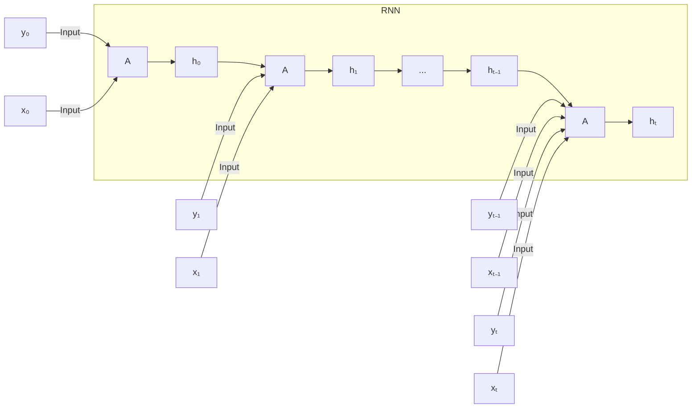

# Recurrent Neural Networks

## Motivation

In the preceding material we considered neural networks that process **a single input**—for example, a solitary image.  Such **feed‑forward neural networks** take an input, apply a series of transformations, and produce a result without any notion of temporal ordering.  However, many real‑world signals are **sequential** or **time‑dependent**.  Typical examples include:

- **Speech and music** – tasks such as translation or music genre classification require understanding how the signal evolves over time.  
- **Video** – applications like object detection or face recognition must exploit the continuity between consecutive frames.  
- **Sensor streams** – measurements of speed, temperature, energy consumption, and similar quantities are naturally ordered in time.

When we treat each element of such a sequence as an isolated “snapshot,” we often lose crucial information.  For instance, translating a single word without its surrounding context almost never yields a correct translation.  Consequently, **temporal context**—the relationship among consecutive elements—is indispensable for these problems.

#### Integrating temporal context

A straightforward idea might be to feed an entire sequence into a large, conventional feed‑forward network.  This approach is problematic for several reasons [1]:

- It consumes an excessive amount of memory because the network must store all time steps simultaneously.  
- Training becomes difficult or even infeasible due to the sheer size of the model and the vanishing‑gradient‑like effects that arise across many layers.  
- It conflates **spatial** dimensions (e.g., width and height of an image) with **temporal** dimensions, ignoring the distinct statistical properties of each.  
- Such a system cannot operate **in real time**, which is essential for applications like live translation.

The first recurrent models date back to the 1970s—Hopfield networks [10] and later the Elman network introduced by Jeff Elman in 1990 [@5]—which already demonstrated the idea of a hidden state that is fed back at each time step.  By reusing the same set of parameters for every element, recurrent neural networks (RNNs) avoid the memory blow‑up of a naïve feed‑forward design while preserving a compact representation of the past.  Moreover, because the hidden state is updated incrementally, an RNN can produce outputs on‑the‑fly, enabling true **online** or **real‑time** processing of streams such as live speech or video.  This contrasts with the batch‑only processing of a large feed‑forward network, which would have to wait for the whole sequence before producing any result.

An interesting side note is that for very simple tasks, deep convolutional sequence‑to‑sequence models have been shown to work surprisingly well [6]; however, they still suffer from the same inability to operate in real time and often require fixed‑length windows, limiting their applicability to genuinely long or variable‑length sequences.

Conceptually, the hidden state \(h_t\) can be thought of as a **notebook** that the network updates after each element \(x_t\).  The notebook carries a compressed summary of everything observed so far, allowing the network to “look back” without storing every raw input.  This simple mechanism provides a natural way to incorporate temporal context directly into the model’s computations.

A more principled solution is to embed the notion of sequential behavior directly into the network architecture.  This leads to **recurrent neural networks (RNNs)**, which maintain an internal state that evolves as each new element of the sequence is processed, thereby providing a natural mechanism for incorporating temporal context.

## Simple Recurrent Networks

### Simple Recurrent Neural Networks  

A simple recurrent neural network (RNN) unit consists of three components: an input vector $x_t$, a hidden (or state) vector $h_t$, and an output vector $y_t$. At each discrete time step $t$, the unit receives the current external input $x_t$ **and** the hidden state from the previous time step $h_{t-1}$. Both are processed by a shared transformation block (labeled “A” in the diagram) which produces two results:

1. the new hidden state $h_t$, which will be fed back into the unit at the next time step, and  
2. the output $y_t$, which may be consumed by downstream parts of the model.

The recurrent loop—$h_{t-1}\rightarrow A\rightarrow h_t$—gives the network a form of memory: the hidden state carries information about all past inputs up to time $t-1$. This architecture mirrors the state‑update equations of discrete‑time dynamical systems, where a state vector is updated from the previous state and a new input.

Historical background  

* The earliest recurrent models appeared in the 1970s [Little (1974) [@Little]] and early 1980s [Hopfield (1982) [@Hopfield]] (the Hopfield network).  
* The **simple recurrent neural network**, also called the **Elman network**, was formally introduced in Jeff Elman’s *Finding Structure in Time* (1990) [Elman (1990) [@Elman90]].

---

### Difference between Recurrent Neural Networks and Feedforward Neural Networks  

Feedforward networks propagate information strictly in one direction, from inputs toward outputs, without any cycles. Consequently, they cannot retain any notion of temporal context.  

Recurrent neural networks, by contrast, contain directed cycles that allow the hidden state to be fed back into the same computational block at the next time step. This recurring connection enables RNNs to  

* **model loops** in the computational graph,  
* **store memory** of past observations,  
* **learn sequential relationships** such as time‑series or language structure,  
* and **produce continuous predictions** in real time as new data arrive.

---

### Basic Structure of RNNs  

An RNN unit receives two streams of information at each time step $t$: the external input $x_t$ (shown on the left) and the hidden state $h_{t-1}$ (fed from the previous unit, shown on top). Both are fed into a processing block “A”. The block outputs the current hidden state $h_t$ (which loops to the right) and the current output $y_t$ (which leaves upward).  

*The current input $x_t$ is multiplied by an input‑to‑hidden weight matrix; the hidden state $h_{t-1}$ is multiplied by a hidden‑to‑hidden weight matrix; the two results are summed with a bias term and passed through a non‑linear activation to produce $h_t$.*  
*The hidden state $h_t$ and the same hidden‑to‑output weight matrix produce the output $y_t$.*  

Because the same parameters are used at every time step, the RNN can be **unfolded** into a chain of identical copies of the unit, each sharing the same weight matrices. The hidden state thus propagates information forward through the entire sequence, allowing earlier inputs to influence later outputs.



---

### Close‑up of a Basic RNN Unit  

Two fundamental questions arise when examining a single RNN cell:

1. **How is the hidden state updated?**  
2. **How is the output computed from the hidden state?**

The unfolded diagram across three consecutive time steps $t\!-\!1$, $t$, and $t\!+\!1$ shows that each cell receives its input $x_t$ and the previous hidden state $h_{t-1}$. These are linearly transformed by weight matrices $W_{xh}$ (input‑to‑hidden) and $W_{hh}$ (hidden‑to‑hidden), summed with a bias $b_h$, and passed through a hyperbolic tangent activation $\tanh$ to yield the new hidden state $h_t$. The hidden state then passes through a sigmoid activation $\sigma$ (or another suitable output non‑linearity) to produce the output $y_t$.

*Activation functions*  

* $\tanh$ is applied after the state‑update affine transformation, providing a bounded, zero‑centered non‑linearity that captures the interaction of the current input and the previous state.  
* $\sigma$ (sigmoid) supplies an additional non‑linearity for the output, often useful when the output represents probabilities.

---

### How to Update the Hidden State  

The core computation of the hidden state at time $t$ is

$$
\vec{h}_t = \tanh\!\left(\vec{W}_{hh}\,\vec{h}_{t-1} + \vec{W}_{xh}\,\vec{x}_t + \vec{b}_h\right).
$$

* $\vec{W}_{hh}\in\mathbb{R}^{n_h\times n_h}$ weight‑matrix transforming the previous hidden state $\vec{h}_{t-1}$.  
* $\vec{W}_{xh}\in\mathbb{R}^{n_h\times n_x}$ weight‑matrix transforming the current input $\vec{x}_t$.  
* $\vec{b}_h\in\mathbb{R}^{n_h}$ is a bias vector added before the non‑linearity. 

Because the same matrices $\vec{W}_{hh}$ and $\vec{W}_{xh}$ are used at every time step, the recurrence captures a **shared dynamics** that can propagate information arbitrarily far into the future—*in principle*.

---

### How to Compute the Output  

After the hidden state $\vec{h}_t$ has been obtained, the output is generated via

$$
\vec{y}_t = \sigma\!\left(\vec{W}_{hy}\,\vec{h}_t + \vec{b}_y\right).
$$

* $\vec{W}_{hy}\in\mathbb{R}^{n_y\times n_h}$ maps the hidden representation to the output space.  
* $\vec{b}_y\in\mathbb{R}^{n_y}$ is the output bias.  
* $\sigma$ is typically a softmax for classification or a sigmoid for binary decisions, but any differentiable activation may be used.

---

### RNN Basic Architectures  

The relationship between input and output sequences determines which RNN architecture is appropriate. Four canonical patterns are illustrated:

| Architecture | Input–Output Relation | Typical Applications |
|--------------|----------------------|----------------------|
| **One‑to‑one** | Single input → single output | Image classification (equivalent to a feed‑forward network) |
| **One‑to‑many** | Single input → sequence of outputs | Image captioning, speech synthesis |
| **Many‑to‑one** | Sequence of inputs → single output | Sentiment analysis, activity recognition |
| **Many‑to‑many** | Sequence of inputs → sequence of outputs | Video classification, machine translation, language modeling |

The diagram shows red boxes for external inputs/outputs and orange boxes for hidden states. Arrows indicate the direction of information flow, making explicit how hidden states are passed from one time step to the next.

---

### Deep RNNs  

Early examples presented only a **single hidden layer**. Stacking multiple recurrent layers—exactly as convolutional networks are deepened—creates a **deep RNN**. The hidden state at layer $l$ and time $t$ is computed as

$$
\vec{h}_t^{\,l} = \tanh\!\left(\vec{W}_{xh}^{\,l}\,\vec{x}_t^{\,l} + \vec{W}_{hh}^{\,l}\,\vec{h}_{t-1}^{\,l} + \vec{b}^{\,l}\right),
$$

where $l$ indexes the depth (bottom layer $l=1$, top layer $l=L$). The horizontal axis of the accompanying figure represents time, the vertical axis represents layer depth. The network thus processes the sequence at each layer, feeding the hidden representation upward to the next layer while still propagating temporal information forward.

*(The two meme slides that originally accompanied this section are omitted for brevity; they illustrated the idea of repeatedly nesting RNNs.)*

---

### Simple Example: Character‑Level Language Model  

Consider a tiny vocabulary $\{h, e, l, o\}$ and a task: learn the probability distribution over the next character given a short text. Characters are encoded as one‑hot vectors, e.g. $h = (1,0,0,0)^\top$.  

We train an RNN on the sequence “hello”. At time step $t=1$ the network receives the one‑hot for ‘h’; at $t=2$ it receives ‘e’, and so on. The desired behavior is that after seeing “hell”, the network predicts ‘o’ as the most probable next character.  

Because the correct prediction at time $t$ depends on **previous inputs** (e.g., to predict the second ‘l’ the network must remember that an ‘l’ has already occurred), the recurrent hidden state is essential.

---

### Training the Character‑Level Model: Backpropagation Through Time (BPTT)  

Training proceeds by **unfolding** the recurrent computation over the entire input sequence, treating the unfolded graph as a deep feed‑forward network with shared parameters. The algorithm consists of three phases:

1. **Forward pass** – Compute hidden states and outputs for all time steps $t=1,\dots,T$ using  
   \[
   \begin{aligned}
   \vec{u}_t &= \vec{W}_{hh}\,\vec{h}_{t-1} + \vec{W}_{xh}\,\vec{x}_t + \vec{b}_h,\\
   \vec{h}_t &= \tanh(\vec{u}_t),\\
   \vec{o}_t &= \vec{W}_{hy}\,\vec{h}_t + \vec{b}_y,\\
   \hat{\vec{y}}_t &= \sigma(\vec{o}_t).
   \end{aligned}
   \]
2. **Loss evaluation** – Typically cross‑entropy:
   \[
   L(\hat{\vec{y}},\vec{y}) = \sum_{t=1}^{T} L(\hat{\vec{y}}_t,\vec{y}_t).
   \]
3. **Backward pass** – Propagate gradients from $t=T$ down to $t=1$, accumulating contributions from both the output path and the recurrent path.

The gradient with respect to the output pre‑activation is
\[
\nabla\vec{o}_t = \sigma'(\vec{o}_t)\,\frac{\partial L}{\partial \hat{\vec{y}}_t},
\]
yielding
\[
\nabla\vec{W}_{hy,t} = \nabla\vec{o}_t\,\vec{h}_t^\top,\qquad
\nabla\vec{b}_{y,t} = \nabla\vec{o}_t.
\]

The hidden‑state gradient combines two terms:

\[
\begin{aligned}
\nabla\vec{h}_{t} &= 
\underbrace{\left(\frac{\partial \vec{h}_{t+1}}{\partial \vec{h}_t}\right)^\!\top \nabla\vec{h}_{t+1}}_{\text{recurrent contribution}}
\;+\;
\underbrace{\left(\frac{\partial \vec{o}_t}{\partial \vec{h}_t}\right)^\!\top \nabla\vec{o}_t}_{\text{output contribution}}\\[4pt]
&= \vec{W}_{hh}^\top\,
\tanh'\!\left(\vec{W}_{hh}\vec{h}_{t} + \vec{W}_{xh}\vec{x}_{t+1} + \vec{b}_h\right)
\,\nabla\vec{h}_{t+1}
\;+\;
\vec{W}_{hy}^\top \nabla\vec{o}_t .
\end{aligned}
\]

With $\nabla\vec{h}_t$ in hand, the remaining gradients are

\[
\begin{aligned}
\nabla\vec{W}_{hh,t} &= \nabla\vec{h}_t \;\tanh'(\vec{u}_t)\; \vec{h}_{t-1}^\top,\\
\nabla\vec{W}_{xh,t} &= \nabla\vec{h}_t \;\tanh'(\vec{u}_t)\; \vec{x}_{t}^\top,\\
\nabla\vec{b}_{h,t} &= \nabla\vec{h}_t \;\tanh'(\vec{u}_t).
\end{aligned}
\]

Because the weights are **shared across time**, the final gradient for each parameter is obtained by summing its per‑time‑step contributions:

\[
\nabla\theta = \sum_{t=1}^{T}
\bigl\{\,\nabla\vec{W}_{xh,t},\;\nabla\vec{W}_{hh,t},\;\nabla\vec{W}_{hy,t},\;
\nabla\vec{b}_{h,t},\;\nabla\vec{b}_{y,t},\;\nabla\vec{h}_0\,\bigr\}.
\]

The parameters are then updated with a learning rate $\eta$:

\[
\vec{\theta} \leftarrow \vec{\theta} - \eta\,\nabla\theta.
\]

#### Pseudocode for the Forward Pass  
```text
Input sequence:  X = {x₁, x₂, …, x_T}
for t = 1 … T do
    u_t = W_hh · h_{t‑1} + W_xh · x_t + b_h
    h_t = tanh(u_t)
    o_t = W_hy · h_t + b_y
    ŷ_t = σ(o_t)
end for
```

#### Pseudocode for the Backward Pass (BPTT)  
```text
Compute loss L( ŷ , y )
Initialize ∇h_T = 0
for t = T … 1 do
    ∇o_t = σ'(o_t) * ∂L/∂ŷ_t
    ∇W_hy,t = ∇o_t · h_tᵀ
    ∇b_y,t  = ∇o_t
    ∇h_t   = W_hhᵀ · tanh'(u_{t+1}) · ∇h_{t+1} + W_hyᵀ · ∇o_t
    ∇W_hh,t = ∇h_t · tanh'(u_t) · h_{t‑1}ᵀ
    ∇W_xh,t = ∇h_t · tanh'(u_t) · x_tᵀ
    ∇b_h,t  = ∇h_t · tanh'(u_t)
end for
Sum gradients over t and update parameters.
```

---

### Normal vs. Truncated BPTT  

In **normal BPTT**, a single parameter update requires backpropagating gradients through the entire unfolded sequence (e.g., $y_0\ldots y_9$). This can be prohibitively expensive for long sequences because the computational graph grows linearly with sequence length.

A pragmatic alternative is **Truncated Backpropagation Through Time (TBPTT)**. The idea is to keep processing the sequence in its natural order while limiting the depth of the backward pass:

* Every $k_1$ time steps, run a BPTT pass over the most recent $k_2$ steps ($k_2\ll k_1$).  
* The hidden state after the truncated segment is retained, so information can still flow forward across many steps, even though gradients are only computed over a short window.

```text
for t = 1 … T do
    run RNN step → compute h_t, y_t
    if t mod k₁ == 0 then
        backpropagate through steps t, t‑1, …, t‑k₂
        update parameters
    end if
end for
```

The diagram illustrates green arrows that denote the truncated gradient flow, showing that only a limited number of past time steps participate in each backward pass.

---

### Long‑Term Dependency Problem in Basic RNNs  

RNNs excel at capturing **short‑range** dependencies because the hidden state can easily incorporate recent inputs. For example, predicting the word “sky” after “the clouds are in the” works well.

However, **long‑range** dependencies are problematic. Predicting “German” after “I grew up in Germany … I speak fluent …” requires information that must travel many time steps. The hidden state may have already been overwritten many times, and the gradients that would reinforce the long‑range connection tend to **vanish** (or, less commonly, explode) during BPTT. This phenomenon, first analyzed by Hochreiter and Schmidhuber [Hochreiter & Schmidhuber (1997) [@lstm]], stems from repeated multiplication of Jacobians across time steps. 

* **Vanishing gradients** make it difficult for the optimizer to adjust early weights based on distant errors.  
* **Exploding gradients** can be mitigated by gradient clipping or truncation. 

Furthermore, the hidden state is **overwritten at each step**, which erodes the memory of earlier inputs. These issues motivate more sophisticated architectures (e.g., LSTM, GRU) and training tricks that we discuss later in the course.

## Long Short-Term Memory Units (LSTMs)

### Background

Long Short‑Term Memory units (LSTMs) were introduced by Hochreiter & Schmidhuber in 1997 [[@Hochreiter1997]]. The primary motivation for this architecture was to address the *vanishing gradient* problem that limits standard recurrent neural networks (RNNs) from learning long‑range dependencies in sequential data. The key innovation of the LSTM is the introduction of **gates**—learnable, element‑wise modulators—that control how information is written to, retained in, and read from an auxiliary storage called the **cell state**. By regulating the flow of gradients through these gates, the network can preserve relevant signals over many time steps.

### Overview of an LSTM Unit

An LSTM cell is a recurrent building block that processes an input vector $\vec{x}_t$ at discrete time step $t$ together with the hidden state $\vec{h}_{t-1}$ produced at the previous step. Inside the cell there is a **cell state** $\vec{C}_t$, which acts as a linear, unfiltered conduit for information across time. Three gates—*forget*, *input*, and *output*—are computed by applying a sigmoid function $\sigma(\cdot)$ (which squashes its argument to the interval $[0,1]$) to affine transformations of the concatenated vector $[\vec{h}_{t-1},\vec{x}_t]$. A candidate cell state $\tilde{\vec{C}}_t$ is generated by a hyperbolic tangent activation $\tanh(\cdot)$.

* **Forget gate** $f_t$ determines how much of the previous cell state $\vec{C}_{t-1}$ should be retained.
* **Input gate** $i_t$ decides how much of the newly computed candidate $\tilde{\vec{C}}_t$ will be added to the cell.
* **Output gate** $o_t$ controls how much of the updated cell state $\vec{C}_t$ is exposed as the hidden output $\vec{h}_t$.

The hidden state $\vec{h}_t$ is then emitted to downstream layers (or to the next time step) and can also be fed through an additional output activation to produce the final network output $\vec{y}_t$.

### LSTM Unit Workflow

The internal dynamics of an LSTM cell can be described as a sequence of four elementary operations:

1. **Forget gate** – computes a vector $\vec{f}_t$ that scales the previous cell state $\vec{c}_{t-1}$, thereby erasing irrelevant information.
2. **Input gate** – computes a vector $\vec{i}_t$ that modulates a candidate cell contribution $\tilde{\vec{c}}_t$, which encodes the new information derived from the current input and previous hidden state.
3. **Cell‑state update** – combines the scaled previous state and the gated candidate to obtain the new cell state $\vec{c}_t$.
4. **Hidden‑state update** – uses the output gate $\vec{o}_t$ to extract a filtered version of the updated cell state, producing the next hidden state $\vec{h}_t$.

The full set of variables involved in a single time step is:

* Input vector $\vec{x}_t$
* Previous hidden state $\vec{h}_{t-1}$ (and next hidden state $\vec{h}_t$)
* Previous cell state $\vec{c}_{t-1}$ (and next cell state $\vec{c}_t$)
* Output vector $\vec{y}_t$

These symbols are used throughout the derivations that follow.

### LSTM Cell State

The cell state $\vec{c}_t$ is the core memory mechanism of the LSTM. Unlike the hidden state, it undergoes **only linear transformations**—no non‑linear activation is applied directly to $\vec{c}_t$. Consequently, gradients can flow backward through many time steps without exponential decay, which is the essential property that mitigates the vanishing‑gradient problem. Because the cell state can be propagated unchanged (i.e., $\vec{c}_t = \vec{c}_{t-1}$ when the forget gate outputs a vector of ones and the input gate outputs zeros), information may persist indefinitely if the gates deem it useful.

The accompanying diagram (not reproduced here) visualizes the cell state as a horizontal line that traverses the LSTM block, intersected by three gated pathways (forget, input, output) that modulate the flow of information.

### Forget Gate: Forgetting Old Information

The forget gate separates the act of *forgetting* from that of *memorizing* by computing a gating vector $\vec{f}_t$ as follows:

\[
\vec{f}_t = \sigma \!\left(\,\vec{W}_f \cdot [\vec{h}_{t-1},\vec{x}_t] + \vec{b}_f \,\right)
\tag{1}
\]

Here, $\vec{W}_f$ is the weight matrix associated with the forget gate, $\vec{b}_f$ is its bias vector, and $[\vec{h}_{t-1},\vec{x}_t]$ denotes the concatenation of the previous hidden state and the current input. The sigmoid ensures that each component of $\vec{f}_t$ lies between 0 (complete forgetting) and 1 (complete retention).

The figure attached to the slide illustrates how $\vec{f}_t$

## Lecture Notes Sources

These integrated lecture notes were transcribed from voice recordings of the lecture (FAU LME). Follow the links for the original blog posts:

- [Recurrent Neural Networks Part 1](https://lme.tf.fau.de/lecture-notes/lecture-notes-dl/lecture-notes-in-deep-learning-recurrent-neural-networks-part-1/)
- [Recurrent Neural Networks Part 2](https://lme.tf.fau.de/lecture-notes/lecture-notes-dl/lecture-notes-in-deep-learning-recurrent-neural-networks-part-2/)
- [Recurrent Neural Networks Part 3](https://lme.tf.fau.de/lecture-notes/lecture-notes-dl/lecture-notes-in-deep-learning-recurrent-neural-networks-part-3/)
- [Recurrent Neural Networks Part 4](https://lme.tf.fau.de/lecture-notes/lecture-notes-dl/lecture-notes-in-deep-learning-recurrent-neural-networks-part-4/)
- [Recurrent Neural Networks Part 5](https://lme.tf.fau.de/lecture-notes/lecture-notes-dl/lecture-notes-in-deep-learning-recurrent-neural-networks-part-5/)
