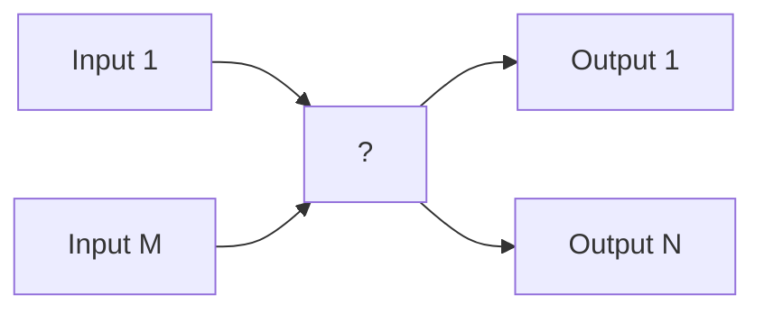
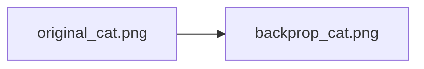
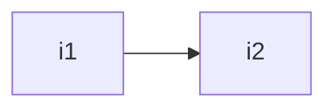
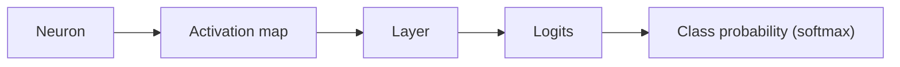

# Visualization and Attention Mechanisms

## Motivation

Neural networks are frequently regarded as **black boxes**: their internal computations are hidden from the observer, making it difficult to reason about why a particular input leads to a specific output. The following diagram captures this typical perception:

In contemporary research and engineering practice, however, we increasingly seek **understanding** and **communication** of the inner workings of these models. Today we want to look into how to communicate the inner workings of a network to other people such as developers and scientists. As Prof. Maier emphasizes in the lecture transcript, this is an important skill for one's future career: being able to convey what is happening inside a network is what allows ideas to spread, results to be reproduced, and architectures to be improved upon. Visualizing neural networks therefore serves several crucial purposes:

1. **Facilitating communication among researchers** – By presenting clear visual representations of architectures and learning dynamics, collaborators can more readily exchange ideas, reproduce results, and build upon each other's work.  
2. **Diagnosing training problems** – Visual cues can reveal pathological behaviors such as non‑converging loss curves, vanishing or exploding gradients, and the presence of *dying ReLUs* (neurons that output zero for all inputs). Early detection of these issues can save substantial computational resources.  
3. **Detecting faulty data** – When visualizations expose unexpected patterns in activations or loss landscapes, they may point to mislabeled samples, corrupted inputs, or distributional shifts between training and test sets.  
4. **Gaining insight into what the network learns** – By probing the representations that emerge within hidden layers, we can answer questions about the *how*, *why*, and *what* of learned features, thereby increasing trust and interpretability.

Beyond these practical benefits, visualizations are indispensable for uncovering hidden failure modes that are otherwise invisible to scalar metrics. For instance, **confounding factors**—systematic correlations in the data that are unrelated to the target task—can cause a network to learn spurious shortcuts. A classic anecdote described by Neil Frazer (1998) illustrates this: a classifier trained to detect tanks learned to discriminate based on weather conditions and background textures rather than the presence of a tank, achieving near‑perfect accuracy on the lab data but failing entirely in the field. Visual inspection of activation maps or learned filters instantly reveals such shortcuts, prompting a redesign of the data collection process. A similar phenomenon appears in speech recordings, where microphones with differing proximity to the speaker act as confounders; Maier *et al.* (2009) proposed a visualization technique that explicitly isolates and suppresses the microphone‑dependent component, demonstrating that without such analysis the model would mistakenly classify based on sensor characteristics rather than the underlying speech disorder.

Visualization also shines a light on **adversarial examples**, where imperceptibly small perturbations—often crafted by gradient‑based optimisation—drive a network to misclassify with high confidence. By visualising the gradients that influence a particular class (e.g., the saliency map for a "panda" versus a "gibbon"), researchers can see that the perturbation concentrates on a few pixels that drastically change the activation landscape, akin to optical illusions for humans. This insight not only motivates the development of more robust architectures but also informs defensive visualization‑based detection schemes.

Historically, the push for interpretability gave rise to seminal tools such as the **Deep Visualization Toolbox** (Yosinski *et al.*) and **Feature Visualization** (Olah *et al.*), which render intermediate activations and optimized inputs to human‑readable images. These early systems laid the groundwork for the three‑fold taxonomy presented below, and they continue to inspire modern practices like guided backpropagation, Grad‑CAM, and inversion techniques.

To address these needs, visualizations can be categorized into three **main types**:

- **Architecture visualizations** – Diagrams that depict the arrangement of layers, connections, and data flow, clarifying the structural design of the model.  
- **Training visualizations** – Plots and animations that track metrics such as loss, accuracy, gradient norms, and activation distributions over epochs, revealing the dynamics of the learning process.  
- **Parameter/weight visualizations** – Techniques that expose the learned representations of data inside the network (e.g., filters of convolutional layers, activation maps, attention maps). These visualizations help us understand how the model encodes information at different levels of abstraction.

## Network Architecture Visualization

Communicating the structure of a neural network is crucial because the architectural priors—i.e., the inductive biases imposed by the chosen connectivity pattern—are frequently the most important factor for achieving good performance. Most modern deep‑learning models can be represented as graph‑based structures, where the granularity of the graph (from individual neurons up to whole "blocks") can be varied. This perspective is closely related to the discussion of neural‑network architectures in Lecture 6.

The objective when drawing such diagrams is to **communicate effectively what is important** about a particular network. Even with the same underlying architecture, different visual choices emphasise different aspects: a node‑level rendering may foreground a specific connectivity pattern, while a stacked block view foregrounds the change of spatial resolution and channel count from layer to layer. The art lies in selecting the representation that highlights the property one wishes to discuss.

---

### Visualization Categories

Network‑architecture visualizations fall into three broad categories:

1. **Node‑link diagrams** – individual neurons are drawn as nodes and (weighted) connections are drawn as edges.
2. **Block diagrams** – each layer (or logical "block") is shown as a solid rectangle, with single arrows indicating the flow of data between layers.
3. **"Others"** – visualizations that do not fit neatly into the first two categories, such as hybrid or abstract representations.

---

### Node‑link Diagrams

Node‑link diagrams provide a **detailed representation** that emphasizes the exact connectivity of the network. Because the number of nodes and edges grows rapidly with network size, these diagrams are practical only for **small (sub‑)networks or recurring building blocks**. Variants of the basic scheme can show additional information, for example:

- Explicit numerical weight values attached to edges.
- Recurrent connections that form cycles.
- Different color or style encodings for distinct types of connections (e.g., excitatory vs. inhibitory).

Node‑link diagrams are particularly well suited to highlighting the difference between, for instance, a fully‑connected layer and a convolutional layer: in the former every input neuron connects to every output neuron, whereas in the latter only a sparse, weight‑shared subset of connections is present. Such structural differences are otherwise hard to convey at a glance, which is why node‑link diagrams remain the representation of choice when introducing the basic building blocks of neural networks.

---

### Block Diagrams

In block diagrams each **block** corresponds to a mathematical operation or a layer (convolution, batch‑normalisation, ReLU, etc.). **Arrows** indicate the **direction of data flow**. The granularity of blocks can be chosen hierarchically; a block may itself contain sub‑blocks that are expanded in a more detailed view. It is common to augment the visual representation with **textual annotations** that describe hyper‑parameters such as filter size, number of filters, stride, padding, etc.

Block diagrams are by far the most common representation used in research papers, partly because they collapse many neurons and many edges into a single visual element while still conveying the global structure of a network. Although in reality every neuron in one block is fully (or sparsely) connected to neurons in the next block, only a single arrow is typically drawn between the two blocks; the actual connectivity pattern is implied by the block's label. The hyper‑parameters that govern that connectivity—filter size, number of filters, stride, padding, and so on—are usually specified either next to the block or in the figure caption.

A useful practical tip is to combine block diagrams with embedded node‑link snippets. This hybrid style allows one to communicate both the macro structure (the overall flow of data through the network) and the micro structure (how a particular block is built up from individual neurons or kernels), which is often the only way to discuss exotic operations such as spatial pyramid pooling or grouped convolutions in a single figure.

The same architecture can be depicted in many different styles. The original AlexNet figure, for example, splits the network into two parallel branches to reflect the fact that it ran on two GPUs and shares activations between branches at specific layers; an alternative visualization of the very same network drops the GPU‑centric split and instead emphasises the convolutional backbone followed by fully‑connected layers and an SVM classifier. Both pictures describe the same model but place different aspects in the foreground. Similarly, the VGG network is sometimes shown as a sequence of three‑dimensional cubes whose horizontal extent shrinks while their depth grows, in order to convey how spatial resolution is traded for channel depth as one moves through the network.

#### Residual Block (ResNet)

> *Figure 1.* The figure depicts a segment of a neural network, specifically a **residual block** as used in ResNet architectures. Data flows vertically, starting with an input $X_l$ at the top and producing an output $X_{l+1}$ at the bottom. The primary path consists of two weight layers separated by **Batch Normalisation (BN)** and **ReLU** activation functions. A **shortcut connection** bypasses these two weight layers, adding the input $X_l$ directly to the output of the second weight layer; this addition is labelled "addition". A final ReLU activation is applied to the result of the addition, producing $X_{l+1}$. The figure highlights the recurring pattern **weight → BN → ReLU**, illustrating how residual connections enable easier gradient propagation in deep networks.

- Blocks represent individual layers or composite operations.
- Arrows convey the flow of activations.
- Hierarchical descriptions allow one to zoom from coarse‑grained modules down to fine‑grained neuron‑level detail.
- Hyper­parameter text (e.g., filter size, number of filters) is frequently added alongside blocks.

#### Extended ResNet Module

> *Figure 2.* The figure shows a block diagram of a **ResNet module** commonly found in deep convolutional neural networks. Boxes denote layers, with their dimensions labelled—**width** above the box and **height** below. A series of convolutional layers is interleaved with **max‑pooling** operations, followed by fully connected (dense) layers. Dashed lines represent **skip connections**, a hallmark of ResNets that help gradients flow and mitigate the vanishing‑gradient problem. Several "Max pooling" blocks include a **stride** parameter (e.g., "Stride of 4"), indicating the down‑sampling factor. Dense layers are labelled "dense" with an output dimension of **1000**. The residual formulation $y = F(x) + x$ is shown, where $x$ is the block input, $F(x)$ is the transformation performed by the convolutional layers, and $y$ is the block output.

#### CNN for Image Classification (ResNet‑style)

> *Figure 3.* This figure depicts a convolutional neural network architecture used for image classification and resembles a ResNet module. The input consists of **10 samples**, each a $256 \times 256$‑pixel image. The data pass through a sequence of convolutional layers named **conv1 … conv5**, each followed by a **max-norm** operation (illustrated by a red bracket labelled "Extract high level features"). Below each convolutional block the spatial dimensions of the feature maps are annotated, showing a progressive reduction in size (e.g., from $256 \times 256$ to $13 \times 13$) while the number of channels increases (e.g., up to 384). After the convolutional backbone, two fully‑connected layers **fc6** and **fc7** are applied, followed by a **Support Vector Machine (SVM)** classifier. A curved arrow indicates that the module is applied **independently to each of the 10 input samples** before classification. The SVM produces a class prediction, denoted by a question mark.

#### Practical Remarks on Block Diagrams

- **Most common representation**, but many variants exist (e.g., 3‑D or pseudo‑3‑D layers, different colour schemes for receptive fields).
- **Recommendation:** Choose a style that clearly conveys the information you intend to emphasise. A good combination of concise textual annotations and clear figures is essential for effective communication.
- **Tool support:** Most deep‑learning libraries (TensorFlow, PyTorch, etc.) provide utilities to automatically render the computational graph. These are invaluable for debugging, yet they are often too low‑level or cluttered for inclusion in formal reports or presentations.

#### Stacked‑Block View

> *Figure 4.* The figure visualises a convolutional neural network (again a ResNet‑style module) as a series of stacked rectangular blocks. Each block's **height** reflects the number of filters (or feature maps) and its **width** reflects the spatial dimensions of those feature maps. Dimensions are labelled beneath each block, starting from **224 × 224** and decreasing through successive pooling and convolution operations to **14 × 14**. The accompanying "D" values (64, 128, 256, 512, 512, 4096, 1000) denote the dimensionality of the respective layers. The network terminates with fully‑connected layers followed by a **Softmax** layer for classification. This layout visualises how the network progressively extracts more abstract features while compressing the spatial resolution, ultimately mapping the input to a categorical output.

---

### "Other" Visualization Techniques

Beyond the two primary categories, several alternative approaches have been explored.

- **Deep Visualization** [Yosinski et al. (2015) [@YosinskiCNFL15]] combines architectural diagrams with visualisations of learned parameters (e.g., feature maps, filters).
- **Graphcore Poplar** offers sophisticated graph visualisations that can display hardware‑specific execution details.

These exotic visualizations are often produced automatically by hardware‑aware compilers or low‑level profilers. They can be visually striking and they make individual layers and configurations identifiable through their distinctive shapes, but they are usually unsuitable as a blueprint for re‑implementing a network: it is genuinely difficult to look at such a graph and reconstruct, for instance, that the underlying model is a ResNet‑50. They are therefore better viewed as artistic or diagnostic curiosities than as primary communication devices.

#### Directed‑Graph Representation of a ResNet Module

> *Figure 5.* This figure presents a ResNet module as a **directed graph**. Nodes correspond to layers and are labelled with names such as "conv1.x – 3×3" together with dimensions in the form *[in, out]*, indicating input and output feature‑map sizes. Edges (arrows) denote the flow of data. Convolutional layers vary in kernel size (1×1, 3×3) and number of filters, first increasing then decreasing the number of feature maps. The module ends with a **Fully Connected** layer that maps a 2048‑dimensional input to a 1000‑dimensional output. The overall circular arrangement reflects the **residual (skip) connections** that alleviate the vanishing‑gradient problem and enable training of very deep networks.

#### High‑Dimensional Point‑Cloud Visualisation

> *Figure 6.* The image shows a dense network of coloured points (primarily yellow and teal, with smaller amounts of green, orange, and white) connected by thin lines. Yellow points form two dense clusters, while teal points are more diffusely distributed, with a gradual transition between the two regions. The connecting lines vary in density, suggesting differing strengths or frequencies of connections. Although there are no axes or explicit unit labels, the visual resembles a **graph‑based representation of a neural‑network module** and could be interpreted as a visualization of parameter distributions or connectivity patterns as described in the deep‑visualisation literature.

## Visualization of Training

#### Types of information that can be inspected while a model is learning  

During training a wealth of data is generated that can be inspected to gain insight into the learning dynamics:

* **Input data** – the raw examples presented to the network, such as images, textual strings, or any other modality. Observing the distribution of inputs can reveal class imbalance, corrupted samples, or preprocessing errors.  
* **Parameters** – the learnable tensors of the model, i.e. weights and biases. Monitoring their magnitude, sparsity, or distribution helps detect exploding/vanishing gradients or over‑regularization.  
* **Hidden‑layer data** – activations, hidden states, or any intermediate representation computed by the network. Visualizing these quantities can expose dead neurons, bottlenecks, or useful feature hierarchies.  
* **Output data** – the final predictions (e.g., class probabilities) and derived quantities such as loss curves, accuracy, precision, recall, etc. These are the most common diagnostics for overall performance.

Collecting and visualizing these signals is useful for several reasons.  
First, it aids **debugging**: mismatched dimensions, numerical instability, or data‑pipeline bugs often manifest as strange activation patterns or sudden spikes in loss.  
Second, it supports **model‑design improvement**: by seeing which layers contribute most to a decision boundary or which weights dominate, a practitioner can prune, re‑architect, or adjust hyper‑parameters.  
Third, it enables **research reproducibility** and **communication**: clear plots of loss versus epoch, or visualizations of learned representations, provide immediate evidence for claims made about a model's behavior. (See also Lecture 5 – Common Practices.)

*Motivation.*  As Prof. Maier emphasizes in the lecture transcript, deep networks are often treated as black boxes: "you have some inputs, then something happens with them, and then there are some outputs."  Visualization therefore becomes essential not only for debugging but also for uncovering **unintended behavior** such as confounding factors or adversarial vulnerabilities.  For example, visual inspection of hidden‑layer activations can reveal that a model has latched onto a spurious correlation (e.g., "weather" in the classic tank‑identification story) rather than the intended semantic cue [@Fraser98].  Similarly, visualizing the effect of tiny, optimized perturbations helps diagnose **adversarial examples**, which appear indistinguishable to humans yet dramatically alter the network's predictions [@Brown17, @Sharif16].

---

#### Toy 2‑D example: visualizing decision boundaries and weight magnitudes  

A simple illustration consists of a feed‑forward network with three hidden layers that solves a binary classification problem on a two‑dimensional feature space. The input vector contains the raw features $x_1$ and $x_2$ as well as their polynomial expansions $x_1^2$, $x_2^2$, and the interaction term $x_1x_2$. The architecture is:

* **First hidden layer:** 4 neurons  
* **Second hidden layer:** 3 neurons  
* **Output layer:** 2 neurons (corresponding to the two classes)

Connections between neurons are drawn as lines whose thickness encodes the absolute value of the associated weight; thicker lines represent larger magnitudes. This visual cue makes it easy to spot which connections dominate the forward pass.

The decision surface learned by the network is overlaid as a color gradient. The colour map spans approximately from $-5$ (cold colors) to $+6$ (warm colors), with warmer hues indicating higher activation values for the decision function. Because the problem is low‑dimensional, the boundary can be displayed directly in the input plane, allowing an intuitive inspection of how the network partitions the space.

Training specifics are also displayed:

* **Training‑to‑test split:** 50 % of the data used for training, the remainder for testing.  
* **Batch size:** 10 samples per update.  
* **Training loss:** $0.008$, indicating the model fits the training set well.  
* **Test loss:** $0.091$, a modest increase that hints at a small generalization gap.  
* **Activation function:** hyperbolic tangent (tanh).  
* **Regularization:** none (regularization rate $\lambda=0$).  
* **Learning rate:** $0.03$.

Although the example is deliberately simple, it demonstrates core concepts that scale to more complex settings: interactive loss curves, visual inspection of decision boundaries, and the importance of weight magnitude visualizations for interpretability.

The interactive **TensorFlow Playground** demo cited in the lecture notes visualises exactly this kind of 2‑D decision‑boundary evolution during training. It is particularly instructive because it lets one watch how the partitioning of the input space changes layer by layer: with sigmoid activations, each fully‑connected layer essentially generates a binary partition of its input space, and successive layers compose these partitions to obtain progressively more complex decision regions. By stepping through the iterations one can accelerate, decelerate or pause training and inspect what has happened at each stage, which makes the toy example a powerful pedagogical bridge to the dynamics inside larger networks. The same line‑thickness convention used here was popularised early on by visualisations such as the **Deep Visualization Toolbox** (Yosinski et al., 2015 [@YosinskiCNFL15]) and the **feature‑visualization** work of Olah et al. (2017 [@Olah17]).

---

#### Time‑series visualizations of training metrics  

For deeper networks—e.g., a ResNet‑style module—the training process generates many scalar metrics that evolve over epochs or iterations. A typical dashboard arranges six plots in a $2\times3$ grid, each tracking a distinct quantity:

| Plot location | Metric (example label) | Y‑axis range |
|---------------|------------------------|--------------|
| Top‑left      | `dnn/dnn/hiddenlayer_0_fraction_of_zero_values` | $0.3$–$0.6$ |
| Top‑center    | (another hidden‑layer statistic) | $0.3$–$0.6$ |
| Top‑right     | (yet another hidden‑layer statistic) | $0.3$–$0.6$ |
| Middle‑left   | (metric with slightly larger range) | $0.3$–$0.64$ |
| Middle‑center | (similar to above) | $0.3$–$0.64$ |
| Bottom‑left   | **Accuracy** | $0$–$1$ |
| Bottom‑center | **Loss** | $0$–$3\times10^{-4}$ |

Each plot contains several coloured lines, each line representing a different training run, hyper‑parameter configuration, or random seed. The x‑axis (not explicitly labelled) corresponds to training time—either epochs or optimizer steps. By observing the trends across these plots, one can infer:

* **Sparsity dynamics** – the fraction of zero activations in a hidden layer may increase as the network settles into a more selective representation.  
* **Stability of gradients** – abrupt jumps or oscillations can signal a learning‑rate that is too high or an ill‑conditioned loss surface.  
* **Convergence of loss and accuracy** – smooth monotonic decay of loss together with rising accuracy indicates successful training; plateaus or divergence suggest the need for intervention.

Such multi‑metric dashboards are supported by most deep‑learning frameworks (e.g., **TensorBoard** for TensorFlow, `torch.utils.tensorboard` for PyTorch, or Weights & Biases). They are essential when training large networks, because they expose at a glance whether the loss is converging, whether the validation loss diverges from the training loss, or whether the gradients have started to explode. After running, say, a hundred epochs without any change in loss it is much faster to spot the problem in a TensorBoard panel than to scroll through raw log files.

*Additional insight.*  Beyond scalar curves, modern dashboards often include **histograms of weight distributions** and **embedding visualizations** (e.g., t‑SNE plots of the final‑layer activations) to spot confounders such as the microphone‑bias example described in the transcript [@Maier09-AMV].  These visual cues can reveal when a network is learning dataset artefacts rather than the intended task.

---

#### Practical recommendation  

The majority of modern deep‑learning libraries provide built‑in utilities for logging, plotting, and interactively exploring training statistics. **Make use of these tools**; they require minimal code changes (e.g., adding a `SummaryWriter` or `Logger` callback) and can dramatically accelerate debugging and model‑development cycles. Continuously monitoring the visualizations described above helps keep the training process transparent and under control.

*Toolbox tip.*  For low‑level inspection of learned filters and activations, the **Deep Visualization Toolbox** (Yosinski et al., 2015 [@YosinskiCNFL15]) and **Feature Visualization** (Olah et al., 2017 [@Olah17]) remain valuable open‑source resources.  They allow you to render first‑layer filters (often resembling edge or Gabor detectors) and to generate activation maximization images, which can be combined with the metric dashboards for a holistic view of training progress.

## Visualization of Parameters

### Motivation  
Neural networks learn a **representation** of the training data, but it is not obvious what happens to the data as it propagates through the network. Understanding this internal processing is important because unexpected or unintuitive behavior can arise, such as:  

* **Adversarial examples** – inputs that are perturbed imperceptibly to a human yet cause the network to make a drastically different prediction.  
* **Performance gaps between laboratory and real‑world settings** – a model that works well on test data may fail when deployed.  

These problems often stem from the network focusing on "wrong" features (e.g., noise patterns, background cues) rather than the intended semantic content. An anecdotal illustration is the classic *tank identification* problem, where a network learned to associate "cloudy" weather with the presence of a tank instead of the tank's visual shape [Frazer (1998) [@Fraser98]; Kanal & Randall (1964) [@Kanal64]].

The story, told here in some detail because it captures the failure mode so vividly, runs as follows. Researchers at the Pentagon wished to train a neural network to identify tanks in photographs. Following the obvious recipe, they collected images of tanks—taken on battlefields where there were grenades, smoke, mud and gritty conditions—and images of empty forest scenery as negative examples. With on the order of two hundred images per class they trained a neural network in the lab and obtained a near‑perfect classification rate. Encouraged by this result they built a deployable system; in the field, however, the recognition rate collapsed to roughly fifty percent, no better than random guessing on a two‑class problem. Inspecting the dataset revealed the cause: every forest image had been recorded on a sunny day with a clear blue sky, whereas every tank image had been recorded under cloudy, smoky conditions. The network had taken the available **shortcut** and learned to detect the weather rather than the tank. The instructive lesson is that this is not a fault of the learning algorithm but of the data: the algorithm faithfully exploited the most discriminative feature it could find, and that feature happened to be irrelevant to the intended task. When collecting a dataset, one must therefore be extremely careful that the data are representative of the future application.

---

### Motivation – Confounds  
Consider an AlexNet model trained to detect tanks. In the training set, all tank images were taken on **cloudy** days, while non‑tank images were captured on **sunny** days. The network therefore learned the *weather* as a correlated feature rather than the tank itself. This is not a failure of the learning algorithm; it is a failure of the dataset to control for a confounding variable.  

A similar confound arises in speech recordings collected with two microphones [Maier et al. (2009) [@Maier09-AMV]]. The scatter plot below shows distinct clusters for the two microphones, indicating that the recordings differ in systematic ways (e.g., sensitivity, placement). A model trained on such data may rely on microphone‑specific characteristics rather than the speech signal itself, because the learning algorithm will exploit the most discriminative features, even if they are irrelevant to the target task.

To make this concrete: in the dimensional‑scaling visualization of the speech corpus, each of the 51 speakers is mapped onto a point in a 2‑D space. The squares correspond to recordings from Microphone 1 and the dots to recordings from Microphone 2; crucially these are *the same speakers* and the recordings are even *simultaneous*, the only difference being that one microphone was placed close to the mouth while the other was mounted on a video camera roughly two and a half meters away. The two clusters are easily separable, which proves that the microphone characteristic alone is enough to discriminate speakers. If a similar setup were used to collect speech for pathology detection—for instance, recording all pathological speakers with one microphone and all controls with another—the network would almost certainly learn to detect the microphone rather than the disease.

The same trap is not limited to microphones. Two different scanners used to acquire histopathology images, or two different sites that happen to host patients with two different diseases, can introduce massive confounders: the network may learn to recognise the characteristic noise pattern of a particular scanner instead of the underlying pathology. Even individual digital cameras can be identified solely by the fixed‑pattern noise in their pixels, a fact exploited in image forensics, and these local cues are picked up readily by the early layers of a deep network. The same caveat applies forcefully to medical applications such as COVID‑19 diagnosis: if positive samples come from one region or one set of three or four scanners and negative samples come from another, the network may learn to identify the scanner rather than the disease.

> **Key takeaway:** Whenever a confounder is *known* we can sometimes correct for it (e.g., the QMOS approach of Maier et al. [Maier et al. (2009) [@Maier09-AMV]] that uses knowledge about the same participants). Other common confounders include sensor type, lighting conditions, participant age/sex, ambient temperature, etc. The safest strategy is to be aware of potential confounds and to design datasets that avoid them. Even temperature is likely to influence a sensory pipeline, so any imaginable systematic factor should be considered. Whenever a confounder cannot be avoided one must compensate for it explicitly; otherwise it is likely to spoil the entire classification system, and without careful inspection of the data the source of the failure will remain invisible.

---

### Motivation – Unintuitive Behaviour of Neural Networks  
Even when two inputs appear identical to a human, the network can produce dramatically different outputs. The classic case is an **adversarial example**: a tiny, carefully optimised perturbation (often called "noise") is added to an image, producing no visible change but causing the network to misclassify. This phenomenon underscores the brittleness of deep models and motivates the need for visualisation techniques that expose what the network actually sees.

A canonical illustration is a pair of images of a panda. The unmodified image is classified as "panda" with a confidence of roughly 57%, while a visually indistinguishable image—obtained by adding a perturbation of only one or two grey values per colour channel—is classified as "gibbon" with a confidence of 99.3%. The perturbation is constructed with full knowledge of the network: an attacker can solve an optimisation problem that maximises the activation of the desired (wrong) class, exploiting the way small per‑pixel signals accumulate across many layers to produce a large shift at the output. Because this perturbation is generated by an explicit optimisation procedure, adversarial examples are essentially *guaranteed* to exist for any sufficiently expressive network; one cannot in general prevent their construction.

---

### Motivation – Adversarial Examples and Optical Illusions  
Human perception is itself imperfect and can be fooled by optical illusions. Analogously, neural networks can be misled by inputs that exploit the model's high‑dimensional decision boundaries. Visual metaphors such as Escher‑style impossible architectures or complex cave scenes illustrate how seemingly coherent structures can hide contradictions that mislead perception. These analogies help us understand that neural networks, like humans, can be systematically deceived.

Two concrete analogies are particularly instructive. Escher's *Waterfall* lithograph depicts water that flows downhill in a closed loop, feeding the very mill that lifts it; locally each segment of the structure looks consistent, yet the overall image is impossible. The "organ player" shadow in Neptune's Grotto in Italy is another example: a particular configuration of stone formations casts a shadow that—when viewed from the right angle—suggests a person sitting at an organ, even though no such figure is actually present. In both cases the perceptual system is fooled by a globally inconsistent stimulus that locally appears plausible, mirroring the way an adversarial example fools a deep network.

---

### Motivation – Adversarial Examples  
Adversarial perturbations can be crafted to induce a **specific mistake**. Two notable examples are:

* **Accessorized attacks on face recognition** – Sharif et al. [Sharif et al. (2016) [@Sharif16]] demonstrated that wearing specially designed eyeglasses can cause a state‑of‑the‑art face recogniser to misidentify a person.  
* **Adversarial stickers** – Brown [Brown et al. (2017) [@Brown17]] showed that placing small stickers on objects (e.g., a banana) can force a classifier to output unrelated labels such as "slug" or "piggy bank."

These attacks illustrate that seemingly innocuous modifications to the input can drastically alter the network's predictions.

In the Sharif et al. attack, the attacker defines a fixed set of pixels in the rough shape of a pair of eyeglasses and then optimises the colour values of those pixels to drive the classifier toward an incorrect identity. The result is a vibrantly coloured frame that, when worn, causes a state‑of‑the‑art face recogniser to identify, for instance, an image of Reese Witherspoon as Russell Crowe. Crucially, the human visual system is essentially unaffected—we still see Reese Witherspoon—because human perception relies on a fundamentally different feature extraction process. A subsequent line of work even printed these glasses on physical frames and showed that camera‑based identification systems could be tricked in the real world. The "toaster sticker" of Brown et al. extends the same idea to scenes: a small, colourful printed patch is optimised to push any ImageNet classifier toward the class "toaster" regardless of the rest of the image, so that placing the patch next to a banana causes the network to report "toaster" rather than "banana." Because the patch was designed to fool many architectures simultaneously, the same printed image transfers across networks; the attached download in the original paper invites the reader to print and test the sticker themselves.

---

### Motivation – Summary  
The overarching goal of visualising network parameters is to **understand how the network represents data**. By doing so we can:

* Detect and diagnose confounding factors.  
* Explain why a network succeeds or fails on particular examples.  
* Increase confidence in predictions and model reliability.  
* Reveal limitations such as susceptibility to adversarial examples.

---

### Simple Parameter Visualization  

#### Direct Visualization of Learned Kernels  
The most straightforward way to inspect a convolutional network is to **plot the learned filter weights** of the first layer. These visualisations are easy to implement and interpret: the filters often resemble edge detectors or Gabor‑like kernels, which can be seen, for example, in models trained on MNIST where they detect simple strokes. If the first‑layer filters appear excessively noisy, this usually indicates a problem with the training setup (e.g., inappropriate initialization or learning rate), or that the network is picking up the noise characteristic of a specific sensor.

Beyond the first layer, direct kernel visualisation becomes less informative, especially when kernels are small (e.g., $3\times3$). Higher‑layer filters tend to encode abstract combinations of lower‑level features, making their weights difficult to interpret directly: in order to understand a filter in a deeper layer one would first have to understand all the transformations applied by the preceding layers, and that decoding chain is rarely tractable.

#### Visualization of Activations  
Because kernels are hard to interpret, a common alternative is to **visualize the activations** they produce when presented with a specific input. The intuition is simple:

* A **strong response** in an activation map indicates that the corresponding feature is present in the input.  
* A **weak response** suggests that the feature is absent.

Activations can be visualised for any layer or neuron, albeit with varying spatial resolution. For the **first layer**, activation maps look like conventional filter responses: bright regions denote strong matches to edges or textures, while dark regions denote low match.  

For **higher‑level neurons**, the activation maps become coarser due to pooling operations, and each channel may correspond to a semantically meaningful concept (e.g., faces). At this stage one can speculate that a particular activation map represents, say, a face‑detecting feature, but the assignment of semantics is necessarily tentative. Tools such as the **Deep Visualization Toolbox** [Yosinski et al. (2015) [@YosinskiCNFL15]] automate this process and provide an interactive way to inspect activations layer by layer; the resulting maps, however, remain coarse and do not explain *why* a particular region activated.

---

#### Investigating Features via Occlusion  
Another technique to assess feature importance is **occlusion sensitivity** [Zeiler & Fergus (2014) [@Zeiler14]]. The procedure is:

1. Slide a masking patch (e.g., a gray square) over the input image.  
2. For each patch location, compute the network's prediction confidence.  
3. Record the drop in confidence caused by the occlusion.

If occluding a region causes a **significant confidence drop**, that region is important for the classification. The result can be visualised as a **heatmap** where warmer colours indicate higher importance. This method can reveal confounds (e.g., a network that relies on background textures rather than the object itself) and help pinpoint the spatial features the model uses.

*Example:* When applying occlusion to images of a Pomeranian dog, a car wheel, and an Afghan Hound, the resulting heatmaps showed that the network focuses on the dog's face, the wheel's branding, and the dog's head, respectively. For the Pomeranian image, occluding the centre of the image—where the dog actually sits—produces the largest drop in confidence, as one would hope. For the car‑wheel image, occluding the wheel itself causes a clear confidence drop, but occluding the advertisements on the car body also reduces confidence; this suggests that the network has implicitly learned that wheels often co‑occur with such markings, a confounder that one would only notice through the occlusion map. For the Afghan Hound image, occluding the dog naturally destroys the prediction, but occluding the (entirely unrelated) face of the dog's owner also lowers confidence: in some sense dog owners begin to resemble their dogs in the model's eyes—another confounder hiding in plain sight. Such insights can indicate whether the model has learned meaningful object parts or spurious correlations.

#### Investigating Features via Maximally Activating Images  
Rather than probing a single image, we can ask **which input maximally excites a given neuron**. This is done by optimisation: starting from random noise (or a mean image), we iteratively adjust the pixel values to increase the activation of the target neuron [Girshick et al. (2013) [@GirshickDDM13]]. The resulting image is called a **maximally activating image**.  

A complementary technique—closely related and often used as a sanity check—is to scan a large dataset and pick the image patches that elicit the *highest* observed activation in a given neuron. Sorting these patches by activation produces sequences such as $0.9, 0.9, 0.8, 0.8, \ldots$ that can be displayed side by side. By inspecting them one can ask whether a given neuron is, say, a "dog face" detector or merely a "dark spot" detector, or whether it encodes a "red flower and tomato sauce" template versus a more generic "specular highlight" template. Such groupings hint at how different inputs cluster together in the network's internal representation, which is useful even when the underlying neuron does not correspond to a clean human concept.

*Benefits:*  
* Simple to implement; reveals "false friends"—features that strongly activate a neuron but are not semantically meaningful.  

*Drawbacks:*  
* Individual neurons often act as **basis vectors** without a clear semantic label; the visualisation may not correspond to a human‑interpretable concept.

---

#### t‑SNE Visualization of CNN Codes  
To understand **which images the network regards as similar**, we can compute the activations of the final layer for a collection of inputs and embed these high‑dimensional vectors into a 2‑D plane using **t‑Distributed Stochastic Neighbor Embedding (t‑SNE)** [Karpathy [@Karpathy]]. This process yields a scatter plot where nearby points correspond to inputs with similar high‑level representations.

The intuition behind using the *last* layer is that its activations are precisely the features that the classifier acts upon, so they encode whatever notion of similarity the trained network has internalised. By zooming into local neighbourhoods of the resulting 2‑D map one observes that semantically related images do indeed cluster together: pictures that the network considers similar end up close to each other in the embedding. The clusters often agree with human intuition about category membership, providing reassurance that the network has discovered a meaningful representation.

*Advantages:* Provides a quick visual check of whether the network clusters semantically related images together.  

*Limitations:* Reducing a very high‑dimensional space to two dimensions can obscure structure and is hard to interpret quantitatively.

---

### Gradient‑Based Visualization  

#### Backpropagation for Visualization  
To identify which pixels most influence a particular neuron, we compute the gradient of that neuron's activation with respect to the input pixels:

\[
\frac{\partial \text{neuron}}{\partial x_i}
\]

Pixels where this gradient is large have a strong effect on the neuron's output. The gradient can be obtained by a **backpropagation** pass using a pseudo‑loss equal to the neuron's activation [Simonyan et al. (2014) [@Simonyan14]]. In practice, one usually backpropagates from a neuron in the output layer because such a neuron is associated with a specific class, but the same recipe applies to any intermediate neuron. The resulting gradient image is a colour map whose magnitudes tell us where a small pixel change would most strongly affect the chosen activation; for a class such as "cat" the high‑gradient region typically coincides with the cat in the image, even though the gradient image itself looks somewhat noisy.

#### Feature Visualization – DeconvNet [Zeiler & Fergus (2014) [@Zeiler14]]  
The **deconvolutional network (DeconvNet)** visualises the input region that caused a specific activation:

1. Forward‑pass the original image through the network.  
2. Zero out all activations except the one of interest.  
3. Perform a *reverse* pass: unpool using recorded "switches" (max‑pool locations) and apply the transposed convolution operations.  

Because the reverse pass mirrors the forward pass (except for ReLU handling), the resulting image highlights the input pattern that triggered the selected neuron. No additional training is required; only the pooling switches need to be stored during the forward pass. Inspecting, for example, the top nine maximally activating images for a given feature map together with the DeconvNet visualization and the corresponding image patch can reveal what that feature map "cares about"—say, green grass‑like patches, suggesting a background rather than an object detector.

#### Guided Backpropagation  
Guided backpropagation refines the DeconvNet approach by **zero‑ing out negative gradients** during the backward pass. The intuition is:

* **Positive gradients** correspond to features that increase the neuron's activation (features the neuron *likes*).  
* **Negative gradients** correspond to features that would suppress the activation (features the neuron *dislikes*).

By discarding the negatives, the resulting visualisation is sharper and often highlights more semantically meaningful structures, especially for higher‑layer neurons.

It is instructive to compare the three variants—plain backpropagation, DeconvNet and guided backpropagation—at the level of how the ReLU is handled in the backward pass. In the forward pass, the ReLU sets all negative entries of its input to zero. Plain backpropagation remembers which entries of the forward activation were negative and zeroes out the corresponding entries of the incoming sensitivity; the negative parts of the sensitivity itself are kept. DeconvNet does not need the forward switches at all but instead zeroes out all negative entries of the sensitivity itself before backpropagating. Guided backpropagation combines both rules: it zeroes out the entries that were negative in the forward pass *and* zeroes out the entries that are negative in the sensitivity, so it is essentially the *intersection* of the two filters. The result is that very little of the original sensitivity survives the journey back to the input, which is exactly why guided backpropagation produces such a sparse, sharp visualization.

When the three techniques are placed side by side, plain backpropagation tends to focus on the object of interest but with a fair amount of noise, DeconvNet produces relatively noisy activations as well, and guided backpropagation yields an extremely sparse representation in which the most salient features—such as a cat's eyes or whiskers—become clearly visible even at the level of individual pixels. Each variant is a useful debugging tool in its own right, depending on whether one wants a global, soft heat‑map or a sharp, near‑binary mask of the "important" pixels.

#### Saliency Maps  
Instead of focusing on a single neuron, we can compute the gradient of the **class score** $f_c$ (the unnormalised logits) with respect to the input image. Taking the absolute value of this gradient yields a **saliency map** that indicates how much each pixel contributes to the class decision. Remarkably, saliency maps often localise the object of interest (e.g., a dog) even though the network was never explicitly trained for localisation. This is a useful side effect of class‑level gradients: by simply taking the pseudo‑loss to be the unnormalised logit for the class of interest and computing its absolute gradient with respect to the input pixels, one obtains a free proxy for object localisation.

---

### Parameter Visualization via Optimization  

#### Optimization Objectives  
Various visualisation strategies can be cast as optimisation problems over the input $\mathbf{x}$. A generic pipeline is:

Different choices of objective (neuron activation, layer activation, class probability) lead to different visualisation techniques. In each case the basic recipe is the same: pick a quantity inside the network (a neuron, an entire activation map, a whole layer, the unnormalised logits, or the post‑softmax class probability), define a pseudo‑loss equal to that quantity, and use the gradient of the pseudo‑loss with respect to the input pixels to actively *change* the input so that the pseudo‑loss is maximised. We are therefore no longer merely *reading off* the gradient at the input but iteratively transforming the input itself.

#### Google DeepDream / Inceptionism  
*DeepDream* (also called *Inceptionism*) seeks an image that **maximises the activation of a particular layer** while regularising the pixel values. Formally, we solve

\[
\max_{\mathbf{x}} \; f_n(\mathbf{x}) \;-\; \lambda \,\|\mathbf{x}\|_2^2 .
\]

The algorithm iteratively:

1. Forward‑propagates the current image to the target layer.  
2. Uses the layer's activations as a pseudo‑gradient (no loss minimisation).  
3. Backpropagates the gradient all the way to the pixel space and updates the image.

Repeating this process for a small number of iterations (10–20) produces **dream‑like images** where the network's favourite patterns are amplified. Different layers yield different visual effects: low‑level layers enhance textures and edges; high‑level layers bring out object parts or entire objects. An *image cascade* (starting from low resolution and progressively increasing size) can be employed to create richer visualisations (the "Inceptionism" technique).

When applied to early layers, DeepDream produces only mild changes to the underlying image; what one mainly observes is an enhancement of brush‑ or stroke‑like textures rather than wholesale changes to the objects. When applied to deeper layers, however, the network's preferred shapes—often whole animals or animal parts—begin to materialise, sometimes in the most unexpected places. One can also start the procedure not from a real image but from random noise; in this case an additional regulariser (such as the $\ell_2$ norm above) is essential, both to prevent the optimisation from drifting into adversarial territory and to encourage the resulting image to be smooth enough to interpret. The result is the kind of abstract, dream‑like structures characteristic of Inceptionism.

DeepDream can expose **hidden weaknesses**: for instance, a network trained on dumbbells may hallucinate a human arm as part of the dumbbell, revealing that the model has erroneously learned that the arm is a cue for the target class. The lesson, once again, is that good data is essential—the network's "memory" of a class includes whatever happens to be correlated with that class in the training set, whether or not the correlation is causal.

#### Inversion  
*Inversion* attempts to reconstruct an input image from a **given activation vector** $\hat{\mathbf{y}}$ (e.g., the activation of the last convolutional layer). This is formulated as the regularised optimisation problem [Mahendran & Vedaldi (2015) [@Mahendran15]]:

\[
\mathbf{x}^* = \arg\min_{\mathbf{x}} \Bigl\| f(\mathbf{x}) - \hat{\mathbf{y}} \Bigr\|_2^2 \;+\; \lambda\, r(\mathbf{x}) .
\]

* $f(\mathbf{x})$ – network output for input $\mathbf{x}$.  
* $r(\mathbf{x})$ – regularisation term (e.g., $\ell_2$ norm, Total Variation (TV), or a learned prior).  

The reconstructed image $\mathbf{x}^*$ highlights the visual features that the network deems most important for producing $\hat{\mathbf{y}}$.

The motivation for studying inversion has practical—indeed security‑related—implications. One sometimes hears the suggestion that storing the activations of, say, the fifth layer of a network and discarding the original input is sufficient to anonymise data, on the grounds that nobody could reconstruct the input from these high‑level features alone. Inversion shows that this assumption is dangerously optimistic: provided one knows the architecture and weights of the network, the activations of an intermediate layer can be inverted by solving the regularised inverse problem above. This is a classical inverse problem; the regulariser $r(\mathbf{x})$ is essential because it stabilises the otherwise ill‑posed inversion by encoding prior knowledge about what natural images look like.

##### Three Families of Regularisers  

1. **High‑frequency penalisation** – Image reconstructions often suffer from high‑frequency noise. *Total Variation* (TV) regularisation encourages sparse image gradients, effectively smoothing the result while preserving edges. Low‑pass filters can also be applied after each optimisation step. Other classical edge‑preserving smoothers, such as wavelet‑based regularisers, are equally suitable; in all cases the goal is to suppress noise while leaving real edges essentially intact.  
2. **Transform robustness** – By randomly applying spatial transformations (rotation, scaling, jitter) to $\mathbf{x}$ during optimisation, the reconstructed image becomes invariant to such transformations, mirroring data‑augmentation strategies. The price one pays is that genuinely orientation‑specific features tend to be averaged out, so the resulting images can lose informative directional cues.  
3. **Learned priors** – A generative model (e.g., a GAN or VAE) can provide a prior over natural images. Instead of optimising directly over $\mathbf{x}$, we optimise over the latent vector $\mathbf{z}$ of the generative model, ensuring that the reconstructed image lies on the manifold of realistic pictures. Equivalently, one can require that the activations of $\mathbf{x}$ in some pre‑trained "perceptual" network match a target distribution. Such priors yield strikingly realistic reconstructions but raise an attribution question: it is not always clear whether a particular feature in the result came from the inverted network or was injected by the prior.

Each family has its own trade‑offs: simple regularisers (TV, low‑pass) are easy to implement and fast, but may erase fine details; transformation‑based regularisers are also simple and help suppress orientation‑specific cues; learned priors yield high‑quality reconstructions but require a pre‑trained generative model and raise the question of attribution (did the prior or the original network produce a particular feature?).

##### Empirical Inversion Results

Mahendran and Vedaldi [@Mahendran15] applied inversion to an AlexNet‑style network and reported strikingly clear reconstructions. Up to and including convolution layer 4 the inverted images are essentially indistinguishable from the original input, even though several pooling stages have already discarded fine spatial information. Only at the level of layer 5 do meaningful deviations begin to appear, and only at layers 6 and 7 does it become close to impossible to guess what the original input was. The take‑away for the proposed "anonymise by truncation" scheme is sobering: cutting off the first two or three layers and storing only the resulting activations is *not* a safe form of anonymisation, because the activations can be inverted to recover an image that is visually very close to the original. As Prof. Maier puts it, if anybody tells you that they have anonymised data by discarding the first two layers, you should be sceptical—provided the network architecture and weights are known, the input is still essentially recoverable.

---

## Attention Mechanisms

### What is Attention?

Human perception constantly shifts focus to process information efficiently.  
Different regions of an image contain distinct visual cues, just as words acquire meaning from their surrounding **context**. When recalling past events, we tend to retrieve only those that are **related** to the current task. This selective focus enables us to pursue a single line of thought while suppressing irrelevant information. A classic illustration of this capability is the **cocktail‑party problem**: a person can attend to one speaker in a noisy environment while ignoring other conversations.

Concretely, in the cocktail‑party scenario several attentional cues combine to isolate one speaker from many. Visual attention to the speaker's lips, stereo hearing acting as a kind of biological beam‑former that suppresses sources from other directions, and top‑down expectations about what the speaker is likely to say all contribute to the selection of a single auditory stream. Without such attention mechanisms it would be essentially impossible to communicate in noisy environments.

*Figure description:* The illustration shows five stylized heads (red, orange, yellow, green, blue) each containing gears and cogs, symbolising the processing of auditory signals. Overlapping speech bubbles filled with many gears represent ambient noise. Each head appears to extract a particular "signal" (the gears inside the head) from the chaotic mixture, visually portraying selective auditory attention.

---

### Implicit Attention

Neural networks can learn to attend to relevant parts of the input **implicitly**, without an explicit attention module. In practice, this manifests as learned weight patterns that emphasize certain features while ignoring others. A useful diagnostic is to apply gradient‑based visualization to a sequence‑to‑sequence model (for instance a CNN that translates English to German) and inspect, for each generated output token, which input tokens have the largest gradients. The resulting heat‑map is essentially a map of *implicit* alignment.  

One way to visualize implicit attention is via a heat‑map of attention weights. Consider a matrix where the vertical axis ("Source") and horizontal axis ("Target") enumerate tokens of a translation pair. Darker cells indicate larger attention values. A highlighted cell (shown with a red circle toward the upper‑right) reveals a specific source‑target alignment that the network has deemed important. The overall shape of the heat‑map resembles a dumbbell, with high weights at the ends, suggesting that the model focuses on the beginnings and endings of the sequences. In a typical English‑to‑German translation, most of the relationship between source and target tokens is roughly diagonal because the languages share similar word order, but there are notable inversions: the English phrase "to reach the official residency of Prime Minister Nawaz Sharif" maps to "die offizielle Residenz des Premierministers Nawaz Sharif zu erreichen", in which the verb phrase "zu erreichen" appears at the *end* of the German clause but at the *beginning* of the English one. Implicit attention captures exactly this kind of long‑range correspondence, suggesting that we should be able to harness it explicitly to improve performance.

> **Key question:** Since networks can discover such patterns on their own, can we obtain further performance gains by introducing **explicit attention mechanisms**?

---

### Sequence‑to‑Sequence Models

The **encoder–decoder** architecture (usually built from recurrent neural networks) forms the backbone of many sequence‑to‑sequence (seq2seq) tasks such as machine translation.

* **Encoder** – receives an input sequence  
  \[
  \{\vec{x}_1,\ldots,\vec{x}_T\}
  \]  
  and computes a series of hidden states  
  \[
  \{\vec{h}_1,\ldots,\vec{h}_T\}.
  \]

* **Decoder** – is initialized with a **context vector** (traditionally the final encoder hidden state \(\vec{h}_T\)), then generates its own hidden states  
  \[
  \{\vec{s}_1,\ldots,\vec{s}_{T'}\}
  \]  
  and the output sequence  
  \[
  \{\vec{y}_1,\ldots,\vec{y}_{T'}\}.
  \]

*The "dumbbell" diagram* depicts this process: an English sentence *"She is eating a green apple"* is fed into the encoder, which compresses it into a fixed‑length context vector \([0.1,\,-0.2,\,0.8,\,1.5,\,-0.3]\). The decoder then expands this vector into the Chinese translation *"她 在 吃 一个 绿 苹果"*.  

Because the encoder reduces an entire variable‑length input to a single vector, it must capture **all** relevant information. This compression is especially challenging for long sentences, even when using powerful recurrent cells such as LSTMs. Moreover, different portions of the input naturally correspond to different portions of the output, a relationship that a single fixed context vector cannot express directly. The fact that input and output lengths $T$ and $T'$ may differ—because two languages express the same content with different numbers of tokens—further limits what a fixed‑length code can express, so any mechanism that breaks the bottleneck and gives the decoder direct access to the full sequence of encoder states stands to deliver a substantial improvement.

---

### Attention for Seq2Seq: Dynamic Context Vector

A major limitation of the basic seq2seq model is that the decoder's context vector \(\vec{h}_T\) provides **no direct access** to earlier encoder states. To overcome this, attention mechanisms introduce **shortcuts** from every encoder hidden state to the decoder, allowing the context at decoding step \(t\) to be a **dynamic combination** of all encoder outputs.

Formally, the dynamic context vector is
\[
\vec{c}_t = \sum_{i} \alpha_{t,i}\,\vec{h}_i,
\]
where the **alignment weights** \(\alpha_{t,i}\) quantify how much the decoder at step \(t\) should attend to encoder state \(\vec{h}_i\).  

The accompanying diagram shows a bidirectional encoder RNN producing hidden states \(\{h_1,\dots,h_T\}\). An attention layer computes alignment scores \(\alpha_{t,i}\) (using a small feed‑forward network) and feeds the resulting context vector into the decoder RNN together with the previous decoder state \(\vec{s}_{t-1}\) to produce the next state \(\vec{s}_t\) and output token \(y_t\).

The reason for using a *bidirectional* encoder is to ensure that each hidden state $\vec{h}_i$ summarises information from both sides of position $i$ in the source sequence. The forward pass starts with $\vec{x}_1$ and successively produces forward hidden states; the backward pass processes the sequence in the opposite direction, starting from $\vec{x}_T$ and producing backward hidden states. Concatenating the two at each position gives an encoder hidden state that captures the local context on both sides, which is exactly what one wants for fine‑grained alignment. Because the alignment weights $\alpha_{t,i}$ form a (softmax‑normalised) probability distribution over encoder positions, the decoder is essentially asked at every step "which slice of the source sequence should I attend to in order to generate the next output token?"—a question to which the model learns an answer end‑to‑end.

#### Bahdanau et al. (2014) – Jointly Learning to Align and Translate [@Bahdanau14-NMT]

- **Encoder:** bidirectional LSTM, each hidden state concatenates forward and backward vectors  
  \[
  \vec{h}_i = \big[\overrightarrow{\vec{h}_i},\;\overleftarrow{\vec{h}_i}\big].
  \]

- **Alignment (score) function:**  
  \[
  \alpha_{t,i}= \frac{\exp\!\big(\text{score}(\vec{s}_{t-1},\vec{h}_i)\big)}{\sum_{j}\exp\!\big(\text{score}(\vec{s}_{t-1},\vec{h}_j)\big)},
  \qquad
  \text{score}(\vec{s}_{t-1},\vec{h}_i)=\vec{v}_\alpha^{\!\top}\!\, \vec{W}_\alpha\big[\vec{s}_{t-1};\vec{h}_i\big],
  \]
  where \(\vec{v}_\alpha\) and \(\vec{W}_\alpha\) are trainable parameters. The score measures **alignment** between the current decoder state and each encoder state, thereby indicating which inputs are important for producing the current output. Bahdanau et al. exploit the universal function approximation property of feed‑forward networks: rather than postulating a particular functional form for the score, they let the network learn it from data, with the softmax ensuring that the resulting weights lie between 0 and 1 and sum to one.

- The resulting attention weights can be visualized as a heat‑map (often showing a diagonal pattern for well‑aligned translations), providing an interpretable glimpse into which source words influence each target word. In an English‑to‑French translation example, the heat‑map is mostly diagonal; the major exception is the phrase "European Economic Area", which is reordered as "zone économique européenne" in French. The attention weights mirror the reordering, so the alignment heat‑map shows a small inversion at exactly the position where the languages diverge in word order—an excellent example of how attention can be used both as a learning mechanism and as an interpretability tool.

#### Alternative Score Functions

Different designs for the alignment score have been proposed:

| Variant | Formula | Reference |
|---|---|---|
| **Content‑based (cosine similarity)** | \(\text{score}(\vec{s}_t,\vec{h}_i)=\cos(\vec{s}_t,\vec{h}_i)\) | [@Graves14-NTM] |
| **General** | \(\text{score}(\vec{s}_t,\vec{h}_i)=\vec{s}_t^{\!\top}\!\vec{W}_\alpha\vec{h}_i\) | [@Luong15-EAA] |
| **Dot‑product** | \(\text{score}(\vec{s}_t,\vec{h}_i)=\vec{s}_t^{\!\top}\vec{h}_i\) | [@Luong15-EAA] |
| **Scaled dot‑product** | \(\displaystyle \text{score}(\vec{s}_t,\vec{h}_i)=\frac{\vec{s}_t^{\!\top}\vec{h}_i}{\sqrt{n}}\) where \(n\) is the hidden‑state dimension | [@Vaswani17-AIA] |

All of these score functions share the same goal: they learn a comparison function that measures how compatible a decoder state is with each encoder state. The cosine variant uses pure geometric similarity; the general form introduces a trainable weight matrix that can warp the comparison; the (scaled) dot‑product variants are computationally cheap and become especially attractive when the hidden state is large, with the scaling factor $\sqrt{n}$ counteracting the tendency of dot products to grow with dimensionality. The choice of score function depends on the task, the representation, and the desired computational budget.

---

### Soft Attention vs. Hard Attention

* **Soft (global) attention** computes a weighted sum over **all** input positions. Because the weighting is a differentiable softmax, the whole model remains end‑to‑end trainable via back‑propagation. However, evaluating all positions can be costly for very long inputs.

* **Hard attention** selects a **fixed‑size glimpse** (e.g., a rectangular crop) from the input, often by sampling from a learned distribution. This reduces computation but introduces non‑differentiability; training therefore requires reinforcement‑learning techniques (e.g., REINFORCE) as discussed in Lecture 9.

Hard attention dramatically lowers the per‑step compute cost, but the discrete sampling step prevents straightforward gradient flow, which is why specialised training algorithms are needed; the trade‑off is therefore between cheap inference and expensive training. Soft attention has the opposite profile.

*Figure description:* The "Glimpse Sensor" diagram shows a sequence of images \(I_{t-1}, I_t, I_{t+1}\). At time \(t\) the sensor extracts a small cropped patch \(p(x_t, l_{t+1})\) from the full image \(x_t\). Three successive glimpses illustrate how the model attends to different local regions over time, exemplifying hard attention.

* **Local attention** [@Luong15-EAA; @Gregor15-DRN] blends the two ideas: the model predicts a central location for a focus window (a convolution‑like kernel) and then applies soft attention within that window.

---

### Show‑Attend‑Tell [@Xu15-SAT]

The **Show‑Attend‑Tell** architecture generates natural‑language captions for images by coupling a CNN feature extractor with an attention‑augmented recurrent decoder. The intuition is that different elements in an image, and their relationships, trigger different words in the caption, so attention should be used to focus the decoder on the most relevant region whenever it is about to emit a particular word.

1. **CNN encoder** extracts a \(14 \times 14\) spatial feature map from the input image.  
2. **Attention module** computes a distribution over these spatial locations conditioned on the words generated so far.  
3. **LSTM decoder** receives the weighted sum of the attended visual features (the "dynamic context") together with the previous hidden state, and emits the next word.

*Figure description (first panel):* A bird flying over water is processed by the CNN; coloured bounding boxes indicate regions that the attention mechanism focuses on when generating specific words (e.g., "bird", "water"). Saliency maps (gray shading) reveal which pixels contributed most to the current word prediction.

*Figure description (second panel):* The same scene is shown alongside a saliency map that highlights the frisbee and the people, illustrating how attention focuses on the most informative parts of the image for caption generation. For the generated sentence "A woman is throwing a frisbee in the park," the attention map associated with the word "frisbee" peaks precisely on the frisbee in the image, demonstrating how the visual region most relevant for a given word is automatically localised.

* **Soft vs. hard attention** in this model:  
  - *Deterministic soft attention* is trained end‑to‑end by back‑propagation.  
  - *Stochastic hard attention* uses reinforcement learning; it yields slightly better captioning scores but incurs higher training complexity.  

Despite their differences, both attention variants generate the same overall sequences of words on this task, which suggests that the choice between them is less about caption quality and more about the trade‑off between training simplicity and computational cost. A welcome by‑product of either choice is the ability to *localise* objects in the image even though no localisation supervision was provided.

*Figure description (grid of saliency maps):* Sixteen grayscale saliency maps (four per row) visualize the effect of soft and hard attention. Brighter regions correspond to higher influence on the classification of "bird". The top row shows blurred maps (fuzzy attention), whereas the bottom row displays sharper focus on the bird's body and wings.

---

### Self‑Attention

Self‑attention allows each element of a sequence to attend to **all other elements of the same sequence**. This is crucial for resolving dependencies such as pronoun reference:

> *"The animal didn't cross the street because **it** was too tired."*  
> Does **it** refer to *animal* or *street*?

By computing attention scores between the token **it** and every other token, the model can incorporate contextual cues and produce a richer representation for each word. Self‑attention thus enriches token embeddings with information from the entire surrounding context, making it indispensable for tasks like machine reading, question answering, and logical reasoning.

*Figure description:* The sentence "The FBI is chasing a criminal on the run." is shown with different words highlighted in blue, red, and green, indicating the varying influence of each token when computing attention for a particular target word. By attending the sequence to itself, every word can be related to every other word, and the resulting representation for each token incorporates whatever contextual information is most relevant for the task at hand.

---

### Attention Is All You Need (AIAYN) [@Vaswani17-AIA]

Vaswani et al. introduced the **Transformer** architecture, which achieves state‑of‑the‑art machine translation **using only attention mechanisms**, discarding both recurrence and convolution.

#### Core Idea

The model iteratively refines token representations through **self‑attention** layers. Each layer consists of:

1. **Multi‑head self‑attention** – multiple parallel attention heads capture relationships in different sub‑spaces.  
2. **Position‑wise fully‑connected feed‑forward network** – applied independently to each token.  
3. **Residual connections** and **layer normalization** ("Add & Norm") surrounding both sub‑layers.

Positional encodings are added to the input embeddings to preserve word order, allowing the network to learn convolution‑like locality despite the lack of explicit recurrence. The two essential building blocks of the encoder are therefore the self‑attention step and the position‑wise fully‑connected layer, the latter of which serves to merge the information produced by the different attention heads.

#### Encoder Details

For each input token, an embedding \(\vec{e}\) of dimension \(d_{\text{model}}\) is obtained. Words are usually represented as one‑hot vectors at the very input, which is far too coarse a representation for the Transformer to operate on directly; the network therefore learns its own embedding via a general function approximator, compressing each one‑hot vector into a dense $d_{\text{model}}$‑dimensional vector. The token then produces three vectors through learned linear projections:

* **Query** \(\vec{q}= \vec{e}\,\vec{W}_q\) – what the token is looking for.  
* **Key**   \(\vec{k}= \vec{e}\,\vec{W}_k\) – a description that other tokens can match against.  
* **Value** \(\vec{v}= \vec{e}\,\vec{W}_v\) – the information that may be transferred.

The attention weight between a query and a key is computed by a **scaled dot‑product**:

\[
\text{attention}(\vec{q},\vec{k},\vec{v})=
\operatorname{softmax}\!\left(\frac{\vec{q}\vec{k}^{\!\top}}{\sqrt{d_k}}\right)\vec{v},
\]
where \(d_k\) is the dimensionality of the key vectors.  

*Illustrative example:* With two tokens \(x_1\) and \(x_2\), the dot‑products \(q_1\!\cdot\!k_1 =112\) and \(q_1\!\cdot\!k_2 =96\) yield softmax weights of \(0.88\) and \(0.12\); the resulting output for token 1 is \(z_1 =0.88\,v_1 + 0.12\,v_2\).

**Multi‑head attention** repeats this process \(h\) times with distinct projection matrices, allowing the model to attend to information from different representation subspaces simultaneously. The concatenated heads are linearly projected back to the model dimension before passing through the feed‑forward network. Stacking six such encoder blocks (as in the original paper) enables deep contextual integration: each block adds another round of attention‑driven mixing, and the residual connections together with layer normalisation make this stacking trainable in practice.

#### Decoder Details

The decoder mirrors the encoder but introduces two additional attention steps:

1. **Masked self‑attention** – each position can only attend to earlier positions, preserving the auto‑regressive property.  
2. **Encoder‑decoder attention** – queries come from the decoder, while keys and values originate from the encoder outputs, allowing the decoder to focus on relevant source tokens.

All other components (multi‑head attention, residual connections, feed‑forward network) are identical to the encoder.

#### Why the Transformer Works

* **Distance‑agnostic integration:** Any two tokens can interact directly, regardless of their positions in the sequence.  
* **Positional encoding** supplies enough order information for the model to emulate convolution‑like local processing when beneficial.  
* **Efficiency:** Parallel computation across sequence positions replaces the sequential nature of RNNs, drastically speeding up training.  
* **Versatility:** The same architecture serves as a backbone for numerous NLP tasks and can be pre‑trained on massive unlabeled corpora (e.g., BERT [@Devlin18-BER]).

A particularly important consequence of point four is the rise of pre‑training on unlabelled text. **BERT** [@Devlin18-BER] is trained completely from unlabelled text by predicting masked tokens within sequences, and the resulting embeddings have proved extremely powerful across a wide variety of natural‑language‑processing tasks. This unsupervised pre‑training paradigm now underpins many state‑of‑the‑art systems and is one of the main reasons that Transformers have come to dominate NLP, while also being faster to train than the sequential alternatives they replaced.

Consequently, Transformers have become the **state‑of‑the‑art** for machine translation, question answering, sentiment analysis, and many other domains, and they have also been adapted to vision tasks such as SAGAN [@SAGAN].

---

### Attention: Summary

* **Alignment / relevance:** Attention quantifies how much each input element contributes to each output element.  
* **Interpretability:** The learned attention weights can be visualized, offering insight into model decisions.  
* **Task reformulation:** Non‑sequential problems (e.g., image classification) can be cast as sequential attention problems.  
* **Transformer power:** Pure attention (without recurrence or convolution) achieves top‑tier performance across NLP and computer‑vision benchmarks.  
* **Hybrid use:** In practice, attention is often combined with convolutions, and recent work even substitutes convolutions with attention layers [@Ramachandran19-SAS].

---

### Coming Up: Deep Reinforcement Learning

The next lecture will shift from perception to decision‑making. Deep reinforcement learning (RL) equips agents with the ability to learn **superhuman** strategies—e.g., beating human champions at Atari games and Go—by iteratively improving a policy through interaction with an environment. The neural networks involved no longer merely *perceive* their inputs but actively *decide* how to interact with an environment, and the upcoming videos will explain the algorithms that make this possible, including a recipe for super‑human performance on Atari games and on the game of Go.

---

### Comprehensive Questions

1. Why is visualization important?  
2. What can visualization help with? What can't it help with?  
3. Why are confounds a problem?  
4. Why could adversarial examples pose a security problem?  
5. How does occlusion work?  
6. What is the difference between deconvolution, backpropagation and guided backpropagation regarding feature visualization?  
7. How is Google DeepDream related to visualization?  
8. What is a saliency map?  
9. What is the idea behind attention?  
10. What is the difference between "normal" and self‑attention?  
11. How does the transformer architecture avoid recurrence and convolutions?
12. What is an adversarial example, and why is it not safe to "anonymise" data by storing only the activations of an intermediate layer?

---

### Further Reading

- Yosinski et al.: *Deep Visualization Toolbox* – <http://yosinski.com/deepvis>  
- Olah et al.: *Feature Visualization* – <https://distill.pub/2017/feature-visualization/>  
- Adam Harley: *MNIST Demo* – <http://scs.ryerson.ca/~aharley/vis/conv/>

## References
#### References

## Lecture Notes Sources

These integrated lecture notes were transcribed from voice recordings of the lecture (FAU LME). Follow the links for the original blog posts:

- [Visualization Attention Part 1](https://lme.tf.fau.de/lecture-notes/lecture-notes-dl/lecture-notes-in-deep-learning-visualization-attention-part-1/)
- [Visualization Attention Part 1 2](https://lme.tf.fau.de/lecture-notes/lecture-notes-dl/lecture-notes-in-deep-learning-visualization-attention-part-1-2/)
- [Visualization Attention Part 3](https://lme.tf.fau.de/lecture-notes/lecture-notes-dl/lecture-notes-in-deep-learning-visualization-attention-part-3/)
- [Visualization Attention Part 4](https://lme.tf.fau.de/lecture-notes/lecture-notes-dl/lecture-notes-in-deep-learning-visualization-attention-part-4/)
- [Visualization Attention Part 5](https://lme.tf.fau.de/lecture-notes/lecture-notes-dl/lecture-notes-in-deep-learning-visualization-attention-part-5/)

## Bibliography

- **Bahdanau14-NMT** — Bahdanau et al. (2015) "Neural Machine Translation by Jointly Learning to Align and Translate." *3rd International Conference on Learning Representations, ICLR 2015, San Diego, CA, USA, May 7-9, 2015, Conference Track Proceedings*. [http://arxiv.org/abs/1409.0473](http://arxiv.org/abs/1409.0473).
- **Brown17** — Brown et al. (2017) "Adversarial Patch." *ArXiv e-prints*. [arxiv:http://arxiv.org/abs/1712.09665v2](http://arxiv.org/abs/1712.09665v2).
- **Cheng16-LST** — Cheng et al. (2016) "Long Short-Term Memory-Networks for Machine Reading." *CoRR*. [http://arxiv.org/abs/1601.06733](http://arxiv.org/abs/1601.06733).
- **Devlin18-BER** — Devlin et al. (2018) "BERT: Pre-training of Deep Bidirectional Transformers for Language Understanding." *CoRR*. [http://arxiv.org/abs/1810.04805](http://arxiv.org/abs/1810.04805).
- **Fraser98** — Frazer (1998) "Neural Network Follies." [https://neil.fraser.name/writing/tank/](https://neil.fraser.name/writing/tank/).
- **GirshickDDM13** — Girshick et al. (2013) "Rich feature hierarchies for accurate object detection and semantic segmentation." *CoRR*. [http://arxiv.org/abs/1311.2524](http://arxiv.org/abs/1311.2524).
- **Graves14-NTM** — Graves et al. (2014) "Neural Turing Machines." *CoRR*. [http://arxiv.org/abs/1410.5401](http://arxiv.org/abs/1410.5401).
- **Gregor15-DRN** — Gregor et al. (2015) "DRAW: A Recurrent Neural Network For Image Generation." *Proceedings of the 32nd International Conference on Machine Learning*. [http://proceedings.mlr.press/v37/gregor15.html](http://proceedings.mlr.press/v37/gregor15.html).
- **Kalchbrenner16-NMT** — Kalchbrenner et al. (2016) "Neural Machine Translation in Linear Time." *CoRR*. [http://arxiv.org/abs/1610.10099](http://arxiv.org/abs/1610.10099).
- **Kanal64** — Kanal & Randall (1964) "Recognition System Design by Statistical Analysis." *Proceedings of the 1964 19th ACM National Conference*. DOI: [10.1145/800257.808903](https://doi.org/10.1145/800257.808903).
- **Karpathy** — Karpathy "t-SNE visualization of CNN codes." [http://cs.stanford.edu/people/karpathy/cnnembed/](http://cs.stanford.edu/people/karpathy/cnnembed/).
- **Krizhevsky12** — Krizhevsky et al. (2012) "ImageNet Classification with Deep Convolutional Neural Networks." *Advances In Neural Information Processing Systems 25*.
- **Luong15-EAA** — Luong et al. (2015) "Effective Approaches to Attention-based Neural Machine Translation." *Proceedings of the 2015 Conference on Empirical Methods in Natural Language Processing*. DOI: [10.18653/v1/D15-1166](https://doi.org/10.18653/v1/D15-1166).
- **Mahendran15** — Mahendran & Vedaldi (2015) "Understanding deep image representations by inverting them." *2015 IEEE Conference on Computer Vision and Pattern Recognition (CVPR)*. DOI: [10.1109/CVPR.2015.7299155](https://doi.org/10.1109/CVPR.2015.7299155).
- **Maier09-AMV** — Maier et al. (2009) "A Microphone-independent Visualization Technique for Speech Disorders." *Proceedings of the 10th Annual Conference of the International Speech Communication Association (Interspeech 2009)*. [http://www5.informatik.uni-erlangen.de/Forschung/Publikationen/2009/Maier09-AMV.pdf](http://www5.informatik.uni-erlangen.de/Forschung/Publikationen/2009/Maier09-AMV.pdf).
- **Mnih14-RMV** — Mnih et al. (2014) "Recurrent Models of Visual Attention." *CoRR*. [http://arxiv.org/abs/1406.6247](http://arxiv.org/abs/1406.6247).
- **Olah17** — Olah et al. (2017) "Feature Visualization." *Distill*. DOI: [10.23915/distill.00007](https://doi.org/10.23915/distill.00007).
- **Ramachandran19-SAS** — Ramachandran et al. (2019) "Stand-Alone Self-Attention in Vision Models." *arXiv e-prints*. [arxiv:http://arxiv.org/abs/1906.05909v1](http://arxiv.org/abs/1906.05909v1).
- **SAGAN** — Zhang et al. (2019) "Self-Attention Generative Adversarial Networks." *Proceedings of the 36th International Conference on Machine Learning*. [http://proceedings.mlr.press/v97/zhang19d.html](http://proceedings.mlr.press/v97/zhang19d.html).
- **Sharif16** — Sharif et al. (2016) "Accessorize to a Crime: Real and Stealthy Attacks on State-of-the-Art Face Recognition." *Proceedings of the 2016 ACM SIGSAC Conference on Computer and Communications Security*. DOI: [10.1145/2976749.2978392](https://doi.org/10.1145/2976749.2978392).
- **Simonyan14** — Simonyan et al. (2014) "Deep Inside Convolutional Networks: Visualising Image Classification Models and Saliency Maps." *International Conference on Learning Representations (ICLR) (workshop track)*. [arxiv:http://arxiv.org/abs/1312.6034v2](http://arxiv.org/abs/1312.6034v2).
- **Springenberg15** — Springenberg et al. (2015) "Striving for Simplicity: The All Convolutional Net." *International Conference on Learning Representations (ICRL) (workshop track)*. [arxiv:http://arxiv.org/abs/1412.6806v3](http://arxiv.org/abs/1412.6806v3).
- **Vaswani17-AIA** — Vaswani et al. (2017) "Attention Is All You Need." *CoRR*. [http://arxiv.org/abs/1706.03762](http://arxiv.org/abs/1706.03762).
- **Xu15-SAT** — Xu et al. (2015) "Show, Attend and Tell: Neural Image Caption Generation with Visual Attention." *CoRR*. [http://arxiv.org/abs/1502.03044](http://arxiv.org/abs/1502.03044).
- **YosinskiCNFL15** — Yosinski et al. (2015) "Understanding Neural Networks Through Deep Visualization." *CoRR*. [http://arxiv.org/abs/1506.06579](http://arxiv.org/abs/1506.06579).
- **Zeiler14** — Zeiler & Fergus (2014) "Visualizing and Understanding Convolutional Networks." *Computer Vision -- ECCV 2014: 13th European Conference, Zurich, Switzerland, September 6-12, 2014, Proceedings, Part I*. DOI: [10.1007/978-3-319-10590-1_53](https://doi.org/10.1007/978-3-319-10590-1_53).