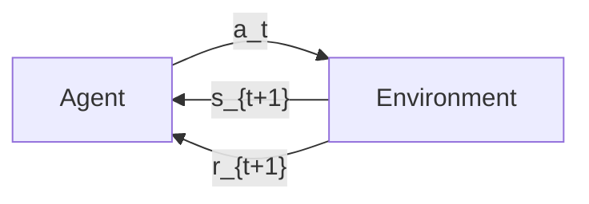
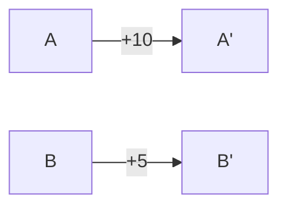
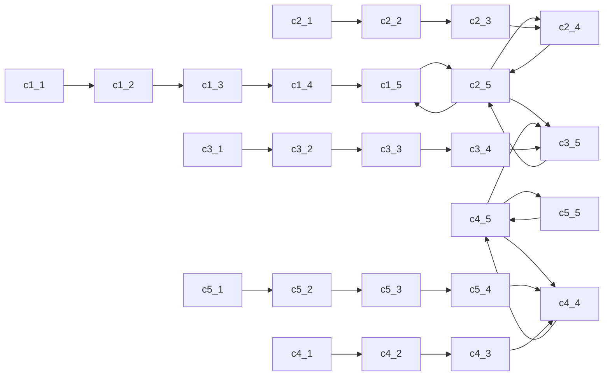
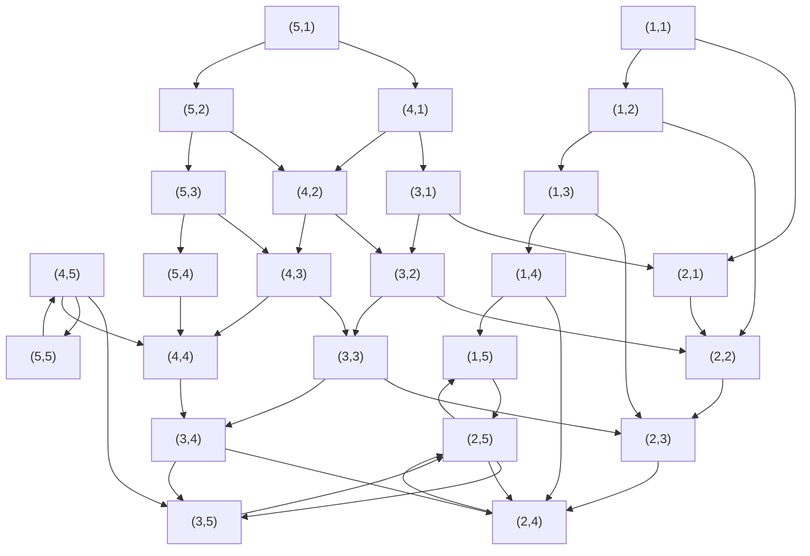
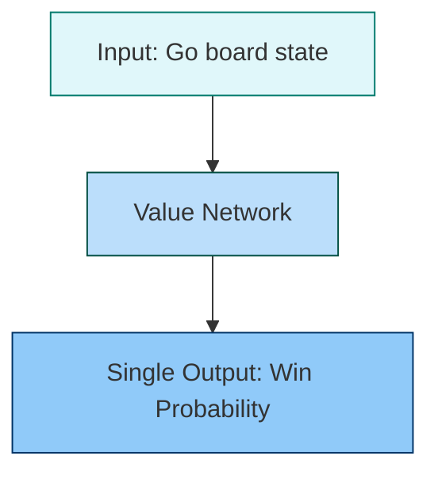

# Deep Reinforcement Learning

## Sequential Decision Making

Reinforcement learning is the branch of machine learning concerned with teaching an autonomous agent how to behave in an environment so as to maximize a numerical reward over time. Before introducing the full machinery of states and transitions, it is instructive to study the simplest possible setting in which an agent must decide which of several actions to take. The lecture motivates this with the *multi-armed bandit problem*: imagine standing in front of a row of slot machines (the so-called "one-armed bandits"), each with its own unknown payout distribution, and having to decide which lever to pull at each time step. This stripped-down formulation isolates the core difficulty of sequential decision making, namely how to balance the desire to exploit the lever that has so far produced the best payout with the need to explore other levers that might be even better. Unlike supervised learning, the agent is never told *which* action would have been correct; it must infer the value of every action from the rewards it observes.

#### Sequential decision making: Multi-armed bandit problem
A row of brightly lit, colorful slot machines in a casino, viewed from a low angle. Each machine features glowing screens displaying reels, paytables with combinations like "777" and associated payouts (e.g., $2000, $5000), and buttons for betting and play. The machines are arranged in a receding line, creating a sense of depth, with ambient lighting from bulbs above and the machines themselves casting vibrant purple and blue hues. The image illustrates the physical setting of the "Multi-armed bandit problem," where each machine represents an independent stochastic arm with an unknown reward distribution $p(r \lvert a)$, and selecting one corresponds to an action $a_t$ under a policy $\pi(a)$.

****Action**** Formalize choosing a machine as **action** $a$ at time $t$ from a set $A$

****Reward**** &lt;+-&gt; Action $a_t$ has a **different**$^1$ **unknown pdf $p(r \lvert a)$** generating **reward** $r_t$

****Policy**** &lt;+-&gt; Formalize choosing an action $a$ as pdf $\pi(a)$ which we call a **policy**

The set $A$ is discrete and contains all permissible actions. Choosing one is intrinsically probabilistic: each arm is governed by its own – generally different and a priori unknown – probability density function $p(r\lvert a)$ that maps the chosen action to a stochastic reward $r_t$. The *policy* $\pi(a)$ is itself a probability density function over the action set, and it is the only quantity the designer can control. Optimising the policy is therefore the central learning problem in this stateless setting.

#### Evaluative Feedback
A stylized, monochromatic illustration of a cut diamond, rendered in shades of gray and white. The gem is shown in a classic brilliant cut, with multiple triangular and kite-shaped facets that reflect light, creating bright highlights and deep shadows. A prominent starburst of white light emanates from the upper-left facet, emphasizing the diamond's sparkle. The image is set against a plain white background, isolating the diamond as the sole subject. Conceptually, the diamond serves as a visual metaphor for reward or value in the context of reinforcement learning, aligning with the slide's discussion of maximizing expected reward over time.

- Find action $a$ producing the **maximum expected reward over time** $t$:
  $$\begin{equation*}
              {\color{orange} \underset{a}{\max} \, \mathbb{E} } \, \left[ p(r \lvert a) \right]
  \end{equation*}$$

- Difference to supervised learning: **No** feedback on **what** action to choose

- $E [p(r  a) ]$ is **not known in advance**

- We can form a one-hot encoded vector $r$ which reflects which action from $a$ caused the reward

-  &lt;+-&gt; Estimate the joint pdf online as $1{t} _{i=1}^{t} r_{i} := {Q_t(a)}$

- We call $Q_t(a)$ the action-value function, which changes with every new information

The objective is not the reward of a single pull but the *maximum expected reward over time*. Because $p(r\lvert a)$ is unknown, the agent must estimate the expected reward online from observed samples. Encoding the reward at time $t$ as a one-hot vector $r_t$ that records which arm produced it allows the joint distribution to be estimated by a simple sample average. The result is the *action-value function* $Q_t(a)$, which is updated whenever a new reward is observed and which converges, under mild conditions, to the true expected reward of each action. The lecture stresses that, unlike in supervised learning, the algorithm itself must decide which action to try; mistakes are unavoidable and are part of the learning process, but on average the chosen actions should produce a high cumulative reward.

#### Incremental update of $Q_t(a)$
$$\begin{align*}
        Q_{t+1}(\mathbf{a}) &= \frac{1}{t} \sum_{i=1}^{t} \mathbf{r}_{i} \\
                         &= \frac{1}{t} \left( \mathbf{r}_t + \sum_{i=1}^{t-1} \mathbf{r}_{i} \right) \\
                         &= \frac{1}{t} \left( \mathbf{r}_t + (t-1) \frac{1}{t-1} \sum_{i=1}^{t-1} \mathbf{r}_{i} \right) \\
                         &= \frac{1}{t} \left( \mathbf{r}_t + (t-1)Q_t(\mathbf{a}) \right) \\
                         &= \frac{1}{t} \left( \mathbf{r}_t + t \, Q_t(\mathbf{a}) - Q_t(\mathbf{a}) \right) \\
                         &= Q_t(\mathbf{a}) + \frac{1}{t} \left( \mathbf{r}_t - Q_t(\mathbf{a}) \right)
\end{align*}$$

The derivation above isolates the most recent reward $r_t$, rewrites the remaining sum as $(t-1)Q_t(a)$, and rearranges to obtain a recursion. The closed form

$$
Q_{t+1}(a) = Q_t(a) + \alpha_t\bigl(r_t - Q_t(a)\bigr), \qquad \alpha_t = \frac{1}{t},
$$

makes the algorithm look like a stochastic-approximation update with a learning rate $\alpha_t$ that automatically shrinks as evidence accumulates. The advantage is practical: the agent only has to keep the running estimate $Q_t(a)$ rather than the entire history of rewards, and the rule generalises naturally if a constant learning rate is used in non-stationary environments.

**Exploitation**

A close-up photograph of a pepperoni, mushroom, and black olive pizza on a wooden surface, with a slice being lifted by a spatula, showing melted cheese stretching. In the background, whole tomatoes and white mushrooms are visible, suggesting fresh ingredients. The image is a food still life with warm lighting, emphasizing texture and appetite appeal. It is not a structural diagram and does not contain equations or methods.

**Exploration**

A vibrant, well-organized fruit display in a market, featuring numerous tropical and exotic fruits arranged in baskets and pyramids. Each type of fruit is visually distinct: spiky yellow rambutans, deep red dragon fruits (some sliced to show white flesh and black seeds), green guavas, orange granadillas, and bright orange kumquats. Many fruits are labeled with small black signs indicating their name and origin (e.g., "Dragon Fruit orig: Colombia," "Guayaba orig: Malaga"). The fruits are artfully presented on green banana leaves, enhancing the visual appeal. The background features a black-and-white geometric tiled wall, and the overall lighting is bright and even, highlighting the rich colors and textures of the produce. This figure illustrates a curated, visually appealing presentation of diverse fruit varieties, likely used to emphasize variety, origin, and freshness in a retail or educational context. It does not contain any mathematical or algorithmic content.

- Reward is maximized by a policy $ (a)$ choosing $_a Q_t(a)$

- We exploit a known good action

- This is a **deterministic**$^1$ policy called **greedy action selection**

- However we **need** to obtain **samples** $r_a$

-  &lt;+-&gt; This means we **cannot follow** the greedy action selection policy for learning

-  &lt;+-&gt; Sometimes explore by selecting other moves which could potentially be better

The pizza analogy used in the lecture captures the *exploitation* extreme: once a recipe has produced a satisfying meal, the greedy policy keeps reproducing it, never asking whether a different combination of ingredients might be better. The fruit-market image, in contrast, embodies *exploration* — actively sampling unfamiliar options. A pure greedy strategy is therefore inadequate for learning, because it never collects new evidence about untried actions. The agent must occasionally accept a sub-optimal pull in order to discover that an apparently inferior arm is in fact the best, and this short-term loss is paid for by long-term gains. Empirically, learning schedules begin with predominantly exploratory behaviour and shift smoothly toward exploitation once the value estimates become reliable.

We sample discrete actions $a$ from $ (a)$, but what distributions can we use?

**Uniform random**
(a) =

- $ A $ is the cardinality of the set of different actions $A$

The *uniform random* policy assigns equal mass to every action, $\pi_{\text{uniform}}(a)=\frac{1}{|A|}$ for $a\in A$, where $|A|$ denotes the cardinality of the action set. It requires no knowledge of the environment and provides maximum exploration, but it almost never selects the best arm and therefore performs poorly in expectation.

**Epsilon Greedy**

\(a\) =

1-&     a = Q\_t(a)  
/ (n-1) &  

The *$\epsilon$-greedy* policy interpolates between greedy and uniform behaviour:

$$
\pi_{\epsilon\text{-greedy}}(a)=
\begin{cases}
1-\epsilon, & a = \arg\max_{a'} Q_t(a'),\\[4pt]
\dfrac{\epsilon}{n-1}, & \text{otherwise},
\end{cases}
$$

where $n=|A|$. With probability $1-\epsilon$ (typically $0.9$ for $\epsilon=0.1$) the agent picks the greedy action and with probability $\epsilon$ it samples a different action uniformly. The hyperparameter $\epsilon$ controls the explore/exploit trade-off and is often *annealed* (reduced) over time so the algorithm becomes increasingly deterministic as it accumulates evidence.

**Softmax**
(a) =

- $_t$ is called **temperature** and used to decrease exploration over time

The *softmax* (Boltzmann) policy assigns probabilities proportional to the exponential of the action values:

$$
\pi_{\text{softmax}}(a)=\frac{\exp\!\bigl(Q_t(a)/\tau\bigr)}{\displaystyle\sum_{a'\in A}\exp\!\bigl(Q_t(a')/\tau\bigr)},
$$

where the *temperature* $\tau>0$ plays a role analogous to $\epsilon$. As $\tau\to 0$ the distribution collapses to the greedy action, while large $\tau$ produces a near-uniform distribution. The softmax is a softer alternative to $\epsilon$-greedy: when two actions have nearly identical action values, say 10 and 9, the greedy rule still picks only one of them whereas the softmax assigns comparable probability mass to both, reflecting the genuine uncertainty about which action is truly best.

#### Summary
So far we ...

- considered **sequential decision making** in a setting known as multi-armed bandits

- found out that **estimating a function** $Q(a)$ and the **greedy action selection** policy $(a)=a Q(a)$ maximized our reward

- learned that **exploration** of different actions is necessary

- assumed rewards **didn't depend** on a **state** of the world

- and our action at time $t$ **doesn't influence** the **rewards** from $a$ at $t+1$

The multi-armed bandit problem isolates the exploration–exploitation dilemma without the additional complication of a world state. Two important simplifications are still in force: rewards depend only on the action and not on any context, and consecutive actions are treated as independent. Both will be relaxed in the next part of the lecture, leading to the full Markov Decision Process formulation that underpins reinforcement learning. The multi-armed bandit problem itself was first formalised by Robbins (1952) and remains the canonical benchmark for online learning; Sutton and Barto (1998) provide the standard textbook treatment.

## Reinforcement Learning

#### Associativity
We extend the multi-armed bandits problem:

- We introduces a state of the world at any time $t$: $s_t$

- Rewards now additionally **depend on** the **state** $s_t$:
  $$\begin{equation*}
              {\color{orange} p( r_t \lvert s_t, a_t) }
  \end{equation*}$$

- However this setting is known as **contextual bandit**

- In the full **reinforcement learning problem**, actions influence the state:
  $$\begin{equation*}
              {\color{orange} p(s_{t+1} \lvert s_t, a_t) }
  \end{equation*}$$

The first generalisation is to add a *state* $s_t$ that summarises the situation of the world at time $t$. Once rewards depend jointly on the state and the action — captured by the conditional density $p(r_t\lvert s_t,a_t)$ — the same action can produce very different outcomes in different contexts. This intermediate setting, in which the state changes from step to step but the agent has no influence over how it does so, is known as the *contextual bandit*. The full reinforcement-learning problem goes one decisive step further: the agent's actions also affect the *next* state through a transition density $p(s_{t+1}\lvert s_t, a_t)$. Past decisions therefore shape future opportunities, and a good policy must consider its long-term consequences rather than the immediate reward alone.

### Markov Decision Processes
#### Markov Decision Process

****Action**** An **action** $a_t$ at time $t$ from a set $A$

****State**** &lt;+-&gt; A **state** $s_t$ from a set $S$

A **state transition pdf** $p(s_{t+1}  s_t, a_t)$

****Reward**** &lt;+-&gt; Transition produces reward $r_{t+1}  R  R$ according to $p(r_{t+1}  s_t, a_t)$

****Policy**** &lt;+-&gt; Agents choose actions $a_t$ by a policy $(a  s)$

If all those sets are **finite** we call this a **finite MDP**

A *Markov Decision Process* (MDP) formalises this interaction loop. At each step the agent observes the current state $s_t$, draws an action $a_t$ from a policy $\pi(a\lvert s)$ that may now condition on the state, and receives a reward $r_{t+1}$ together with the next state $s_{t+1}$ that is drawn from the transition density. The Markov property is implicit: the next state depends only on the present state and action, not on the entire history. The diagram divides the world into the *agent*, which is responsible only for choosing actions, and the *environment*, which contains everything else — including, for example, the body of a robot whose pose forms part of the state. When the action set $A$, the state set $S$ and the reward set are all finite, the MDP is called *finite*.

-  Here $s$ is the field we are currently on.

- The agent can **move** in all four directions

- Any action which would leave the grid has $p(s_{t+1}  a_t, s_t)$ equal to a $$ distribution on $s_{t+1}=s_t$ and a similarly deterministic $r_t=-1$

- Every state we reach other than tile $A'$ and $B'$ deterministically causes $r_t=0$

- On $A$ or $B$ **any** action will take us to $A'$ or $B'$ respectively

The lecture illustrates these ideas with a small *grid world*. The agent occupies one of twenty-five squares and may move up, down, left or right. Two distinguished tiles, $A$ and $B$, act as portals: any move from $A$ teleports the agent to $A'$ with reward $+10$, and any move from $B$ sends it to $B'$ with reward $+5$. All other moves yield zero reward, except attempts to leave the grid, which are punished with $-1$ and leave the agent on the same tile (a Dirac-delta transition $\delta_{s_{t+1}, s_t}$). The state space therefore has size 25 and the action space size 4. Because the rewards and transitions are deterministic apart from the agent's own choices, this small example is ideal for visualising state-value functions and policies in subsequent figures.

#### Example policy
*Figure (plot, source: `grid_empty.tex`): rendered from TikZ in the original slides; not converted to Mermaid because it is a plot.*

*Figure (plot, source: `grid_actions_rnd.tex`): rendered from TikZ in the original slides; not converted to Mermaid because it is a plot.*

- Policies now depend on $s_t$

- We can extend the **uniform random policy** to be independent from $s_t$

- However there's no reason to believe that this policy is any good

- How can we **estimate good policies**?

A policy in the MDP setting is no longer a single distribution but a family $\pi(a\lvert s)$ indexed by the state. The simplest example, used as a baseline throughout the grid-world discussion, is the *state-independent* uniform random policy that selects each of the four directions with probability $1/4$ regardless of position. Such a policy will obviously waste many moves bumping against the boundary and will only stumble onto $A$ or $B$ by chance, so the question that drives the rest of the chapter is how to *estimate* policies that perform substantially better.

#### What is a good policy?
-  We have to be precise about *good*

- Preliminary we have to state **two kinds** of tasks

  1.  **Episodic** tasks which have an **end**

  2.  **Continuing** tasks which are **infinitely** long

- **Unify them** using a **terminal state** in **episodic tasks** which only transition to themselves with deterministic $r_t=0$

- Goal is to **maximize the future return**

g\_t = \_k=t+1^T ^k-t-1 r\_k

- $$ is a **discount** reducing influence of rewards **far** in the future

- $  (0,1]$ meaning that $ = 1$ is allowed as long as $T  $

Defining what makes a policy "good" requires care. *Episodic* tasks have a well-defined beginning and end (a chess game, an Atari level), whereas *continuing* tasks run indefinitely. The two cases can be unified by introducing an absorbing terminal state that transitions only to itself with reward zero, so that an episodic task can be regarded as an infinite sequence whose rewards eventually become zero. The optimisation criterion is the *expected future return*, defined as the discounted sum

$$
G_t = \sum_{k=t+1}^{T} \gamma^{\,k-t-1} r_k,
$$

where the discount factor $\gamma\in(0,1]$ gives geometrically less weight to rewards that lie far in the future. A small $\gamma$ encourages the agent to prefer short paths to high rewards; in the grid world this discourages random wandering and rewards reaching $A$ or $B$ directly. The boundary value $\gamma=1$ is permissible only when the horizon $T$ is finite, otherwise the sum need not converge. Whereas the multi-armed bandit problem only required maximising the immediate expected reward, the MDP setting forces the agent to plan over the entire future trajectory and so motivates the value-function machinery introduced next.

### Policy Iteration
A polished, reflective glass sphere sits on a dark pedestal in an outdoor field, capturing and inverting a wide-angle view of its surroundings. The upper hemisphere reflects a green, tree-lined landscape under a pale sky, while the lower hemisphere mirrors a bright, cloudless sky, creating a seamless, inverted image. The sphere's surface is smooth and highly reflective, with subtle distortions and light refraction visible at the edges. The background is softly blurred, emphasizing the sphere as the central subject. The figure metaphorically illustrates the concept of "value functions" in reinforcement learning — where the state-value function $V_{\pi}(s)$ represents the expected future return from a state, analogous to how the sphere reflects and summarizes the entire environment into a single, compact, and transformed view.

The concept of value functions is central to reinforcement learning, as it allows the agent to evaluate the long-term benefits of being in a particular state. The state-value function $V_{\pi}(s)$ is defined as the expected future return, starting from state $s$ and following policy $\pi$. This function helps the agent make decisions by providing a measure of the quality of each state, which can then be used to guide the selection of actions. The metaphor of the reflective sphere underscores the idea that the value function encapsulates a comprehensive view of the environment's potential outcomes, much like how the sphere captures and inverts its surroundings.

Before we used the action-value function $Q(a)$

- Now $a_t$ has to depend on $s_t$

-  &lt;3-&gt; Use an oracle predicting the future reward $g_t$ following $(s_t,a_t)$ from $s_t$

- We introduce the **state-value function** $V_{}(s)$

V\_(s) = \_ = \_

In the bandit chapter the action-value function $Q(a)$ described how good every action was on its own. With states in the picture, the natural object becomes the *state-value function* $V_\pi(s)$, which is the expected future return obtained by starting from state $s$ and thereafter following policy $\pi$. Formally,

$$
V_\pi(s) = \mathbb{E}_\pi\!\bigl[G_t\,\bigl|\,s_t=s\bigr],
$$

so $V_\pi(s)$ marginalises over actions and concentrates the question "what is this situation worth?" in a single scalar. The agent treats $V_\pi$ as an oracle that predicts the discounted future reward $g_t$ starting from $s_t$ under policy $\pi$. Importantly, the value depends jointly on the state *and* on the policy used thereafter; the same state may be valuable under one policy and worthless under another.

#### State-value Function Example

*Figure (plot, source: `grid_state_value_f_rnd.tex`): rendered from TikZ in the original slides; not converted to Mermaid because it is a plot.*

- Recall our grid example

- Some **edge tiles** are negative since the policy **can't control the move**

- What if we use the **greedy action selection** policy on this $V_{}(s)$ ?

- We get a **better policy**!

Returning to the grid world, the lecturer numerically computes $V_\pi(s)$ for the uniform random policy by simulating many episodes. The resulting value map shows that the bottom-row tiles can hold values around $-1.9$ to $-2.0$: at a corner there is a 50% chance of attempting to leave the grid, and the resulting penalty of $-1$ contaminates the entire value estimate. By contrast, the tile that contains $A$ has expected return roughly $8.8$ and the tile $B$ around $5.3$, reflecting their large immediate rewards. Even under random behaviour the value function therefore encodes useful information about the environment. The natural next step is to derive a *better* policy by acting greedily with respect to $V_\pi$, choosing at every state the action that leads to the neighbouring state with the highest value.

#### Action-value function
- Before we used the action-value function $Q(a)$

- Now we introduced $V_{}(s)$ filling a similar role

- We can also introduce the **action-value function** $Q_{}(s, a)$

- Basically this accounts for the **transition probabilities**

Q\_(s,a) = \_ = \_

The two value functions can coexist. The MDP analogue of the bandit's $Q(a)$ is the *state-action value function* $Q_\pi(s,a)$, which conditions on both the current state and the next action and then assumes the policy is followed thereafter:

$$
Q_\pi(s,a) = \mathbb{E}_\pi\!\bigl[G_t\,\bigl|\,s_t=s,\,a_t=a\bigr].
$$

Compared with $V_\pi$, the action-value function additionally absorbs the transition probabilities: it tells the agent how much future reward to expect from *deviating* with action $a$ in state $s$ before reverting to $\pi$. This makes $Q_\pi$ slightly more informative for control, because greedy improvement can be carried out without an explicit model of the transitions.

#### Are Value Functions Created Equal?
- No.

- There can only be one$^1$ **optimal** $V^*(s)$

- We can state its existence without referring to a specific policy:
  $$\begin{equation}
                  V^*(s) = \underset{\pi}{\max} V_{\pi}(s)
  \end{equation}$$

- $Q^*(s,a)$ can also be defined and is related to $V^*(s_{t})$by:
  $$\begin{equation}
                  Q^*(s,a) = \mathbb{E} \left[ r_{t+1} + \gamma V^*(s_{t+1}) \right]
  \end{equation}$$

Among all possible value functions, exactly one is *optimal*. The optimal state-value function $V^*(s)$ is the pointwise supremum of $V_\pi(s)$ over all policies $\pi$ and exists without reference to any particular policy; its uniqueness is a structural property of the MDP. The optimal action-value function $Q^*(s,a)$ is related to $V^*$ by a single Bellman expansion: the value of an action equals the immediate expected reward plus the discounted optimal value of the resulting state. Once either $V^*$ or $Q^*$ is known, the agent has, in effect, solved the planning problem.

#### Optimal Value-function Example
*Figure (plot, source: `grid_state_value_f_rnd.tex`): rendered from TikZ in the original slides; not converted to Mermaid because it is a plot.*

*Figure (plot, source: `grid_state_value_f_opt.tex`): rendered from TikZ in the original slides; not converted to Mermaid because it is a plot.*

- Observe that $V^*$ is strictly positive since it's deterministic

Comparing the value map of the random policy with the optimal value map for the grid world makes the improvement visible: every entry of $V^*$ is strictly positive, since in this deterministic environment an optimal agent always navigates toward the high-reward portals and never wastes moves on actions that would lead off the board. The strict positivity is a sanity check on the computation as well as a useful conceptual point: in deterministic MDPs the optimal value function cannot decrease below zero as long as a positive reward is reachable from every state.

#### Optimal Policies
- Policies can now be ordered: $  '$ if and only if $V_{}(s)  V_{'}(s),  s  S$

- **Any** policy $$ with $V_{} = V^*$ is an optimal policy $^*$

- This implies there might be **more than one** optimal policy

- Given either $V^*$ or $Q^*$ an optimal policy is directly obtained by **greedy action selection**

Policies admit a partial order: $\pi$ is at least as good as $\pi'$ if $V_\pi(s)\ge V_{\pi'}(s)$ for every state $s$. Any policy whose value function attains $V^*$ everywhere is therefore an *optimal policy* $\pi^*$, but the optimal policy need not be unique — several different policies can produce the same optimal value function, for instance when two actions in a given state lead to states of equal value. Whenever $V^*$ or $Q^*$ is available, an optimal deterministic policy is obtained immediately by greedy action selection: at each state pick the action that maximises the corresponding value.

#### Greedy Action Selection on $V^*(s)$ or $Q^*(s,a)$

The two grid diagrams compare greedy action selection on the random-policy state values (left) with greedy action selection on the optimal state values (right). The two policies look broadly similar, but the optimal policy admits multiple equivalent moves at several states: where two arrows point in different directions, either choice yields an optimal trajectory and the policy can break ties uniformly without loss of optimality. This visual confirms the earlier observation that more than one optimal policy can correspond to the unique optimal value function.

#### A Tool to Compute Optimal Value-functions
- We **still need** to compute $V^*(s)$ and $Q^*(s,a)$

- For this the **Bellman equations** can be utilized

- They are **consistency conditions** for the value functions

**Bellman equation for $V_{}(s)$**
V\_(s) = \_a (a s) \_s\_t+1,rp(s\_t+1,r s, a)

The remaining question is *how* to compute $V^*$ and $Q^*$. The answer is provided by the *Bellman equations*, which are consistency conditions linking the value of a state to the values of its successors. For $V_\pi$ the equation reads

$$
V_\pi(s) = \sum_a \pi(a\lvert s)\sum_{s_{t+1},r} p(s_{t+1},r\lvert s,a)\bigl[r + \gamma V_\pi(s_{t+1})\bigr],
$$

i.e. the value of $s$ is the expected immediate reward plus the discounted value of the next state, where the expectation is taken over both the policy's choice of action and the environment's stochastic transition.

#### Policy Evaluation
- The Bellman equations form a **system of linear equations** which can be solved for **small** problems

- Better: **Iteratively solve**, by turning the Bellman equations into **update rules**:
  $$\begin{equation*}
                  V_{k+1}(s) = \sum_a \pi(a \lvert s) \sum_{s_{t+1},r} p(s_{t+1},r \lvert s, a) \left[ r + \gamma V_{k}(s_{t+1}) \right]
  \end{equation*}$$
  For all $s  S$

For a fixed policy the Bellman equations form a linear system that can in principle be solved in closed form, but this only scales to very small problems. A more practical approach is *iterative policy evaluation*: turn the equation into an update rule that produces a new estimate $V_{k+1}(s)$ from the previous one $V_k$, applied for every state $s\in S$, and repeat until convergence. Each sweep refines the estimate by exploiting the recursive structure inherent in the Bellman equation.

#### Policy Improvement
- $V_{}(s)$ is used to **guide our search** for good policies

- Another necessary step is to **update the policy**

- However if we use **greedy action selection** an update of $V_{}(s)$ is **simultaneously** an update of $(s)$

- Now iterate **evaluation** of the **greedy policy** on $V_{}(s)$

- Stop iterating if the **policy stops changing**

- But is this **guaranteed** to work?

Once $V_\pi$ is known, the agent can be improved by acting greedily with respect to it. Crucially, when greedy action selection is used, every update of the value function automatically defines a new policy: the two are coupled, so a change in $V$ implies a change in $\pi$. Iterating this coupled update — evaluate the current greedy policy, then take greedy actions on the new value function — produces a sequence of monotonically improving policies that terminates as soon as the policy stops changing. This is the core of *policy iteration*.

#### Policy Improvement Theorem
- We consider changing a single action $a_t$ in state $s_t$ but following $$

- In general if
  $$\begin{equation*}
          Q_{\pi}(s, \pi'(s)) \geq V_{\pi}(s) \,,\forall s \in S \implies \pi' \geq \pi
  \end{equation*}$$

- This also implies:
  $$\begin{equation*}
                  V_{\pi'}(s) \geq V_{\pi}(s)
  \end{equation*}$$

- Because we **only select greedy** we have $Q_{}(s,a) > V_{}(s)$ before convergence

- So iteratively updating $V_{}(s)$ and using **greedy action selection** is guaranteed to work here

- We terminate if the policy no longer changes

- Last remark: If we don't loop over all $s  S$ for policy evaluation, but update the policy directly this algorithm is called **Value iteration**

The *policy improvement theorem* makes this guarantee precise. If a candidate policy $\pi'$ satisfies $Q_\pi(s, \pi'(s)) \ge V_\pi(s)$ for every state, then $\pi' \ge \pi$ in the partial order of policies, which in turn implies $V_{\pi'}(s) \ge V_\pi(s)$. Whenever the agent acts greedily on the current value function, the inequality is strict before convergence, so the value function is genuinely improved. The procedure therefore converges in a finite number of iterations for finite MDPs and terminates as soon as the policy stops changing. A streamlined variant skips the full inner loop of policy evaluation and updates the value function with a single Bellman backup per state before re-deriving the greedy policy; this is *value iteration*.

### Other Solution Methods
#### Limitations
- Both policy iteration and value iteration **require** using the **updated policies** during learning to obtain better approximations to $V^*(s)$

- For this reason we call them **on-policy** algorithms

- Additionally we assumed the **state-transition** pdf and **reward** pdf are known

- Can we relax this?

- Yes. The methods differ mostly **how they perform policy evaluation**

Policy iteration and value iteration are powerful but rest on two restrictive assumptions: the policy that is being evaluated must also be the one currently used (they are *on-policy* methods), and the agent must know the transition and reward distributions exactly. Real-world environments rarely afford either luxury, so a family of *model-free* methods has been developed to relax these requirements. The methods differ mainly in *how* they perform the policy-evaluation step.

#### Monte Carlo Techniques
Properties

- Only for **episodic** tasks

- Off-policy - learns $V^*(s)$ by following any **arbitrary** $(s,a)$

- Does **not need** information about dynamics of the environment

Scheme

- **Generate** an **episode** by using some policy

- Loop **backwards** over the episode accumulating the expected future reward $g_t = g_{t+1} + r_{t+1}$

- If a state was **not yet** visited append $g_t$ to a list $*returns*(s_t)$

- Update $V_{s_t} = 1{N} _{n=1}^N *returns*_n(s_t)$

*Monte Carlo* methods estimate value functions purely from sample episodes, with no model of the environment. Because they require returns from completed trajectories they apply only to episodic tasks, but they are *off-policy*: any behaviour policy that visits all states often enough can be used to learn the optimal value function, although the exploration–exploitation dilemma still applies because under-visited states are estimated poorly. The procedure is to play an entire episode with some behaviour policy, then walk *backwards* through it accumulating the future return $g_t = g_{t+1} + r_{t+1}$. The first time a state is encountered in an episode, the corresponding return is appended to a per-state list of returns and the state value is updated as the sample mean over that list. Repeating this over many episodes converges to the optimal value function in the limit.

#### Temporal Difference Learning
Properties

- On-policy

- Does **not need** information about dynamics of the environment

Scheme

- Loop and follow $(s_t,a_t)$

- Use $a$ from $(s_t,a_t)$, observe $r_t$, $s_{t+1}$

- Update: $V_{t+1}(s) = V_t(s) + [ r_t +  V_{t}(s_{t+1}) - V_t(s_t)]$

- **Converges to the optimal solution**

- A variant of this estimates $Q_{(s,a)}$ and is known as SARSA

*Temporal-difference (TD) learning* is an on-policy alternative that, unlike Monte Carlo, can update value estimates after every single step rather than waiting for the end of the episode. It also requires no model of the environment. The agent follows the current policy, observes the reward $r_t$ and the next state $s_{t+1}$, and updates the value of the previous state by

$$
V_{t+1}(s_t) = V_t(s_t) + \alpha\bigl[r_t + \gamma V_t(s_{t+1}) - V_t(s_t)\bigr],
$$

where the learning rate $\alpha$ controls how strongly each new sample shifts the estimate. The bracketed quantity is the *TD error*, and the update has been proven to converge to the optimal value function under standard conditions. The action-value variant of this scheme, in which $Q_\pi(s,a)$ is updated instead of $V_\pi(s)$, is known as *SARSA* (an acronym formed from the quintuple $s_t, a_t, r_t, s_{t+1}, a_{t+1}$ used in the update).

#### Q Learning
Properties

- Off-policy

- Temporal difference type of method

- Does **not need** information about dynamics of the environment

Scheme

- Loop and follow $(s_t,a_t)$ derived from $Q_t(s,a)$ e.g. $$-greedy

- Use $a$ from $(s_t,a_t)$, observe $r_t$, $s_{t+1}$

- Update: $Q_{t+1}(s,a) = Q_t(s_t,a_t) +  [ r_t +  a{} Q_t(s_{t+1},a_t) - Q_t(s_t,a_t)]$

*Q-learning* is the most influential off-policy temporal-difference algorithm. Like SARSA, it requires no model and updates after every transition; unlike SARSA, it bootstraps from the *maximum* action value at the next state rather than from the value of the action that the policy would actually choose. The agent therefore follows an exploratory policy derived from its current $Q$-estimate (typically $\epsilon$-greedy) but learns the value of the *greedy* policy. The update rule

$$
Q_{t+1}(s_t,a_t) = Q_t(s_t,a_t) + \alpha\bigl[r_t + \gamma\max_{a'} Q_t(s_{t+1},a') - Q_t(s_t,a_t)\bigr]
$$

is the model-free analogue of a Bellman optimality backup and converges to $Q^*$ for tabular problems. Q-learning forms the algorithmic backbone of the deep reinforcement-learning systems considered later in this chapter.

#### If you have Universal Function Approximators
- What about just parametrizing $(s_t, a_t, w)$ by weights $w$ and use some loss-function $L$?

-  &lt;2-&gt; Known as **policy gradient** and this instance is called REINFORCE

<!-- -->

- Generate an episode using $(s_t, a_t, w)$

- Go forwards in the episode: $t=0, \,... \,,T-1$

- $w = w +  ^t g_t _{w} ( (a_t  s_t, w) )$

A complementary class of methods does not represent value functions explicitly at all. Instead, the *policy* itself is parameterised by weights $w$ and is improved by gradient ascent on the expected return. The simplest such *policy-gradient* algorithm is *REINFORCE*: generate an episode under the current policy $\pi(a_t\lvert s_t,w)$, then for each time step update the weights with

$$
w \leftarrow w + \alpha\,\gamma^{\,t}\,g_t\,\nabla_w \log\pi(a_t\lvert s_t,w),
$$

where $g_t$ is the discounted return from time $t$ onwards. Because the policy is differentiable, ordinary deep-learning machinery — backpropagation, mini-batches, automatic differentiation — applies directly, which makes REINFORCE the conceptual bridge between classical reinforcement learning and the deep reinforcement learning that follows.

## Deep Reinforcement Learning

### Deep Q Learning
#### Atari Games: Human-level control through deep reinforcement learning \[@Atari\]
- Volodymyr Mnih et al. (Google DeepMind) 2013/2015

- Idea: Let a neural network play Atari games!

- Input: Current and three subsequent video frames from game

- Processed by network trained with reinforcement learning

- Goal: learn best controller movements

- Convolutional layers for frame processing, fully-connected for final decision making

A screenshot of the Atari 2600 game Pac-Man, showing a top-down view of the maze. The maze is rendered in a pixelated style with a blue background and yellow walls. A white Pac-Man character is visible in the lower-left quadrant, facing right, with a small green ghost directly below it. Two white dots are positioned near the top-left corner. A green status bar at the bottom displays the score "35" in white digits. The image illustrates the type of visual input used by a deep reinforcement learning agent to learn gameplay, as described in the accompanying text.

Human-level control through deep reinforcement learning \[@Atari\]

The landmark demonstration of deep reinforcement learning is the *Deep Q-Network* (DQN) of Mnih et al. (2013, 2015) at Google DeepMind, which learned to play a wide range of Atari 2600 games at human level. The architecture mirrors a generic convolutional pipeline: convolutional layers extract spatial features from the raw video frames, after which fully connected layers map the resulting representation to discrete control outputs. The same network architecture, hyperparameters and training procedure were used across all games, with no game-specific knowledge encoded by hand — the agent's only inputs were the screen pixels and the score signal.

#### Learning Atari Games
This diagram illustrates the architecture of a deep reinforcement learning model for playing Atari Pac-Man. It shows a sequence of layers: the input is a pixelated game frame, followed by two convolutional layers that extract spatial features using filters. These are followed by two fully connected layers that process the extracted features into a policy output. The final layer outputs a probability distribution over 18 discrete actions (8 directions, 4 combinations with fire, and "no input"), corresponding to the controls of a classic Atari joystick. The blue arrows indicate data flow, and the blue circular icons represent activation functions (e.g., ReLU) between layers. This architecture enables the agent to learn human-level control by mapping visual inputs to action probabilities.

Human-level control through deep reinforcement learning \[@Atari\]

The output layer has 18 units corresponding to the discrete controls of a classic Atari joystick: a "no input" action, the eight cardinal and ordinal directions, the fire button, and the eight directions combined with fire. Restricting the action space to this small discrete set is what allows the standard Q-learning machinery to be used unchanged: the network estimates one $Q$-value per action and the agent picks the maximum (or, during training, $\epsilon$-greedy with respect to those values).

#### Learning Atari Games
- **Deep Q-network**: Deep network that applies Q-learning

- State $s_t$ of the game: current + 3 previous frames (image stack)

- 18 outputs associated with an action

-  Each output estimates optimal action value for "its" action given the input

- Instead of label & cost function, update to maximize reward

- Reward: +1/-1 when game score increased/decreased, 0 otherwise

- $$-greedy policy with $$ decreasing to a low value during training

- Semi-gradient form of Q-learning to update network weights $w$

- Uses mini-batches to accumulate weight updates

The "state" $s_t$ presented to the network is a stack of the current frame and three preceding frames. This crude form of memory is necessary because a single frame does not capture information about velocities (e.g. the direction in which the ball in *Breakout* is travelling); stacking frames lets the convolutional features encode short-term temporal context. The reward signal is reduced to its sign — $+1$ when the game score increases, $-1$ when it decreases, $0$ otherwise — to put all games on a comparable scale. There is no labelled training set and no per-frame loss function; the network is updated to maximise the expected discounted future reward, using mini-batches and a *semi-gradient* form of Q-learning (the gradient is taken only with respect to the prediction, not the bootstrap target) and an $\epsilon$-greedy exploration schedule that anneals $\epsilon$ to a small value over training.

#### Target Network
- Weight update:

  $$\begin{equation*}
  \vec{w}_{t+1} = \vec{w}_t + \alpha \left[ r_{t+1} + \gamma \max_a \hat{q}(s_{t+1}, a, \vec{w}_t) - \hat{q}(s_{t}, a_t, \vec{w}_t) \right] \cdot \nabla\vec{w}_t\hat{q}(s_{t}, a_t, \vec{w}_t)
  \end{equation*}$$

- Problem: The target $ _aq(s_{t+1}, a, w_t)$ is a function of $w_t$.

-  Target changes simultaneously with the weights we want to learn!

-  Training can oscillate or diverge

- Idea: Use a second **target network**:

- After each $C$ steps, copy weights of action-value network to a duplicate network and keep them fixed

- Use output $q$ of "target network" as a target to stabilize:
  $$\begin{equation*}
  \gamma \max_a \bar{q}(s_{t+1}, a, \vec{w}_t)
  \end{equation*}$$

A naive deep Q-learning update has a subtle pathology. The target $\gamma\max_a \hat q(s_{t+1},a,w_t)$ is itself a function of the weights $w_t$ that the gradient step is trying to update, so the target moves whenever the prediction does. The resulting feedback loop frequently produces oscillations or even divergence of the weights. The remedy adopted by DeepMind is to maintain a second *target network* whose weights $\bar w$ are a periodically refreshed copy of $w$. Every $C$ steps the action-value network's weights are copied to the target network, where they are then held fixed; the bootstrap target is computed using $\bar q(s_{t+1},a,\bar w)$ rather than $\hat q(s_{t+1},a,w_t)$. Because the target now changes only at discrete intervals, the gradient updates have a stationary objective between refreshes and the optimisation behaves more like standard supervised learning.

#### Experience Replay
Goal: Reduce correlation between updates

- After performing action $a_t$ for image stack $s_t$ (state) and receiving reward $r_t$, add $(s_t, a_t, r_t, s_{t+1})$ to **replay memory**

-  Memory accumulates experiences

- To update the network, draw random samples from memory, instead of taking the most recent ones

-  Removes dependence on current weights

-  Increases stability

The second key engineering trick is *experience replay*. Consecutive transitions in a single game are highly correlated — successive frames look almost identical and reflect a single tactical situation — and stochastic-gradient methods perform poorly when their input batches are not approximately independent. To break the correlation, every transition $(s_t,a_t,r_t,s_{t+1})$ is appended to a large *replay memory*, and gradient updates are computed on mini-batches sampled uniformly at random from this buffer rather than on the most recent transitions. The agent therefore continues to learn from a diverse mix of past experiences and is not overly biased by whatever is happening at the current moment, which both stabilises training and improves sample efficiency.

#### Atari Breakout Example
The image displays a screenshot of the classic Atari game Breakout, shown within a windowed interface resembling an old computer or emulator. At the top of the game area, the score is displayed as "175 4 1", likely indicating total points, lives, and level. The main gameplay area features a horizontal paddle at the bottom and a multi-colored brick wall (orange, yellow, green, blue) arranged in rows above it. A small white ball is visible near the top of the brick wall, suggesting it is in motion. The visual style is pixelated, characteristic of early arcade games. The figure illustrates a simple physics-based game where the player controls the paddle to bounce the ball and break all the bricks, serving as an example of early interactive computer games.

The lecturer uses the Atari game *Breakout* to illustrate qualitative learning behaviour. Early in training the paddle moves erratically and the ball is rarely returned, but after enough iterations the agent learns to track the ball reliably and to keep it in play. With prolonged training the system also discovers a higher-order tactic: by deliberately knocking out the bricks on the left edge first, the ball can be sent into the channel above the wall, where it bounces between the upper boundary and the bricks and racks up points without paddle intervention. This emergent behaviour is striking because the system was never told that such a tactic exists; it was discovered purely through reward maximisation and serves as a vivid demonstration that deep Q-learning can uncover non-obvious strategies given enough experience.

### AlphaGo
#### Mastering the game of Go with deep neural networks and tree search \[@AlphaGo\]
- Go is an ancient Chinese boardgame: Black plays against white for control over the board

- Simple rules but extremely high number of possible moves and situations

- Performance on par with professional human players thought years away

A wooden Go board with a grid of intersecting lines, upon which black and white stones are arranged in a mid-game configuration. The board rests on four small, rounded feet and is placed on a green tatami mat. To the left, a dark, round stone container (go-bako) is partially visible. The stones are distributed across the board, forming clusters and empty spaces, illustrating the strategic placement typical of the game. The figure visually represents the physical setup of Go, a game with simple rules but immense strategic depth, which was the subject of the lecture discussing AlphaGo's use of deep neural networks and tree search for mastering it.

https://commons.wikimedia.org/wiki/File:FloorGoban.jpg

The second great success story of deep reinforcement learning is *AlphaGo*, the system developed by Silver et al. at DeepMind that defeated world-class human Go players. Go is an ancient Chinese board game in which black and white compete for control of a 19×19 board. Its rules are deceptively simple, but the combinatorial complexity of the play is enormous, and reaching expert-level performance was widely believed to be many years away because brute-force search techniques that worked for chess could not cope with Go's branching factor.

#### Challenges in Go
- Go is a "perfect information" game: No hidden information and no chance

- Theoretically, we can construct a full game tree and traverse it with Minimax to find the best moves

- Problem: High number of legal moves ($ 250$ – chess $ 35$)

- Games involve many moves ($ 150$)

-  &lt;.-&gt; Exhaustive search is infeasible!

Go is a *perfect-information* game with no hidden state and no element of chance. In principle the entire game tree could be enumerated and traversed with Minimax to find optimal play. The obstacle is sheer scale: in any given position there are roughly 250 legal moves (compared with about 35 in chess), and a typical game lasts on the order of 150 moves. The size of the resulting tree is so far beyond what any computer can enumerate that exhaustive search is simply infeasible.

#### Challenges in Go (cont.)
- Search tree can be **pruned** if we have an accurate evaluation function

- For chess (DeepBlue) already extremely complex and based on massive human input

- For Go: "No simple yet reasonable evaluation function will ever be found for Go." (Müller 2002) \[@Mueller02\]

- Still: **AlphaGo beat Lee Sedol and Ke Jie, two of the world's strongest players in 2016 and 2017!**

The classical workaround in chess was to prune the search tree using a hand-engineered evaluation function — a procedure famously taken to its limits in IBM's Deep Blue, which combined an extremely complex evaluator with massive amounts of human-designed heuristics. For Go, however, the prevailing opinion was bleak. Müller's 2002 survey concluded that "no simple yet reasonable evaluation function will ever be found for Go," reflecting a consensus that hand-crafted heuristics could not succeed. Against this backdrop the achievements of AlphaGo were remarkable: in 2016 the system defeated Lee Sedol, and in 2017 it defeated Ke Jie, both among the strongest human Go players of the era.

#### Mastering the game of Go with deep neural networks and tree search \[@AlphaGo\]
- AlphaGo was developed by Silver et al. (also Google DeepMind)

- Combination of multiple methods:

  - Deep neural networks

  - Monte Carlo tree search (MCTS)

  - Supervised learning **and**

  - Reinforcement learning

- First improvement compared to a full tree search: Monte Carlo Tree Search (MCTS)

- Networks to support efficient search through tree

AlphaGo's success rests on a combination of techniques rather than a single new idea: deep neural networks supply learned policies and value estimates, *Monte Carlo Tree Search* (MCTS) replaces full enumeration, *supervised learning* from expert games bootstraps the networks, and *reinforcement learning* through self-play refines them. The networks support the search by directing it toward promising parts of the tree and by providing accurate value estimates at the leaves, so that far fewer nodes need to be expanded.

#### Monte Carlo Tree Search

```mermaid
graph TD
    A[Q+U] -->|max| B[Q+U]
    B -->|max| C[Q+U]
    A --> D[Q+U]
    D --> E[Q+U]
    E --> F[Q+U]
    F --> G[Q+U]
    G --> H[Q+U]
    H --> I[Q+U]
    I --> J[Q+U]
    J --> K[Q+U]
    K --> L[Q+U]
    L --> M[Q+U]
    M --> N[Q+U]
    N --> O[Q+U]
    O --> P[Q+U]
    P --> Q[Q+U]
    Q --> R[Q+U]
    R --> S[Q+U]
    S --> T[Q+U]
    T --> U[Q+U]
    U --> V[Q+U]
    V --> W[Q+U]
    W --> X[Q+U]
    X --> Y[Q+U]
    Y --> Z[Q+U]
    Z --> AA[Q+U]
    AA --> AB[Q+U]
    AB --> AC[Q+U]
    AC --> AD[Q+U]
    AD --> AE[Q+U]
    AE --> AF[Q+U]
    AF --> AG[Q+U]
    AG --> AH[Q+U]
    AH --> AI[Q+U]
    AI --> AJ[Q+U]
    AJ --> AK[Q+U]
    AK --> AL[Q+U]
    AL --> AM[Q+U]
    AM --> AN[Q+U]
    AN --> AO[Q+U]
    AO --> AP[Q+U]
    AP --> AQ[Q+U]
    AQ --> AR[Q+U]
    AR --> AS[Q+U]
    AS --> AT[Q+U]
    AT --> AU[Q+U]
    AU --> AV[Q+U]
    AV --> AW[Q+U]
    AW --> AX[Q+U]
    AX --> AY[Q+U]
    AY --> AZ[Q+U]
    AZ --> BA[Q+U]
    BA --> BB[Q+U]
    BB --> BC[Q+U]
    BC --> BD[Q+U]
    BD --> BE[Q+U]
    BE --> BF[Q+U]
    BF --> BG[Q+U]
    BG --> BH[Q+U]
    BH --> BI[Q+U]
    BI --> BJ[Q+U]
    BJ --> BK[Q+U]
    BK --> BL[Q+U]
    BL --> BM[Q+U]
    BM --> BN[Q+U]
    BN --> BO[Q+U]
    BO --> BP[Q+U]
    BP --> BQ[Q+U]
    BQ --> BR[Q+U]
    BR --> BS[Q+U]
    BS --> BT[Q+U]
    BT --> BU[Q+U]
    BU --> BV[Q+U]
    BV --> BW[Q+U]
    BW --> BX[Q+U]
    BX --> BY[Q+U]
    BY --> BZ[Q+U]
    BZ --> CA[Q+U]
    CA --> CB[Q+U]
    CB --> CC[Q+U]
    CC --> CD[Q+U]
    CD --> CE[Q+U]
    CE --> CF[Q+U]
    CF --> CG[Q+U]
    CG --> CH[Q+U]
    CH --> CI[Q+U]
    CI --> CJ[Q+U]
    CJ --> CK[Q+U]
    CK --> CL[Q+U]
    CL --> CM[Q+U]
    CM --> CN[Q+U]
    CN --> CO[Q+U]
    CO --> CP[Q+U]
    CP --> CQ[Q+U]
    CQ --> CR[Q+U]
    CR --> CS[Q+U]
    CS --> CT[Q+U]
    CT --> CU[Q+U]
    CU --> CV[Q+U]
    CV --> CW[Q+U]
    CW --> CX[Q+U]
    CX --> CY[Q+U]
    CY --> CZ[Q+U]
    CZ --> DA[Q+U]
    DA --> DB[Q+U]
    DB --> DC[Q+U]
    DC --> DD[Q+U]
    DD --> DE[Q+U]
    DE --> DF[Q+U]
    DF --> DG[Q+U]
    DG --> DH[Q+U]
```

- Idea: Run many Monte Carlo simulations of episodes (=entire Go games) to select action (=where to place a stone)

- Starting from a root node representing the current state, MCTS iteratively extends the search tree

Mastering the game of go without human knowledge \[@AlphaGoZero\]

The principle of *Monte Carlo Tree Search* is to sample, rather than enumerate, future game continuations. Starting from the current board (the root) the algorithm selectively extends the tree along promising branches — the moves that have so far been observed to lead to high-value states — and uses random or guided rollouts to estimate how good those continuations are. After many such simulations, the move at the root that has been visited the most (or that has accumulated the highest value) is played. By concentrating computation on the parts of the tree that matter, MCTS explores far deeper than blind enumeration would allow.

#### Monte Carlo Tree Search (cont.)
Algorithm:

- **Selection**: Starting at root, traverse with tree policy to a leaf node

- **Expansion**: (Optional) add one or more child nodes to the current leaf

- **Simulation**: From the current or the child node, simulate episode with actions according to rollout policy

- **Backup**: Propagate the received reward back through the tree

- Repeat for a certain amount of time, then stop

- Then, choose action from root node according to accumulated statistics

- Start again with new root node

A single MCTS iteration consists of four phases. *Selection* descends from the root through the existing tree using a *tree policy* that balances exploitation of previously successful moves with exploration of less-visited ones, until it reaches a leaf. *Expansion* optionally adds one or more child nodes corresponding to legal moves from that leaf. *Simulation* (or *rollout*) plays out a complete or partial episode from the new node using a fast *rollout policy*. *Backup* propagates the simulation's outcome back through the visited nodes, updating their visit counts and accumulated values. The four phases are repeated for a fixed amount of time, after which the agent commits to an action at the root according to the accumulated statistics. After the opponent responds, the chosen child becomes the new root and the process restarts.

#### Monte Carlo Tree Search (cont.)
- Tree policy guides in how far successful paths are frequented more often.

- Typical exploration/exploitation trade-off.

- Problem: Estimation via MCTS not accurate enough for Go.

- Ideas in AlphaGo:

  - Control tree expansion by using a neural network to find promising actions.

  - Improve value estimation by a neural network.

- More efficient extension & evaluation of search tree → better at Go!

The tree policy embodies the same exploration–exploitation trade-off that appears in the bandit problem: paths that have produced large rewards should be revisited frequently, but lesser-known paths must also be sampled occasionally. Plain MCTS, however, was not strong enough for Go on its own, because the rollouts produced too noisy an estimate of position value. The AlphaGo team's contribution was to use neural networks both to direct the tree expansion toward genuinely promising moves and to improve the value estimates of leaf positions. This combination made the search dramatically more efficient and was the key to the system's playing strength.

#### Deep Neural Networks for Go
Utilization of three different networks:

- **Policy network**: Suggests the next move in leaf nodes for extension

- **Value network**: Given the current board position, get chances of winning

- **Rollout policy network**: Guide rollout action selection

- All networks are deep convolutional networks

- Input: Current board position and additional precomputed features

Mastering the game of Go with deep neural networks and tree search \[@AlphaGo\]

AlphaGo employs three distinct deep convolutional networks, each tasked with a different role inside the MCTS pipeline. The *policy network* suggests promising next moves at the leaf nodes that are about to be expanded. The *value network* takes a board position and returns an estimate of the probability of winning from that position, removing the need to play many random rollouts to convergence. The *rollout policy network* is a much faster, simpler model used to drive the simulations themselves. All three networks consume the same kind of input: the current board position together with a set of pre-computed features that summarise tactical patterns.

#### Policy Network
- 13 conv-layers, one output for each point on the Go board.

- Huge database of expert human moves (30 mio) available.

- Start with **supervised** learning: Train network to predict the next move in **human expert plays**

- Further train network with reinforcement learning by playing against **older versions of itself**. Reward when winning the game

- Older versions avoid correlation and instability

- Training time: 3 weeks on 50 GPUs + 1 day for RL

The figure illustrates the architecture of the AlphaGo policy network, depicted as a three-layered neural network. The top layer, shown in light green, represents the input layer with green blocks symbolizing the Go board state (19x19 grid points). A vertical purple pathway, representing the network's computation, connects this layer to the bottom layer, shown in blue, which represents the output layer with black and pink blocks indicating the predicted move probabilities. The middle layer is translucent, suggesting hidden layers that process the input to produce the output. This diagram visually represents the policy network's function: taking a board state as input and outputting a probability distribution over all possible next moves, which is trained first via supervised learning from expert human games and then refined via reinforcement learning through self-play.

Mastering the game of Go with deep neural networks and tree search \[@AlphaGo\]

The policy network is a 13-layer convolutional architecture with one output unit per point on the 19×19 Go board, so its softmax produces a probability distribution over all legal next moves. It is trained in two phases. The first phase is *supervised*: the network is fitted to predict the move chosen by a human expert, using a database of approximately 30 million expert moves. The second phase uses *reinforcement learning*: the current network plays games against earlier versions of itself, with a reward of $+1$ for winning and $-1$ for losing; using older self-copies as opponents — rather than the current network itself — decorrelates successive games and prevents instabilities. The lecture quotes a training time of three weeks on 50 GPUs for the supervised phase and only one further day for the reinforcement-learning fine-tuning, indicating that the bulk of the work was actually done by supervised imitation rather than by reinforcement learning.

#### Value network
- Same architecture as policy network but just one output node

- Goal: Estimate how likely the current state leads to a win

- Training utilized self-play games of reinforcement learned policy

-  Trained using Monte-Carlo policy evaluation for 30 mio positions from these games

- Training time: 1 week on 50 GPUs

The figure illustrates the architecture of the AlphaGo value network, a deep neural network that estimates the probability of winning from a given Go board state. It is depicted as a multi-layered neural network with a grid-like input layer at the bottom representing the Go board, transitioning through several hidden layers (shown as translucent blue planes) to a single output node at the top (pink diamond). The input layer contains black and white stones on a grid, while the output layer is a single node, visually emphasizing its function as a scalar predictor. The network architecture is conceptually similar to the policy network but simplified to one output, corresponding to the value function $V(s)$ that estimates the expected game outcome from state $s$. This network was trained using Monte-Carlo policy evaluation on self-play games to predict win likelihood.

Mastering the game of Go with deep neural networks and tree search \[@AlphaGo\]

The value network has the same convolutional backbone as the policy network but a single scalar output: the estimated probability of winning from the input position. It was trained on 30 million positions sampled from the reinforcement-learning self-play games, using Monte Carlo policy evaluation to compute the regression targets. Training required about a week on 50 GPUs. Conceptually, the value network plays the role of $V_\pi(s)$ for the AlphaGo policy and provides MCTS with high-quality leaf-node evaluations that no rollout could match in either accuracy or speed.

#### Rollout policy network
- AlphaGo could use policy network to select moves during roll-out

- Problem: Inference comparatively high: 5 ms

- Solution: Train simpler, linear network on subset of data that provides actions **fast**

- Speedup of $1000$ compared to policy network → more simulations possible

For the simulation phase, querying the full policy network at every move would be far too slow — its inference time of about 5 ms quickly dominates the cost of an MCTS rollout. A *rollout policy network* solves this by using a much smaller, essentially linear model trained on a subset of the same data. The simpler model is roughly a thousand times faster than the policy network and, although individually less accurate, it allows so many more simulations per move that the increased breadth of search more than compensates for the lower per-simulation quality.

### AlphaGo Zero
#### AlphaGo Zero: Do we even need humans for training?
- After minor improvements, Silver et al. proposed AlphaGo Zero:

-  **Solely** trained with reinforcement learning & playing against itself!

- Simpler MCTS, no rollout policy

- Include MCTS in self-play games

- Multi-task training: Policy and value network share initial layers

- Further extension in Dec. '17: AlphaZero \[@AlphaZero\] – able to also play chess and shogi

A subsequent variant, *AlphaGo Zero*, eliminated human data entirely. Starting from random play, the system was trained purely by reinforcement learning and self-play, with MCTS embedded directly inside the self-play loop. The architecture was simplified — no rollout policy network was needed — and the policy and value functions were combined into a single network whose initial layers were shared between the two heads, an instance of *multi-task learning* that allowed the model to make better use of its parameters. AlphaGo Zero surpassed the original AlphaGo despite being trained without any human knowledge. The follow-up *AlphaZero* (Silver et al., December 2017) extended the same algorithm to chess and shogi, demonstrating that a single self-play reinforcement-learning framework can master several distinct perfect-information games at superhuman level.

#### Next Time
- Algorithms to learn if we **don't even observe rewards**

- How to benefit from **adversaries**

- Extensions to perform **image processing** tasks

The next chapter steps further away from supervision: it covers algorithms that learn without any reward signal at all, shows how an adversarial training setup can be turned to our advantage in the form of *generative adversarial networks*, and discusses applications of these ideas to image-processing tasks. Reinforcement learning thus blends naturally into the next major topic of the course.

#### Comprehensive Questions
- What is a policy?

- What are value functions?

- Explain the exploitation vs exploration dilemma.

- Describe typical solutions to the dilemma.

- What is the difference of a multi armed bandit problem to the full reinforcement learning problem?

- Describe a Markov decision process.

- Is an optimal policy necessarily unique?

- What do the Bellman equations represent?

- Describe policy iteration.

- Why does policy iteration work?

- How can you beat your friends in every Atari game?

- How can one master the game of Go?

#### Further Reading
The image displays the front cover of the textbook *Reinforcement Learning: An Introduction* by Richard S. Sutton and Andrew G. Barto. The cover features a dark teal abstract background with a stylized, semi-transparent network diagram in the center. This diagram consists of interconnected nodes—some highlighted in bright yellow, others in light gray—suggesting a graph or state-action structure central to reinforcement learning. A vertical decorative element on the right side includes a series of light blue circles and a square, possibly symbolizing decision points or components of a learning system. The title and authors are prominently displayed in clean, white typography. The overall design conveys a technical, academic theme consistent with the subject matter.

This is a headshot photograph of Richard S. Sutton, a prominent researcher in reinforcement learning. He is shown smiling, with a full beard and long hair, wearing a light blue button-down shirt over a dark undershirt, against a plain, neutral gray background. The image is a standard portrait style, likely intended for academic or professional identification. The name "sutton" in the caption confirms the subject's identity. The surrounding context indicates this image is likely associated with a lecture or publication on reinforcement learning, referencing his foundational work, including Deep Q-learning and AlphaGo.

- \[ - the one real reference for Reinforcement learning in its 2018 draft, including Deep Q learning and Alpha Go details

The lecturer especially recommends Sutton and Barto's *Reinforcement Learning: An Introduction* as the standard reference for going beyond the necessarily brief survey given in these slides; the 2018 draft of the second edition covers deep Q-learning and AlphaGo and is freely available online. The subject is far broader than what fits in a single chapter, and the textbook is the natural place to deepen any of the topics introduced here.

## References

#### References

## Lecture Notes Sources

These integrated lecture notes were transcribed from voice recordings of the lecture (FAU LME). Follow the links for the original blog posts:

- [Reinforcement Learning Part 1](https://lme.tf.fau.de/lecture-notes/lecture-notes-dl/lecture-notes-in-deep-learning-reinforcement-learning-part-1/)
- [Reinforcement Learning Part 2](https://lme.tf.fau.de/lecture-notes/lecture-notes-dl/lecture-notes-in-deep-learning-reinforcement-learning-part-2/)
- [Reinforcement Learning Part 3](https://lme.tf.fau.de/lecture-notes/lecture-notes-dl/lecture-notes-in-deep-learning-reinforcement-learning-part-3/)
- [Reinforcement Learning Part 4](https://lme.tf.fau.de/lecture-notes/lecture-notes-dl/lecture-notes-in-deep-learning-reinforcement-learning-part-4/)
- [Reinforcement Learning Part 5](https://lme.tf.fau.de/lecture-notes/lecture-notes-dl/lecture-notes-in-deep-learning-reinforcement-learning-part-5/)

## Bibliography

- **AlphaGo** — Silver et al. (2016) "Mastering the game of Go with deep neural networks and tree search." *Nature*.
- **AlphaGoZero** — Silver et al. (2017) "Mastering the game of go without human knowledge." *Nature*.
- **AlphaZero** — Silver et al. (2017) "Mastering Chess and Shogi by Self-Play with a General Reinforcement Learning Algorithm." *arXiv preprint arXiv:1712.01815*. [arxiv:http://arxiv.org/abs/1712.01815v1](http://arxiv.org/abs/1712.01815v1).
- **Atari** — Mnih et al. (2015) "Human-level control through deep reinforcement learning." *Nature*.
- **Mueller02** — M\"uller (2002) "Computer Go." *Artificial Intelligence*. DOI: [https://doi.org/10.1016/S0004-3702(01)00121-7](https://doi.org/https://doi.org/10.1016/S0004-3702(01)00121-7).